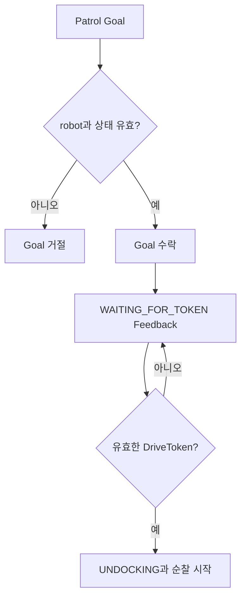
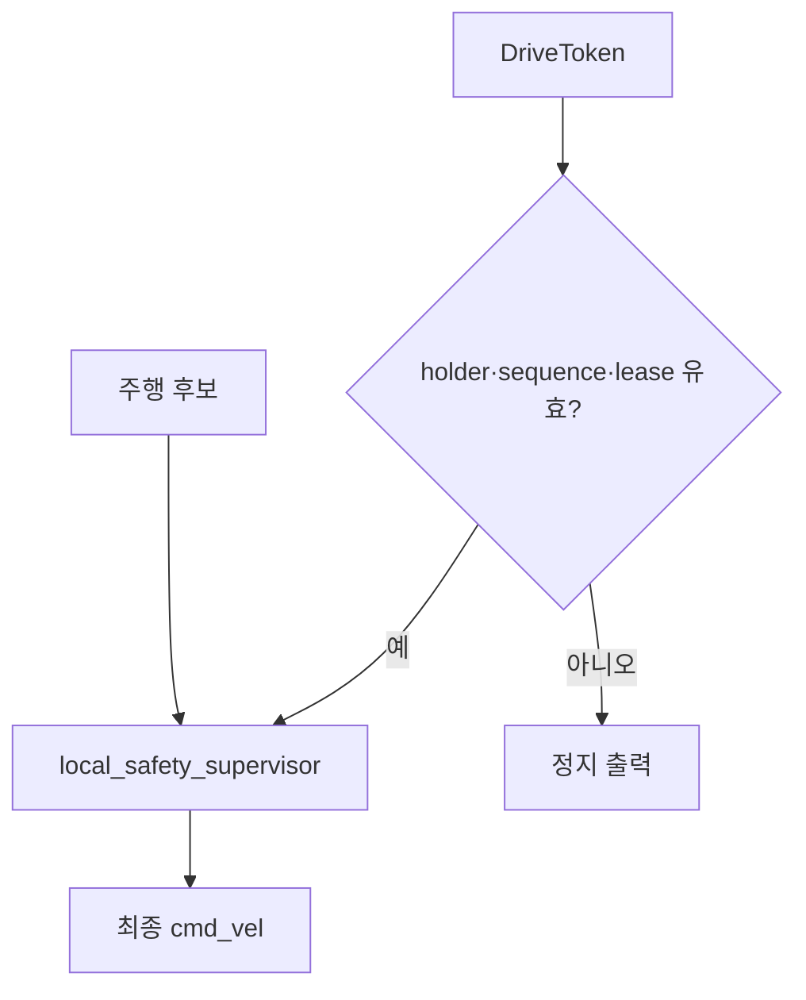
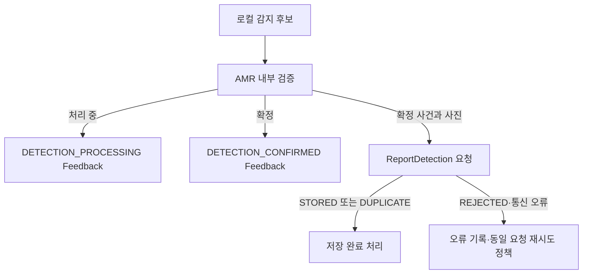

# AMR 기능 설계

> 기준일: 2026-09-13 · 공용 계약: `patrol_interfaces 2.0.0`
>
> 상태: 최종 계약 설계 · AMR 소비 코드 전환 및 구현 대조 전

AMR1과 AMR2는 같은 기능을 공유하고 `robot1`, `robot6` 식별자와 namespace만
구분한다. 공용 필드와 QoS는 [interfaces.md](interfaces.md)를 따른다.

## 1. 책임과 경계

AMR의 책임:

- `/{robot}/patrol_action` Action Server 제공
- Goal 수락, 순찰 진행 Feedback과 Result 반환
- `PatrolCommand`에 따른 안전구역 이동과 순찰 재개
- `DriveToken` 검증과 최종 속도 차단
- Nav2 Action과 waypoint 실행
- 로컬 감지 처리와 확정 상태 전달
- `ReportDetection`을 통한 사건·사진 저장 요청
- 배터리, 도킹과 로컬 장애 처리

AMR은 순찰 대상 선정, permit 판단, Token 발급과 화재 후 다음 순찰 허용 여부를
결정하지 않는다. 해당 판단은 관제 책임이다. PC 4 CCTV 차량 상태 처리와 AMR
로컬 감지는 서로 다른 기능이다.

## 2. 공용 입출력

| 구분 | 이름 | 타입 | AMR 역할 |
|---|---|---|---|
| Action | `/{robot}/patrol_action` | `patrol_interfaces/action/Patrol` | Server |
| Topic | `/{robot}/patrol_command` | `patrol_interfaces/msg/PatrolCommand` | Subscriber |
| Topic | `/{robot}/drive_token` | `patrol_interfaces/msg/DriveToken` | Subscriber |
| Topic | `/{robot}/mission_execution_event` | `patrol_interfaces/msg/MissionExecutionEvent` | AMR 내부 생산·소비 |
| Service | `/system_monitor/report_detection` | `patrol_interfaces/srv/ReportDetection` | Client |

`DetectionEvidence`는 공용 타입이지만 별도 토픽은 확정하지 않았다. `EStop`은
예약 타입이며 현재 AMR 기본 구현 범위에 포함하지 않는다.

## 3. Patrol Action

### 3.1 시작

1. Goal의 `robot_id`와 local robot 설정이 일치하는지 확인한다.
2. 다른 활성 Goal이 있거나 필드가 잘못되면 Goal을 거절한다.
3. Goal 수락 후 `WAITING_FOR_TOKEN` Feedback을 보낸다.
4. 유효한 Token 전에는 Nav2 Goal과 속도 출력을 시작하지 않는다.
5. Token 수락 뒤 `token_valid=true`, `accepted_token_sequence`를 보고한다.

### 3.2 진행과 결과

- `INITIAL_POSE_READY`: 유효한 `current_pose` 포함
- `PATROLLING`: 기본 경로 순찰 중
- `WAYPOINT_REACHED`: `current_waypoint_id` 포함
- `MOVING_TO_SAFE_ZONE`: 안전구역 이동 중
- `DETECTION_PROCESSING`: 로컬 감지 처리 중
- `DETECTION_CONFIRMED`: `event_id`, `event_type` 포함
- `RESUMING`: 순찰 재개 중
- `DOCKING`: 도킹 중
- `BLOCKED`: 진행 불가

Action 종료는 `SUCCEEDED`, `FAILED`, `CANCELED`와 대응 reason을 사용한다. 관제의
취소 요청은 ROS 2 Action Cancel로 처리한다.

## 4. PatrolCommand

- `MOVE_TO_SAFE_ZONE`: 현재 Patrol Action을 유지하고 안전구역으로 이동
- `RESUME_PATROL`: 중단 지점 정책에 따라 기존 순찰을 재개

AMR은 `last_command_id`와 `command_status`를 Patrol Feedback으로 반환한다. 같은
명령 ID를 중복 실행하지 않는 내부 정책은 AMR 구현에서 보장해야 한다.

## 5. DriveToken과 로컬 안전

- `holder_robot_id`가 local robot과 일치해야 한다.
- `sequence`가 과거 값이면 폐기한다.
- 빈 `token`은 즉시 권한 회수로 처리한다.
- lease 만료 후에는 최종 속도를 차단한다.
- Token 수신만으로 새로운 Patrol Goal을 시작하지 않는다.
- Nav2와 로컬 감지 정렬을 포함한 모든 주행 후보는 `local_safety_supervisor`를
  통과한다.

## 6. 로컬 감지와 저장

AMR 제어와 감지 코드 사이의 함수·토픽·콜백은 AMR 내부 구현으로 둔다. 별도 공용
감지 Action을 사용하지 않는다.

현재 `src/patrol_amr_safety/patrol_amr_safety/vision_node_v2.py`는
`ReportDetection` Client를 구현한다. Patrol Feedback 연결과 AMR 내부 감지 결과
연계는 코드 대조와 통합시험이 남아 있다.

## 7. MissionExecutionEvent

AMR 내부 command gateway와 mission 실행부가 명령 수용·거절·시작·저장 완료를
공유할 때 사용한다. `RESULT_STORED`에는 Patrol Result를 `result_*` 필드로
평탄화한다. 이 메시지는 관제의 Patrol Feedback·Result를 대체하지 않는다.

## 8. 현재 코드 전환 상태

현재 저장소의 AMR 패키지는 최종 Patrol Action Server와 DriveToken 소비 경로를
완성한 상태가 아니다. 기존 시험용 순찰·안전구역·로컬 비전 파일은 존재하지만,
공용 계약 반영 완료로 간주하지 않는다.

| 영역 | 현재 상태 | 완료 조건 |
|---|---|---|
| Patrol Action Server | 전환 필요 | Goal·Feedback·Result·Cancel 시험 |
| PatrolCommand | 전환 필요 | 대피·재개와 command 상태 Feedback 시험 |
| DriveToken | 전환 필요 | lease·sequence·권한 회수와 최종 출력 시험 |
| ReportDetection | Client 코드 존재 | 실제 Service Server 종단시험 |
| MissionExecutionEvent | 전환 필요 | 내부 생산·소비와 Result 저장 시험 |
| EStop | 미구현 예약 | 별도 승인 전 구현하지 않음 |

## 9. 검증 기준

- Goal 수락 전 필드 검증
- `WAITING_FOR_TOKEN` 전 이동 금지
- 동시에 두 로봇에 유효한 Token이 없는지 확인
- Token 만료·회수 시 최종 속도 정지
- permit 전이에 따른 대피·재개와 command 상태 Feedback
- waypoint와 pose Feedback
- 감지 확정 Feedback과 ReportDetection의 event_id 일치
- Result·Cancel·오류 경로 정리
- robot1·robot6 namespace 독립성

실제 코드 반영 전 flowchart는 설계이며, 구현 후 대상 commit과 함께 구현 대조
완료로 갱신한다.
