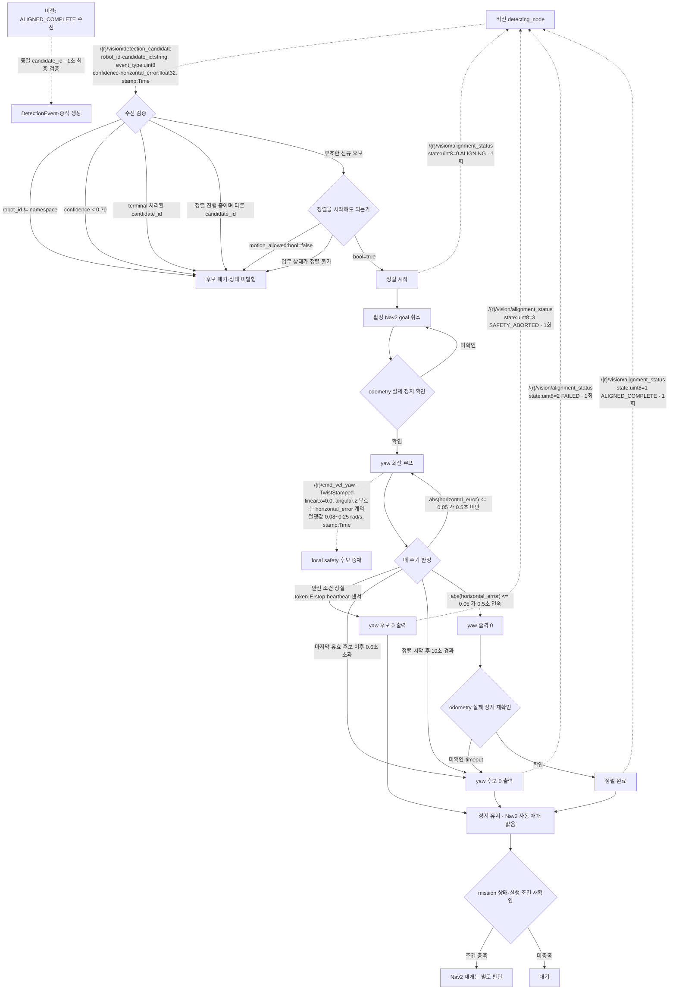
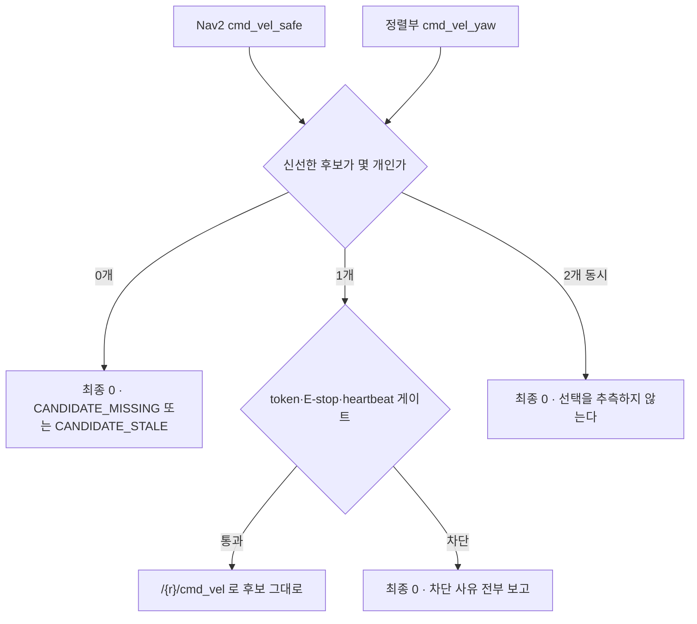

# AMR mission 노드 Detection 수신·yaw 정렬 흐름

- 작성 시각: 2026-09-09
- 범위: 비전 `DetectionCandidate` 수신부터 `AlignmentStatus` terminal 발행까지, mission 노드가 담당하는 구간
- 근거: [DetectionCandidate 토픽·QoS 확정](change_requests/CR-AMR_09-09_10-49_DetectionCandidate_토픽_QoS_확정_요청.md), [AlignmentStatus 토픽·QoS 확정](change_requests/CR-AMR_09-09_10-45_AlignmentStatus_토픽_QoS_확정_요청.md), [yaw 정렬 수치와 Nav2 후보 중재 확정](change_requests/CR-AMR_09-09_10-53_yaw_정렬_Nav2_중재_확정.md)
- 구현 상태: **미구현.** 공용 메시지 세 종만 존재하고 AMR 수신·정렬·발행 코드는 없다.

## 1. 책임 경계

| 책임 | 담당 | 상태 |
|---|---|---|
| 후보 생산, `AlignmentStatus` 소비, 정렬 완료 후 1초 최종 검증 | 비전 `detecting_node` | robot6 후보 발행 단위 시험 완료 |
| 후보 선택, Nav2 goal 취소, yaw 후보 생산, `AlignmentStatus` 생산 | mission 정렬부 (박성현) | 미구현 |
| 두 속도 후보 신선도·동시성 판정, 안전 게이트, 유일한 최종 `cmd_vel` | local safety (조정묵) | `cmd_vel_yaw` 구독 미구현 |

비전 노드는 `cmd_vel`, `cmd_vel_yaw`, Nav2 goal 중 어느 것도 발행하지 않는다. 회전과 정지 확인은 전부 AMR이 한다.

## 2. 인터페이스 계약

| 방향 | 토픽 | 타입 | QoS |
|---|---|---|---|
| 비전 → mission | `/{robot}/vision/detection_candidate` | `patrol_interfaces/DetectionCandidate` | RELIABLE / VOLATILE / KEEP_LAST(10) |
| mission → 비전 | `/{robot}/vision/alignment_status` | `patrol_interfaces/AlignmentStatus` | RELIABLE / VOLATILE / KEEP_LAST(10) |
| mission → local safety | `/{robot}/cmd_vel_yaw` | `geometry_msgs/TwistStamped` | Nav2 후보와 동일 velocity QoS |

양쪽 모두 `TRANSIENT_LOCAL`을 쓰지 않는다. 노드 재시작 뒤 과거 후보나 과거 terminal 상태가 새 것처럼 재전달되는 것을 막기 위해서다.

`candidate_id`는 비전이 만들고 AMR은 파싱하거나 바꾸지 않는다. `AlignmentStatus.candidate_id`에 받은 값을 그대로 되돌려준다.

## 3. 확정 수치

| 항목 | 값 |
|---|---|
| 후보 수락 confidence | 0.70 이상 |
| 정렬 완료 오차 | `abs(horizontal_error) <= 0.05` |
| 오차 유지시간 | 0.5초 연속 |
| yaw 각속도 | 절댓값 0.08 ~ 0.25 rad/s |
| yaw timeout | 정렬 시작 후 10초 |
| 후보 단절 | 마지막 유효 후보 이후 0.6초 초과 |
| 후보 신선도 (Q-17) | 각 TwistStamped age 0.5초 이하 |
| 실제 정지 확인 | 선속도 0.05 m/s 이하, 각속도 0.1 rad/s 이하, 0.5초 연속, odom age 0.5초 이하 |

## 4. 수신부터 terminal 까지

## 5. local safety 쪽 중재

mission 정렬부가 `cmd_vel_yaw`를 내는 동안 Nav2도 `cmd_vel_safe`를 낼 수 있다. 최종 판정은 local safety가 한다.

두 후보가 동시에 신선하면 어느 쪽을 믿을지 정할 근거가 없으므로 0을 낸다. 정렬부가 Nav2 취소와 실제 정지 확인을 먼저 하는 이유가 이것이다. 그 순서를 지키면 두 후보가 동시에 신선한 구간이 생기지 않는다.

## 6. 상태 전이 규칙

- 한 `candidate_id`에 `ALIGNING`은 최대 1회, terminal 상태도 최대 1회다.
- terminal 발행 후 같은 ID를 `ALIGNING`으로 되돌리지 않는다. 새 정렬은 새 ID로 시작한다.
- 안전 원인 중단은 `FAILED`가 아니라 `SAFETY_ABORTED`로 구분한다. 비전이 재시도 여부를 다르게 판단해야 하기 때문이다.
- `ALIGNED_COMPLETE`는 odometry 실제 정지 확인 전에 발행하지 않는다. 회전 중에 비전이 최종 검증을 시작하면 흔들린 영상으로 판정하게 된다.
- terminal 뒤 Nav2를 자동 재개하지 않는다.

## 7. 미구현·미합의

| 항목 | 상태 |
|---|---|
| mission 정렬부 전체 (수신·중재·yaw 생산·상태 발행) | 미구현 |
| local safety `cmd_vel_yaw` 구독과 두 후보 동시 신선 시 0 출력 | 미구현 |
| 정렬 완료 뒤 동일 대상 1초 최종 확인과 이벤트 중복 판정 | TBD-IF-006 |
| `DetectionEvent`·`EvidenceChunk` 발행과 수신 저장 ACK | TBD-IF-006·007 |
| 비전팀의 토픽·QoS 회신 | 대기 |
