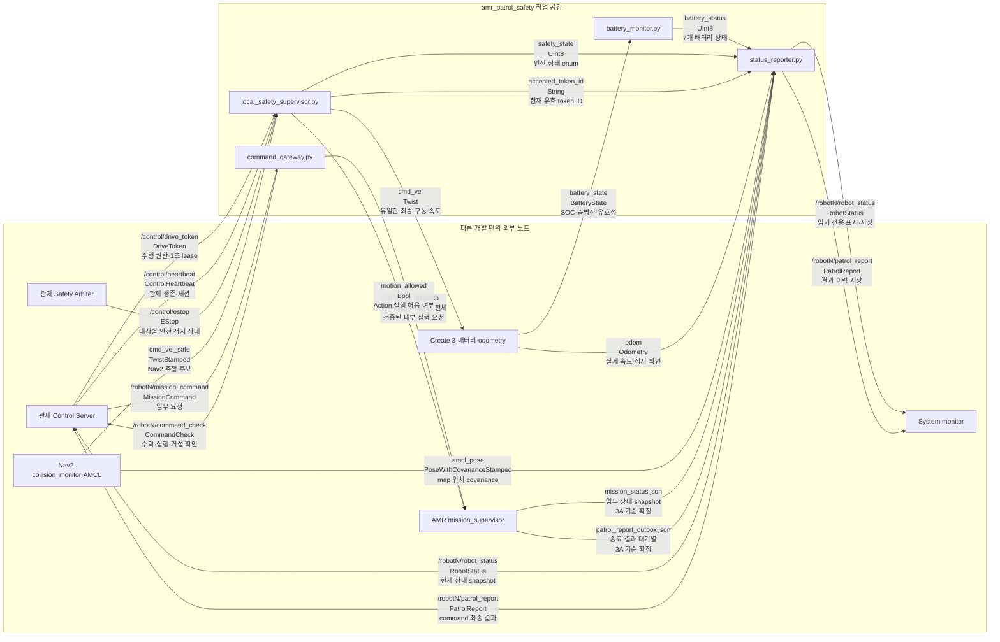
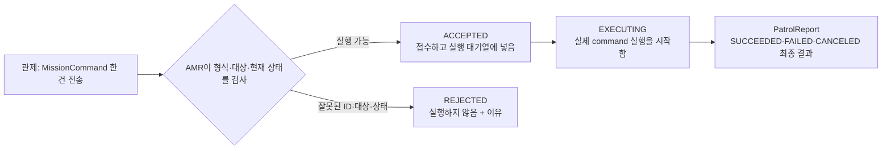
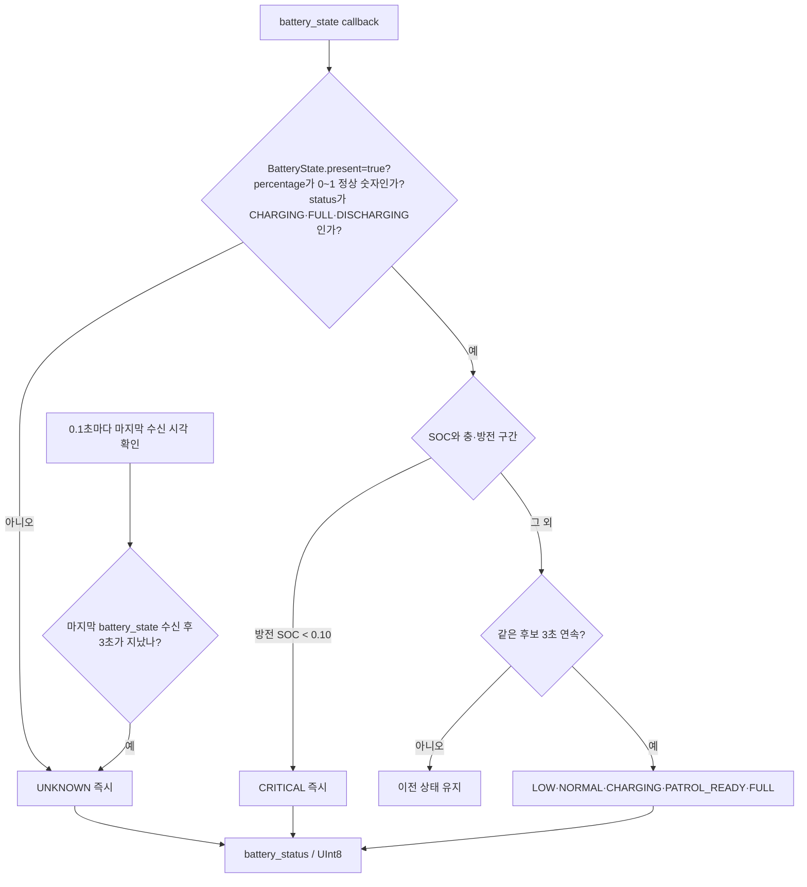
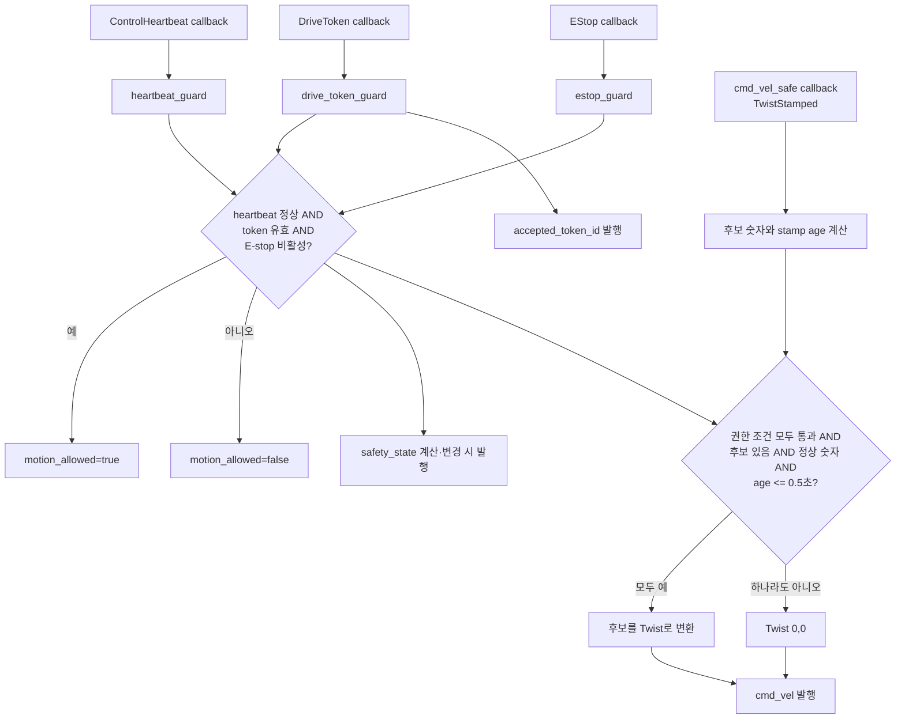
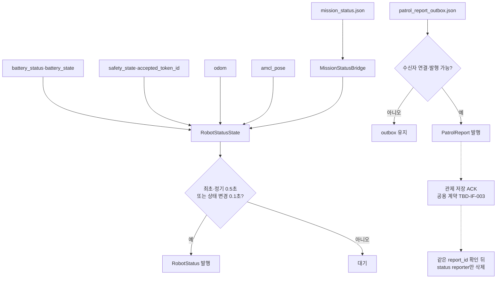
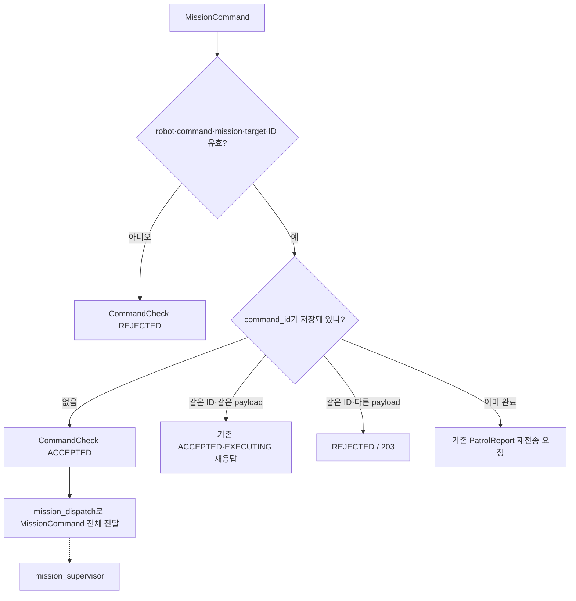
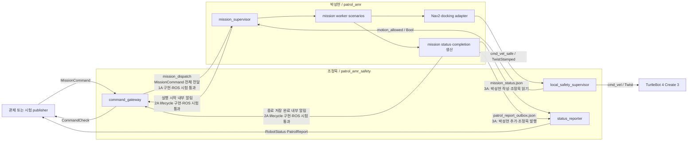
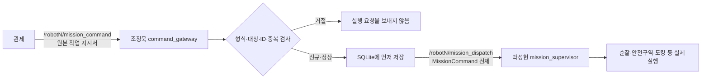
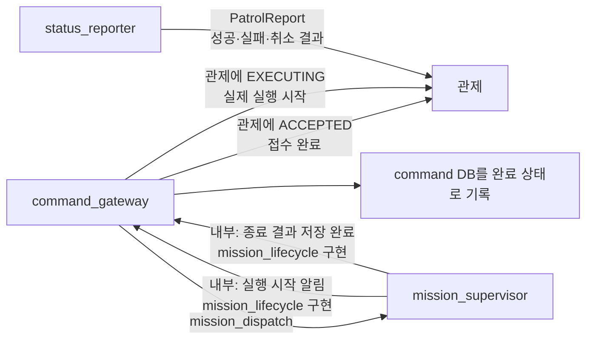
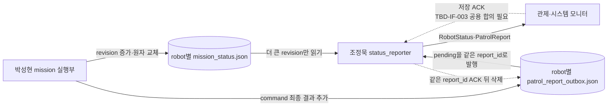

# `amr_patrol_safety` 문서 기준 노드·모듈·메시지 연결도

작성일: 2026-09-08 · 상태: **1A·2A·3A 구현 중간 대조본** · 담당 범위: AMR 로컬 안전·배터리·상태/결과·명령 식별 입구

사용자가 말한 작업 공간은 `amr_patrol_safety`다. 현재 저장소의 실제 패키지 경로와 ROS 패키지명은 `src/patrol_amr_safety/`, `patrol_amr_safety`이므로 이 문서의 파일 경로는 현재 저장소 이름을 사용한다. 패키지 이름을 바꾸는 일은 코드·빌드 설정 변경이므로 이번 문서 작업에는 포함하지 않는다.

이 문서는 저장소의 Markdown 54개를 읽고 아래 기준 문서의 확정 내용만 모아, 앞으로 코드를 정리할 때 참고할 **노드 단위 Python 파일**, **각 노드가 사용할 내부 모듈**, **박스 사이 메시지 선**을 정리한다.

- [공용 개발 규칙](../AGENTS.md)
- [시스템 구조](architecture.md)
- [공용 ROS 2 인터페이스](interfaces.md)
- [관제 인터페이스 v1.0](decisions/2026-09-08-control-interface-baseline.md)
- [AMR 기능 설계](amr.md)
- [시스템 통합 흐름](integration.md)

> 이 문서는 구현 완료를 뜻하지 않는다. 1A·2A·3A의 주요 연결은 코드에 반영했지만, 7.0절의 재시험 대기 항목과 실물 TurtleBot 4 시험이 남아 있다. 아래 그림은 계속 **설계 기준**으로 사용하고 모든 시험이 끝난 뒤 `구현 대조 완료`로 바꾼다.

## 1. 내가 맡을 노드 파일

`amr_patrol_safety` 범위의 실행 노드는 아래 4개로 구분한다.

| 실행 노드 | Python 파일 | 한 문장 책임 | 하지 않는 일 |
|---|---|---|---|
| `battery_monitor` | `patrol_amr_safety/battery_monitor.py` | 로봇의 원본 배터리 관측을 7개 배터리 상태로 분류한다. | 도킹 명령·교대 로봇 선정 |
| `local_safety_supervisor` | `patrol_amr_safety/local_safety_supervisor.py` | token·heartbeat·E-stop·속도 후보 신선도를 결합해 최종 `cmd_vel`을 단독 발행한다. | 임무 선택, Nav2 목표 생성, Detection 판단 |
| `status_reporter` | `patrol_amr_safety/status_reporter.py` | 배터리·위치·실제 속도·안전·현재 임무 정보를 한 묶음의 `RobotStatus` 메시지로 만들어 관제와 모니터에 보낸다. 끝난 command의 결과는 `PatrolReport`로 보낸다. | STALE·UNREPORTED·교대 등 관제 판단 |
| `command_gateway` | `patrol_amr_safety/command_gateway.py` | MissionCommand의 ID·형식·중복을 검사하고 CommandCheck와 내부 실행 요청을 만든다. | 실제 Nav2·도킹·시나리오 실행 |

정상 순찰, 대피, 재개, 도킹, 중단은 각각 별도 모듈로 분리하되 `mission_supervisor` 아래에서 실행한다. 시나리오마다 새로운 ROS 노드를 만드는 것은 이 작업 범위가 아니다.

### 처음 읽을 때 필요한 ROS 용어

| 용어 | 쉬운 뜻 |
|---|---|
| 노드(node) | 한 가지 책임을 맡아 계속 실행되는 프로그램이다. 여기서는 실행 가능한 Python 파일 하나라고 생각하면 된다. |
| 토픽(topic) | 노드끼리 메시지를 주고받는 이름 붙은 통로다. 예: `/robot1/robot_status`. |
| 메시지 타입 | 통로로 보내는 데이터의 정해진 양식이다. 예: `Twist`는 선속도와 회전속도를 담는다. |
| 발행(publish) | 메시지를 토픽에 보내는 것이다. |
| 구독(subscribe) | 토픽에서 메시지를 받아 보는 것이다. |
| 콜백(callback) | 구독한 메시지가 도착했을 때 자동으로 실행되는 함수다. |
| 로컬 상태 | AMR 한 대 안에서만 알고 있는 현재 값이다. 배터리 판정, 실제 속도, 현재 임무 등이 이에 해당한다. |
| 후보 속도 | 아직 바퀴에 적용되지 않은 속도 제안이다. 마지막 안전 검사를 통과해야 실제 구동부로 전달된다. |

## 2. 작업 범위 전체 그림

실선은 v1.0 또는 2026-09-08 AMR 내부 결정으로 전달 방식이 확정된 연결이다. 점선은 외부 개발 단위와의 계약 또는 구현 세부가 아직 남은 경계다.



`N`은 첫 번째 로봇이면 `1`, 두 번째 로봇이면 `6`이다. 메시지의 `robot_id`와 namespace는 각각 `robot1`·`/robot1`, `robot6`·`/robot6`을 사용한다. 화면 이름 `AMR1`·`AMR2`를 wire 식별자로 사용하지 않는다.

### 2.1 “로컬 상태를 `RobotStatus`로 만든다”는 뜻

로봇 안에서는 배터리 노드, 안전 노드, 위치 추정 노드, 임무 노드가 각자 일부 정보만 알고 있다. `status_reporter`는 이 값들을 모아서 **“이 로봇은 지금 어떤 상태인가”를 한 번에 보여 주는 상태표**를 만든다. 그 상태표의 공식 메시지 이름이 `RobotStatus`다.

예를 들어 `RobotStatus` 한 건에는 다음 내용이 함께 들어간다.

- 어느 로봇인지: `robot_id`
- 현재 초기화·이동·충전·오류 중 무엇인지: `operational_state`
- 순찰·대피·도킹·일시정지 중 무엇인지: `mission_state`
- 배터리 상태와 SOC: `battery_state`, `battery_soc`
- 안전 정지 상태: `safety_state`
- 현재 위치와 그 위치가 유효한지: `pose`, `pose_valid`
- 실제 선속도·회전속도와 실제로 멈췄는지: `linear_velocity`, `angular_velocity`, `motion_stopped`
- 현재 처리 중인 명령·임무·token: `active_command_id`, `active_mission_id`, `accepted_token_id`

즉 `RobotStatus`는 명령이 아니라 **관제와 시스템 모니터가 읽는 현재 상태 스냅샷**이다. 사진처럼 그 시점의 상태를 묶어 보내며, 정기적으로 2 Hz(0.5초마다) 발행하고 중요한 값이 바뀌면 최대 10 Hz 범위에서 더 빨리 발행한다.

### 2.2 `mission_supervisor`의 역할

`mission_supervisor`는 AMR의 **작업 관리자**다. 안전 노드가 바퀴로 나가는 최종 속도를 검사한다면, mission supervisor는 “무슨 일을 어떤 순서로 할 것인가”를 관리한다.

1. 관제 명령을 내부 실행 요청으로 받는다.
2. 명령에 맞는 시나리오를 고른다. 예: 새 순찰, 안전구역 이동, 순찰 재개, 도킹, 중단.
3. 위치·LiDAR·odometry·주행 권한처럼 실행 준비가 되었는지 확인한다.
4. Nav2에 `NavigateToPose` 목표를 보내 W1~W7 또는 목적지까지 이동시킨다. 도킹은 Dock Action을 사용한다.
5. `motion_allowed=false`, token 상실, STOP·CANCEL 등이 생기면 실행 중인 이동을 취소한다.
6. 진행 상태는 `mission_status.json`, 끝난 결과는 `patrol_report_outbox.json` 쪽으로 넘긴다.

중요하게도 mission supervisor가 계산한 이동은 곧바로 바퀴로 가지 않는다. Nav2와 collision monitor를 거친 후보 속도가 다시 `local_safety_supervisor`의 마지막 검사를 통과해야 한다.

2026-09-08 사용자 결정 1A에 따라 `command_gateway`는 유일한 외부 명령 접수 창구, `mission_supervisor`는 실제 작업 관리자다. 두 노드 사이는 내부 `/{robot}/mission_dispatch`에서 기존 `MissionCommand` 전체를 전달한다. 재전송·수신 확인 방식은 결정 2와 함께 정한다.

### 2.3 `MissionCommand`로 요청할 수 있는 임무

`MissionCommand`는 관제가 AMR에 보내는 **작업 지시서**다. 현재 공식 종류는 6개다.

| 종류 | 값 | 쉬운 의미 | 실행 뒤 다시 이어갈 수 있나? |
|---|---:|---|---|
| `STOP` | 0 | 지금 수행 중인 이동을 멈추고 현재 진행 위치를 기억한다. 활성 임무가 없어도 안전한 “이미 멈춰 있음” 처리로 수락할 수 있다. | 예. 이후 `RESUME_PATROL` 필요 |
| `START_PATROL` | 1 | 새 mission ID로 기본 순찰 계획을 처음부터 시작한다. robot1은 `robot1_default`, robot6은 `robot6_default` 계획만 허용한다. | 해당 없음 |
| `MOVE_TO_SAFE_ZONE` | 2 | 현재 map과 안전영역을 보고 가장 가까운 유효 안전구역으로 이동한다. | 같은 mission을 유지 |
| `RESUME_PATROL` | 3 | STOP 등으로 일시정지해 둔 기존 순찰을 같은 mission ID로 이어서 수행한다. | 취소된 mission은 재개 불가 |
| `DOCK` | 4 | 지정된 자기 로봇의 도킹 스테이션으로 가서 충전을 시작한다. | 도킹 목적의 command |
| `CANCEL` | 5 | 지정한 활성 mission 전체를 끝내고 결과를 `CANCELED`로 남긴다. | 아니오. 다시 하려면 새 mission 필요 |

`STOP`은 “잠깐 멈추고 이어갈 수 있음”, `CANCEL`은 “이 임무 자체를 끝냄”이라는 차이가 있다. E-stop과 token 만료는 위 6개 명령이 아니라, 어떤 임무보다 우선하는 별도 안전 계층이다.

### 2.4 `CommandCheck`가 확인하는 것

`CommandCheck`는 **MissionCommand 한 건을 AMR이 어떻게 처리하고 있는지 알려 주는 접수 확인서**다. 로봇이 목적지에 성공적으로 도착했다는 최종 결과가 아니다.



- `ACCEPTED`: 그 command를 접수했고 실행 대기열에 넣었다.
- `EXECUTING`: 그 command의 실제 시나리오 실행을 시작했다.
- `REJECTED`: 그 command는 실행하지 않는다. 잘못된 대상, 잘못된 mission, command ID 충돌 같은 이유를 함께 보낸다.

따라서 “수락·실행·거절”의 대상은 **속도 값이나 로봇 자체가 아니라 `command_id`로 식별되는 MissionCommand 한 건**이다. 실제 성공·실패·취소는 나중에 `PatrolReport`로 알려 준다.

### 2.5 `patrol_report_outbox.json`과 “종료 결과”

여기서 종료 결과는 **MissionCommand 한 건이 최종적으로 어떻게 끝났는지**다.

| 결과 | 의미 | 예 |
|---|---|---|
| `SUCCEEDED` | 요청한 일을 정상적으로 끝냄 | 순찰 시작 command의 목표 구간 수행, 도킹 성공 |
| `FAILED` | 주행·위치·센서·시스템 문제로 일을 끝내지 못함 | 경로 없음, Nav2 timeout, 위치 무효 |
| `CANCELED` | 관제 취소·명령 교체·안전 정책·교대 때문에 일을 중단함 | `CANCEL`, token 상실에 따른 실행 취소 |

결과에는 `report_id`, 원래 `command_id`와 `mission_id`, 결과값, 이유, 시작·종료 시각, 마지막 waypoint, 관련 event ID가 포함된다.

`patrol_report_outbox.json`은 이 결과를 디스크에 잠시 보관하는 **발송 대기함**이다.

1. mission supervisor 쪽에서 command 종료 결과를 만든다.
2. 네트워크로 보내기 전에 JSON 파일에 먼저 저장한다.
3. `status_reporter`가 파일의 미발송 결과를 읽어 `PatrolReport` 메시지로 보낸다.
4. 관제 연결이 없거나 발행에 실패하면 파일에서 지우지 않고 다음에 다시 시도한다.
5. 프로그램이 재시작되어도 디스크 파일이 남으므로 결과를 잃지 않고 같은 `report_id`로 재전송할 수 있다.

현재는 구독자가 연결된 상태에서 publish 호출이 성공하면 대기 항목을 지우는 방식이다. 관제 또는 시스템 모니터가 실제 DB 저장을 끝냈다는 ACK를 누가 보내고 언제 지울지는 TBD-IF-003이다.

### 2.6 `cmd_vel / Twist / 최종 구동 속도`

맞다. 여기서 속도는 **로봇 바퀴가 실제로 따라야 할 이동 속도**다. `Twist`의 핵심값은 앞으로·뒤로 가는 `linear.x`(m/s)와 제자리 회전하는 `angular.z`(rad/s)다.

다만 `local_safety_supervisor`가 경로를 계획하거나 적절한 주행 속도를 새로 계산하는 것은 아니다. Nav2와 collision monitor가 만든 `cmd_vel_safe` 후보를 받아 아래처럼 **통과시키거나 0으로 막는 마지막 문지기** 역할을 한다.

| 검사 | 통과 조건 | 실패하면 |
|---|---|---|
| 관제 heartbeat | 마지막으로 수락한 heartbeat가 1초를 초과하지 않음 | `cmd_vel=(0, 0)` |
| DriveToken | 이 로봇이 holder이고 token이 회수·만료되지 않음 | `cmd_vel=(0, 0)` |
| E-stop | 자기 로봇 또는 `all` 대상 E-stop이 비활성 | `cmd_vel=(0, 0)` |
| 후보 존재·숫자 | `cmd_vel_safe`가 존재하고 속도값이 NaN·무한대가 아닌 정상 숫자 | 없거나 잘못된 표본이면 정지 방향 처리 |
| 후보 신선도 | 후보의 timestamp가 현재보다 0.5초를 초과해 오래되지 않음 | `cmd_vel=(0, 0)` |

모든 검사를 통과하면 후보의 `linear.x`와 `angular.z`를 바꾸지 않고 `cmd_vel`로 전달한다. 현재 확정 범위에는 별도 최고속도 제한, 부드러운 감속량 계산, 장애물 거리별 속도 계산이 없다. 그 정책은 TBD-AMR-006이다.

`command_gateway`는 `cmd_vel`을 발행하지 않는다. gateway는 명령 접수와 중복 방지만 담당하고, `cmd_vel`의 유일한 발행자는 `local_safety_supervisor`다.

## 3. 노드별 내부 모듈 분해

### 3.1 `battery_monitor.py`

한 노드 파일 안에서 아래 두 논리 모듈로 나눈다.

| 논리 모듈 | 입력 | 출력·책임 |
|---|---|---|
| `classify_observation` | SOC, `present`, `power_supply_status` | 유효한 충전/방전 관측을 배터리 상태 후보로 분류 |
| `BatteryStateModel` | 분류 후보, monotonic 시각 | CRITICAL 즉시, 그 외 3초 유지, 3초 미수신 UNKNOWN 적용 |

`battery_monitor`가 받는 것은 배터리 드라이버가 발행한 `sensor_msgs/BatteryState` 메시지다. 질문에 나온 값은 이 메시지 안의 필드다.

| 받은 필드 | 쉬운 뜻 | 유효하다고 보는 기준 |
|---|---|---|
| `present` | 배터리가 장착되어 있고 센서가 배터리 존재를 확인했는지 나타내는 참/거짓 값 | `true`여야 한다. `false`면 SOC 숫자가 있어도 믿지 않고 UNKNOWN |
| `percentage` | 배터리 잔량 비율. 문서에서 말하는 SOC다. | 0.0~1.0 사이의 정상 실수여야 한다. 0.37은 37%다. NaN, 무한대, 음수, 1보다 큰 값은 UNKNOWN |
| `power_supply_status` | 현재 충전 중인지 방전 중인지 나타내는 상태 | `CHARGING`·`FULL`은 충전 방향, `DISCHARGING`은 방전 방향. 그 밖의 상태는 방향이 명확하지 않아 UNKNOWN |

방향과 SOC가 유효하면 다음처럼 상태 후보를 정한다.

| 방향 | SOC | 후보 상태 |
|---|---:|---|
| 방전 | 10% 미만 | `CRITICAL` |
| 방전 | 10% 이상 20% 미만 | `LOW` |
| 방전 | 20% 이상 | `NORMAL` |
| 충전 | 50% 미만 | `CHARGING` |
| 충전 | 50% 이상 80% 미만 | `PATROL_READY` |
| 충전 | 80% 이상 | `FULL` |

여기서 **신선도 확인**은 배터리 잔량 자체가 신선한지 화학적으로 검사한다는 뜻이 아니다. **마지막 `battery_state` 메시지를 받은 지 너무 오래되지 않았는지** 확인한다는 뜻이다. 0.1초마다 마지막 수신 시각을 확인하고, 3초 동안 새 메시지가 없으면 기존 SOC를 더 이상 믿지 않고 `UNKNOWN`으로 바꾼다.



배터리 상태 숫자는 `UNKNOWN=0`, `CRITICAL=1`, `LOW=2`, `NORMAL=3`, `CHARGING=4`, `PATROL_READY=5`, `FULL=6`이다. `battery_status`는 AMR 내부 연결이며 별도 공용 `BatteryEvent` 계약이 아니다.

### 3.2 `local_safety_supervisor.py`

이 노드는 네 개의 순수 판정 모듈을 조합한다.

| 내부 모듈 | 입력 | 판단 |
|---|---|---|
| `drive_token_guard.py` | control session, token ID, holder, lease, message sequence | 자기 로봇의 유효 주행 권한인지, 회수·만료·역순인지 |
| `heartbeat_guard.py` | control session, sequence, 수신 monotonic 시각 | 관제 heartbeat가 1초 이내 정상인지 |
| `estop_guard.py` | target robot, active, 대표 reason, sequence | 자기 로봇 또는 `all` 대상 E-stop이 활성인지 |
| `motion_guard.py` | 위 세 판단, `TwistStamped` 후보와 age | 후보를 통과시킬지 최종 0 속도를 낼지 |

`heartbeat_guard.py`는 책임상 이 패키지 내부 순수 모듈로 보는 것이 자연스럽다. 현재 실제 파일 위치를 옮기는 일은 코드 재정비 단계에서 별도 승인 후 처리한다.



`motion_allowed`와 최종 `cmd_vel`은 비슷해 보여도 질문이 다르다.

- `motion_allowed`: **이 로봇이 지금 주행 Action을 수행할 권한이 있는가?** heartbeat 정상, 자기 DriveToken 유효, E-stop 비활성일 때만 `true`다. Nav2 후보가 아직 오지 않았다는 이유만으로는 `false`로 바꾸지 않는다.
- `cmd_vel`: **지금 도착한 이 속도 후보를 실제 바퀴에 보내도 되는가?** 위 권한 3개에 후보 존재·정상 숫자·0.5초 신선도까지 모두 확인한다.

발행 시점은 다음과 같다.

- 노드가 시작될 때 초기 안전값을 한 번 알린다.
- DriveToken·heartbeat·E-stop을 새로 받았을 때 다시 계산한다.
- 새 메시지가 없어도 0.1초 타이머로 token lease와 heartbeat timeout을 다시 계산한다.
- 이전에 발행한 값과 달라졌을 때 `motion_allowed`와 `safety_state`를 발행한다.
- 차단 중에는 구동부가 명확히 정지 명령을 계속 받도록 `cmd_vel=(0, 0)`을 반복 발행한다.

`safety_state`는 관제와 모니터가 안전 상태를 사람이 이해할 수 있는 enum으로 볼 수 있게 하는 값이다.

| 값 | 문서상 의미 |
|---|---|
| `SAFETY_UNKNOWN` | 시작 직후처럼 아직 안전 상태를 신뢰할 수 없음 |
| `SAFETY_NORMAL` | 활성 안전 차단이 없음. 단, 이것만으로 출발 명령이 있다는 뜻은 아님 |
| `SAFETY_STOPPING` | 속도 출력을 0으로 차단했고 실제 정지를 확인하는 중 |
| `SAFETY_STOPPED` | odometry로 실제 정지 조건까지 확인됨 |
| `SAFETY_ESTOPPED` | E-stop이 활성 |
| `SAFETY_ERROR` | 로컬 안전 계층 자체 오류 |

문서 계약에서 `SAFETY_STOPPED`는 단순히 0 속도를 명령했다는 뜻이 아니라, odometry의 선속도 절댓값 ≤ 0.05 m/s와 각속도 절댓값 ≤ 0.1 rad/s가 0.5초 연속이고 측정 age ≤ 0.5초인 것까지 확인한 상태다. 그런데 현재 책임 그림에서는 odometry를 `status_reporter`가 받는다. 따라서 `STOPPING → STOPPED` 판정의 단일 소유자를 코드 재정비 전에 확정해야 한다. 이 부분은 “0을 보냈으니 이미 멈췄다”고 단순 처리하면 안 된다.

중요한 의미는 다음과 같다.

- `DriveToken`만 받아서는 출발하지 않는다. 이것은 이동 권한일 뿐 임무 명령이 아니다.
- heartbeat가 다시 들어와도 자동 재출발하지 않는다. 새 token과 별도 MissionCommand가 필요하다.
- E-stop 활성은 즉시 반영한다. 해제 역시 출발 명령이 아니다.
- `motion_allowed`는 mission Action의 실행·취소 판단용이고, 실제 물리 출력 차단은 `cmd_vel`에서 수행한다.
- 최종 `cmd_vel` 발행자는 이 노드 하나여야 한다.
- `cmd_vel_yaw` 후보와 Nav2 후보 사이의 선택은 TBD-AMR-001이므로 이 문서에서 임의로 정하지 않는다.

`cmd_vel_yaw`는 OAK-D가 발견한 대상을 카메라 중앙에 맞추기 위해 mission supervisor가 제안하는 **제자리 회전용 속도 후보**다. 이름의 `yaw`는 로봇이 수평 방향으로 고개를 돌리듯 회전하는 각도를 뜻한다. 이 값 역시 바로 바퀴로 보내면 안 되고 local safety를 통과해야 한다. 현재는 토픽과 `TwistStamped` 타입만 예약됐고, Nav2의 `cmd_vel_safe`와 동시에 들어올 때 무엇을 우선할지, 회전 속도·timeout·정렬 완료 기준은 TBD-AMR-001이라 아직 연결하지 않는다.

`command_gateway.py`는 MissionCommand의 접수·중복·거절만 판단하므로 `cmd_vel`, `cmd_vel_safe`, `cmd_vel_yaw` 어느 것도 발행하지 않는다.

### 3.3 `status_reporter.py`

상태 저장·변환·발행을 아래 모듈로 나눈다.

| 내부/연계 모듈 | 책임 |
|---|---|
| `robot_status_state.py` | operational·mission·docking·battery·safety 축, pose, odometry, token, reason snapshot |
| `PublicationGate` | 정기 2 Hz와 상태 변경 발행 최대 10 Hz 제한 |
| `StatusSequence` | 프로세스 세션 안에서 증가하는 `status_sequence` |
| `status_mission_bridge.py` | mission 팀이 남긴 mission 상태를 RobotStatus 필드로 변환. 3A에서 조정묵 소유로 확정 |
| `mission_status_store.py` | `mission_status.json` 원자 읽기·쓰기 계약. 3A에서 박성현 소유로 확정 |
| `patrol_report_outbox.py` | 아직 전송을 끝내지 못한 최종 결과 영속 보관. 3A에서 박성현 소유로 확정 |
| `patrol_report_adapter.py` | outbox record를 `PatrolReport`로 변환·발행하고, 삭제 조건이 충족되면 삭제 요청. 3A에서 조정묵 소유로 확정 |

`status_mission_bridge.py` 이하 네 파일은 mission 실행 결과의 생산자와 status reporter의 경계다. 3A에 따라 **파일 저장 형식과 쓰기는 박성현 mission 쪽**, **RobotStatus·PatrolReport 변환과 외부 발행은 조정묵 status 쪽**이 담당한다. 이번 구현에서 조정묵 소유로 확정한 bridge·adapter는 `patrol_amr_safety`로 이동하고 import도 전환했다. 상태 reporter가 임무 결과를 새로 판단해서는 안 된다.

`patrol_report_outbox.json`에 관해서는 [2.5절](#25-patrol_report_outboxjson과-종료-결과)을 먼저 읽으면 된다. `status_reporter`는 결과를 새로 판단하는 노드가 아니다. mission 쪽에서 이미 확정해 대기함에 넣어 둔 결과를 읽고, 공용 `PatrolReport` 형식으로 바꿔 보내는 **우편 배달 역할**이다. 연결이 없거나 발행이 실패하면 항목을 그대로 남겨 다음 poll에서 다시 시도한다.



RobotStatus의 다섯 상태 축을 섞지 않는다.

- `operational_state`: 준비·이동·충전·오류 같은 전체 동작 상태
- `mission_state`: 순찰·대피·도킹·일시정지·완료 같은 임무 상태
- `docking_state`: 언도킹·도킹·완료·실패 상태
- `battery_state`: 7개 배터리 enum
- `safety_state`: UNKNOWN·NORMAL·STOPPING·STOPPED·ESTOPPED·ERROR

`STALE`과 `UNREPORTED`는 관제가 판단한다. status reporter가 자체 타이머로 두 상태를 만들어서는 안 된다.

### 3.4 `command_gateway.py`

명령 실행 노드가 아니라 **명령 신원과 확인 응답을 관리하는 입구**다.

쉽게 말하면 관제의 작업 지시가 들어오는 **접수 창구**다. 창구는 직접 로봇을 움직이지 않고 다음 네 가지를 확인한다.

1. 이 지시서가 어느 로봇·어느 mission을 위한 것인지 확인한다.
2. `command_id`를 보고 처음 받은 새 지시인지, 이전 지시의 재전송인지 확인한다.
3. 명령 종류·대상·필드가 공식 규칙에 맞는지 확인한다.
4. 접수했으면 `ACCEPTED`, 실행이 시작됐으면 `EXECUTING`, 실행할 수 없으면 이유를 붙여 `REJECTED`를 돌려준다.

여기서 **명령 신원**은 사람 신원을 뜻하지 않는다. “지금 받은 메시지가 정확히 어느 작업 지시 한 건인가”를 `command_id`, `mission_id`, `robot_id`로 구별한다는 뜻이다. **확인 응답**은 그 지시서의 현재 접수 상태를 `CommandCheck`로 관제에 답하는 것이다.

| 내부 모듈 | 책임 |
|---|---|
| `mission_ingress.py` | MissionCommand wire 필드를 검증 가능한 내부 값으로 복사 |
| `command_store.py` | command ID·payload·상태·완료 결과를 SQLite에 영속 보관하고 Q-14 적용 |
| `command_check.py` | ACCEPTED·EXECUTING·REJECTED 메시지 구성 |
| `report_replay.py` | 완료 command 재수신 시 같은 report ID 재전송 요청 |

`command_id`는 MissionCommand 한 건마다 붙이는 고유한 접수번호다. 예를 들어 `cmd-<관제세션>-robot1-start-0001` 같은 형태다. `mission_id`가 전체 순찰 업무 묶음의 번호라면, `command_id`는 그 안에서 발생한 START·STOP·RESUME 같은 **개별 지시 한 건의 번호**다.

저장 여부를 확인하는 이유는 네트워크에서는 같은 메시지가 다시 올 수 있기 때문이다. 관제가 5초 안에 확인 응답을 못 받으면 같은 ID와 같은 내용으로 최대 2회 재전송한다. AMR이 매번 새 명령으로 생각하면 같은 순찰이나 도킹을 두 번 실행할 수 있으므로, 먼저 저장된 ID를 찾는다.

- 처음 보는 ID: 새 command로 한 번만 접수하고 실행 요청을 만든다.
- 같은 ID·같은 payload: 새로 실행하지 않고 기존 `ACCEPTED` 또는 `EXECUTING` 상태를 다시 알려 준다.
- 같은 ID·다른 payload: 같은 접수번호로 내용이 바뀐 충돌이므로 `REJECTED / COMMAND_ID_CONFLICT`로 거절한다.
- 이미 끝난 ID: 새로 실행하지 않고 기존 `PatrolReport`를 같은 report ID로 다시 보내 달라고 요청한다.

여기서 payload는 command의 **본문 내용**이다. 중복 충돌 비교에는 `robot_id`, `command`, `target_id`, `target_pose`, `mission_id`가 들어간다.

`SQLite`는 별도 DB 서버를 띄우지 않고 하나의 로컬 파일로 사용하는 작은 관계형 데이터베이스다. JSON 메모장보다 검색·중복 제약·transaction 처리가 쉬워 command 접수번호와 상태를 안전하게 관리하기에 적합하다. **영속 보관**은 프로그램 메모리에만 두지 않고 디스크에 저장해, 노드나 PC가 재시작되어도 기억한다는 뜻이다.

영속 보관이 필요한 가장 큰 이유는 재시작 전 받은 command가 다시 왔을 때 중복 실행하지 않기 위해서다. Q-14에 따라 24시간 이내 command는 개수가 많아도 모두 남기고, 24시간이 지난 것 중에서도 최신 1,000개를 남긴다.



명령 중복 보관은 **24시간 이내 전부 + 24시간이 지난 항목 중 최신 1,000개**다. DDS 수신 시각은 command payload 충돌 비교 대상이 아니다. `parameters_json`은 v1.0에서 제거됐고 `target_pose`는 wire 필드만 유지하며 현재 합의된 명령에서는 기본값만 허용한다.

gateway와 mission supervisor의 내부 dispatch 타입·수락 후 EXECUTING 전환·완료 통지는 코드 재정비 전에 하나의 상태 수명으로 확정해야 한다. public `mission_command`를 두 노드가 각각 독립 처리하는 구조로 설계하지 않는다.

## 4. 메시지 사전

### 4.1 외부 공용 메시지

| 메시지 | 방향 | 무엇을 뜻하나 | 핵심 안전 의미 |
|---|---|---|---|
| `MissionCommand` | 관제 → command gateway | 로봇이 수행할 STOP·START·대피·재개·도킹·취소 | token과 별개이며 자체로 안전 게이트를 우회하지 못함 |
| `CommandCheck` | command gateway → 관제 | 명령이 수락·실행·거절됐는지 | 최종 결과가 아니라 명령 확인 |
| `DriveToken` | 관제 → local safety | 어느 로봇이 움직일 권한을 보유하는지 | 5 Hz, lease 1초, 빈 token ID는 회수 |
| `ControlHeartbeat` | 관제 → local safety | 현재 관제 세션이 살아 있는지 | 5 Hz, 1초 초과 미수신 시 정지 |
| `EStop` | Safety Arbiter → local safety | 대상 로봇의 E-stop 활성 여부와 대표 원인 | `robot1`·`robot6`·`all`, 활성 즉시 반영 |
| `RobotStatus` | status reporter → 관제·모니터 | 로봇 현재 상태 snapshot | `safety_state`와 실제 `motion_stopped`를 구분 |
| `PatrolReport` | status reporter → 관제·모니터 | command 하나의 최종 성공·실패·취소 | `UNREPORTED`를 결과 enum에 추가하지 않음 |

### 4.2 내부 표준·간단 메시지

| 토픽/연결 | 타입 | 뜻 |
|---|---|---|
| `battery_state` | `sensor_msgs/BatteryState` | 원본 SOC·충전 상태·센서 유효성 |
| `battery_status` | `std_msgs/UInt8` | battery monitor가 판정한 7개 enum |
| `cmd_vel_safe` | `geometry_msgs/TwistStamped` | Nav2 collision monitor까지 통과한 후보 속도 |
| `cmd_vel` | `geometry_msgs/Twist` | 구동부가 실제 받는 최종 속도 |
| `motion_allowed` | `std_msgs/Bool` | mission Action을 실행해도 되는 권한 상태 |
| `safety_state` | `std_msgs/UInt8` | RobotStatus에 실을 안전 상태 enum |
| `accepted_token_id` | `std_msgs/String` | 비어 있지 않으면 그 token이 현재 유효함 |
| `odom` | `nav_msgs/Odometry` | 실측 속도와 실제 정지 확인 자료 |
| `amcl_pose` | `geometry_msgs/PoseWithCovarianceStamped` | map 위치·시각·covariance |
| `mission_dispatch` | `patrol_interfaces/MissionCommand` | gateway 검증을 통과한 신규 command 전체를 mission owner에게 전달 |
| `mission_status.json` | 로컬 JSON | mission의 현재 상태를 reporter에 전달 |
| `patrol_report_outbox.json` | 로컬 JSON | 아직 전송 완료되지 않은 최종 결과 보관 |

## 5. 내 범위가 아닌 박스

| 박스 | 담당 | 이 작업 공간과의 경계 |
|---|---|---|
| `mission_supervisor`와 `scenarios/` | 박성현 담당 AMR mission·navigation | gateway의 실행 요청을 받고 상태·결과를 돌려줌 |
| Nav2·AMCL·costmap·collision monitor | 박성현 담당 AMR navigation | `cmd_vel_safe`, `amcl_pose`를 제공하고 Action을 수행 |
| Create 3·배터리·LiDAR·odometry driver | AMR 장치 계층 | 최종 `cmd_vel`을 받고 센서 값을 제공 |
| Control Server·Safety Arbiter | 관제 | 명령·token·heartbeat·E-stop을 발행하고 상태·결과를 수신 |
| System monitor | 시스템 모니터 | RobotStatus·PatrolReport를 표시·저장하며 제어 판단을 하지 않음 |
| OAK-D detecting node | 비전 | DetectionCandidate를 만들며 직접 속도나 Nav2 goal을 발행하지 않음 |

Detection yaw 정렬, DetectionEvent·증적, 화재 부저는 AMR 책임과 연결되지만 현재 `amr_patrol_safety` P0 정리 범위에는 넣지 않는다. 관련 계약인 TBD-AMR-001·004·006, TBD-IF-006·007이 결정되고 담당 범위가 추가 승인되면 별도 노드·모듈 그림을 만든다.

## 6. 코드를 재정비하기 전에 문서로 확정할 것

| 항목 | 현재 문서 상태 | 재정비 전 필요한 결정 |
|---|---|---|
| gateway → mission dispatch | 1A로 `mission_dispatch`·MissionCommand 전체 전달 확정 | QoS, 재전송·수신 확인, 중복 실행 방지, EXECUTING 전환 주체 |
| mission → status 상태 전달 | **3A 확정:** 로봇별 `mission_status.json` 최신 snapshot | 현재 코드가 `revision > last_revision` 규칙을 지키는지 보강·시험 |
| PatrolReport 대기열 | **3A 확정:** 로봇별 `patrol_report_outbox.json`, mission만 추가하고 status reporter만 외부 발행·삭제 | 외부 저장 ACK 메시지·주체·QoS는 공용 계약 TBD-IF-003 합의 필요 |
| `cmd_vel_yaw` 중재 | 토픽·타입만 확정 | Nav2 후보와 동시 도착 시 선택·timeout(TBD-AMR-001) |
| 추가 장애물·감속 | 미정 | 거리·감속·센서 실패 정책(TBD-AMR-006) |
| E-stop 상세 clear 원인 | v1.0 밖 | 원인별 활성·해제 조건과 depth(TBD-IF-004) |
| `SAFETY_STOPPING → STOPPED` | enum 의미는 확정, 현재 노드 책임 경계 불명확 | odometry 실제 정지를 누가 판정하고 `safety_state`에 반영할지 단일 소유자 확정 |
| RobotStatus 메시지 정의 | 의미 확정 | 중복 선언된 `SAFETY_*` 상수 한 세트로 정리 승인 |

위 미정값을 임의로 코드에 넣지 않는다. v1.0 범위 밖 항목은 차기 버전으로 남기고, 현재 확정된 token·heartbeat·E-stop·상태 enum만 기준으로 구현한다.

## 7. 기능 단위 테스트 분할안

아래는 **설계 테스트 목록과 2026-09-08 중간 실행 기록**이다. 한 번에 실제 로봇을 움직여 보는 방식으로 시작하지 않고, 작은 계산부터 차례로 쌓는다.

### 7.0 구현·시험 중간 보고 — 2026-09-08 작업 중단 시점

#### 구현된 범위

| 구분 | 현재 구현 | 상태·남은 일 |
|---|---|---|
| 1A 명령 단일 입구 | `command_gateway`만 public `mission_command`를 구독한다. 유효한 명령은 command ID 문자열만 보내지 않고 `MissionCommand` 전체를 내부 `mission_dispatch`로 한 번 전달한다. `mission_supervisor`는 `mission_dispatch`만 구독한다. | **구현·ROS 시험 통과** |
| 2A 진행상태 단일 발행 | mission 쪽이 내부 `mission_lifecycle`로 `EXECUTING`과 `COMPLETED`를 알리고, gateway가 SQLite 상태와 public `CommandCheck`를 갱신한다. 완료 결과는 원래 `PatrolReport` 내용 그대로 status reporter에 재전달한다. | **주요 흐름 구현·ROS 시험 통과.** STOP의 최종 결과 표현과 재시작 중 복구 세부는 추가 확인 필요 |
| 3A mission JSON 경계 | mission 쪽은 `mission_status.json`과 `patrol_report_outbox.json`을 쓰고, status 쪽은 이를 읽어 `RobotStatus`·`PatrolReport`로 변환한다. `status_mission_bridge.py`와 `patrol_report_adapter.py`를 `patrol_amr_safety`로 이동했다. snapshot schema와 증가하는 revision 검사를 보강했다. | **구현·ROS 시험 통과.** 외부 저장 ACK 후 outbox 삭제는 TBD-IF-003이라 미구현 |
| command DB | command ID·payload·ACCEPTED/EXECUTING/COMPLETED·완료 결과를 SQLite에 저장하고, 재시작 뒤 같은 명령을 다시 실행하지 않도록 했다. Q-14 정리도 유지한다. | **단위·재시작 ROS 시험 통과** |
| 안전·상태 launch | `amr_safety_status.launch.py`가 battery, local safety, status reporter, command gateway 네 노드를 기동하도록 정리했다. 시험용 토픽과 DB/JSON 경로를 모두 별도 namespace·임시 경로로 바꿀 수 있다. | **구현 완료, 격리 수정 후 전체 재시험 대기** |
| 공용 메시지 빌드 | `RobotStatus.msg`에 중복 선언돼 ROS interface 빌드를 막던 `SAFETY_*` 상수를 한 세트로 정리했다. | **3개 패키지 빌드 통과** |

`완료`는 코드와 자동시험을 통과했다는 뜻이고, `재시험 대기`는 수정 파일의 문법은 확인했지만 수정 후 전체 시나리오를 다시 돌리지 않았다는 뜻이다. 실제 TurtleBot 4에서 확인했다는 뜻은 아니다.

#### 지금까지 실제로 실행한 시험

| 7번 기준 | 실행한 시험 | 확인한 내용 | 결과 |
|---|---|---|---|
| 7.1 배터리 | 순수 판정 단위시험, 실제 로컬 ROS publisher/subscriber를 사용하는 `battery_monitor_ros_smoke.py` | BatteryState 수신, 상태 경계·3초 유지·신선도, `battery_status` 발행 | **통과** |
| 7.2 안전 | guard·motion 단위시험과 전체 launch smoke 일부 | token·heartbeat·E-stop 조합, 후보 속도 timeout, odom·pose·battery 전달 | **단위시험 통과. 전체 launch는 마지막 발행 주기 검사에서 수정 후 재시험 대기** |
| 7.3 상태·결과 | `amr07_status_reporter_smoke.py` | 3A JSON snapshot/outbox가 `RobotStatus`와 `PatrolReport`로 변환되는지 | **통과** |
| 7.4 명령 | `command_lifecycle_smoke.py`, `command_gateway_persistence_smoke.py` | MissionCommand 전체 전달, ACCEPTED→EXECUTING→COMPLETED, 완료 report 재전달, gateway 재시작 뒤 중복 dispatch 방지, Q-14 | **통과** |
| 전체 단위 회귀 | Python unittest 전체 | 변경 당시 모든 기존·신규 단위시험 | **354개 통과. 이후 launch 격리 인자 수정분까지 포함한 최종 전체 회귀는 미실행** |
| ROS 빌드 | `patrol_interfaces`, `patrol_amr`, `patrol_amr_safety` colcon build | 공용 메시지 생성과 두 패키지 import·launch 설치 | **통과. 마지막 launch 인자 수정 후 재빌드는 미실행** |
| TurtleBot 4 실기 | 실행하지 않음 | 실제 driver topic·QoS·센서값·구동 반응 | **미실행** |

현재 멈춘 지점은 7.2의 `amr_safety_status_smoke.py` 전체 launch 시험이다. 처음에는 시험 domain에서 예상하지 못한 odometry가 들어와 실제 환경과 섞일 가능성을 발견했다. 그 실행은 종료했고, 이후 모든 시험 입력과 최종 `cmd_vel` 출력을 `/patrol_test` 아래로 remap하고 DB·JSON도 임시 디렉터리로 분리했다. 격리 전 실행에서 후보 속도 `0.25 m/s`가 `/robot1/cmd_vel`에 잠깐 발행됐을 가능성이 있으므로, 이력상 안전 주의사항으로 남긴다. 격리 수정 후에는 문법 검사까지만 통과했고 전체 재실행은 하지 않았다.

#### 다른 컴퓨터에서 이어서 먼저 할 자동시험

아래 시험은 실물 로봇을 연결하기 전에 수행한다. 무엇이 실패했는지 좁히기 위해 순서를 바꾸지 않는다.

| 순서 | 실행 방법 | 무엇을 확인하나 | 시작 조건 |
|---|---|---|---|
| 1 | `colcon build --packages-select patrol_interfaces patrol_amr patrol_amr_safety --symlink-install` | 마지막 launch 인자까지 포함해 세 패키지가 빌드되는지 | ROS 2 Jazzy 환경 source |
| 2 | 전체 Python unittest 실행 | 마지막 수정이 기존 354개 통과 상태를 깨지 않았는지 | 1번 통과 |
| 3 | `python3 tests/integration/amr_safety_status_smoke.py` | 네 노드 전체 launch, 격리 토픽, 최종 속도 차단, RobotStatus 2 Hz·변경 최대 10 Hz | **실물 로봇 연결 없이** 실행하고 `/patrol_test` remap 재확인 |
| 4 | 나머지 integration smoke 네 종류 재실행 | battery, status/outbox, lifecycle, DB 재시작 흐름의 최종 회귀 | 3번 통과 |

#### 곧 사용자가 직접 할 시험

자동시험 1~4가 모두 통과하기 전에는 실제 로봇에 속도 명령을 보내지 않는다. 사용자 시험은 아래처럼 읽기 전용 확인부터 시작한다. 표의 `robotN`은 실제 `robot1` 또는 `robot6`로 바꾼다.

| 순서 | 시험 방법 | 이 시험이 확인하는 것 | 안전 조건·합격 기준 |
|---|---|---|---|
| 사용자 1. 실제 토픽 목록 | 로봇과 같은 ROS 네트워크에서 `ros2 topic list`를 실행하고 battery·odom·amcl_pose·cmd_vel 후보/최종 토픽을 찾는다. 각 토픽에 `ros2 topic info <토픽> --verbose`를 실행한다. | 문서의 토픽 이름·메시지 타입·QoS가 실제 TurtleBot 4/Nav2 구성과 같은지 | **읽기 전용, 로봇을 움직이지 않음.** 차이는 코드 변경 전에 remap 표로 기록 |
| 사용자 2. 실제 배터리 | 실제 battery 토픽을 한 메시지씩 관찰하고 `battery_monitor`를 연결해 `battery_status`와 `RobotStatus.battery_status`를 함께 본다. 충전기 연결/해제 상태도 비교한다. | `present`, SOC 0~1, charging/discharging 값과 3초 미수신 시 UNKNOWN이 실제 driver에서 맞는지 | **주행 불필요.** 두 출력 enum이 같고 노드가 끊김에서 죽지 않으면 합격 |
| 사용자 3. 실제 odom·pose | 로봇 정지 상태에서 odom과 AMCL pose를 읽고 `RobotStatus.motion_stopped`, `pose_valid`를 관찰한다. | 실제 frame, timestamp, covariance, 정지 속도 경계가 문서 가정과 맞는지 | 먼저 정지만 확인. 이동 확인은 다음 안전 시험과 함께 수행 |
| 사용자 4. 최종 속도 안전 | 바퀴를 지면에서 띄우거나 통제 공간에서 `/robotN/cmd_vel` publisher가 local safety 하나뿐인지 확인한다. 그 뒤 저속 후보에서 E-stop, token 회수, heartbeat 단절을 각각 한 번씩 시험한다. | 최종 `cmd_vel`의 단일 소유권과 세 차단 원인이 실제 구동을 정지시키는지 | 비상 정지 수단 준비. 각 경우 0 속도가 나오고 권한 복구만으로 자동 재출발하지 않으면 합격 |
| 사용자 5. 성현님 공동 명령 종단 | 성현님 mission/Nav2와 함께 START_PATROL 한 건을 발행하고 CommandCheck, mission_dispatch, Nav2 goal, PatrolReport를 순서대로 기록한다. 같은 command ID도 한 번 더 보낸다. | 1A·2A·3A 전체, 실제 실행 1회, 세 ID 일치, 중복 Nav2 goal 방지 | 사용자 1~4 통과 후 진행. 관제 연결 전에는 로컬 ROS publisher로 먼저 시험 |

사용자에게 가장 먼저 필요한 것은 **사용자 1의 읽기 전용 토픽 조사**다. 실제 토픽 이름과 QoS를 확인한 다음에만 실제 로봇용 remap을 확정한다.

### 테스트 환경 원칙 — 2026-09-08 사용자 지정

1. ROS 노드는 Python 함수 호출만으로 끝내지 않는다. 로컬 PC의 격리된 `ROS_DOMAIN_ID`에서 실제 ROS 2 publisher와 subscriber를 실행해 토픽 이름·메시지 타입·QoS·namespace·발행 주기까지 확인한다.
2. TurtleBot 4 또는 Create 3가 실제로 제공하는 상태값은 로컬 시험 publisher 입력을 실제 ROS 통신으로 확인한 후, 실제 로봇에 연결해 같은 시험을 반복한다. 로컬 입력값은 시험용이지만 통신 계층은 mock이 아니라 실제 ROS 2다.
3. 실제 구동 명령을 보내는 시험은 먼저 바퀴를 지면에서 띄우거나 충분히 통제된 공간에서 수행한다. 저속 제한, E-stop, token 회수, heartbeat timeout 정지를 먼저 확인한 뒤 바닥 주행으로 넘어간다.
4. 관제가 만드는 메시지는 TurtleBot 4 센서값이 아니므로 로컬 실제 ROS publisher로 먼저 검증하고, 이후 관제 PC와 AMR PC를 연결한 통합시험으로 반복한다.
5. SQLite·JSON의 중복·재시작 시험은 파일 기능이므로 로컬 임시 경로에서 먼저 검증한다. 실제 로봇에서는 설치 후 쓰기 권한·로봇별 경로 분리·프로세스 재시작 복원만 다시 확인한다.

| 데이터·기능 | 로컬 실제 ROS 통신 시험 | TurtleBot 4 연결 시험 |
|---|---|---|
| `battery_state` | `BatteryState` 실제 publisher를 띄워 callback·QoS·`battery_status` 발행 확인 | 실제 배터리 드라이버 토픽과 타입·QoS를 조회하고 충전·방전·미수신 시 상태 확인 |
| `odom` | 실제 `Odometry` publisher로 속도 경계와 0.5초 유지·신선도 확인 | Create 3 odometry를 받아 정지·이동 시 실제 속도와 `motion_stopped` 확인 |
| `amcl_pose` | 실제 `PoseWithCovarianceStamped` publisher로 frame·timestamp·covariance 확인 | 실제 Nav2·AMCL을 실행해 이동 전후 pose와 `pose_valid` 확인 |
| `cmd_vel_safe` | 실제 `TwistStamped` publisher로 후보값·timestamp·0.5초 timeout 확인 | 실제 Nav2 `collision_monitor` 출력이 local safety에 도착하는지 확인 |
| 최종 `cmd_vel` | 실제 subscriber로 통과값과 `(0,0)`을 관찰 | Create 3 구동부 연결 후 바퀴를 띄운 시험 → 통제된 저속 바닥 주행 순서로 확인 |
| DriveToken·heartbeat·E-stop | 공용 메시지 타입과 실제 QoS를 쓰는 로컬 ROS publisher로 정상·단절·역순 시험 | 관제 또는 시험 publisher를 AMR 네트워크에 연결해 실제 로봇 정지 반응 확인 |
| `RobotStatus` | 실제 subscriber에서 모든 필드·2 Hz·변경 최대 10 Hz 확인 | 실제 battery·odom·AMCL 입력이 RobotStatus에 그대로 반영되는지 관찰 |
| MissionCommand·CommandCheck | 실제 ROS publisher/subscriber로 6종 명령과 중복·거절 확인 | 성현님 mission supervisor와 경계 합의 후 AMR 통합 실행에서 확인 |
| PatrolReport·outbox | 실제 subscriber 연결·해제와 프로세스 재시작으로 동일 report ID 재전송 확인 | AMR 프로세스 재시작과 네트워크 단절·복구에서 결과 유실 여부 확인 |
| SQLite command store | 임시 DB로 중복·충돌·Q-14·재시작 검증 | robot별 영속 경로 권한과 재기동 뒤 중복 방지만 확인 |

| 단계 | 무엇을 시험하나 | ROS·실물 로봇 필요 여부 | 실패했을 때 알 수 있는 것 |
|---|---|---|---|
| 1. 순수 모듈 단위시험 | 숫자·ID·시간을 넣었을 때 판정 결과가 맞는지 | 불필요 | 어느 계산 규칙이 틀렸는지 파일 단위로 찾기 쉬움 |
| 2. 노드 입출력 시험 | 격리 domain에서 실제 ROS publisher/subscriber를 실행하고 예상 토픽이 발행되는지 | ROS 필요, 실물 불필요 | callback·QoS·메시지 변환·발행 주기 문제 |
| 3. 재시작·파일 시험 | 임시 DB/JSON을 사용해 프로세스 재시작 뒤 복원되는지 | ROS는 기능에 따라 선택, 실물 불필요 | 중복 실행·결과 유실·손상 파일 처리 문제 |
| 4. 통합·실기 시험 | 관제·Nav2·드라이버까지 연결해 전체 선이 맞는지 | ROS 필요, 마지막 단계만 실물 필요 | 팀 간 계약·namespace·실제 센서·구동 문제 |

### 7.1 `battery_monitor` 테스트

| 시험 단위 | 넣어 볼 입력 | 기대 결과 | 단계 |
|---|---|---|---|
| SOC 방전 경계 | `present=true`, `DISCHARGING`, SOC 0.099·0.10·0.199·0.20 | 각각 CRITICAL·LOW·LOW·NORMAL. CRITICAL만 즉시, 나머지는 3초 유지 후 전환 | 순수 모듈 |
| SOC 충전 경계 | `present=true`, `CHARGING`, SOC 0.499·0.50·0.799·0.80 | 각각 CHARGING·PATROL_READY·PATROL_READY·FULL, 같은 후보 3초 뒤 전환 | 순수 모듈 |
| 배터리 존재 여부 | `present=false`, SOC는 정상값 | 즉시 UNKNOWN | 순수 모듈·노드 |
| 잘못된 SOC | NaN·무한대·-0.01·1.01 | 즉시 UNKNOWN, 노드가 죽지 않음 | 순수 모듈·노드 |
| 불명확한 충방전 상태 | CHARGING·FULL·DISCHARGING 이외 status | 즉시 UNKNOWN | 순수 모듈·노드 |
| 3초 상태 유지 | 2.999초까지 같은 비긴급 후보, 정확히 3초 도달 | 도달 전에는 이전 상태, 3초에 새 상태 | 순수 모듈 |
| 후보 흔들림 | LOW 2초 → NORMAL → LOW | 첫 LOW 대기시간을 이어 쓰지 않고 두 번째 LOW부터 3초를 다시 셈 | 순수 모듈 |
| 메시지 신선도 | 마지막 수신 후 2.999초·3.0초 | 2.999초는 유지, 3초가 되면 UNKNOWN | 시간 제어 단위시험·노드 |
| 토픽 발행 | 상태 변경과 늦게 시작한 구독자 | 변경된 UInt8 enum을 발행하고 TRANSIENT_LOCAL 구독자가 최신 상태 수신 | ROS 노드 |

### 7.2 `local_safety_supervisor` 테스트

| 시험 단위 | 넣어 볼 입력 | 기대 결과 | 단계 |
|---|---|---|---|
| 시작 기본값 | heartbeat·token·E-stop을 아직 하나도 받지 않음 | `motion_allowed=false`, `cmd_vel=(0,0)`, 신뢰 전 상태는 안전 방향 | 순수 모듈·노드 |
| DriveToken guard | 자기 holder 정상 token, 빈 ID 회수, 1초 lease 경계·초과, 다른 holder, 중복·역순 sequence | 정상 token만 GRANTED, 나머지는 권한 없음. 폐기한 메시지가 lease를 연장하지 않음 | 순수 모듈 |
| Heartbeat guard | 최초 미수신, 정상 5 Hz, 마지막 수신 1.0초·1.001초, 새 control session, 과거 session 재도착 | 1초까지 HEALTHY, 초과 시 EXPIRED. 새 session에서 이전 token 무효 | 순수 모듈 |
| E-stop guard | target이 자기 로봇·`all`·다른 로봇, active true/false, 역순 sequence | 자기와 all만 즉시 반영, 다른 대상과 역순은 상태를 잘못 바꾸지 않음 | 순수 모듈 |
| `motion_allowed` 조합 | heartbeat 정상/비정상 × token 유효/무효 × E-stop 해제/활성 | 세 조건이 모두 좋을 때만 true. 후보 속도 존재 여부는 이 Bool에 영향 없음 | 순수 모듈·노드 |
| 후보 속도 신선도 | 유효 권한에서 후보 age 0.499·0.5·0.501초 | 0.5초까지 후보 그대로, 0.5초 초과는 `(0,0)` | 순수 모듈·노드 |
| 후보 누락·비정상 숫자 | 후보 없음, NaN, 무한대 | 실제 구동 출력은 정지 방향. 잘못된 표본 때문에 안전 노드가 죽지 않음 | 순수 모듈·노드 |
| 차단 원인별 최종 출력 | heartbeat timeout만, token 만료만, E-stop만, 여러 원인 동시 | 어느 한 조건만 실패해도 `(0,0)`이며 원인 로그가 구분됨 | 노드 |
| 발행 타이밍 | 입력 callback 직후, 새 입력 없이 0.1초 timer, 값이 변하지 않은 경우 | 차단은 즉시 반영하고 timeout도 timer가 잡음. 상태 토픽은 값이 바뀔 때 발행 | 노드 |
| 실제 정지와 safety enum | 0 출력 직후, odometry가 정지 경계를 0.5초 충족하기 전·후 | 전에는 STOPPING, 실제 정지 확인 뒤 STOPPED라는 문서 의미 유지 | 책임 경계 확정 후 노드 통합 |
| 최종 발행자 검사 | 실행 중 `/robotN/cmd_vel` publisher 목록 확인 | local safety 하나만 존재. command gateway·mission supervisor의 직접 발행 없음 | ROS 통합 |
| `cmd_vel_yaw` | Nav2 후보와 yaw 후보가 각각·동시에 도착 | TBD-AMR-001 확정 전에는 합격 기준을 만들거나 임의 구현하지 않음 | 보류 |

### 7.3 `status_reporter` 테스트

| 시험 단위 | 넣어 볼 입력 | 기대 결과 | 단계 |
|---|---|---|---|
| 상태 묶기 | battery·safety·token·pose·odom·mission 값을 각각 한 번 입력 | 한 RobotStatus 안의 대응 필드에 값이 정확히 들어감 | 순수 모델·노드 |
| 다섯 상태 축 독립성 | battery만 변경, mission만 변경, docking만 변경 | 바꾼 축만 변하고 다른 상태값을 임의로 덮어쓰지 않음 | 순수 모델 |
| 위치 유효성 | map frame 정상 pose, 잘못된 frame, `pose_valid=false` | 정상 위치만 현재 위치로 인정하고 마지막 유효 위치는 보존 | 순수 모델·노드 |
| 실제 정지 판정 | 선속도 0.05·초과, 각속도 0.1·초과, 0.5초 유지, odom age 0.5·초과 | 모든 경계를 만족할 때만 `motion_stopped=true` | 순수 모델 |
| 발행 주기 | 상태 변화 없음, 상태 연속 변경 | 정기 2 Hz. 변경 발행은 최대 10 Hz를 넘지 않고 sequence 증가 | 가상 시간 단위시험·노드 |
| mission snapshot | 정상 `mission_status.json`, 같은 revision, 손상 JSON | 새 정상 revision만 반영. 손상 파일에서는 마지막 정상 상태 유지와 오류 기록 | 파일·노드 |
| outbox 미연결 | pending report가 있지만 subscriber 없음 | 파일에서 지우지 않고 대기 | 파일·ROS 노드 |
| outbox 발행 실패 | publisher 예외 또는 일시 통신 실패 | pending 유지 후 다음 poll 재시도 | 파일·ROS 노드 |
| 재시작 복원 | pending 저장 후 status reporter 재시작 | 같은 `report_id`와 payload로 재발행 | 재시작·파일 |
| 중복 결과 | 같은 report가 반복 도착 | report ID 기준으로 새 결과를 만들지 않음. 최종 삭제는 TBD-IF-003 ACK 결정 뒤 보강 | 파일·통합 |

### 7.4 `command_gateway` 테스트

| 시험 단위 | 넣어 볼 입력 | 기대 결과 | 단계 |
|---|---|---|---|
| 6종 명령 검증 | STOP·START_PATROL·MOVE_TO_SAFE_ZONE·RESUME_PATROL·DOCK·CANCEL의 정상 mission/target 조합 | 각 정상 조합은 ACCEPTED, 명령별 잘못된 필수값은 REJECTED | 순수 모듈 |
| 신규 command | 처음 보는 유효 `command_id` | DB에 저장, ACCEPTED 한 번, `mission_dispatch`로 MissionCommand 전체 전달 | 순수 모듈·노드 |
| 상태 전이 | 신규 → 실행 시작 → 완료 | ACCEPTED → EXECUTING → COMPLETED 방향만 허용, 역방향 전이 거절 | 순수 모듈 |
| 같은 ID·같은 payload | 실행 전·실행 중 동일 메시지 재수신 | 기존 ACCEPTED·EXECUTING을 다시 응답하되 두 번째 dispatch 없음 | 순수 모듈·노드 |
| 같은 ID·다른 payload | command_id는 같고 command·target·mission 중 하나를 변경 | REJECTED / 203 `COMMAND_ID_CONFLICT`, 기존 DB 행 보존 | 순수 모듈·노드 |
| 완료 ID 재수신 | 이미 PatrolReport까지 저장된 command를 다시 보냄 | 새 실행 없이 기존 report ID의 재전송 요청 | 순수 모듈·노드 |
| 잘못된 로봇·대상 | robot1 gateway에 robot6 명령, 잘못된 patrol plan·dock ID | REJECTED, dispatch 없음 | 순수 모듈·노드 |
| 재시작 중복 방지 | command 저장 뒤 gateway를 재시작하고 같은 명령 전송 | SQLite 복원 후 중복 실행하지 않음 | 재시작·DB |
| Q-14 보존 | 24시간 안쪽 자료 1,000개 초과, 24시간 밖 자료 1,000개 초과 | 24시간 이내는 전부 유지하고 오래된 항목은 최신 1,000개 유지 | DB 단위시험 |
| 두 노드 단일 소유권 | gateway와 mission supervisor를 함께 실행해 command 한 건 발행 | public 명령 처리 owner와 dispatch owner가 하나씩이며 실제 실행도 한 번 | 내부 계약 확정 후 통합 |

### 7.5 마지막 통합 확인

| 흐름 | 시험 방법 | 합격 기준 |
|---|---|---|
| 명령 종단 | 관제에서 START_PATROL 한 건 발행 | ACCEPTED → EXECUTING → 최종 PatrolReport의 세 ID가 원래 command와 일치하고 중복 실행 없음 |
| 안전 종단 | 주행 후보가 나오는 중 token 회수·heartbeat 단절·E-stop을 각각 유도 | 각 조건에서 local safety가 즉시 또는 정해진 timeout에 0을 발행하고 자동 재출발하지 않음 |
| 배터리 종단 | 시험 publisher가 실제 ROS로 BatteryState를 보내 SOC 경계·3초 단절을 유도 | battery_status와 RobotStatus battery 필드가 같은 enum이며 UNKNOWN 전환 일치 |
| 보고 종단 | PatrolReport 생성 시 관제 구독을 끊었다가 복구 | outbox가 결과를 보존하고 같은 report ID로 재전송 |
| 로봇 분리 | robot1·robot6 namespace를 동시에 실행 | 명령·status·속도·DB·JSON 경로가 서로 섞이지 않음 |

실물 주행 전에는 1~3단계가 모두 통과해야 한다. 실물 시험에서는 바퀴를 띄운 상태 또는 충분한 안전 공간에서 최종 `cmd_vel` publisher가 하나인지 먼저 확인하고, E-stop·token 회수·heartbeat timeout의 정지부터 검증한다.

## 8. 문서를 읽는 권장 순서

1. 이 문서 1~2절에서 담당 노드와 전체 선을 본다.
2. 3절에서 자신이 구현할 노드의 내부 모듈만 읽는다.
3. [interfaces.md 2~5·8·9절](interfaces.md)에서 실제 필드·enum·QoS·시간값을 확인한다.
4. [integration.md W-03~05](integration.md#3-종단-동작)에서 배터리·통신·E-stop 종단 흐름을 확인한다.
5. 구현 직전에는 [관제 인터페이스 v1.0](decisions/2026-09-08-control-interface-baseline.md)에서 이번 버전에 포함되는 범위와 차기 버전 TBD를 다시 구분한다.

코드 재정비 후에는 각 노드 flowchart에 실제 클래스, 콜백, publisher/subscriber, 실패·취소·복구 경로와 시험 ID를 추가하고 `구현 대조 완료`로 갱신한다.

## 9. 조정묵·박성현 작업 분리와 공동 테스트

이 절의 사람별 구분은 [미션·내비게이션 구현 대조 문서](../src/patrol_amr/docs/mission_navigation.md)의 “박성현 담당 미션·내비게이션 코드와 조정묵 담당 `local_safety_supervisor`” 경계를 기준으로 한다. 두 사람 모두 AMR 개발 단위지만, 동시에 같은 파일을 수정하지 않도록 패키지와 기능 책임을 나눈다.

### 9.1 조정묵 담당 — `patrol_amr_safety`

| 기능 | 담당 파일 | 책임 |
|---|---|---|
| 배터리 판정 | `battery_monitor.py` | 실제 `BatteryState`를 UNKNOWN·CRITICAL·LOW·NORMAL·CHARGING·PATROL_READY·FULL로 판정 |
| 주행 권한 | `drive_token_guard.py`, `heartbeat_guard.py`, `estop_guard.py` | token·heartbeat·E-stop 메시지 유효성과 timeout 판정 |
| 최종 속도 안전 | `motion_guard.py`, `local_safety_supervisor.py` | `cmd_vel_safe` 후보를 통과시키거나 `(0,0)`으로 차단하고 최종 `cmd_vel` 단독 발행 |
| 상태 모델·발행 | `robot_status_state.py`, `status_reporter.py` | 배터리·위치·odometry·임무·안전 상태를 RobotStatus로 묶고 PatrolReport 발행 |
| 명령 접수·중복 방지 | `command_gateway.py` | MissionCommand 검증, command ID 중복·충돌 방지, CommandCheck 발행 |
| 담당 노드 기동 | `amr_safety_status.launch.py` | robot1·robot6 namespace에서 담당 노드와 remapping 구성 |

`heartbeat_guard.py`는 기능 책임상 조정묵 안전 영역이지만 현재 실제 파일은 `patrol_amr` 패키지에 있다. 소유권 정리 전에는 박성현 파일을 임의로 이동·삭제하지 않고, 두 사람이 이동 방법과 import 전환 시점을 합의한다.

### 9.2 박성현 담당 — `patrol_amr`

| 기능 | 대표 파일 | 책임 |
|---|---|---|
| 임무 총괄 | `mission_supervisor.py`, `mission_config.py` | 임무 노드 구성·수명 관리, 명령·준비 상태·worker 연결 |
| 명령 해석·실행 순서 | `mission_command_parser.py`, `mission_command_callback.py`, `mission_arbiter.py`, `mission_worker.py`, `mission_controller.py` | 명령별 시나리오 선택, 한 번에 하나의 주행 작업 실행, STOP·CANCEL 처리 |
| 순찰 시나리오 | `scenarios/start_patrol.py`, `scenarios/patrol.py`, `scenarios/resume_patrol.py`, `scenarios/safe_zone.py`, `scenarios/docking.py`, `scenarios/interruption.py` | W1~W7 순찰·안전구역 이동·재개·도킹·중단의 실제 순서 |
| Nav2·도킹 연결 | `navigation_adapter.py`, `nav2_goal_runner.py`, `docking_runner.py` | NavigateToPose·Dock Action 전송, 취소, retry, 결과 정규화 |
| 주행 준비 확인 | `robot_readiness.py`, `robot_readiness_callbacks.py`, `motion_gate.py`, `motion_permission.py` | AMCL·LiDAR·odometry·`motion_allowed`를 보고 Action 시작·취소 판단 |
| 임무 진행·종료 결과 생산 | `mission_state.py`, `mission_reporter.py`, `mission_status_store.py` | 현재 임무 snapshot과 command 최종 결과 생성 |
| waypoint·화재 연계 | `waypoint_repository.py`, `fire_event_registry.py`, `audio_note_sequence_adapter.py` | 순찰점 검증과 화재 이벤트·부저 Action 관리 |

박성현 파트는 실제 임무와 Nav2 Action을 실행하지만 최종 `cmd_vel`을 직접 발행하지 않는다. Nav2가 만든 후보는 collision monitor를 거쳐 조정묵 파트의 local safety로 보내야 한다.

### 9.3 현재 두 패키지 사이에 걸쳐 있는 파일

아래 파일은 현재 `patrol_amr`에 있지만 `patrol_amr_safety`가 직접 import한다. 따라서 어느 한쪽이 단독으로 함수나 저장 형식을 바꾸면 상대 코드가 깨질 수 있다.

| 현재 `patrol_amr` 파일 | 사용하는 조정묵 노드 | 정리할 경계 |
|---|---|---|
| `heartbeat_guard.py` | `local_safety_supervisor.py` | 안전 패키지 이동 또는 공용 모듈 유지 방법 |
| `command_check.py`, `command_store.py`, `mission_ingress.py`, `patrol_report.py` | `command_gateway.py` | gateway 소유 모듈과 mission 실행 모듈 분리 |
| `mission_status_store.py` | `status_reporter.py`가 읽기 기능 사용 | **3A 박성현 소유:** mission snapshot schema와 원자 저장 |
| `status_mission_bridge.py` | `status_reporter.py` | **3A 조정묵 소유:** 최신 revision을 RobotStatus로 변환 |
| `patrol_report_outbox.py` | `status_reporter.py`가 읽기·삭제 기능 사용 | **3A 박성현 소유:** mission 최종 결과 추가와 outbox 원자 저장 |
| `patrol_report_adapter.py` | `status_reporter.py` | **3A 조정묵 소유:** PatrolReport 변환·외부 발행·삭제 조건 적용 |

3A의 논리 소유권에 맞춰 박성현 소유 파일은 `patrol_amr`에 남기고, 조정묵 소유 bridge·adapter는 `patrol_amr_safety`로 이동했다. 두 패키지의 import 전환과 관련 단위·ROS 시험까지 함께 반영했다.

### 9.4 두 파트 사이 메시지 흐름



실선은 타입과 의미가 정해진 연결이다. `mission_dispatch`는 2026-09-08 사용자 결정 1A, 진행상태 전달은 2A, 두 JSON 파일 경계는 3A로 설계 기준이 확정됐으며 주요 연결이 현재 코드에 반영됐다. 남은 시험과 미구현 계약은 7.0절을 따른다.

### 9.5 공동 결정 현황과 쉬운 설명

| 공동 결정 | 쉬운 질문 | 상태 |
|---|---|---|
| 1. MissionCommand 단일 입구 | 관제가 보낸 작업 지시서를 누가 처음 받아 검사할 것인가? | **1A 기준 확정** — `command_gateway`가 유일한 외부 입구 |
| 2. 명령 진행상태 전달 | 접수한 일이 실제로 시작되고 끝났다는 사실을 누가 관제에 알려 줄 것인가? | **2A 기준 확정** — gateway가 CommandCheck 단독 발행 |
| 3. mission 상태·결과 파일 | 성현님이 만든 진행상태와 결과를 어디에 저장하고 누가 읽고 지울 것인가? | **3A 기준 확정** — 로봇별 JSON과 생산자·소비자 단일 소유 |

#### 9.5.1 결정 1 — MissionCommand 단일 입구: 1A 확정

결정일: 2026-09-08

결정 상태: **기준**
영향 단위: AMR 조정묵 `patrol_amr_safety`, AMR 박성현 `patrol_amr`

관제가 보내는 `/{robot}/mission_command`는 조정묵의 `command_gateway` 하나만 구독한다. gateway는 접수 창구처럼 명령을 먼저 검사하고 DB에 기록한다. 박성현의 `mission_supervisor`는 외부 `mission_command`를 직접 구독하지 않고, gateway가 검사를 통과시킨 내부 `/{robot}/mission_dispatch`만 받는다.

| 1A 항목 | 쉬운 설명 | 담당 |
|---|---|---|
| 외부 입구 | 관제가 보낸 원본 MissionCommand를 처음 받는 곳이다. 한 곳만 받아야 같은 명령을 서로 다르게 판단하지 않는다. | 조정묵 `command_gateway` |
| 명령 검사 | robot ID, command ID, mission ID, 명령 종류, target이 공식 규칙에 맞는지 본다. | 조정묵 `command_gateway` |
| 중복 검사 | 같은 command ID를 처음 받았는지, 같은 내용의 재전송인지, 같은 ID인데 내용이 바뀐 충돌인지 DB에서 확인한다. | 조정묵 `command_gateway` |
| 내부 전달 | 검사를 통과한 신규 명령의 **전체 MissionCommand**를 `mission_dispatch`로 보낸다. command ID 문자열 하나만 보내지 않는다. | 조정묵 → 박성현 |
| 실제 실행 | 전달받은 명령에 맞는 순찰·안전구역·도킹·중단 시나리오를 선택해 Nav2/Dock Action을 실행한다. | 박성현 `mission_supervisor` |
| 중복 실행 방지 | gateway가 신규 명령만 전달하고 mission 쪽도 같은 command ID를 다시 실행하지 않아야 한다. 메시지가 재전송돼도 실제 임무 효과는 한 번만 발생해야 한다. | 두 사람 공동 |

내부 `mission_dispatch`는 별도 새 공용 메시지를 만들지 않고 기존 `patrol_interfaces/msg/MissionCommand` 타입을 그대로 사용한다. 토픽의 역할만 “관제 원본 입력”과 “검증된 내부 실행 요청”으로 나눈다.



1A 구현 때 바뀌는 부분은 다음과 같다.

- 조정묵: `command_gateway`의 `command_dispatch` String 발행을 전체 `MissionCommand` 발행으로 변경하고 launch·ROS 통신 시험을 추가한다.
- 박성현: `mission_supervisor`의 public `mission_command` 구독을 제거하고 내부 `mission_dispatch` 구독으로 바꾼다.
- 두 사람: gateway 재시작·mission supervisor 재시작·메시지 재전송에도 같은 command ID가 두 번 실행되지 않는지 공동 시험한다.
- 2A로 방향 확정: mission 쪽은 실행 시작·종료 저장 완료를 gateway에 내부 알림하고, gateway는 그 알림을 받아 외부 CommandCheck와 DB 상태를 갱신한다. 내부 알림의 정확한 타입·QoS·재전송 규칙은 구현 명세로 더 적어야 한다.

#### 9.5.2 결정 2 — 명령 진행상태 전달: 2A 확정

결정일: 2026-09-08

결정 상태: **기준**
영향 단위: AMR 조정묵 `patrol_amr_safety`, AMR 박성현 `patrol_amr`

이 항목은 어려운 상태 이름을 정하는 문제가 아니라, **한 건의 작업 지시가 지금 어디까지 진행됐는지를 관제에 누가 말해 줄지** 정하는 문제다.

예를 들어 관제가 `START_PATROL` 한 건을 보낸다.

| 실제 상황 | 상태 이름 | 이 사실을 직접 아는 노드 |
|---|---|---|
| gateway가 명령 형식과 중복을 검사하고 DB 저장까지 끝냈지만 아직 로봇은 움직이지 않음 | `ACCEPTED` | 조정묵 `command_gateway` |
| mission supervisor가 명령을 가져가 실제 순찰 worker·Nav2 실행을 시작함 | `EXECUTING` | 박성현 `mission_supervisor` |
| 순찰 command가 성공·실패·취소 중 하나로 끝나 최종 결과가 만들어짐 | 최종 `PatrolReport` | 박성현 mission 실행부가 먼저 알고, 조정묵 `status_reporter`가 외부 발행 |

쉽게 비유하면 다음과 같다.

```text
ACCEPTED  = 식당이 주문서를 확인하고 주문을 접수함
EXECUTING = 주방이 실제로 요리를 시작함
최종 결과 = 음식이 완성됐거나, 실패했거나, 주문이 취소됨
```

gateway는 주문 접수까지만 직접 알 수 있고, 실제 요리를 시작했는지와 끝났는지는 mission supervisor가 알려 줘야 한다. 여기서 정해야 할 핵심 질문은 **관제에 진행상태를 말하는 창구를 gateway 하나로 유지할 것인지**다.

| 선택 | 실제 동작 | 장단점 |
|---|---|---|
| **2A 확정** | gateway가 관제에 CommandCheck를 단독 발행한다. mission supervisor는 “실행 시작”, “종료 결과 저장 완료”를 내부 메시지로 gateway에 알려 준다. | 관제가 믿을 발행자가 하나라 가장 명확함. 내부 상태 알림 계약이 필요함 |
| 2B | gateway는 ACCEPTED, mission supervisor는 EXECUTING을 각각 관제에 직접 발행한다. | 구현은 일부 단순하지만 CommandCheck 발행자가 둘이라 sequence·상태 충돌 위험이 있음 |
| 2C | gateway가 ACCEPTED·REJECTED만 보내고 EXECUTING은 보내지 않는다. | 간단하지만 현재 공식 CommandCheck 진행상태 계약을 충족하지 못함 |

2A의 실제 흐름은 다음과 같다.



2A에서 각 항목의 담당과 의미는 다음과 같다.

| 2A 항목 | 쉬운 설명 | 담당 |
|---|---|---|
| `ACCEPTED` 판단 | 명령 형식·대상·ID가 정상이고 SQLite 저장까지 끝나 실행 대기 상태가 됐다는 뜻이다. 아직 로봇이 움직였다는 뜻은 아니다. | 조정묵 `command_gateway` |
| `ACCEPTED` 외부 발행 | 접수한 command ID를 `CommandCheck(ACCEPTED)`로 관제에 알려 준다. | 조정묵 `command_gateway` |
| 실행 시작 판단 | mission worker가 command를 실제로 가져가 시나리오 실행을 시작하는 순간이다. gateway는 이 순간을 스스로 알 수 없다. | 박성현 `mission_supervisor`·worker |
| 실행 시작 내부 알림 | “이 command ID를 실제로 실행하기 시작했다”는 정보를 gateway에 보낸다. | 박성현 → 조정묵 |
| `EXECUTING` 기록·외부 발행 | 내부 실행 시작 알림을 받은 뒤 SQLite를 EXECUTING으로 바꾸고 관제에 `CommandCheck(EXECUTING)`을 보낸다. | 조정묵 `command_gateway` |
| 종료 결과 생성 | 실행한 command가 SUCCEEDED·FAILED·CANCELED 중 무엇으로 끝났는지, reason·시각·마지막 waypoint와 함께 만든다. | 박성현 mission 실행부 |
| 종료 결과 안전 저장 | 최종 결과를 outbox에 먼저 저장한다. 저장 전에는 command가 안전하게 완료 기록됐다고 보지 않는다. | 박성현 mission 결과 생산부 |
| 종료 저장 완료 내부 알림 | outbox 저장이 끝난 command ID와 최종 결과 식별정보를 gateway에 알린다. | 박성현 → 조정묵 |
| DB 완료 기록 | 종료 알림을 받은 뒤 SQLite의 command 상태와 재전송용 최종 결과 정보를 완료 상태로 보관한다. | 조정묵 `command_gateway` |
| 최종 결과 외부 발행 | outbox의 결과를 `PatrolReport`로 관제·시스템 모니터에 보낸다. CommandCheck가 아니라 별도 최종 결과 메시지다. | 조정묵 `status_reporter` |

외부 `/{robot}/command_check`의 발행자는 `command_gateway` 하나로 고정한다. 박성현 `mission_supervisor`는 public CommandCheck를 직접 발행하지 않고, 자신만 알 수 있는 실행 시작·종료 사실을 내부 경계로 gateway에 전달한다.

2A 주요 흐름은 구현됐지만 아래 세부 규칙은 추가 확인이 필요하다.

- 실행 시작 내부 알림과 종료 저장 완료 내부 알림의 토픽 이름·메시지 타입
- 같은 내부 알림이 중복되거나 역순으로 왔을 때 command ID·상태를 검증하는 규칙
- `mission_dispatch`를 mission 쪽이 못 받았을 때 재전송하는 조건과 수신 확인 방법
- gateway 또는 mission supervisor 재시작 뒤 ACCEPTED·EXECUTING command를 복구하는 방법
- 종료 알림에 report ID만 보낼지, gateway 재전송용 최종 report payload 전체를 보낼지

#### 9.5.3 결정 3 — mission 상태와 종료 결과 파일: 3A 확정

결정일: 2026-09-08

결정 상태: **기준**
영향 단위: AMR 조정묵 `patrol_amr_safety`, AMR 박성현 `patrol_amr`

3A는 두 프로세스 사이를 **로봇별 JSON 파일 두 개**로 연결한다. ROS 내부 토픽이나 양쪽 DB 공유로 바꾸지 않는다.

- `mission_status.json`: 지금 순찰 중인지, 어느 waypoint인지처럼 **현재 진행상태를 적는 화이트보드**다. 한 로봇당 최신 snapshot 한 건만 보관한다.
- `patrol_report_outbox.json`: 이미 끝난 command 결과 중 아직 외부 전달 완료를 보장하지 못한 것을 보관하는 **발송 대기함**이다. 여러 결과가 대기할 수 있다.

| 3A 항목 | 확정 기준 | 쉬운 설명 |
|---|---|---|
| 진행상태 작성자 | 박성현 mission 실행부만 `mission_status.json`을 쓴다. | 실제 임무 진행을 아는 쪽만 화이트보드를 고친다. |
| 진행상태 소비자 | 조정묵 `status_reporter`만 읽어 `RobotStatus`에 반영한다. | reporter는 적힌 내용을 전달할 뿐 임무 상태를 추측하지 않는다. |
| 종료 결과 추가자 | 박성현 mission 결과 생산부만 outbox에 결과를 추가한다. | 일이 끝난 이유와 결과를 실제 실행부가 확정한다. |
| 종료 결과 발행자 | 조정묵 `status_reporter`만 pending 결과를 `PatrolReport`로 보낸다. | 외부로 보내는 우편 배달 창구를 하나로 둔다. |
| outbox 삭제자 | 조정묵 `status_reporter`만 동일 `report_id`의 전달 완료를 확인한 뒤 삭제한다. | mission 쪽은 배달 여부를 추측해 지우지 않는다. |
| 저장 방식 | 두 파일 모두 임시 파일 작성·flush·`fsync`·원자 교체를 사용한다. outbox는 잠금도 사용한다. | 저장 도중 전원이 꺼져 반쪽 JSON이 되는 위험을 줄인다. |

기본 저장 경로도 로봇별로 고정한다. `ROS_HOME`을 따로 지정하지 않았다면 실제 기본값은 아래와 같다. launch에서 경로를 덮어쓸 수는 있지만, 같은 로봇의 mission supervisor와 status reporter에는 반드시 같은 절대 경로를 넣어야 한다.

```text
~/.ros/patrol_amr/robot1/mission_status.json
~/.ros/patrol_amr/robot1/patrol_report_outbox.json

~/.ros/patrol_amr/robot6/mission_status.json
~/.ros/patrol_amr/robot6/patrol_report_outbox.json
```

`mission_status.json`의 기준 schema는 `schema_version=1`과 아래 snapshot 필드다.

| 필드 | 뜻 |
|---|---|
| `mission` | 현재 임무 상태 이름. 예: PATROLLING·PAUSED·DOCKING·COMPLETED에 대응하는 내부 이름 |
| `waypoint_index`, `last_waypoint_index` | 현재 waypoint와 마지막으로 진행한 waypoint 순번 |
| `command_id`, `mission_id` | 현재 실행 중인 작업 지시와 임무의 식별자 |
| `outcome`, `reason_code`, `reason` | 종료·일시정지 결과와 그 이유 |
| `updated_monotonic_s` | 로봇 프로세스의 monotonic 시계로 기록한 마지막 변경 시각 |
| `revision` | 내용이 바뀔 때마다 1씩 증가하는 snapshot 번호 |

revision 규칙은 **새 파일의 `revision`이 마지막 적용값보다 클 때만 반영**하는 것이다. 같은 revision은 같은 snapshot의 반복 읽기이므로 무시하고, 더 작은 revision은 오래된 파일이 되돌아온 것이므로 무시하고 오류를 기록한다. 현재 `status_mission_bridge.py`는 같은 revision만 무시하므로, 더 작은 revision 거절은 코드 재정비 항목이다.

`patrol_report_outbox.json`의 기준 schema는 `schema_version=1`, 세션별 다음 번호인 `next_sequences`, 미전송 결과 모음인 `pending`이다. pending 한 건은 최소한 다음 정보를 보존한다.

| 정보 | 뜻 |
|---|---|
| `report_id`, `report_sequence`, `source_session_id` | 재시작·재전송에도 같은 결과를 식별하고 순서를 확인하는 값 |
| `robot_id`, `command_id`, `mission_id` | 어느 로봇의 어떤 작업 결과인지 식별하는 값 |
| `result`, `reason_code`, `reason` | SUCCEEDED·FAILED·CANCELED 결과와 이유 |
| `started_at_ns`, `finished_at_ns` | 작업 시작·종료 시각 |
| `final_waypoint_id`, `related_event_ids` | 마지막 waypoint와 연결된 감지 이벤트 목록 |

파일이 없으면 아직 기록이 없는 정상 시작으로 본다. JSON 문법, schema version 또는 필수 필드가 손상됐으면 자동으로 빈 파일을 덮어쓰거나 삭제하지 않는다. `mission_status.json`은 마지막으로 적용한 정상 snapshot을 유지하고 오류를 남긴다. outbox는 발행·삭제를 중단하고 원본을 보존해 결과 유실을 막는다.



3A에서 **누가 삭제할지**는 status reporter 하나로 확정했다. 그러나 **무슨 외부 메시지를 ACK로 쓸지, 관제와 시스템 모니터 중 누가 ACK할지, 둘 다 필요한지**는 AMR 두 사람만 정할 수 없는 공용 인터페이스다. 따라서 이 마지막 선은 TBD-IF-003으로 남기고 관제·시스템 모니터 합의 전에는 확정 계약이라고 부르지 않는다. 현재 코드의 “구독자 연결 상태에서 publish 호출이 성공하면 즉시 삭제”는 현 구현일 뿐 3A의 최종 전달 보장 기준은 아니다.

3A 코드 재정비로 파일 위치를 다음처럼 정리했다.

- 박성현 `patrol_amr` 유지: `mission_status_store.py`, `patrol_report_outbox.py`
- 조정묵 `patrol_amr_safety`로 이동: `status_mission_bridge.py`, `patrol_report_adapter.py`
- 두 사람 공동 시험: 경로 일치, revision 역행, 손상 JSON, 동시 접근, 재시작 후 같은 `report_id` 재발행

결정 1A에 따라 두 노드를 동시에 public production 명령 소유자로 기동하지 않는다. 기존 `command_dispatch` String은 `mission_dispatch`의 전체 MissionCommand로 교체했다. 1A·2A·3A의 주요 코드 반영과 현재 시험 상태는 7.0절을 기준으로 판단한다.

### 9.6 각자 먼저 끝내야 하는 단독 테스트

| 담당 | 공동 테스트 전에 단독 통과할 항목 |
|---|---|
| 조정묵 | battery 경계·미수신, token lease·회수, heartbeat timeout, E-stop 대상·sequence, 후보 0.5초, 최종 0 출력, RobotStatus 실제 정지, gateway 중복·SQLite 재시작, outbox 보존 |
| 박성현 | 6종 MissionCommand 해석, mission arbiter 단일 실행, W1~W7 순서·checkpoint, Nav2 retry·cancel, 안전구역 선택, Dock Action·timeout, mission status·종료 결과 생성 |

단독 시험은 순수 함수 시험으로 끝내지 않는다. 각 담당 노드는 로컬 격리 `ROS_DOMAIN_ID`에서 실제 ROS publisher/subscriber를 사용한 smoke test까지 통과해야 공동 시험으로 넘어간다.

### 9.7 두 사람이 함께 할 로컬 실제 ROS 시험

| ID | 시험 | 조정묵 준비 | 박성현 준비 | 합격 기준 |
|---|---|---|---|---|
| JT-01 | ROS graph·단일 소유자 | gateway·local safety·status reporter 기동 | mission supervisor·Nav2 test adapter 기동 | `/robotN/cmd_vel` publisher는 local safety 1개, public MissionCommand 처리 owner도 1개 |
| JT-02 | 정상 START_PATROL | 정상 명령을 ACCEPTED하고 1회 dispatch | dispatch를 받아 mission 1회 시작 | command ID·mission ID·robot ID가 전 구간 일치, 중복 실행 없음 |
| JT-03 | 잘못된·중복 명령 | 잘못된 target 거절, 같은 ID 중복 억제 | 거절 command 미실행, 중복 dispatch 미실행 | REJECTED 명령은 Nav2 goal 0건, 동일 재전송도 실행 1회 이하 |
| JT-04 | `motion_allowed` 취소 | token·heartbeat·E-stop 조합으로 true→false 발행 | false 수신 시 활성 Nav2·Dock Action 취소 | Action 취소와 local `cmd_vel=(0,0)`이 둘 다 확인됨 |
| JT-05 | token 회수·만료 | 빈 token 또는 1초 lease 만료, 최종 속도 차단 | 활성 임무를 CANCELED 처리하고 자동 재개 금지 | 새 token과 새 MissionCommand 전까지 재출발 없음 |
| JT-06 | heartbeat·E-stop | heartbeat 1초 초과와 E-stop 활성·해제 생성 | `motion_allowed=false`에 따라 작업 취소 | 차단 즉시 0 출력, 해제·heartbeat 복구만으로 자동 재출발 없음 |
| JT-07 | Nav2 후보 속도 | `cmd_vel_safe` 정상·0.5초 stale를 받아 최종 출력 | 실제 ROS `TwistStamped` 시험 후보 제공 | 정상 후보는 그대로 통과, 0.5초 초과·중단은 0 출력 |
| JT-08 | 임무 상태 보고 | mission snapshot을 RobotStatus에 반영 | PATROLLING·PAUSED·DOCKING·COMPLETED snapshot 생성 | active IDs와 mission state가 같은 revision으로 RobotStatus에 나타남 |
| JT-09 | 종료 결과 보고 | outbox drain과 PatrolReport 발행 | SUCCEEDED·FAILED·CANCELED 결과를 각각 생성 | 세 결과가 ID·reason·시각을 보존하고 미연결 시 유실되지 않음 |
| JT-10 | 프로세스 재시작 | SQLite·outbox·status reporter 재시작 복원 | mission checkpoint·state 복원 | 같은 command가 두 번 실행되지 않고 pending report는 같은 ID로 재전송 |
| JT-11 | STOP과 CANCEL 차이 | 각 command 접수·확인 | STOP은 checkpoint 보존, CANCEL은 mission 종료·checkpoint 제거 | STOP 후 RESUME 가능, CANCEL 후 같은 mission RESUME 거절 |

이 단계의 센서·관제 입력은 시험 publisher가 만들 수 있지만 전송은 mock 함수가 아니라 실제 ROS 2 토픽·타입·QoS를 사용한다. Nav2 Action도 가능하면 test action server/client로 실제 ROS Action 통신을 사용한다.

### 9.8 두 사람이 함께 할 TurtleBot 4 연결 시험

| ID | 시험 순서 | 확인할 실제 값 | 합격 기준 |
|---|---|---|---|
| RT-01 | 연결 후 읽기 전용 확인 | 실제 `battery_state`, `odom`, `amcl_pose`, Nav2 lifecycle, 토픽 타입·QoS | robot namespace와 launch remapping이 실제 장비 토픽에 맞음 |
| RT-02 | 바퀴를 띄운 정상 후보 시험 | collision monitor의 실제 `cmd_vel_safe`, Create 3가 받는 `cmd_vel` | token·heartbeat·E-stop 정상일 때만 후보가 전달됨 |
| RT-03 | 바퀴를 띄운 안전 차단 | token 회수·lease 만료·heartbeat timeout·E-stop 각각 | local safety가 0을 발행하고 mission supervisor가 활성 Action을 취소 |
| RT-04 | 저속 START_PATROL | AMCL pose, W1~W7 목표, 실제 odom, RobotStatus | goal 순서와 상태 보고가 일치하고 최종 `cmd_vel` publisher가 하나 |
| RT-05 | 저속 STOP→RESUME | checkpoint, 실제 정지, 새 token·새 RESUME command | 실제 정지 확인 후에만 재개하고 이전 waypoint 진행상태 유지 |
| RT-06 | 저속 CANCEL | Nav2 cancel 결과, mission 상태, PatrolReport | 자동 재개 없이 CANCELED 결과와 reason이 저장·발행됨 |
| RT-07 | 도킹 | Dock Action, 접점 상태, 실제 BatteryState CHARGING/FULL | DOCKED와 CHARGING이 2초 연속일 때만 성공 보고 |
| RT-08 | 네트워크 단절·재연결 | heartbeat timeout, outbox, SQLite, checkpoint | 로봇 정지, 자동 재출발 없음, 재연결 후 결과 유실·중복 실행 없음 |

RT-01은 움직이지 않는 시험이다. RT-02·03은 바퀴를 지면에서 띄우거나 동등한 안전 조치를 한 뒤 수행한다. RT-04 이후만 통제된 공간에서 저속 바닥 주행으로 진행한다. 실제 관제 구현이 아직 없으면 관제 메시지는 실제 ROS 시험 publisher로 보내고, AMR 두 사람의 연결이 통과한 뒤 관제 팀과 같은 항목을 다시 수행한다.

### 9.9 공동 시험 진행 순서와 중단 기준

1. 두 사람 단독 단위시험과 로컬 ROS smoke를 모두 통과한다.
2. 9.5절 세 가지 내부 계약을 문서로 확정한다.
3. JT-01에서 publisher·subscriber 수와 타입·QoS를 확인한다.
4. JT-02~03 명령 접수·중복을 확인한다.
5. JT-04~07 안전 취소와 속도 경로를 확인한다.
6. JT-08~11 상태·결과·재시작을 확인한다.
7. RT-01 읽기 전용 장비 연결을 확인한다.
8. RT-02~03 바퀴 비접지 안전 시험을 통과한다.
9. RT-04~08 저속 실주행·도킹·단절 복구를 확인한다.

어느 단계든 `/robotN/cmd_vel` publisher가 둘 이상이거나, token·heartbeat·E-stop 차단 중 0이 나오지 않거나, 같은 command ID가 두 번 실행되면 즉시 다음 단계로 넘어가지 않는다. 실제 시험 결과에는 일자·robot ID·두 패키지 버전·ROS domain·입력값·관측값·로그 경로를 함께 기록한다.
