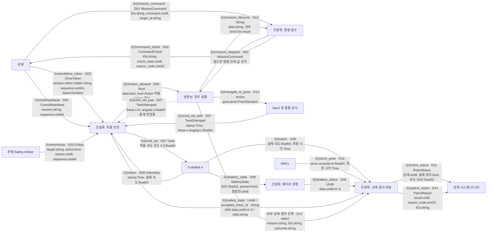
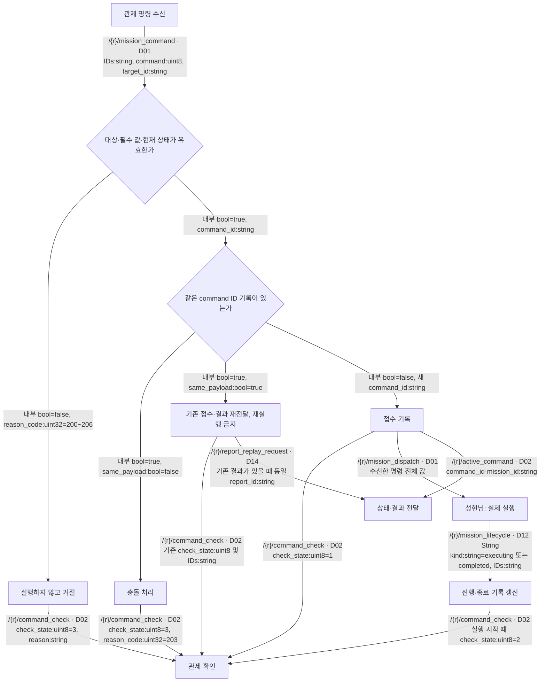
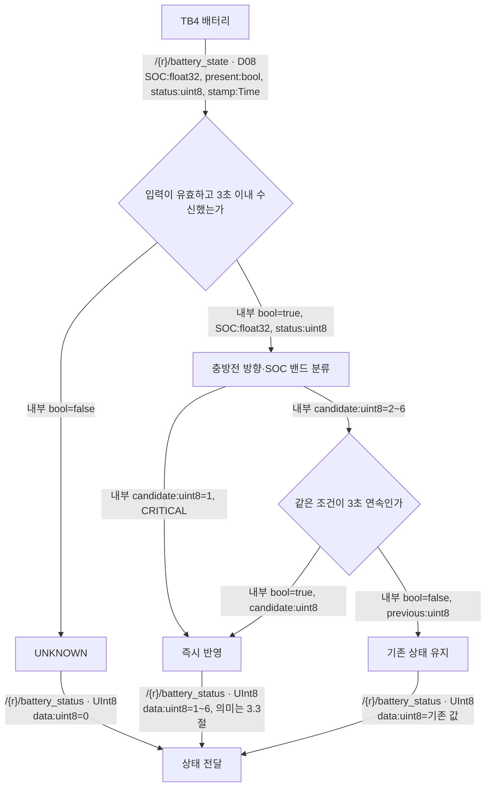
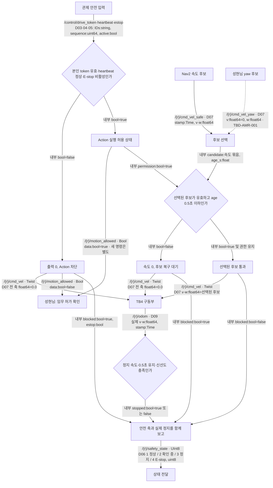
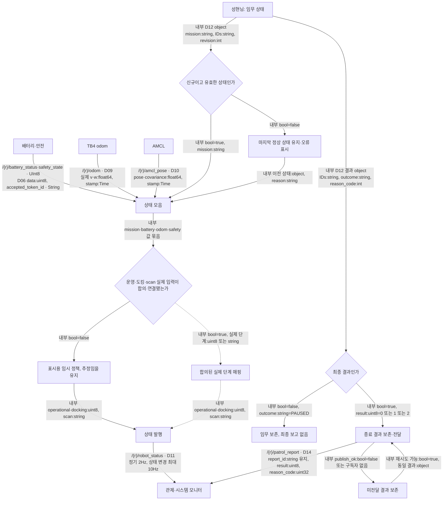
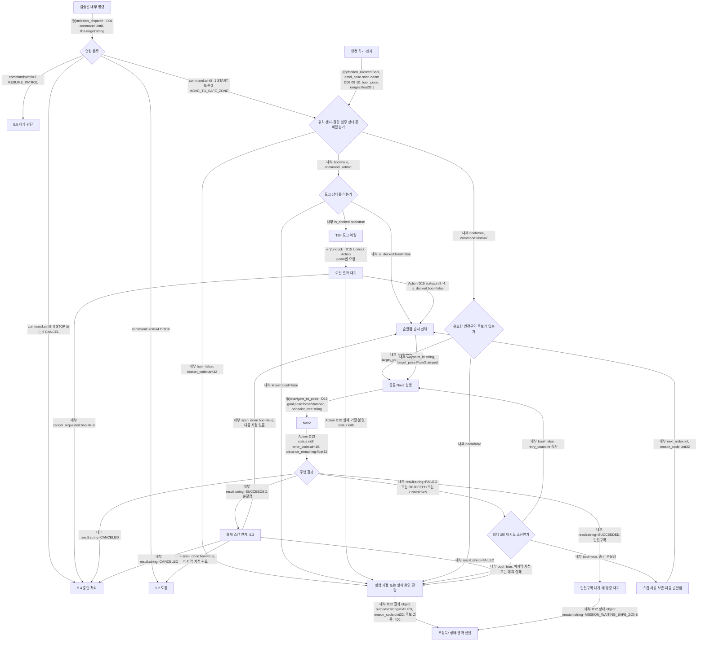
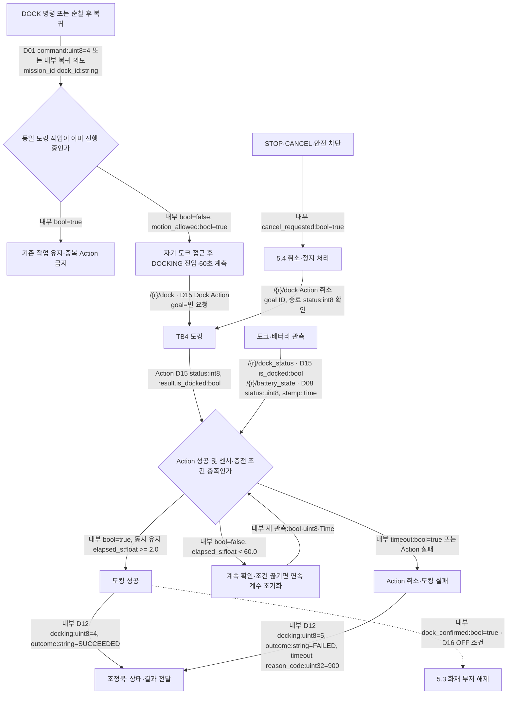
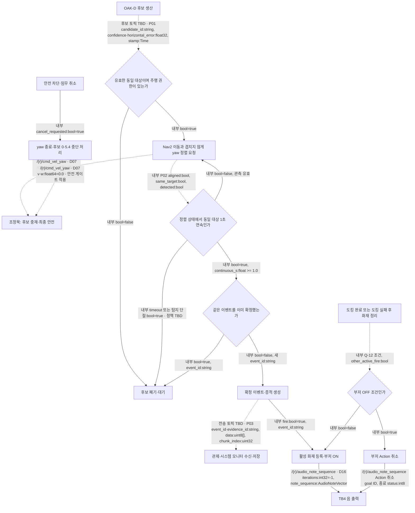
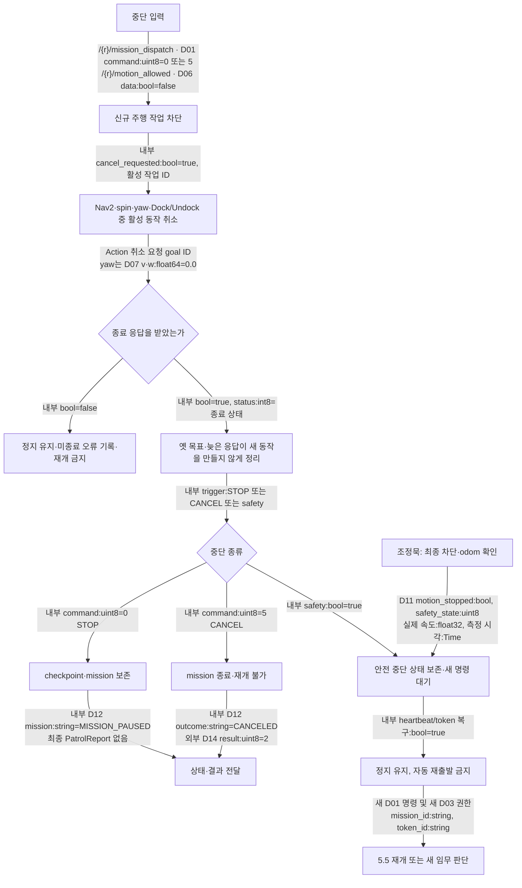
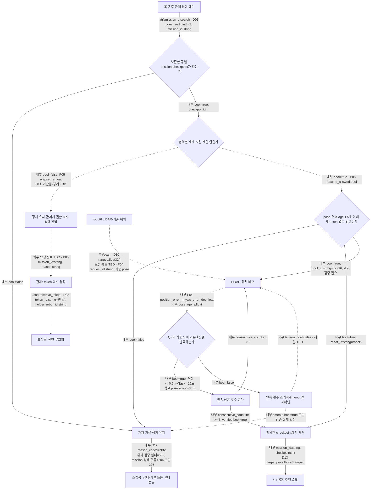

# AMR 안전·임무 설계 흐름과 9월 9일 공동 시험 계획

갱신: **2026-09-09 KST** · 구현·시험 완료 목표: **2026-09-09 12:00 KST**

사용자가 말한 “내일”은 명시한 마감 날짜를 우선하여 **9월 9일 오전**으로 기록한다. 아래 시간표는 작업 계획이며 예약 실행이나 완료 보장이 아니다. 실기 결과는 아직 **미실행**이다.

이 문서의 모든 그림은 **설계**다. 코드를 작성하기 전에 합의할 수 있는 입력·판단·출력·실패·복구 흐름으로 읽는다. 현재 구현 수준은 1절에서 별도로 표시하며, 설계 그림이 있다고 구현·시험 완료로 처리하지 않는다. 함수·클래스·저장 알고리즘·실행 명령 등 코드 상세는 본문에 넣지 않는다.

기준: [공용 인터페이스](interfaces.md), [AMR 기능·TBD](amr.md), [통합 순서](integration.md), [관제 v1.0 결정](decisions/2026-09-08-control-interface-baseline.md). 화살표를 읽기 위한 값 설명은 이 문서에 표시하되, 계약 변경은 기준 문서에서 결정한다. 기존 코드별 그림·검증 로그는 [9월 8일 구현·시험 이력](amr_patrol_safety_flowchart_2026-09-08_history.md)에 보존했다.

## 1. 오전 시작 시 확인할 진행 상태와 역할

담당 구분은 이번 공동 작업에 한정한다. 조정묵은 `patrol_amr_safety`의 안전·명령 접수·상태/결과 전달, 성현님은 `patrol_amr`의 실제 임무·Nav2·도킹·감지 실행을 맡는 작업안이다. 공용 메시지나 상대 파트의 수정은 합의할 변경 범위를 먼저 확인한다.

| 항목 | 9월 8일 작업본에서 확인한 상태 | 구현·연결이 남은 일 | 오전 확인 담당 |
|---|---|---|---|
| AMR-11 E-stop | 현행 v1.0 로컬 차단·odom 정지 판단 구현 및 로컬 ROS 시험 완료 | 실제 바퀴 정지, 해제 후 자동 출발 없음 확인. 물리 latch·manual reset은 현행 범위 제외 | 조정묵, 성현님은 Action 취소 확인 |
| AMR-13 도킹 | TB4 Dock/Undock 요청·취소·60초 제한·도킹 상태 연속 확인 구현 | **DOCKED와 실제 CHARGING의 동시 연속 확인** 연결, 중복 실행 방지와 실패 경로 실기 | 성현님 실행, 조정묵 센서·보고 |
| AMR-14 감지·증적·부저 | 화재 이벤트 중복 관리·TB4 부저 연결용 기초 기능 있음 | OAK-D 후보→yaw→1초 확인→이벤트·증적→부저의 전체 연결, 속도 중재 | 성현님 실행, 조정묵 안전 중재·보고 공동 |
| AMR-15 robot6 위치 검증 | scan 수신·pose 준비 확인 있음 | **실제 위치 비교 및 0.5m·15도·3회 연속 판정 없음**. 요청·결과·timeout 계약 필요 | 성현님 검증 생산, 조정묵 전달 공동 |
| AMR-18 중단·복구 | Nav2 취소·진행 상태 정리·명령 대기 핵심 경로 있음 | yaw/spin/도킹까지 취소 연결, 늦은 응답과 잔여 목표 차단, 실기 | 성현님 실행 정리, 조정묵 최종 정지 |
| AMR-19 순찰 재개 | checkpoint와 재개 방식 선택 기능 있음. 기본 설정 비활성 | 재개 위치 확정, **30초 규칙의 기산점·만료 처리·token 회수 연계 없음** | 성현님 시나리오, 조정묵 상태 전달, 관제 회수 결정 |
| 안전·상태 패키지 공통 | 명령 입구·배터리·권한·heartbeat·상태/결과 연결 완료. 전체 단위시험 367개 및 격리 ROS 시험 통과 기록 있음 | 실제 TB4·관제·mission 연결 시험, 임시 보고 상태의 실제 입력 교체 | 조정묵 |

**전체 AMR 코드가 완료된 상태는 아니다.** 임시 구현을 포함한 완료 범위는 안전·보고 패키지다. 임시 `SCANNING` 표시는 실제 탐지나 증적 완료를 의미하지 않는다.

원본 작업표의 오래된 조건을 그대로 구현하지 않는다. 도킹은 접점 “또는” 센서 3초가 아니라 **DOCKED와 CHARGING 모두 2초**, E-stop은 현행 v1.0에서 물리 latch·manual reset 제외다. AMR-19의 재개 30초는 Q-06의 **마지막 pose age 30초**와 서로 다른 조건이며, 재개 정책은 TBD-AMR-005에서 결정해야 한다.

## 2. 화살표·타입 읽는 법

- `/{r}`는 `/robot1` 또는 `/robot6`이다. `robot_id:string`도 각각 `robot1`, `robot6`이다. `AMR1/AMR2`는 화면 이름이다.
- 실선은 기준 흐름, 점선은 **제안 또는 연결 미완료**다. 실선도 실기 통과 표시가 아니다.
- 화살표의 `D01` 같은 번호는 3절의 **필드·타입·값 사전**을 가리킨다. 연결은 `통로 / 타입 / 전달 값` 순서로 읽는다.
- `내부`는 ROS 토픽이 아닌 판단 결과 또는 파트 안의 데이터 전달이다. 분기선의 `bool=true/false`는 내부 판단값이며 ROS 메시지를 발행한다는 뜻이 아니다.
- `string` 문자열, `bool` 참/거짓, `uint8` 0~255 정수, `uint16/32/64` 해당 비트 수의 음이 아닌 정수, `int32` 부호 있는 정수, `float32/64` 실수, `T[]` 여러 값의 배열, `object` 여러 필드 묶음이다. 내부 `int/float`는 아직 ROS wire 타입을 정하지 않은 숫자다.
- `Time`은 `sec:int32 + nanosec:uint32`, `Duration`도 같은 두 필드로 나타낸 기간이다. `Header`는 `stamp:Time + frame_id:string`이다. 서로 다른 PC의 로컬 경과 시계를 직접 비교하지 않는다.

`amcl_pose` 생산자는 AMCL, odom 생산자는 TB4다. 관제는 명령·token·안전 해제를 결정하고, 시스템 모니터는 수신 결과를 표시·저장한다.

## 3. 화살표의 값 사전

### 3.1 명령·권한·안전 입력

| 번호·통로·메시지 타입 | 전달 필드와 타입 | 값의 종류·의미 |
|---|---|---|
| D01 `/{r}/mission_command`, `/{r}/mission_dispatch` · `patrol_interfaces/MissionCommand` | `header:Header`; `command_id, mission_id, robot_id, target_id, issued_by:string`; `command:uint8`; `target_pose:PoseStamped` | `command`: **0 STOP** 진행 보존 정지, **1 START_PATROL** 새 순찰, **2 MOVE_TO_SAFE_ZONE** 대피, **3 RESUME_PATROL** 기존 순찰 재개, **4 DOCK** 도킹, **5 CANCEL** 임무 종료. `target_id`: START는 `robot1_default/robot6_default`, DOCK는 `dock_1/dock_6`, 나머지 빈 문자열. `target_pose`는 현행 6종 명령에서 사용하지 않음 |
| D02 `/{r}/command_check`, 내부 `/{r}/active_command` · `patrol_interfaces/CommandCheck` | `header:Header`; `command_id, mission_id, robot_id, reason, source_session_id:string`; `check_state:uint8`; `reason_code:uint32`; `sequence:uint64` | `check_state`: **0 UNKNOWN** 미정, **1 ACCEPTED** 접수, **2 EXECUTING** 실행 시작, **3 REJECTED** 거절. 접수 성공은 임무 성공이 아님. 원인은 3.5절 |
| D03 `/control/drive_token` · `patrol_interfaces/DriveToken` | `header:Header`; `control_session_id, token_id, holder_robot_id:string`; `lease_duration:Duration`; `message_sequence:uint64` | holder는 `robot1/robot6`; 빈 token은 해당 holder 권한 회수. 같은 세션에서 sequence 증가만 수락. 발행 5Hz·lease 1초(Q-01). 새 token만으로 자동 출발하지 않음 |
| D04 `/control/heartbeat` · `patrol_interfaces/ControlHeartbeat` | `header:Header`; `control_session_id:string`; `sequence:uint64` | 관제 세션과 증가 번호. 5Hz, 1초 미수신 시 차단(Q-16). 세션 변경 시 이전 권한 무효 |
| D05 `/control/estop` · `patrol_interfaces/EStop` | `header:Header`; `target_robot_id:string`; `active:bool`; `reason:uint8`; `sequence:uint64` | target=`robot1/robot6/all`. active=true 정지 활성, false 해제 통보. reason: **0 UNKNOWN** 미분류, **1 OPERATOR** 운영자 요청, **2 COMMUNICATION** 통신, **3 TOKEN** 권한, **4 OBSTACLE** 장애물, **5 KEEPOUT_FAILURE** 영역 제한 실패, **6 SYSTEM_FAULT** 시스템 고장 |

E-stop 해제는 관제가 모든 활성 원인이 **3초 연속 사라짐**을 확인한 뒤 통보한다. AMR은 해제만으로 출발하지 않는다. 새로운 token과 별도 유효 MissionCommand가 모두 필요하다. 물리 E-stop의 latch/reset은 이 표의 계약이 아니다.

### 3.2 로봇 센서·내부 상태·속도

| 번호·통로·타입 | 필드와 값의 의미 |
|---|---|
| D06 `/{r}/motion_allowed` · `std_msgs/Bool` | `data:bool`; true는 Action 실행 허용, false는 신규 Action 차단·현재 동작 중단. true 자체는 새 임무 명령이 아님 |
| D06 `/{r}/battery_status`, `/{r}/safety_state` · `std_msgs/UInt8` | `data:uint8`; 각각 3.3절 Battery/Safety 표의 값 |
| D06 `/{r}/accepted_token_id` · `std_msgs/String` | `data:string`; 현재 수락한 token ID, 빈 문자열은 유효 token 없음 |
| D07 `/{r}/cmd_vel_nav`, `cmd_vel_smoothed`, `cmd_vel_safe`, `cmd_vel_yaw` · `geometry_msgs/TwistStamped` | `header:Header`, `twist.linear.{x,y,z}, twist.angular.{x,y,z}:float64`. 평면 이동은 `linear.x` m/s, 회전은 `angular.z` rad/s. yaw 후보의 linear.x는 0. 나머지 축은 평면 구동에서 0. 후보 age≤0.5초(Q-17) |
| D07 `/{r}/cmd_vel` · `geometry_msgs/Twist` | 시각 필드 없이 `linear/ angular`의 각 축 `float64`. 허용 시 선택된 후보, 차단 시 전 축 0.0. 최종 발행자는 local safety 한 개 |
| D08 `/{r}/battery_state` · `sensor_msgs/BatteryState` | 이 설계가 읽는 값: `header:Header`, `percentage:float32` SOC 0~1, `present:bool`, `power_supply_status:uint8`: **0 UNKNOWN**, **1 CHARGING**, **2 DISCHARGING**, **3 NOT_CHARGING**, **4 FULL**. 충전 방향은 1 또는 4, 방전 방향은 2. 나머지·무효 SOC·present=false는 분류 불가 |
| D09 `/{r}/odom` · `nav_msgs/Odometry` | `header:Header`, `child_frame_id:string`, `twist.twist.linear/ angular` 각 축 `float64`; 실제 선속도·각속도와 측정 시각. 정지 판정은 속도 절댓값 v≤0.05m/s, ω≤0.1rad/s를 0.5초 연속 유지하고 age≤0.5초 |
| D10 `/{r}/amcl_pose` · `geometry_msgs/PoseWithCovarianceStamped` | `header:Header`의 frame=`map`; `pose.pose.position.{x,y,z}:float64` m, `orientation.{x,y,z,w}:float64` quaternion, `pose.covariance:float64[36]` 불확실성. 유효·신선한 위치와 마지막 유효 위치를 구분 |
| D10 `/{r}/scan` · `sensor_msgs/LaserScan` | `header:Header`, `angle_min/angle_max/angle_increment:float32` rad, `range_min/range_max:float32` m, `ranges:float32[]` 방향별 거리 m. **수신했다는 사실만으로 위치 검증 통과가 아님** |
| D15 `/{r}/dock_status` · `irobot_create_msgs/DockStatus` | `header:Header`, `is_docked:bool` 도킹됨, `dock_visible:bool` 도크 관측됨. 도크가 보인다는 사실은 도킹 완료가 아님 |

센서 표는 판단에 사용하는 필드를 설명한다. 센서 메시지의 다른 측정값을 삭제하거나 타입을 변경하자는 뜻이 아니다. 센서·Action 경로는 **예상 경로**이며 실제 TB4에서 조회해 7절의 관측값에 기록한다. 기존 Discovery 구성을 유지한다.

### 3.3 RobotStatus의 값과 상태 종류

D11 `/{r}/robot_status`의 타입은 `patrol_interfaces/RobotStatus`다.

| 필드·타입 | 값·의미 |
|---|---|
| `header:Header`, `robot_id, source_session_id:string`, `status_sequence:uint64` | 상태 생성 시각, 로봇·발행 세션, 증가 번호 |
| `operational_state:uint8` | **0 UNKNOWN** 미정, **1 INITIALIZING** 준비 중, **2 READY** 준비, **3 MOVING** 이동, **4 STOPPED_SAFETY** 안전 차단, **5 CHARGING** 충전, **6 ERROR** 오류 |
| `mission_state:uint8` | **0 NONE** 임무 없음, **1 UNDOCKING** 도크 이탈, **2 PATROLLING** 순찰, **3 MOVING_TO_SAFE_ZONE** 대피 이동, **4 WAITING_SAFE_ZONE** 안전구역 대기, **5 RETURNING_TO_DOCK** 도크 복귀, **6 DOCKING** 도킹 중, **7 PAUSED** 보존 정지, **8 COMPLETED** 완료, **9 FAILED** 실패, **10 CANCELED** 취소 종료 |
| `docking_state:uint8` | **0 UNKNOWN** 미정, **1 UNDOCKED** 도크 밖, **2 UNDOCKING** 이탈 중, **3 DOCKING** 접속 중, **4 DOCKED** 도킹 완료, **5 FAILED** 도킹 실패 |
| `battery_state:uint8` | **0 UNKNOWN** 무효·미수신, **1 CRITICAL** 방전 SOC<0.10, **2 LOW** 방전 0.10≤SOC<0.20, **3 NORMAL** 방전 SOC≥0.20, **4 CHARGING** 충전 SOC<0.50, **5 PATROL_READY** 충전 0.50≤SOC<0.80, **6 FULL** 충전 SOC≥0.80 |
| `safety_state:uint8` | **0 UNKNOWN** 미정, **1 NORMAL** 활성 차단 없음, **2 STOPPING** 차단·정지 확인 중, **3 STOPPED** 차단·실제 정지 확인, **4 ESTOPPED** E-stop 활성, **5 ERROR** 안전 계층 오류. 1은 임무 명령이 아니며 4는 실제 속도 0의 증명이 아님 |
| `active_command_id, active_mission_id, accepted_token_id:string`, `token_valid:bool` | 현재 명령·임무·권한 식별자와 권한 유효 여부 |
| `pose, last_valid_pose:PoseWithCovarianceStamped`, `pose_valid:bool` | 현재 측정·마지막 정상 측정·현재 유효 여부. 각각의 header에 측정 시각이 있음 |
| `linear_velocity, angular_velocity:float32`, `motion_stopped:bool` | 실제 m/s·rad/s, D09 정지 조건 충족 여부 |
| `battery_soc:float32`, `battery_timestamp:Time` | SOC 비율과 배터리 측정 시각 |
| `current_waypoint_id:string`, `scan_state:string` | 현재 순찰점 ID, 스캔 단계 문자열. waypoint 이름은 실제 계획의 ID를 사용 |
| `reason_code:uint32`, `reason:string` | 상태 원인 번호와 사람이 읽을 설명 |

`scan_state`의 **현재 임시 문자열**: `UNKNOWN` 미확인, `IDLE` 스캔 작업 없음, `MOVING_TO_WAYPOINT` 순찰점 이동 추정, `SCANNING` 순찰 중 정지에서 추정, `PAUSED` 중단, `FAILED` 실패, `CANCELED` 취소, `COMPLETED` 완료. 마지막 세 값 역시 임무 상태에서 옮긴 임시 표시다. 실제 scan 단계 생산자가 연결되기 전 탐지 성공 판정에 사용하지 않는다.

운영·도킹·scan의 임시 추정은 [임시 정책 TEMP-AMR-STATUS-20260908-v1](development/provisional-amr-status-policy.md)에 별도 기록되어 있다. 성현님이 실제 단계를 제공하면 의미·재시작 처리를 맞춰 대체한다. 공용 enum 숫자는 변경하지 않는다.

### 3.4 두 파트의 내부 인계와 Action

| 번호·통로·타입 | 전달 값과 종류·의미 |
|---|---|
| D12 `/{r}/mission_lifecycle` · `std_msgs/String` | `data:string` 안의 구조화된 값: `schema_version:int=1`, `kind:string`=`executing` 실행 시작 / `completed` 종료, `command_id, mission_id, robot_id:string`, `report:object 또는 null`. 시작에는 null, 종료에는 D14에 해당하는 결과. 외부 CommandCheck는 gateway만 발행 |
| D12 내부 임무 상태 인계 · `object` (ROS 토픽 아님) | `mission:string`은 `MISSION_NONE` 등 3.3절 Mission 이름에 `MISSION_` 접두사. `command_id, mission_id, outcome, reason:string`; `waypoint_index, last_waypoint_index:int`=-1 미지정 또는 0부터 순번; `reason_code:int`; `revision:int` 증가 번호; `updated_monotonic_s:float` 로컬 갱신 시각. outcome은 빈 값 진행 중 / `PAUSED` 보존 / `SUCCEEDED, FAILED, CANCELED` 종료 |
| D12 내부 결과 인계 · `object` (ROS 토픽 아님) | D14의 로봇·명령·임무·결과·이유·시작/종료 시각·연관 이벤트를 전달. 같은 결과는 같은 report ID 유지. 전달 실패 시 결과 보존. 외부 저장 ACK 계약은 TBD-IF-003 |
| D13 `/{r}/navigate_to_pose` · `nav2_msgs/action/NavigateToPose` | goal=`pose:PoseStamped`, `behavior_tree:string`; feedback=`current_pose:PoseStamped`, `distance_remaining:float32` m, 시간:`Duration`, `number_of_recoveries:int16`; result=`error_code:uint16`, `error_msg:string`. Action 상태 `status:int8`: 0 UNKNOWN, 1 ACCEPTED, 2 EXECUTING, 3 CANCELING, 4 SUCCEEDED, 5 CANCELED, 6 ABORTED |
| D13 내부 주행 결과 · `string` | `SUCCEEDED` 성공, `FAILED` 실패, `CANCELED` 취소, `REJECTED` 목표 거절, `UNKNOWN` 결과 불명. 위 Action 상태와 외부 PatrolReport result의 숫자를 혼용하지 않음 |
| D15 `/{r}/dock`, `/{r}/undock` · `irobot_create_msgs/action/Dock`, `Undock` | goal=빈 요청; result=`is_docked:bool`; Dock feedback=`sees_dock:bool`. Action 성공과 도킹·충전 유지 조건을 함께 확인 |
| D16 `/{r}/audio_note_sequence` · `irobot_create_msgs/action/AudioNoteSequence` | goal=`iterations:int32` -1 반복 / 양수 횟수, `note_sequence:AudioNoteVector` 음 목록; result=`complete:bool`, `iterations_played:int32`, `runtime:Duration`. 반복 재생이 부저 ON, 취소 요청이 OFF 의도이며 실제 음 종료를 확인 |
| 내부 취소 요청·Action 취소 | 내부 `cancel_requested:bool=true`는 취소 의도. ROS Action 취소 요청은 goal ID와 시각을 가진 요청이며 Bool 토픽이 아님. 취소 수락·종료 상태·실제 정지를 각각 확인 |

`PoseStamped`는 `header:Header`와 위치 x/y/z·방향 quaternion x/y/z/w의 `float64` 묶음이다. `AudioNoteVector`는 `header:Header`, `notes:AudioNote[]`, `append:bool`이며, 각 음은 `frequency:uint16` Hz와 `max_runtime:Duration`이다. append=true는 음 목록 뒤에 추가, false는 교체 의미다. Action 취소의 goal ID는 `uint8[16]`이며 응답의 취소 수락 여부와 최종 상태를 구분한다.

### 3.5 최종 결과·사유

D14 `/{r}/patrol_report`와 내부 재전달 통로 `/{r}/report_replay_request`는 `patrol_interfaces/PatrolReport`를 쓴다. 필드: `header:Header`; `report_id, robot_id, source_session_id, command_id, mission_id, reason, final_waypoint_id:string`; `result:uint8`; `reason_code:uint32`; `started_at, finished_at:Time`; `related_event_ids:string[]`.

`result`: **0 SUCCEEDED** 목표 달성 / **1 FAILED** 실패 / **2 CANCELED** 취소 종료. STOP은 임무를 보존하므로 최종 보고서를 만들지 않는다. CANCEL은 취소 결과를 남긴다. `UNREPORTED`는 관제의 보고 누락 판단이며 result 값이 아니다.

| reason_code:uint32 | 의미 |
|---|---|
| 0 | 사유 없음 |
| 100 / 101 / 102 | 관제 취소 / 명령 대체 / 안전 정책 취소 |
| 200 / 201 / 202 / 203 | 잘못된 명령 / 대상 / 미지원 명령 / 같은 command ID에 다른 내용 |
| 204 / 205 / 206 | 잘못된 mission / 필수 값 오류 / 현재 상태에서 불가 |
| 300 / 301 / 302 / 303 | 경로 없음 / 주행 시간 초과 / 목표 거절 / 목표 중단 |
| 400 / 401 / 402 | 안전구역 없음 / Keepout 적용 실패 / 복구 실패 |
| 500 / 501 / 502 | 위치 무효 / 위치 오래됨 / LiDAR 검증 실패 |
| 600 / 601 / 602 | token 없음 / token 만료 / 통신 상실 |
| 700 / 701 / 702 | E-stop / 장애물 차단 / 화재 감지 |
| 800 / 801 / 900 / 901 | 배터리 LOW / CRITICAL / 도킹 시간 초과 / 역할 교대 |
| 1000 / 1001 | 센서 오류 / 내부 오류 |

### 3.6 아직 합의할 감지·위치 검증 데이터 — 제안

다음 값은 **설계에 필요한 논리 데이터**다. 공용 토픽·wire 타입을 새로 확정한 것이 아니다. 계약 담당자가 실제 이름·타입을 결정하기 전 점선 연결을 구현 완료로 표시하지 않는다.

| 번호 | 논리 값·종류·의미 | 결정할 경계 |
|---|---|---|
| P01 감지 후보 | `candidate_id:string` 동일 후보 ID, `event_type` 화재/누수/장애물 등 분류, `confidence:float32` 0~1, `horizontal_error:float32` 중심 오차, `stamp:Time` 측정 시각 | 후보 토픽·분류 숫자·좌우 부호·단위·동일 대상 기준: TBD-AMR-001·TBD-IF-006. 후보 메시지의 제안 FIRE=0과 DetectionEvent의 FIRE=1을 직접 대입하지 않음 |
| P02 정렬·스캔 판단 | `aligned:bool`, `same_target:bool`, `detected:bool`, `continuous_s:float` 유지 초, `scan_state:string` 실제 단계 | 오차·속도·timeout·단절 시 계수·단계 문자열: TBD-AMR-001·005. 1초 확인 의도는 유지 |
| P03 확정 이벤트·증적 | `event_id, evidence_id, robot_id:string`; 이벤트 분류·위험도, `confidence:float32`, `location_valid:bool`, 위치·측정 시각; 증적 `media_type, sha256:string`, `chunk_index, chunk_count, total_size:uint32`, `data:uint8[]` 이미지 등 bytes | `DetectionEvent`·`Evidence` 정의는 있으나 생산·전송·저장 ACK 전체 계약은 TBD-IF-006·007. 최종 토픽 TBD, 수신자는 관제·시스템 모니터 협의 |
| P04 LiDAR 검증 요청·결과 | `request_id, robot_id:string`, 기준·측정 pose, `position_error_m:float`, `yaw_error_deg:float`, `consecutive_count:int`, `verified:bool`, `reason:string` | 대상·연산 위치·토픽/서비스·wire 타입·timeout: TBD-AMR-002. Q-06의 0.5m·15도·3회 연속을 만족해야 verified=true |
| P05 재개·token 회수 요청 | `mission_id:string`, `checkpoint:int`, `elapsed_s:float`, `resume_allowed:bool`; 관제에 알릴 회수 사유 | 30초 기산점·경계·재개 점·회수 요청 통로 TBD-AMR-005 및 관제 협의. AMR이 DriveToken을 직접 발행해 반납을 흉내 내지 않음 |

DetectionEvent에 정의된 `event_type:uint8`은 0 미정 / 1 화재 / 2 누수 / 3 장애물 / 4 조명 / 5 시설 손상이며, `risk_level:uint8`은 0 미정 / 1 낮음 / 2 중간 / 3 높음이다. 후보 분류를 이 값으로 변환할 규칙과 실제 송수신 토픽은 별도 확인한다.

## 4. 조정묵 파트 설계

### 4.1 명령 접수·중복 방지

### 4.2 배터리 분류

배터리 분류는 도킹 성공의 대체 센서가 아니다. 높은 SOC의 `PATROL_READY/FULL`과 실제 충전 상태를 구분하는 기준은 TBD-AMR-004에서 확인한다.

### 4.3 최종 속도·안전 상태

후보 신선도 차단과 `motion_allowed`의 권한 차단은 구분한다. **yaw와 Nav2의 선택 정책은 아직 미연결**이다. 안전 입력이 바뀌면 후보 처리 중에도 차단을 우선한다. odom 무효·stale이면 정지 완료로 간주하지 않는다. 실제 정지 감속·거리 합격 수치는 TBD-AMR-006이며 실측만으로 계약 확정 처리하지 않는다.

### 4.4 상태·결과 전달과 임시 상태 교체

외부 저장 ACK는 아직 확정되지 않았다. 토픽 수신·발행 성공과 DB 저장 완료를 같은 합격 조건으로 기록하지 않는다.

## 5. 성현님 파트 설계와 바로 수행할 작업

### 5.1 임무 선택·공통 주행·순찰·대피

스캔을 단순 정지 대기로 대체해 AMR-14·17 완료로 기록하지 않는다. 안전구역 후보는 Q-08 조건을 만족해야 하며 실제 후보 공급은 TBD-CTRL-002다. waypoint·도크·map·Keepout 정합과 Nav2 재시도/스킵은 성현님이 기존 작업 진척을 먼저 확인한다. 스킵 상세의 외부 보고 형식은 TBD-AMR-005에서 맞춘다.

### 5.2 AMR-13 도킹 — 충전 확인 연결 필요

**현행 Q-09:** DOCKING 진입 후 60초 이내에 DOCKED와 CHARGING이 모두 2초 연속. 단순 Action 성공·dock_visible·SOC 증가만으로 성공 처리하지 않는다. 원본 작업표의 3초는 사용하지 않는다. 실제 충전 status=FULL 및 높은 SOC의 취급·센서 신선도는 TBD-AMR-004에서 합의 후 판정에 반영한다. TB4 Dock/Undock의 자체 구동 경로가 최종 안전 차단을 우회하는지도 RT-07에서 반드시 확인한다.

### 5.3 AMR-14 감지·yaw·증적·화재 부저 — 전체 연결 필요

오전 합의 항목: 정렬 허용 오차·속도·timeout, 동일 대상 식별, 탐지 단절 시 계수, Nav2/yaw 동시 요청 처리, 이벤트 중복 기준, 증적 수신·저장 확인, 부저 소유자와 OFF 조건. 모두 TBD-AMR-001·004 및 TBD-IF-006·007에 연결한다. 제안으로는 안전 차단 최우선·동시 주행 금지·불명확하면 정지 방향을 사용하되, 숫자와 복구 조건을 확정한 것으로 취급하지 않는다. E-stop 해제 부저는 사용하지 않는다.

### 5.4 AMR-18 중단·복구 — Action 종료와 실제 정지를 따로 확인

취소를 요청했다는 사실만으로 종료 완료로 표시하지 않는다. 종료 응답이 없거나 실제 정지가 확인되지 않으면 재개하지 않는다. 안전 중단을 PAUSED로 보존할지 최종 취소할지의 세부 정책은 TBD-AMR-005에서 원인별로 합의한다.

### 5.5 AMR-15 위치 검증·AMR-19 재개 — 제안 흐름

이 그림의 30초 재개 창·검증 요청·회수 요청은 **미합의 제안**이다. 마지막 pose가 30초 이내라는 Q-06만으로 현재 pose 신선도(Q-05)를 통과시키지 않는다. AMR이 token 발급·회수 결정권을 가져오지 않는다. 검사 결과가 false 또는 불명확하면 출발시키지 않는다. 연속 샘플의 독립성·실패 재시도·timeout·기산 시점은 성현님과 관제가 먼저 결정해야 한다.

### 5.6 성현님 오전 작업 인계표

| 우선순위·대상 | 시작할 때 확인할 것 | 완료해서 조정묵에게 넘길 것 | 연결 시험 |
|---|---|---|---|
| P0 명령·상태 경계 | public 명령 입구가 gateway 하나인지, 내부 D01·D12 및 로봇 ID가 일치하는지 | 시작·정지·취소·성공·실패 각각의 상태/결과, 중복 goal 없음 | RT-05·06 |
| P0 AMR-18 | Nav2 외 활성 Dock/Undock·spin·yaw도 취소되는지 | 작업별 취소 종료·미종료 오류·복구 후 명령 대기 경로 | RT-04·06 |
| P0 AMR-13 | 실제 DockStatus·BatteryState 수신과 Q-09 연결 여부 | 도킹/충전 동시 2초, 60초 실패, 중복 방지, 실제 docking 단계 | RT-07 |
| P0 실제 상태 생산 | operational·docking·scan 중 직접 제공할 값과 변경 시점 | 필드 의미·타입·전이·초기값·재시작값 합의표. 임시 추정 제거 가능 여부 | RT-03·05·07 |
| P1 AMR-14 | 후보 생산자·부저 기초 기능·미연결 부분 | P01~03 합의, yaw 중재 공동 연결, 실제 스캔·증적·부저 성공/실패 | RT-10 |
| P1 AMR-15·19 | 위치 기준 공급·검증 연산·checkpoint 의미 | P04·05 합의, 위치 검증 결과, 재개/거절/시간초과 상태 | RT-11 |
| P1 AMR-08~10·16~17 | 실제 map·도크·순찰점·Keepout·안전구역·재시도/스킵 진행 현황 | 실제 주행 가능한 경로, 스킵 결과, 실패 원인과 후속 동작 | RT-05·12 |

위 표는 성현님에게 보낼 **인계 초안**이다. 실제 전달·상대 수락은 아직 기록되지 않았다. 이번 문서 작업으로 성현님 파트 코드를 수정하거나 계약이 합의됐다고 처리하지 않는다.

### 5.7 조정묵이 먼저 준비할 수 있는 부분 — 확인만 수행

2026-09-09 사용자 후속 지시 **“만들진 말고 일단 확인만”**에 따라 구현하지 않았다. 아래 평가는 현재 저장소의 `patrol_amr` 작업본 기준이며 성현님 PC의 미공유 변경까지 확인한 결과는 아니다.

| 후보 | 분리 가능성·병합 부담 | 먼저 준비할 수 있는 범위 | 성현님과 함께 해야 하는 범위 |
|---|---|---|---|
| AMR-13 도킹 완료 조건 판정 | **높음·낮음**: 센서 관측을 받아 판정만 반환하면 독립 가능 | DOCKED와 충전 여부·경과 시간을 입력받아 2초 유지·60초 초과를 판정하는 부분. 실제 센서 해석은 분리 | FULL·신선도 의미 합의, 실제 Dock Action과 입력 연결 |
| AMR-15 오차 경계·연속 횟수 판정 | **높음·낮음**: 계산된 오차를 입력받는 작은 기능 | 위치·방향 오차의 Q-06 경계와 3회 연속 성공 여부. 중복/무효 샘플 처리 계약은 선행 | LiDAR에서 위치를 계산하는 기능, 기준 위치 공급·요청/결과·timeout |
| AMR-14 연속 탐지 판정 | **조건부**: 정렬·동일 대상 판정값을 입력받는 부분만 분리 가능 | 합의한 입력으로 연속 1초 충족 여부를 판단. 실제 OAK-D·yaw·증적 송신은 제외 | 단절·동일 대상·정렬 기준 결정, 전체 감지 실행 연결 |
| 실제 운영·도킹·scan 보고 연결 | **자기 파트 안에서는 낮음** | 성현님이 전달할 실제 단계와 기존 RobotStatus 사이의 매핑 준비 | 실제 단계의 생산 시점·타입·초기/재시작 의미 합의 |
| AMR-18 Action 취소·AMR-19 재개 전체 | **낮음·높음: 선행 병렬 작성 비추천** | 현 상태·필요 입력·성공/실패 조건 정리까지 | 임무 수명·checkpoint·권한·늦은 응답 처리를 성현님 실행 흐름과 함께 수정 |
| Nav2/yaw 중재·전체 Dock 실행·이벤트 전송 계약 | **낮음·높음: 독립 선작성 비추천** | 설계·경계 합의까지 | 최종 안전 소유권·실행 노드·공용 계약을 공동 변경 |

우선 후보는 **AMR-13 판정 부분**, 다음은 **AMR-15의 계산된 오차 판정 부분**이다. 두 경우 모두 독립 기능을 작성해도 실제 센서·임무 연결 전에는 해당 AMR 항목 전체 완료가 아니다. 기존 실행 흐름을 복제하거나 별도 노드를 먼저 추가하지 않는 조건에서 병합 부담을 줄일 수 있다.

## 6. 오전 첫 합의 목록 — 미결이면 관련 기능은 완료 제외

| 결정 항목 | 근거·소유 경계 | 9월 9일 확인란 |
|---|---|---|
| 실제 센서·Action 이름·타입·QoS, namespace·map·TF | architecture의 TBD-ARCH-001, 실제 TB4 조회 | 미확인 |
| Nav2·yaw 후보 중재, 정렬·탐지 판정 수치 | AMR 공동, TBD-AMR-001·006 | 미합의 |
| DOCKED+CHARGING과 FULL/높은 SOC·센서 신선도·부저 OFF | AMR 공동·관제, TBD-AMR-004, Q-09·12 | 미합의 잔여 |
| LiDAR 비교 대상·위치·요청/결과·timeout | AMR 공동·관제, TBD-AMR-002 | 미합의 |
| 재개 점·30초의 시작/경계·만료 보고·token 회수 요청 | 성현님·관제, TBD-AMR-005 | 미합의 |
| 실제 operational/docking/scan 값의 생산자와 재시작 의미 | AMR 공동, 임시 정책 문서·TBD-AMR-005 | 임시 구현, 교체 미합의 |
| 이벤트·증적의 분류 매핑·토픽·ACK·실패/재전송 | AMR·관제·모니터, TBD-IF-006·007 | 미합의 |
| PatrolReport 저장 확인·ACK·삭제 조건 | AMR·관제·모니터, TBD-IF-003 | 로컬 전달과 저장 보장 구분 |

기존 검토 요청: [실제 정지 판단](change_requests/CR-AMR_09-08_23-02_실제_정지_safety_state_판정.md), [운영·도킹 입력 연결](change_requests/CR-AMR_09-08_23-06_운영_도킹_상태_입력_연결.md), [결과 ACK](change_requests/CR-AMR_09-08_10-42_PatrolReport_ACK와_큐_삭제_조건_검토.md). 새 합의는 관련 기준 문서의 기존 TBD에 결정일·근거·영향 범위를 남긴 뒤 구현·시험 상태를 따로 갱신한다.

## 7. 사용자가 직접 확인할 TurtleBot 4 시험

**전 항목 미실행.** 순서는 읽기 전용 연결 → 정지 상태 센서 → 통제된 저속 안전 차단 → 임무/도킹 → 두 로봇/복구 → 미완성 기능 통합이다. 실제 움직임·네트워크 단절 시험은 사용자가 현장 준비를 알린 뒤 진행한다. 단위시험·격리 ROS 검사는 별도 자동 확인이며 반복 승인을 요청하지 않는다.

각 시험에서 robot1·robot6 결과를 분리한다. 둘 중 한 대만 통과하면 두 로봇 완료로 기록하지 않는다. 기존 TB4 Onboard Discovery 설정을 유지하고 실제 설정 차이는 먼저 기록한다.

| ID·항목 | 준비·직접 할 확인 | 합격 기준·기록할 관측 | 담당·선행 |
|---|---|---|---|
| RT-01 통신·식별 | 두 TB4와 AMR/관제 사이 실제 토픽·Action 목록, 타입·QoS·publisher/subscriber, namespace·ID 확인 | D01~16 예상/실제 경로표 작성. robot1/robot6 혼선·중복 namespace 없음. 도메인·Discovery 식별자를 robot ID와 구분 | 조정묵·성현님, 읽기 전용 |
| RT-02 배터리·도크 센서 | 정지 상태에서 충전 연결/해제 전후 원본 SOC·present·충방전·DockStatus 관찰. 안전한 입력 중계 차단으로 미수신 확인 | D08→battery_status→RobotStatus.battery_state 일치, 3초 미수신 UNKNOWN. 실제 충전 status 및 높은 SOC 관측 기록. SOC 전 경계는 격리 입력 시험 결과와 구분 | 조정묵, RT-01 |
| RT-03 odom·pose·상태 | 정지와 이후 저속 이동의 odom·AMCL·RobotStatus 동시 관찰. 입력 끊김도 확인 | 정지 기준 D09, 오래된 odom은 motion_stopped=false. pose frame·시각·유효성 일치. 상태 정기 2Hz·변경 최대 10Hz. 임시 세 상태의 한계 기록 | 조정묵, RT-01; 이동은 RT-04 이후 |
| RT-04 최종 안전·AMR-11 | 최종 속도 publisher 1개 확인 후 통제된 저속에서 E-stop, token 만료/회수, heartbeat 단독 단절, 후보 단절 각각 수행 | 출력 0과 실제 정지 모두 확인. token 1초·heartbeat 1초·후보 age 0.5초 조건 준수. E-stop 반응 시간·정지 거리 실측. 해제/heartbeat/token 복구만으로 재출발 없음 | 조정묵·성현님, RT-01~03 정지 확인 |
| RT-05 명령 종단·중복·주행 | START→접수→실행→실제 goal→완료 결과를 확인. 같은 명령 재전송, 같은 ID 다른 내용, 다른 로봇 대상도 확인 | D01·02·12·14의 IDs 일치, 중복 goal 없음, 충돌 reason=203. 실제 순찰점 도착·실패/재시도·스킵은 각각 기록 | 성현님 실행·조정묵 수신, RT-04 |
| RT-06 STOP/CANCEL·AMR-18 | 주행·yaw·도킹 등 구현된 각 동작 중 STOP/CANCEL/안전 차단. 취소 중 늦은 응답·복구도 확인 | STOP은 PAUSED·checkpoint 보존·최종 보고 없음. CANCEL은 CANCELED 결과·재개 불가. 잔여 goal·회전·자동 출발 없음. 미종료 Action은 실패로 남김 | 공동, RT-04·05, 미연결 동작은 BLOCKED |
| RT-07 AMR-13 도킹·부저 해제 조건 | 두 로봇 각각 자기 도크 접근/이탈·도킹 성공, 확인 중 접점/충전 단절, 도크 미접속 timeout, 중복 DOCK | DOCKED+CHARGING 2초 연속, 단절 시 계수 초기화, 60초 제한, 중복 Action 없음. 도킹 자체 구동도 안전 정지 가능. 상태·결과 일치 | 성현님·조정묵, RT-02·04·06, 충전 판정 연결 후 |
| RT-08 두 로봇 token 교대 | 기존 holder 회수→실제 정지 확인→다른 holder 발급. 개별 E-stop과 all도 관찰 | 동시 이동 권한 없음. odom stale이면 교대 진행 금지. 개별 대상은 해당 로봇, all은 두 로봇 차단 | 공동·관제, RT-04·05 |
| RT-09 단절·재시작·결과 | 로봇 정지 후 관제 수신 단절·복구, AMR/관제 프로세스 재시작, 동일 ID 재전송 | 이전 권한·명령 자동 실행 없음, 로봇별 상태/결과 분리, 미전달 결과 복구와 같은 report ID 확인. **DB 저장 완료는 수신 측 증거가 있을 때만 PASS** | 공동·관제/모니터, RT-04·05 |
| RT-10 AMR-14 감지·증적 | 안전한 시험 영상/대상으로 정렬·1초 탐지·단절·중복·증적 수신·부저 ON/OFF. Nav2/yaw 동시 요청도 확인 | 합의한 P01~03 기준 통과, 최종 안전 우회 없음, 동일 event 중복 없음, 실제 증적/저장 결과 확인, 부저 종료. 임시 SCANNING만으로 PASS 불가 | 공동, 계약·연결 완료 및 RT-04·06·07 |
| RT-11 AMR-15·19 위치 검증·재개 | robot6 실제 LiDAR 비교, 오차 경계·3회 연속/중간 실패, 유효/무효 checkpoint, 합의한 재개 시간 경계·초과 | Q-06 판정과 P04 요청 ID 일치, 3회 전 재개 금지. 합의한 checkpoint 재개, 초과 시 정지·관제 회수 연계. pose age 30초와 재개 창 구분 | 공동·관제, 계약·연결 완료 및 RT-03·06 |
| RT-12 Keepout·대피·전체 순찰 | 성현님 기존 진척 확인 후 실제 map/TF·마스크, 안전구역 유무, 재시도/스킵·복귀까지 관찰 | 실제 후보가 Q-08 충족, 후보 없으면 정지·400, Keepout 부분 실패 처리, W1~W7 실제 계획과 결과 일치. 연계하지 못하면 전체 순찰 완료 제외 | 성현님·관제, RT-04·05·07 |

RT-04 등 주행 시험은 통제 공간·저속·즉시 정지 수단을 준비한다. 예상치 못한 움직임, 최종 속도 중복 발행, 두 로봇 동시 권한, 취소되지 않는 Action이 나타나면 움직이는 시험을 중단하고 원인 수정 후 해당 선행 시험부터 다시 확인한다. E-stop “즉시” 반응은 로그로 측정하되 미합의 정지 거리/감속 수치를 임의 PASS 기준으로 만들지 않는다.

### 실제 접속 결과 기록표

| 로봇 | 데이터 | 예상 경로 | 실제 경로·타입·QoS | 결과 |
|---|---|---|---|---|
| robot1 / robot6 각각 | 배터리 | `/{r}/battery_state` | 미확인 | NOT RUN |
| robot1 / robot6 각각 | odom / AMCL / scan | `/{r}/odom`, `/{r}/amcl_pose`, `/{r}/scan` | 미확인 | NOT RUN |
| robot1 / robot6 각각 | 후보 / 최종 속도 | `/{r}/cmd_vel_safe`, `/{r}/cmd_vel_yaw`, `/{r}/cmd_vel` | 미확인 | NOT RUN |
| robot1 / robot6 각각 | 도크 상태 / Action | `/{r}/dock_status`, `/{r}/dock`, `/{r}/undock` | 미확인 | NOT RUN |
| robot1 / robot6 각각 | 명령 / 상태 / 결과 | `/{r}/mission_command`, `/{r}/robot_status`, `/{r}/patrol_report` | 미확인 | NOT RUN |
| 공통 | 관제 권한 / 생존 / 정지 | `/control/drive_token`, `/control/heartbeat`, `/control/estop` | 미확인 | NOT RUN |

### 시험 결과 기입 양식

모든 RT 항목에 다음 한 줄을 **로봇별·시나리오별**로 추가한다. 결과는 `PASS / FAIL / BLOCKED / NOT RUN` 중 하나다. 계획을 작성했다는 이유로 PASS를 넣지 않는다.

| 일시 KST | RT-ID·세부 조건 | robot_id | 테스트 코드 버전·작업본 식별 | ROS domain·실제 경로 | 관측값·시간·IDs | 로그/영상 위치 | 결과·남은 원인 | 확인자 |
|---|---|---|---|---|---|---|---|---|
| 미실행 | — | — | — | — | — | — | NOT RUN | — |

## 8. 9월 9일 12시까지의 실행 순서 — 제안 시간표

**08:00 시작 가정**이다. 시작이 늦어지면 남은 기능을 완료로 간주하거나 안전 선행 시험을 생략하지 않는다. 핵심 안전/명령/도킹과 감지/검증/재개를 구분해 실제 완료 범위를 11:45에 확정한다. 성현님 작업표 수락·실제 로봇 준비·관제/모니터 참여가 필요한 일정이다.

| 시간 KST | 조정묵 | 성현님 | 공동 종료 조건 |
|---|---|---|---|
| 08:00~08:20 | RT-01 읽기 전용 접속·현재 안전 파트 상태 확인 | 1절 진척 갱신, 미완성 실행 경로·실제 장비 확인 | 실행할 작업본·로봇 ID·토픽 표 일치 |
| 08:20~08:40 | 상태 입력·yaw 안전 경계·시험 순서 합의 | 도킹 충전·감지·LiDAR·재개 계약과 구현 범위 확정 | 6절의 결정을 기준 문서에 기록. 미합의 항목 BLOCKED 표시 |
| 08:40~10:00 | 실제 센서·상태 연결, 승인된 안전/보고 수정, RT-02·03 | P0 도킹·취소·상태 생산 연결, P1 감지·위치 검증·재개 구현 | 관련 단위/격리 ROS 확인. 남은 구현량을 10:00에 재평가 |
| 10:00~10:30 | RT-04 안전 차단·실제 정지 확인 | Action 취소·자동 재출발 없음 공동 확인 | 두 로봇 안전 선행 통과 후 주행 시험 진행 |
| 10:30~11:00 | 상태·결과 수신 및 실패 관측 | RT-05·06·07 명령·중단·도킹 실기 | 성공·실패·취소·timeout 증거 확보 |
| 11:00~11:30 | RT-08·09·10·11 공동 관측 | 감지·LiDAR·재개 및 RT-12 종단 확인 | 구현 완료된 항목을 두 로봇/실제 담당 수신자까지 검증 |
| 11:30~11:45 | 발견 결함 수정 및 관련 회귀 확인 | 실행부 결함 수정 및 해당 실기 재확인 | 실패를 수정한 항목만 재판정, 미실행 유지 |
| 11:45~12:00 | 결과표·남은 조건·임시 정책 갱신 | 항목별 코드 완료/실기 완료 확인 | 구현·로컬 ROS·실기·팀 통합을 나눠 최종 인계 |

AMR-14·15·19는 미합의와 미구현이 남아 있어 전 항목의 정오 완료는 아직 보장할 수 없다. 목표는 유지하되, 10:00 점검에서 남은 작업과 시험 시간을 기록하고 조정한다. **완료 판정:** 필요한 코드 연결 + 관련 로컬 검사 통과 + 해당 RT 실기 PASS + 상대 수신/연계 확인. 임시 보고 값만 연결되거나 장비 없이 통신만 확인한 항목은 그 범위까지만 완료로 표시한다.
