# AMR 안전·임무 설계 흐름과 9월 9일 공동 시험 계획

갱신: **2026-09-09 KST** · 구현·시험 완료 목표: **2026-09-09 12:00 KST**

사용자가 말한 “내일”은 명시한 마감 날짜를 우선하여 **9월 9일 오전**으로 기록한다. 아래 시간표는 작업 계획이며 예약 실행이나 완료 보장이 아니다. 실기 결과는 아직 **미실행**이다.

각 그림의 상태는 절마다 **설계** 또는 **구현 대조**로 표시한다. 구현 대조는 실제 파일과 맞춘 흐름이고, 설계 그림은 합의할 입력·판단·출력·실패·복구 흐름이다. 그림이 있다는 이유로 구현·시험 완료로 처리하지 않는다. 성현님 파일별 상세 그림은 [미션·내비게이션 구현 대조](../src/patrol_amr/docs/mission_navigation.md)를 기준으로 하고 이 문서 9절에서 빠짐없이 연결한다. **AMR 파트 전체 플로우차트는 10절, launch 파일이 무엇을 구동하는지는 11절**이며 두 절은 두 패키지의 실제 코드를 확인해 작성한 구현 대조다.

기준: [공용 인터페이스](interfaces.md), [AMR 기능·TBD](amr.md), [통합 순서](integration.md), [관제 v1.0 결정](decisions/2026-09-08-control-interface-baseline.md). 2026-09-09 사용자가 제공한 `AMR 공동 구현 계약 v1`의 AMR 내부 결정은 이 문서의 공동 구현 기준으로 반영한다. 화살표를 읽기 위한 값 설명은 이 문서에 표시하되, 공용 메시지·System monitor ACK처럼 다른 개발 단위에 영향을 주는 변경은 기준 문서 갱신·수정 요청·명시적 구현 승인을 거쳐야 한다. 기존 코드별 그림·검증 로그는 [9월 8일 구현·시험 이력](amr_patrol_safety_flowchart_2026-09-08_history.md)에 보존했다.

## 1. 오전 시작 시 확인할 진행 상태와 역할

담당 구분은 이번 공동 작업에 한정한다. 조정묵은 `patrol_amr_safety`의 안전·명령 접수·상태/결과 전달, 성현님은 `patrol_amr`의 실제 임무·Nav2·도킹·감지 실행을 맡는 작업안이다. 공용 메시지나 상대 파트의 수정은 합의할 변경 범위를 먼저 확인한다.

| 항목 | 9월 8일 작업본에서 확인한 상태 | 구현·연결이 남은 일 | 오전 확인 담당 |
|---|---|---|---|
| AMR-11 E-stop | 현행 v1.0 로컬 차단·odom 정지 판단 구현 및 로컬 ROS 시험 완료 | 실제 바퀴 정지, 해제 후 자동 출발 없음 확인. 물리 latch·manual reset은 현행 범위 제외 | 조정묵, 성현님은 Action 취소 확인 |
| AMR-13 도킹 | TB4 Dock/Undock 요청·취소·60초 제한·도킹 상태 연속 확인 구현 | **DOCKED와 실제 CHARGING의 동시 연속 확인** 연결, 중복 실행 방지와 실패 경로 실기 | 성현님 실행, 조정묵 센서·보고 |
| AMR-14 감지·증적·부저 | 화재 이벤트 중복 관리·TB4 부저 연결용 기초 기능 있음 | OAK-D 후보→yaw→1초 확인→이벤트·증적→부저의 전체 연결, 속도 중재 | 성현님 실행, 조정묵 안전 중재·보고 공동 |
| AMR-15 robot6 위치 검증 | scan 수신·pose 준비 확인 있음 | **실제 위치 비교 및 0.5m·15도·3회 연속 판정 없음**. 요청·결과·timeout 계약 필요 | 성현님 검증 생산, 조정묵 전달 공동 |
| AMR-18 중단·복구 | Nav2 취소·진행 상태 정리·명령 대기 핵심 경로 있음 | STOP은 checkpoint 보존·비종료 저장, CANCEL과 `motion_allowed=false`는 checkpoint 삭제·CANCELED 결과 저장으로 분리. yaw/spin/Dock 취소, 늦은 응답 차단, 실기 | 성현님 실행 정리, 조정묵 최종 정지·gateway 반영 |
| AMR-19 순찰 재개 | checkpoint와 재개 방식 선택 기능 있음. 기본 설정 비활성 | `next_waypoint`로 설정·고정하고 PAUSED/WAITING_SAFE_ZONE의 동일 mission만 재개. 기존 30초 재개 창은 합격 기준에서 제거하고, robot6 위치 검증은 별도 선행 조건으로 유지 | 성현님 checkpoint·ledger, 조정묵 admission·상태 전달 |
| 안전·상태 패키지 공통 | 공개 명령 입구·배터리·권한·heartbeat·상태/결과 연결 완료. gateway는 PENDING→D17 event 소비→외부 CommandCheck 구조까지 반영 | 성현님 mission의 D17 생산부·TRANSIENT_LOCAL 구독, 실제 TB4·관제 연결 시험, 임시 보고 상태의 실제 입력 교체 | 조정묵 |

**전체 AMR 코드가 완료된 상태는 아니다.** 임시 구현을 포함한 완료 범위는 안전·보고 패키지다. 임시 `SCANNING` 표시는 실제 탐지나 증적 완료를 의미하지 않는다.

원본 작업표의 오래된 조건을 그대로 구현하지 않는다. 도킹은 접점 “또는” 센서 3초가 아니라 **DOCKED와 CHARGING 모두 2초**, E-stop은 현행 v1.0에서 물리 latch·manual reset 제외다. AMR-19의 재개 위치는 공동 계약에 따라 **다음 waypoint**로 고정한다. 이전 그림의 30초 재개 창은 채택하지 않았으며 Q-06의 **마지막 pose age 30초**와 혼용하지 않는다.

### 1.1 9월 9일 공동 구현 계약으로 갱신한 범위

이 절은 이후 절의 오래된 설명과 충돌할 때 우선한다. 계약을 문서에 반영한 것이 코드 변경 승인이나 구현 완료를 뜻하지 않는다.

| 경계 | 9월 9일 공동 기준 | 현재 작업본과의 차이·상태 |
|---|---|---|
| 명령 진입 | 공개 `mission_command`는 gateway만 구독하고 전체 `MissionCommand`를 내부 `mission_dispatch`로 전달 | 진입 구조는 연결됨 |
| ACCEPTED 시점 | gateway 기본 검증→SQLite `PENDING`→dispatch→mission `ADMITTED/REJECTED` 후 외부 ACCEPTED/REJECTED. 4초 무응답은 `206 / MISSION_DISPATCH_TIMEOUT` | **gateway 소비부 구현 완료**, mission 생산부 연결·ROS 종단시험 필요 |
| 내부 실행 이벤트 | `MissionExecutionEvent`: ADMITTED, REJECTED, STARTED, NONTERMINAL_STORED, RESULT_STORED. QoS RELIABLE/TRANSIENT_LOCAL/KEEP_LAST(20) | 메시지·gateway 구독/검증/영속 멱등 처리 반영. **성현님 mission 생산부 미반영** |
| dispatch QoS·중복 | RELIABLE/TRANSIENT_LOCAL/KEEP_LAST(10), mission ledger가 retained 재수신·재시작의 실제 Action 중복을 차단 | gateway PENDING 저장·재시작 1회 복원·4초 만료 반영. **mission execution ledger와 retained 중복 Action 차단 미반영** |
| 중재 | STOP > MOVE_TO_SAFE_ZONE > DOCK > CANCEL > RESUME_PATROL > START_PATROL. 높은 우선순위만 교체, 같거나 낮으면 거절, 낮은 명령 FIFO 금지 | 우선순위·교체·SUPERSEDED 전체 대조 필요 |
| STOP | 활성 mission이 없어도 no-op 수락. ADMITTED→STARTED→NONTERMINAL_STORED, PAUSED·checkpoint 보존·PatrolReport 없음 | gateway의 비종료 저장·중복 차단은 반영. **mission의 STOP admission·checkpoint 보존·D17 생산부 미반영** |
| CANCEL | 동일 활성 mission만 허용. checkpoint 삭제, CANCELED/100 결과 저장, 새 mission ID START만 가능 | gateway의 RESULT_STORED 소비·완료 보고 보존은 반영. **mission의 동일 활성 임무 검사·checkpoint 삭제·D17 생산부 미반영** |
| 안전 권한 상실 | 모든 명령보다 우선. Nav2·Dock 취소, mission CANCELED, checkpoint 삭제, CANCELED/102 `LOCAL_SAFETY_REVOKED`, 자동 재출발 금지 | 현재 외부 stop/cancel 핵심은 있으나 결과·checkpoint 종단 보강 필요 |
| 재개 | `resume_policy=next_waypoint`; PAUSED 또는 WAITING_SAFE_ZONE이며 checkpoint가 있는 동일 mission만 허용 | 코드 선택지는 있으나 기본 설정은 disabled. 설정·checkpoint 경계·시험 필요 |
| 저장 책임 | gateway SQLite는 외부 command 상태, mission execution ledger는 side effect 중복, mission status/outbox는 상태·결과 | gateway PENDING/REJECTED/비종료·이벤트 키·재시작 복원 반영. mission ledger 연결은 미완성 |
| 결과 ACK | 같은 report ID를 1초 간격 재발행, 30초 후 경고하되 삭제 금지. 일치하는 STORED/DUPLICATE ACK만 삭제 후보 | `IngestionAck`의 System monitor 공식 채택 전 **외부 확인·구현 보류** |

`MissionExecutionEvent.msg` 추가는 사용자 승인 범위에 따라 수정 요청서를 남기고 반영했다. `IngestionAck` 적용과 `RobotStatus.msg`의 “중복 SAFETY 상수 제거”는 별도 단위에 영향을 주거나 삭제 대상이 불명확하므로 적용하지 않았다.

### 1.2 9월 9일 자동 시험 결과와 다음 시작점

기준선 시험은 커밋 `82d53ec`에서 수행했고, pull·병합 뒤 현재 기준은 커밋 `1933d4c`와 아래 작업 트리다. 실물 로봇이 없는 검사는 로컬 DDS만 사용하고 Discovery Server 환경변수를 제거한 개별 `ROS_DOMAIN_ID`에서 수행했다.

| 구분 | 실행 결과 | 판정 범위 |
|---|---|---|
| 빌드 | `patrol_interfaces`, `patrol_amr`, `patrol_amr_safety` 3개 성공 | 현재 작업본 컴파일·설치 가능 |
| 인터페이스 | 16종 소스·설치 타입 대조 PASS, manifest `d6f24b6e…a80c6d9` | 기존 15종 + AMR 내부 MissionExecutionEvent 배포 정합 |
| 전체 단위시험 | 397개 통과, 최종 재실행 2.730초 | 현재 구현의 순수 로직 회귀 |
| 배터리 ROS | `BATTERY_MONITOR_ROS_SMOKE_PASS` | 격리된 원본 입력→상태 발행 |
| 상태·결과 ROS | `AMR07_STATUS_REPORTER_SMOKE_PASS` | outbox 복구와 임시 상태 축 |
| 신규 명령 event ROS | `MISSION_EXECUTION_EVENT_SMOKE_PASS`, domain 149 | 실제 gateway에 6종 명령·거절·중복·충돌·ADMITTED/STARTED/RESULT·4초 timeout·늦은 admission 차단을 ROS 통신으로 입력/관측. mission은 probe이며 로봇 주행 없음 |
| gateway 재시작 ROS | `GATEWAY_PERSISTENCE_PASS`, domain 153 | 응답 완료 명령 중복 실행 방지, PENDING 명령 crash 후 retained 복원·admission 후 수락, Q-14 retention 확인 |
| 안전 ROS robot1 | `AMR_SMOKE_PASS`, domain 155, 상태 66건, 변경 최단 0.100초 | 수정한 안전 launch 4개 노드, 시험 전용 토픽·임시 저장 경로에서 배터리·권한·E-stop·속도·odom·pose 종단 확인. 실물·Nav2는 없음 |
| 안전 ROS robot6 | `AMR_SMOKE_PASS`, domain 137, 상태 70건, 변경 최단 0.100초 | 실물·Nav2가 아닌 로컬 게이트 시험 |
| 이중 namespace ROS | `AMR_DUAL_NAMESPACE_SMOKE_PASS`, domain 158 | 한 domain에서 robot1/robot6 상태·명령·DB·token·E-stop·시험용 최종 속도 발행자 분리 |

중간 재시작 시험에서 pull 병합으로 사라진 PENDING 메시지 복원 함수와 gateway 프로세스 중첩 시 SQLite primary-key 경합을 발견해 복원·원자 등록으로 수정했다. 또한 VOLATILE 시험 구독이 retained dispatch를 놓치는 현상으로 성현님 `mission_supervisor`의 동일 QoS 문제를 확인했다. 최종 PASS는 이 수정 후 결과다. 이 결과는 RT-01~12 실물·다중 PC 시험 PASS를 대신하지 않는다. 오늘 자동 시험 뒤의 구현 시작점은 9절에 정리한다.

## 2. 화살표·타입 읽는 법

- `/{r}`는 `/robot1` 또는 `/robot6`이다. `robot_id:string`도 각각 `robot1`, `robot6`이다. `AMR1/AMR2`는 화면 이름이다.
- 실선은 기준 흐름, 점선은 **제안 또는 연결 미완료**다. 실선도 실기 통과 표시가 아니다.
- 화살표의 `D01` 같은 번호는 3절의 **필드·타입·값 사전**을 가리킨다. 연결은 `통로 / 타입 / 전달 값` 순서로 읽는다.
- `내부`는 ROS 토픽이 아닌 판단 결과 또는 파트 안의 데이터 전달이다. 분기선의 `bool=true/false`는 내부 판단값이며 ROS 메시지를 발행한다는 뜻이 아니다.
- `string` 문자열, `bool` 참/거짓, `uint8` 0~255 정수, `uint16/32/64` 해당 비트 수의 음이 아닌 정수, `int32` 부호 있는 정수, `float32/64` 실수, `T[]` 여러 값의 배열, `object` 여러 필드 묶음이다. 내부 `int/float`는 아직 ROS wire 타입을 정하지 않은 숫자다.
- `Time`은 `sec:int32 + nanosec:uint32`, `Duration`도 같은 두 필드로 나타낸 기간이다. `Header`는 `stamp:Time + frame_id:string`이다. 서로 다른 PC의 로컬 경과 시계를 직접 비교하지 않는다.

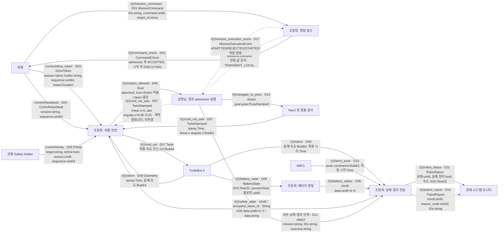
```mermaid
flowchart LR
    C[관제] -->|"/control/drive_token · D03 DriveToken<br/>session·token·holder:string, sequence:uint64, lease:Duration"| S[조정묵: 최종 안전]
    C -->|"/control/heartbeat · D04 ControlHeartbeat<br/>session:string, sequence:uint64"| S
    E[관제 Safety Arbiter] -->|"/control/estop · D05 EStop<br/>target:string, active:bool, reason:uint8, sequence:uint64"| S
    C -->|"/{r}/mission_command · D01 MissionCommand<br/>IDs:string, command:uint8, target_id:string"| G[조정묵: 명령 접수]
    G -.->|"/{r}/mission_dispatch · D01 MissionCommand<br/>전체 값 유지 · TRANSIENT_LOCAL"| M[성현님: 임무 admission·실행]
    M -.->|"/{r}/mission_execution_event · D17 MissionExecutionEvent<br/>ADMITTED/REJECTED/STARTED/저장 완료"| G
    G -->|"/{r}/command_check · D02 CommandCheck<br/>admission 후 ACCEPTED, 시작 후 EXECUTING"| C
    S -->|"/{r}/motion_allowed · D06 Bool<br/>data:bool, true=Action 허용 / false=중단"| M
    M -->|"/{r}/navigate_to_pose · D13 Action<br/>goal pose:PoseStamped"| N[Nav2 및 충돌 검사]
    N -->|"/{r}/cmd_vel_safe · D07 TwistStamped<br/>stamp:Time, linear.x·angular.z:float64"| S
    M -.->|"/{r}/cmd_vel_yaw · D07 TwistStamped<br/>linear.x=0, abs angular.z=0.08~0.25 · 계약 결정/코드 미연결"| S
    S -->|"/{r}/cmd_vel · D07 Twist<br/>허용 속도 또는 0.0:float64"| R[TurtleBot 4]
    R -->|"/{r}/battery_state · D08 BatteryState<br/>SOC:float32, present:bool, 충방전:uint8"| B[조정묵: 배터리 판정]
    R -->|"/{r}/odom · D09 Odometry<br/>stamp:Time, 실제 속도:float64"| S
    R -->|"/{r}/odom · D09<br/>실제 속도:float64, 측정 시각:Time"| T[조정묵: 상태·결과 전달]
    AM[AMCL] -->|"/{r}/amcl_pose · D10<br/>pose·covariance:float64, 측정 시각:Time"| T
    B -->|"/{r}/battery_status · D06 UInt8<br/>data:uint8=0~6"| T
    S -->|"/{r}/safety_state · UInt8 / accepted_token_id · String<br/>D06 data:uint8=0~5 / data:string"| T
    M -->|"내부 상태·결과 인계 · D12 object<br/>mission:string, IDs:string, outcome:string"| T
    T -->|"/{r}/robot_status · D11 RobotStatus<br/>상태:uint8, 실제 정지:bool, 속도·SOC:float32"| O[관제·시스템 모니터]
    T -->|"/{r}/patrol_report · D14 PatrolReport<br/>result:uint8, reason_code:uint32, IDs:string"| O
```

`amcl_pose` 생산자는 AMCL, odom 생산자는 TB4다. 관제는 명령·token·안전 해제를 결정하고, 시스템 모니터는 수신 결과를 표시·저장한다.

## 3. 화살표의 값 사전

### 3.1 명령·권한·안전 입력

| 번호·통로·메시지 타입 | 전달 필드와 타입 | 값의 종류·의미 |
|---|---|---|
| D01 `/{r}/mission_command`, `/{r}/mission_dispatch` · `patrol_interfaces/MissionCommand` | `header:Header`; `command_id, mission_id, robot_id, target_id, issued_by:string`; `command:uint8`; `target_pose:PoseStamped` | `command`: **0 STOP** 진행 보존 정지, **1 START_PATROL** 새 순찰, **2 MOVE_TO_SAFE_ZONE** 대피, **3 RESUME_PATROL** 기존 순찰 재개, **4 DOCK** 도킹, **5 CANCEL** 임무 종료. `target_id`: START는 `robot1_default/robot6_default`, DOCK는 `dock_1/dock_6`, 나머지 빈 문자열. `target_pose`는 현행 6종 명령에서 사용하지 않음 |
| D02 `/{r}/command_check`, 내부 `/{r}/active_command` · `patrol_interfaces/CommandCheck` | `header:Header`; `command_id, mission_id, robot_id, reason, source_session_id:string`; `check_state:uint8`; `reason_code:uint32`; `sequence:uint64` | `check_state`: **0 UNKNOWN** 미정, **1 ACCEPTED** mission admission과 실행 대기열 진입 확인, **2 EXECUTING** worker 실제 실행 시작, **3 REJECTED** 거절. gateway SQLite 저장만으로 ACCEPTED를 발행하지 않는다. 원인은 3.5절 |
| D03 `/control/drive_token` · `patrol_interfaces/DriveToken` | `header:Header`; `control_session_id, token_id, holder_robot_id:string`; `lease_duration:Duration`; `message_sequence:uint64` | holder는 `robot1/robot6`; 빈 token은 해당 holder 권한 회수. 같은 세션에서 sequence 증가만 수락. 발행 5Hz·lease 1초(Q-01). 새 token만으로 자동 출발하지 않음 |
| D04 `/control/heartbeat` · `patrol_interfaces/ControlHeartbeat` | `header:Header`; `control_session_id:string`; `sequence:uint64` | 관제 세션과 증가 번호. 5Hz, 1초 미수신 시 차단(Q-16). 세션 변경 시 이전 권한 무효 |
| D05 `/control/estop` · `patrol_interfaces/EStop` | `header:Header`; `target_robot_id:string`; `active:bool`; `reason:uint8`; `sequence:uint64` | target=`robot1/robot6/all`. active=true 정지 활성, false 해제 통보. reason: **0 UNKNOWN** 미분류, **1 OPERATOR** 운영자 요청, **2 COMMUNICATION** 통신, **3 TOKEN** 권한, **4 OBSTACLE** 장애물, **5 KEEPOUT_FAILURE** 영역 제한 실패, **6 SYSTEM_FAULT** 시스템 고장 |

E-stop 해제는 관제가 모든 활성 원인이 **3초 연속 사라짐**을 확인한 뒤 통보한다. AMR은 해제만으로 출발하지 않는다. 새로운 token과 별도 유효 MissionCommand가 모두 필요하다. 물리 E-stop의 latch/reset은 이 표의 계약이 아니다.

### 3.2 로봇 센서·내부 상태·속도

| 번호·통로·타입 | 필드와 값의 의미 |
|---|---|
| D06 `/{r}/motion_allowed` · `std_msgs/Bool` | `data:bool`; true는 Action 실행 허용, false는 신규 Action 차단·현재 동작 중단. true 자체는 새 임무 명령이 아님 |
| D06 `/{r}/battery_status`, `/{r}/safety_state` · `std_msgs/UInt8` | `data:uint8`; 각각 3.3절 Battery/Safety 표의 값 |
| D06 `/{r}/accepted_token_id` · `std_msgs/String` | `data:string`; 현재 수락한 token ID, 빈 문자열은 유효 token 없음 |
| D07 `/{r}/cmd_vel_nav`, `cmd_vel_smoothed`, `cmd_vel_safe`, `cmd_vel_yaw` · `geometry_msgs/TwistStamped` | `header:Header`, `twist.linear.{x,y,z}, twist.angular.{x,y,z}:float64`. 평면 이동은 `linear.x` m/s, 회전은 `angular.z` rad/s. yaw 후보의 linear.x는 0. 나머지 축은 평면 구동에서 0. 후보 age≤0.5초(Q-17) |
| D07 `/{r}/cmd_vel` · `geometry_msgs/Twist` | 시각 필드 없이 `linear/ angular`의 각 축 `float64`. 허용 시 선택된 후보, 차단 시 전 축 0.0. 최종 발행자는 local safety 한 개 |
| D08 `/{r}/battery_state` · `sensor_msgs/BatteryState` | 이 설계가 읽는 값: `header:Header`, `percentage:float32` SOC 0~1, `present:bool`, `power_supply_status:uint8`: **0 UNKNOWN**, **1 CHARGING**, **2 DISCHARGING**, **3 NOT_CHARGING**, **4 FULL**. 충전 방향은 1 또는 4, 방전 방향은 2. 나머지·무효 SOC·present=false는 분류 불가 |
| D09 `/{r}/odom` · `nav_msgs/Odometry` | `header:Header`, `child_frame_id:string`, `twist.twist.linear/ angular` 각 축 `float64`; 실제 선속도·각속도와 측정 시각. 정지 판정은 속도 절댓값 v≤0.05m/s, ω≤0.1rad/s를 0.5초 연속 유지하고 age≤0.5초 |
| D10 `/{r}/amcl_pose` · `geometry_msgs/PoseWithCovarianceStamped` | `header:Header`의 frame=`map`; `pose.pose.position.{x,y,z}:float64` m, `orientation.{x,y,z,w}:float64` quaternion, `pose.covariance:float64[36]` 불확실성. 유효·신선한 위치와 마지막 유효 위치를 구분 |
| D10 `/{r}/scan` · `sensor_msgs/LaserScan` | `header:Header`, `angle_min/angle_max/angle_increment:float32` rad, `range_min/range_max:float32` m, `ranges:float32[]` 방향별 거리 m. **수신했다는 사실만으로 위치 검증 통과가 아님** |
| D15 `/{r}/dock_status` · `irobot_create_msgs/DockStatus` | `header:Header`, `is_docked:bool` 도킹됨, `dock_visible:bool` 도크 관측됨. 도크가 보인다는 사실은 도킹 완료가 아님 |

센서 표는 판단에 사용하는 필드를 설명한다. 센서 메시지의 다른 측정값을 삭제하거나 타입을 변경하자는 뜻이 아니다. 센서·Action 경로는 **예상 경로**이며 실제 TB4에서 조회해 7절의 관측값에 기록한다. 기존 Discovery 구성을 유지한다.

### 3.3 RobotStatus의 값과 상태 종류

D11 `/{r}/robot_status`의 타입은 `patrol_interfaces/RobotStatus`다.

| 필드·타입 | 값·의미 |
|---|---|
| `header:Header`, `robot_id, source_session_id:string`, `status_sequence:uint64` | 상태 생성 시각, 로봇·발행 세션, 증가 번호 |
| `operational_state:uint8` | **0 UNKNOWN** 미정, **1 INITIALIZING** 준비 중, **2 READY** 준비, **3 MOVING** 이동, **4 STOPPED_SAFETY** 안전 차단, **5 CHARGING** 충전, **6 ERROR** 오류 |
| `mission_state:uint8` | **0 NONE** 임무 없음, **1 UNDOCKING** 도크 이탈, **2 PATROLLING** 순찰, **3 MOVING_TO_SAFE_ZONE** 대피 이동, **4 WAITING_SAFE_ZONE** 안전구역 대기, **5 RETURNING_TO_DOCK** 도크 복귀, **6 DOCKING** 도킹 중, **7 PAUSED** 보존 정지, **8 COMPLETED** 완료, **9 FAILED** 실패, **10 CANCELED** 취소 종료 |
| `docking_state:uint8` | **0 UNKNOWN** 미정, **1 UNDOCKED** 도크 밖, **2 UNDOCKING** 이탈 중, **3 DOCKING** 접속 중, **4 DOCKED** 도킹 완료, **5 FAILED** 도킹 실패 |
| `battery_state:uint8` | **0 UNKNOWN** 무효·미수신, **1 CRITICAL** 방전 SOC<0.10, **2 LOW** 방전 0.10≤SOC<0.20, **3 NORMAL** 방전 SOC≥0.20, **4 CHARGING** 충전 SOC<0.50, **5 PATROL_READY** 충전 0.50≤SOC<0.80, **6 FULL** 충전 SOC≥0.80 |
| `safety_state:uint8` | **0 UNKNOWN** 미정, **1 NORMAL** 활성 차단 없음, **2 STOPPING** 차단·정지 확인 중, **3 STOPPED** 차단·실제 정지 확인, **4 ESTOPPED** E-stop 활성, **5 ERROR** 안전 계층 오류. 1은 임무 명령이 아니며 4는 실제 속도 0의 증명이 아님 |
| `active_command_id, active_mission_id, accepted_token_id:string`, `token_valid:bool` | 현재 명령·임무·권한 식별자와 권한 유효 여부 |
| `pose, last_valid_pose:PoseWithCovarianceStamped`, `pose_valid:bool` | 현재 측정·마지막 정상 측정·현재 유효 여부. 각각의 header에 측정 시각이 있음 |
| `linear_velocity, angular_velocity:float32`, `motion_stopped:bool` | 실제 m/s·rad/s, D09 정지 조건 충족 여부 |
| `battery_soc:float32`, `battery_timestamp:Time` | SOC 비율과 배터리 측정 시각 |
| `current_waypoint_id:string`, `scan_state:string` | 현재 순찰점 ID, 스캔 단계 문자열. waypoint 이름은 실제 계획의 ID를 사용 |
| `reason_code:uint32`, `reason:string` | 상태 원인 번호와 사람이 읽을 설명 |

`scan_state`의 **현재 임시 문자열**: `UNKNOWN` 미확인, `IDLE` 스캔 작업 없음, `MOVING_TO_WAYPOINT` 순찰점 이동 추정, `SCANNING` 순찰 중 정지에서 추정, `PAUSED` 중단, `FAILED` 실패, `CANCELED` 취소, `COMPLETED` 완료. 마지막 세 값 역시 임무 상태에서 옮긴 임시 표시다. 실제 scan 단계 생산자가 연결되기 전 탐지 성공 판정에 사용하지 않는다.

운영·도킹·scan의 임시 추정은 [임시 정책 TEMP-AMR-STATUS-20260908-v1](development/provisional-amr-status-policy.md)에 별도 기록되어 있다. 성현님이 실제 단계를 제공하면 의미·재시작 처리를 맞춰 대체한다. 공용 enum 숫자는 변경하지 않는다.

### 3.4 두 파트의 내부 인계와 Action

| 번호·통로·타입 | 전달 값과 종류·의미 |
|---|---|
| D17 `/{r}/mission_execution_event` · `patrol_interfaces/MissionExecutionEvent` | 상수 `ADMITTED=1`, `REJECTED=2`, `STARTED=3`, `NONTERMINAL_STORED=4`, `RESULT_STORED=5`; `header:Header`; `command_id, mission_id, robot_id, source_session_id, reason:string`; `event_type:uint8`; `sequence:uint64`; `mission_state:uint8`; `reason_code:uint32`; `has_report:bool`; `report:PatrolReport`. 멱등 키는 `command_id + event_type + report_id`. 메시지와 gateway 소비부는 구현됐고 mission 생산부는 미연결 |
| D12 내부 임무 상태 인계 · `object` (ROS 토픽 아님) | `mission:string`은 `MISSION_NONE` 등 3.3절 Mission 이름에 `MISSION_` 접두사. `command_id, mission_id, outcome, reason:string`; `waypoint_index, last_waypoint_index:int`=-1 미지정 또는 0부터 순번; `reason_code:int`; `revision:int` 증가 번호; `updated_monotonic_s:float` 로컬 갱신 시각. outcome은 빈 값 진행 중 / `PAUSED` 보존 / `SUCCEEDED, FAILED, CANCELED` 종료 |
| D12 내부 결과 인계 · `object` (ROS 토픽 아님) | D14의 로봇·명령·임무·결과·이유·시작/종료 시각·연관 이벤트를 전달. 같은 결과는 같은 report ID 유지. 전달 실패 시 결과 보존. 외부 저장 ACK 계약은 TBD-IF-003 |
| D13 `/{r}/navigate_to_pose` · `nav2_msgs/action/NavigateToPose` | goal=`pose:PoseStamped`, `behavior_tree:string`; feedback=`current_pose:PoseStamped`, `distance_remaining:float32` m, 시간:`Duration`, `number_of_recoveries:int16`; result=`error_code:uint16`, `error_msg:string`. Action 상태 `status:int8`: 0 UNKNOWN, 1 ACCEPTED, 2 EXECUTING, 3 CANCELING, 4 SUCCEEDED, 5 CANCELED, 6 ABORTED |
| D13 내부 주행 결과 · `string` | `SUCCEEDED` 성공, `FAILED` 실패, `CANCELED` 취소, `REJECTED` 목표 거절, `UNKNOWN` 결과 불명. 위 Action 상태와 외부 PatrolReport result의 숫자를 혼용하지 않음 |
| D15 `/{r}/dock`, `/{r}/undock` · `irobot_create_msgs/action/Dock`, `Undock` | goal=빈 요청; result=`is_docked:bool`; Dock feedback=`sees_dock:bool`. Action 성공과 도킹·충전 유지 조건을 함께 확인 |
| D16 `/{r}/audio_note_sequence` · `irobot_create_msgs/action/AudioNoteSequence` | goal=`iterations:int32` -1 반복 / 양수 횟수, `note_sequence:AudioNoteVector` 음 목록; result=`complete:bool`, `iterations_played:int32`, `runtime:Duration`. 반복 재생이 부저 ON, 취소 요청이 OFF 의도이며 실제 음 종료를 확인 |
| 내부 취소 요청·Action 취소 | 내부 `cancel_requested:bool=true`는 취소 의도. ROS Action 취소 요청은 goal ID와 시각을 가진 요청이며 Bool 토픽이 아님. 취소 수락·종료 상태·실제 정지를 각각 확인 |

`PoseStamped`는 `header:Header`와 위치 x/y/z·방향 quaternion x/y/z/w의 `float64` 묶음이다. `AudioNoteVector`는 `header:Header`, `notes:AudioNote[]`, `append:bool`이며, 각 음은 `frequency:uint16` Hz와 `max_runtime:Duration`이다. append=true는 음 목록 뒤에 추가, false는 교체 의미다. Action 취소의 goal ID는 `uint8[16]`이며 응답의 취소 수락 여부와 최종 상태를 구분한다.

### 3.5 최종 결과·사유

D14 `/{r}/patrol_report`와 내부 재전달 통로 `/{r}/report_replay_request`는 `patrol_interfaces/PatrolReport`를 쓴다. 필드: `header:Header`; `report_id, robot_id, source_session_id, command_id, mission_id, reason, final_waypoint_id:string`; `result:uint8`; `reason_code:uint32`; `started_at, finished_at:Time`; `related_event_ids:string[]`.

`result`: **0 SUCCEEDED** 목표 달성 / **1 FAILED** 실패 / **2 CANCELED** 취소 종료. STOP은 임무를 보존하므로 최종 보고서를 만들지 않는다. CANCEL은 취소 결과를 남긴다. `UNREPORTED`는 관제의 보고 누락 판단이며 result 값이 아니다.

| reason_code:uint32 | 의미 |
|---|---|
| 0 | 사유 없음 |
| 100 / 101 / 102 | 관제 취소 / 명령 대체 / 안전 정책 취소 |
| 200 / 201 / 202 / 203 | 잘못된 명령 / 대상 / 미지원 명령 / 같은 command ID에 다른 내용 |
| 204 / 205 / 206 | 잘못된 mission / 필수 값 오류 / 현재 상태에서 불가 |
| 300 / 301 / 302 / 303 | 경로 없음 / 주행 시간 초과 / 목표 거절 / 목표 중단 |
| 400 / 401 / 402 | 안전구역 없음 / Keepout 적용 실패 / 복구 실패 |
| 500 / 501 / 502 | 위치 무효 / 위치 오래됨 / LiDAR 검증 실패 |
| 600 / 601 / 602 | token 없음 / token 만료 / 통신 상실 |
| 700 / 701 / 702 | E-stop / 장애물 차단 / 화재 감지 |
| 800 / 801 / 900 / 901 | 배터리 LOW / CRITICAL / 도킹 시간 초과 / 역할 교대 |
| 1000 / 1001 | 센서 오류 / 내부 오류 |

### 3.6 아직 합의할 감지·위치 검증 데이터 — 제안

다음 값은 **설계에 필요한 논리 데이터**다. 공용 토픽·wire 타입을 새로 확정한 것이 아니다. 계약 담당자가 실제 이름·타입을 결정하기 전 점선 연결을 구현 완료로 표시하지 않는다.

| 번호 | 논리 값·종류·의미 | 결정할 경계 |
|---|---|---|
| P01 감지 후보 | `candidate_id:string` 동일 후보 ID, `event_type` 화재/누수/장애물 등 분류, `confidence:float32` 0~1, `horizontal_error:float32` 중심 오차, `stamp:Time` 측정 시각 | AMR 요청안 토픽은 `/{robot}/vision/detection_candidate`, RELIABLE/VOLATILE/KEEP_LAST(10), 비전 단일 발행·AMR 구독이다. 기존 wire의 FIRE=0·LEAK=1·OBSTACLE=2와 좌/중앙/우 부호를 유지한다. confidence≥0.70, 동일 candidate ID 유지, 단절 0.6초는 2026-09-09 결정 |
| P02 정렬·스캔 판단 | `aligned:bool`, `same_target:bool`, `detected:bool`, `continuous_s:float` 유지 초, `scan_state:string` 실제 단계 | 정렬은 오차≤0.05를 0.5초 연속, yaw 0.08~0.25rad/s, timeout 10초, 후보 단절 0.6초로 결정. 정렬 뒤 비전의 동일 대상 1초 최종 확인·이벤트 생산 상세는 TBD-IF-006에 남음 |
| P03 확정 이벤트·증적 | `event_id, evidence_id, robot_id:string`; 이벤트 분류·위험도, `confidence:float32`, `location_valid:bool`, 위치·측정 시각; 증적 `media_type, sha256:string`, `chunk_index, chunk_count, total_size:uint32`, `data:uint8[]` 이미지 등 bytes | `DetectionEvent`·`Evidence` 정의는 있으나 생산·전송·저장 ACK 전체 계약은 TBD-IF-006·007. 최종 토픽 TBD, 수신자는 관제·시스템 모니터 협의 |
| P04 LiDAR 검증 요청·결과 | `request_id, robot_id:string`, 기준·측정 pose, `position_error_m:float`, `yaw_error_deg:float`, `consecutive_count:int`, `verified:bool`, `reason:string` | 대상·연산 위치·토픽/서비스·wire 타입·timeout: TBD-AMR-002. Q-06의 0.5m·15도·3회 연속을 만족해야 verified=true |
| P05 재개 판단 | `mission_id:string`, `checkpoint:int`, `resume_allowed:bool`; checkpoint는 다음에 방문할 waypoint index | `next_waypoint`는 9월 9일 AMR 공동 기준. PAUSED/WAITING_SAFE_ZONE, 동일 mission, 유효 checkpoint와 별도 RESUME 명령을 검사한다. robot6 LiDAR 검증 요청·결과 통로는 P04로 별도 결정. AMR이 DriveToken을 직접 발행하지 않음 |

DetectionEvent에 정의된 `event_type:uint8`은 0 미정 / 1 화재 / 2 누수 / 3 장애물 / 4 조명 / 5 시설 손상이며, `risk_level:uint8`은 0 미정 / 1 낮음 / 2 중간 / 3 높음이다. 후보 분류를 이 값으로 변환할 규칙과 실제 송수신 토픽은 별도 확인한다.

## 4. 조정묵 파트 설계

### 4.1 명령 접수·중복 방지

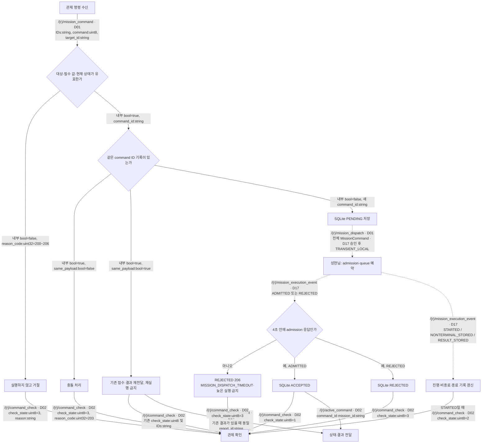
```mermaid
flowchart TD
    I[관제 명령 수신] -->|"/{r}/mission_command · D01<br/>IDs:string, command:uint8, target_id:string"| V{대상·필수 값·현재 상태가 유효한가}
    V -->|"내부 bool=false, reason_code:uint32=200~206"| R[실행하지 않고 거절]
    R -->|"/{r}/command_check · D02<br/>check_state:uint8=3, reason:string"| O[관제 확인]
    V -->|"내부 bool=true, command_id:string"| D{같은 command ID 기록이 있는가}
    D -->|"내부 bool=true, same_payload:bool=false"| X[충돌 처리]
    X -->|"/{r}/command_check · D02<br/>check_state:uint8=3, reason_code:uint32=203"| O
    D -->|"내부 bool=true, same_payload:bool=true"| Q[기존 접수·결과 재전달, 재실행 금지]
    Q -->|"/{r}/command_check · D02<br/>기존 check_state:uint8 및 IDs:string"| O
    Q -->|"/{r}/report_replay_request · D14<br/>기존 결과가 있을 때 동일 report_id:string"| T[상태·결과 전달]
    D -->|"내부 bool=false, 새 command_id:string"| A[SQLite PENDING 저장]
    A -.->|"/{r}/mission_dispatch · D01<br/>전체 MissionCommand · D17 승인 후 TRANSIENT_LOCAL"| M[성현님: admission·queue 예약]
    M -.->|"/{r}/mission_execution_event · D17<br/>ADMITTED 또는 REJECTED"| H{4초 안에 admission 응답인가}
    H -->|"아니오"| TO[REJECTED 206<br/>MISSION_DISPATCH_TIMEOUT·늦은 실행 금지]
    TO -->|"/{r}/command_check · D02<br/>check_state:uint8=3"| O
    H -->|"예, ADMITTED"| AC[SQLite ACCEPTED]
    AC -->|"/{r}/command_check · D02<br/>check_state:uint8=1"| O
    AC -->|"/{r}/active_command · D02<br/>command_id·mission_id:string"| T
    H -->|"예, REJECTED"| RR[SQLite REJECTED]
    RR -->|"/{r}/command_check · D02<br/>check_state:uint8=3"| O
    M -.->|"/{r}/mission_execution_event · D17<br/>STARTED / NONTERMINAL_STORED / RESULT_STORED"| L[진행·비종료·종료 기록 갱신]
    L -->|"STARTED일 때 /{r}/command_check · D02<br/>check_state:uint8=2"| O
```

**gateway 구현 대조:** `PENDING` 저장, 전체 명령 dispatch, D17 검증, ADMITTED 이후 ACCEPTED, STARTED 이후 EXECUTING, 결과 저장, 재시작 복원 및 4초 timeout까지 반영됐다. 점선인 성현님 mission admission·이벤트 생산부가 아직 연결되지 않았으므로 이 흐름 전체가 통합 완료된 것은 아니다.

### 4.2 배터리 분류

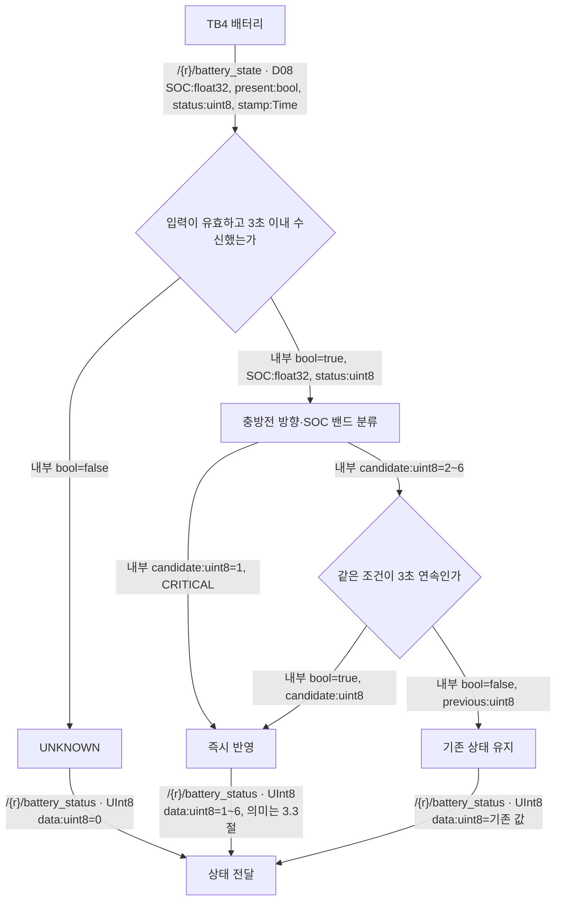
```mermaid
flowchart TD
    I[TB4 배터리] -->|"/{r}/battery_state · D08<br/>SOC:float32, present:bool, status:uint8, stamp:Time"| V{입력이 유효하고 3초 이내 수신했는가}
    V -->|"내부 bool=false"| U[UNKNOWN]
    U -->|"/{r}/battery_status · UInt8<br/>data:uint8=0"| O[상태 전달]
    V -->|"내부 bool=true, SOC:float32, status:uint8"| C[충방전 방향·SOC 밴드 분류]
    C -->|"내부 candidate:uint8=1, CRITICAL"| K[즉시 반영]
    C -->|"내부 candidate:uint8=2~6"| H{같은 조건이 3초 연속인가}
    H -->|"내부 bool=false, previous:uint8"| P[기존 상태 유지]
    H -->|"내부 bool=true, candidate:uint8"| K
    K -->|"/{r}/battery_status · UInt8<br/>data:uint8=1~6, 의미는 3.3절"| O
    P -->|"/{r}/battery_status · UInt8<br/>data:uint8=기존 값"| O
```

배터리 분류는 도킹 성공의 대체 센서가 아니다. 2026-09-09 결정에 따라 원본 `BatteryState.present=true`와 `power_supply_status=CHARGING/FULL`, `DockStatus.is_docked=true`를 사용하며 각 입력 age≤1초·동시 2초 연속을 확인한다.

<a id="32-local_safety_supervisorpy"></a>

### 4.3 최종 속도·안전 상태


```mermaid
flowchart TD
    C[관제 안전 입력] -->|"/control/drive_token·heartbeat·estop<br/>D03·04·05: IDs:string, sequence:uint64, active:bool"| V{본인 token 유효·heartbeat 정상·E-stop 비활성인가}
    V -->|"내부 bool=false"| Z[출력 0, Action 차단]
    V -->|"내부 bool=true"| P[Action 실행 허용 상태]
    P -->|"/{r}/motion_allowed · Bool<br/>data:bool=true · 새 명령은 별도"| M[성현님: 임무 허가 확인]
    N[Nav2 속도 후보] -->|"/{r}/cmd_vel_safe · D07<br/>stamp:Time, v·w:float64"| A[후보 선택]
    Y[성현님 yaw 후보] -->|"/{r}/cmd_vel_yaw · D07<br/>v:float64=0, abs w=0.08~0.25 · age≤0.5초"| A
    A -->|"내부 candidate:속도 묶음, age_s:float"| F{선택된 후보가 유효하고 age 0.5초 이하인가}
    P -->|"내부 permission:bool=true"| F
    F -->|"내부 bool=false"| B[속도 0, 후보 복구 대기]
    F -->|"내부 bool=true 및 권한 유지"| O[선택된 후보 통과]
    B -->|"/{r}/cmd_vel · Twist<br/>D07 전 축 float64=0.0"| R[TB4 구동부]
    Z -->|"/{r}/cmd_vel · Twist<br/>D07 전 축 float64=0.0"| R
    Z -->|"/{r}/motion_allowed · Bool<br/>data:bool=false"| M
    O -->|"/{r}/cmd_vel · Twist<br/>D07 v·w:float64=선택된 후보"| R
    R -->|"/{r}/odom · D09<br/>실제 v·w:float64, stamp:Time"| D{정지 속도·0.5초 유지·신선도 충족인가}
    D -->|"내부 stopped:bool=true 또는 false"| S[안전 축과 실제 정지를 함께 보고]
    Z -->|"내부 blocked:bool=true, estop:bool"| S
    B -->|"내부 blocked:bool=true"| S
    O -->|"내부 blocked:bool=false"| S
    S -->|"/{r}/safety_state · UInt8<br/>D06 1 정상 / 2 확인 중 / 3 정지 / 4 E-stop, uint8"| T[상태 전달]
```

후보 신선도 차단과 `motion_allowed`의 권한 차단은 구분한다. 2026-09-09 결정에 따라 Nav2와 yaw 중 하나만 신선할 때 그 후보를 검사하며, 둘 다 신선하면 선택을 추측하지 않고 최종 0을 출력한다. yaw는 Nav2 goal 취소와 실제 정지 확인 뒤 시작하며 terminal 뒤 자동 재개하지 않는다. 안전 입력이 바뀌면 후보 처리 중에도 차단을 우선한다. odom 무효·stale이면 정지 완료로 간주하지 않는다. 실제 정지 감속·거리 합격 수치는 TBD-AMR-006이며 실측만으로 계약 확정 처리하지 않는다.

### 4.4 상태·결과 전달과 임시 상태 교체

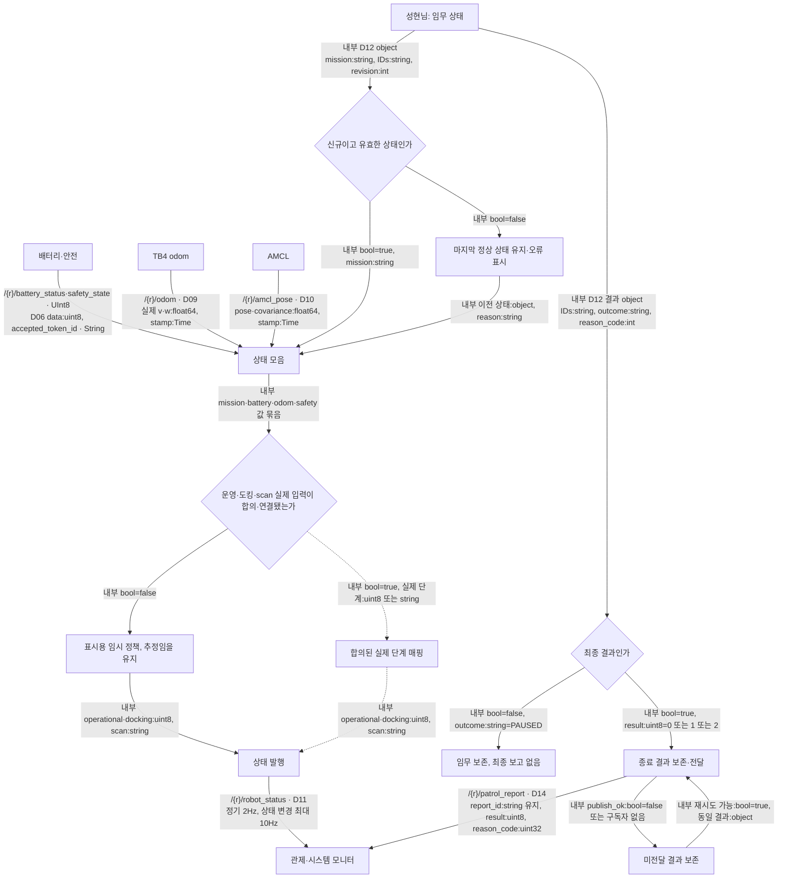
```mermaid
flowchart TD
    B[배터리·안전] -->|"/{r}/battery_status·safety_state · UInt8<br/>D06 data:uint8, accepted_token_id · String"| C[상태 모음]
    R[TB4 odom] -->|"/{r}/odom · D09<br/>실제 v·w:float64, stamp:Time"| C
    A[AMCL] -->|"/{r}/amcl_pose · D10<br/>pose·covariance:float64, stamp:Time"| C
    M[성현님: 임무 상태] -->|"내부 D12 object<br/>mission:string, IDs:string, revision:int"| V{신규이고 유효한 상태인가}
    V -->|"내부 bool=true, mission:string"| C
    V -->|"내부 bool=false"| K[마지막 정상 상태 유지·오류 표시]
    K -->|"내부 이전 상태:object, reason:string"| C
    C -->|"내부 mission·battery·odom·safety 값 묶음"| P{운영·도킹·scan 실제 입력이 합의·연결됐는가}
    P -->|"내부 bool=false"| U[표시용 임시 정책, 추정임을 유지]
    P -.->|"내부 bool=true, 실제 단계:uint8 또는 string"| E[합의된 실제 단계 매핑]
    U -->|"내부 operational·docking:uint8, scan:string"| S[상태 발행]
    E -.->|"내부 operational·docking:uint8, scan:string"| S
    S -->|"/{r}/robot_status · D11<br/>정기 2Hz, 상태 변경 최대 10Hz"| O[관제·시스템 모니터]
    M -->|"내부 D12 결과 object<br/>IDs:string, outcome:string, reason_code:int"| Q{최종 결과인가}
    Q -->|"내부 bool=false, outcome:string=PAUSED"| H[임무 보존, 최종 보고 없음]
    Q -->|"내부 bool=true, result:uint8=0 또는 1 또는 2"| F[종료 결과 보존·전달]
    F -->|"/{r}/patrol_report · D14<br/>report_id:string 유지, result:uint8, reason_code:uint32"| O
    F -->|"내부 publish_ok:bool=false 또는 구독자 없음"| W[미전달 결과 보존]
    W -->|"내부 재시도 가능:bool=true, 동일 결과:object"| F
```

외부 저장 ACK는 아직 확정되지 않았다. 토픽 수신·발행 성공과 DB 저장 완료를 같은 합격 조건으로 기록하지 않는다. 공동 구현 방향은 pending report를 같은 `report_id`로 1초 간격 재발행하고 30초 뒤 경고하되 보존하는 것이다. `/{r}/ingestion_ack`에서 robot·entity type·report ID가 일치하고 status가 STORED 또는 DUPLICATE일 때만 삭제하는 안은 System monitor 확인과 공용 계약 반영 전까지 production에 적용하지 않는다.

## 5. 성현님 파트 설계와 바로 수행할 작업

### 5.1 임무 선택·공통 주행·순찰·대피

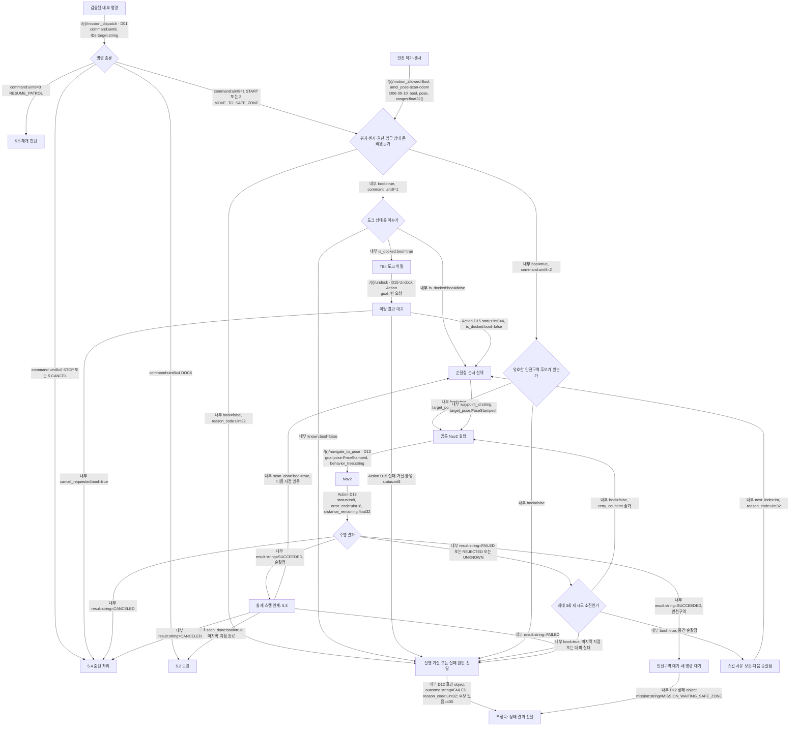
```mermaid
flowchart TD
    G[검증된 내부 명령] -->|"/{r}/mission_dispatch · D01<br/>command:uint8, IDs·target:string"| C{명령 종류}
    C -->|"command:uint8=0 STOP 또는 5 CANCEL"| X[5.4 중단 처리]
    C -->|"command:uint8=3 RESUME_PATROL"| U[5.5 재개 판단]
    C -->|"command:uint8=4 DOCK"| D[5.2 도킹]
    C -->|"command:uint8=1 START 또는 2 MOVE_TO_SAFE_ZONE"| R{위치·센서·권한·임무 상태 준비됐는가}
    S[안전 허가·센서] -->|"/{r}/motion_allowed:Bool, amcl_pose·scan·odom<br/>D06·09·10: bool, pose, ranges:float32[]"| R
    R -->|"내부 bool=false, reason_code:uint32"| F[실행 거절 또는 실패 원인 전달]
    R -->|"내부 bool=true, command:uint8=1"| UD{도크 상태를 아는가}
    UD -->|"내부 known:bool=false"| F
    UD -->|"내부 is_docked:bool=false"| P[순찰점 순서 선택]
    UD -->|"내부 is_docked:bool=true"| UA[TB4 도크 이탈]
    UA -->|"/{r}/undock · D15 Undock Action<br/>goal=빈 요청"| UB[이탈 결과 대기]
    UB -->|"Action D15 status:int8=4, is_docked:bool=false"| P
    UB -->|"Action D15 실패·거절·불명, status:int8"| F
    UB -->|"내부 cancel_requested:bool=true"| X
    R -->|"내부 bool=true, command:uint8=2"| A{유효한 안전구역 후보가 있는가}
    A -->|"내부 bool=false"| F
    A -->|"내부 bool=true, target_pose:PoseStamped"| N[공통 Nav2 실행]
    P -->|"내부 waypoint_id:string, target_pose:PoseStamped"| N
    N -->|"/{r}/navigate_to_pose · D13<br/>goal pose:PoseStamped, behavior_tree:string"| V[Nav2]
    V -->|"Action D13<br/>status:int8, error_code:uint16, distance_remaining:float32"| E{주행 결과}
    E -->|"내부 result:string=SUCCEEDED, 순찰점"| SC[실제 스캔 연계: 5.3]
    E -->|"내부 result:string=SUCCEEDED, 안전구역"| W[안전구역 대기·새 명령 대기]
    E -->|"내부 result:string=FAILED 또는 REJECTED 또는 UNKNOWN"| T{최대 3회 재시도 소진인가}
    T -->|"내부 bool=false, retry_count:int 증가"| N
    T -->|"내부 bool=true, 중간 순찰점"| SK[스킵 사유 보존·다음 순찰점]
    SK -->|"내부 next_index:int, reason_code:uint32"| P
    T -->|"내부 bool=true, 마지막 지점 또는 대피 실패"| F
    E -->|"내부 result:string=CANCELED"| X
    SC -->|"내부 scan_done:bool=true, 다음 지점 있음"| P
    SC -->|"내부 scan_done:bool=true, 마지막 지점 완료"| D
    SC -->|"내부 result:string=FAILED"| F
    SC -->|"내부 result:string=CANCELED"| X
    F -->|"내부 D12 결과 object<br/>outcome:string=FAILED, reason_code:uint32; 후보 없음=400"| O[조정묵: 상태·결과 전달]
    W -->|"내부 D12 상태 object<br/>mission:string=MISSION_WAITING_SAFE_ZONE"| O
```

스캔을 단순 정지 대기로 대체해 AMR-14·17 완료로 기록하지 않는다. 안전구역 후보는 Q-08 조건을 만족해야 하며 실제 후보 공급은 TBD-CTRL-002다. waypoint·도크·map·Keepout 정합과 Nav2 재시도/스킵은 성현님이 기존 작업 진척을 먼저 확인한다. 스킵 상세의 외부 보고 형식은 TBD-AMR-005에서 맞춘다.

### 5.2 AMR-13 도킹 — 충전 확인 연결 필요

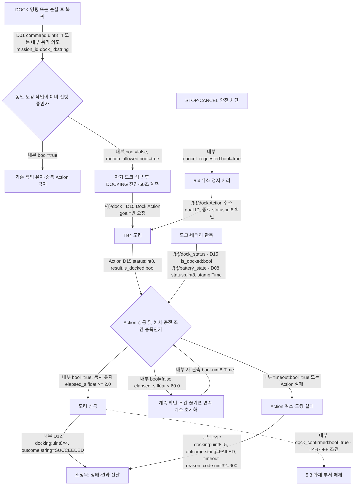
```mermaid
flowchart TD
    I[DOCK 명령 또는 순찰 후 복귀] -->|"D01 command:uint8=4 또는 내부 복귀 의도<br/>mission_id·dock_id:string"| D{동일 도킹 작업이 이미 진행 중인가}
    D -->|"내부 bool=true"| K[기존 작업 유지·중복 Action 금지]
    D -->|"내부 bool=false, motion_allowed:bool=true"| N[자기 도크 접근 후 DOCKING 진입·60초 계측]
    N -->|"/{r}/dock · D15 Dock Action<br/>goal=빈 요청"| A[TB4 도킹]
    A -->|"Action D15 status:int8, result.is_docked:bool"| C{Action 성공 및 센서·충전 조건 충족인가}
    S[도크·배터리 관측] -->|"/{r}/dock_status · D15 is_docked:bool<br/>/{r}/battery_state · D08 status:uint8, stamp:Time"| C
    C -->|"내부 bool=true, 동시 유지 elapsed_s:float >= 2.0"| OK[도킹 성공]
    C -->|"내부 bool=false, elapsed_s:float < 60.0"| W[계속 확인·조건 끊기면 연속 계수 초기화]
    W -->|"내부 새 관측:bool·uint8·Time"| C
    C -->|"내부 timeout:bool=true 또는 Action 실패"| F[Action 취소·도킹 실패]
    X[STOP·CANCEL·안전 차단] -->|"내부 cancel_requested:bool=true"| AB[5.4 취소·정지 처리]
    AB -->|"/{r}/dock Action 취소<br/>goal ID, 종료 status:int8 확인"| A
    OK -->|"내부 D12<br/>docking:uint8=4, outcome:string=SUCCEEDED"| O[조정묵: 상태·결과 전달]
    F -->|"내부 D12<br/>docking:uint8=5, outcome:string=FAILED, timeout reason_code:uint32=900"| O
    OK -.->|"내부 dock_confirmed:bool=true · D16 OFF 조건"| B[5.3 화재 부저 해제]
```

**현행 Q-09:** DOCKING 진입 후 60초 이내에 `DockStatus.is_docked=true`와 원본 `BatteryState.present=true`, `power_supply_status=CHARGING/FULL`이 모두 신선한 상태로 2초 연속이어야 한다. 각 입력 age는 1초 이하다. 단순 Action 성공·dock_visible·SOC 증가만으로 성공 처리하지 않는다. TB4 Dock/Undock의 자체 구동 경로가 최종 안전 차단을 우회하는지도 RT-07에서 반드시 확인한다.

### 5.3 AMR-14 감지·yaw·증적·화재 부저 — 전체 연결 필요

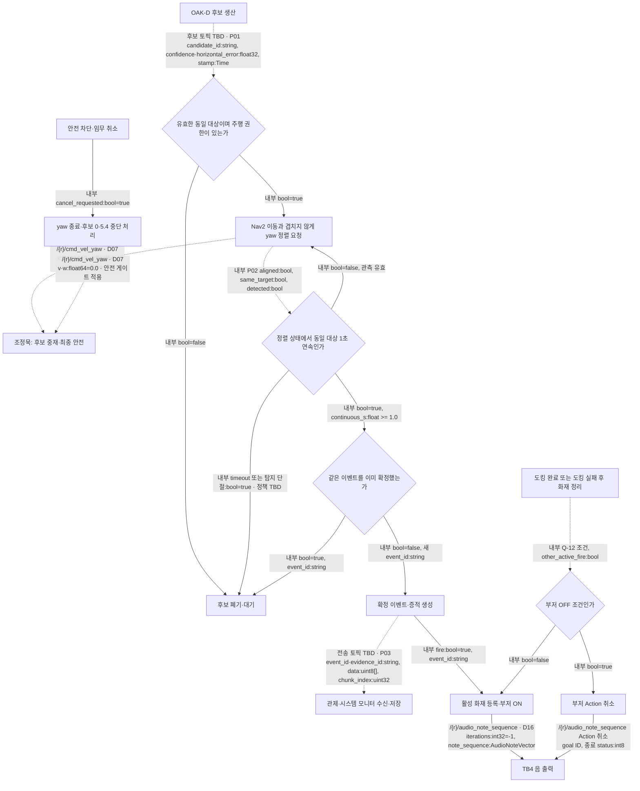
```mermaid
flowchart TD
    O[OAK-D 후보 생산] -.->|"후보 토픽 TBD · P01<br/>candidate_id:string, confidence·horizontal_error:float32, stamp:Time"| V{유효한 동일 대상이며 주행 권한이 있는가}
    V -->|"내부 bool=false"| W[후보 폐기·대기]
    V -->|"내부 bool=true"| A[Nav2 이동과 겹치지 않게 yaw 정렬 요청]
    A -.->|"/{r}/cmd_vel_yaw · D07<br/>v:float64=0, w:float64, stamp:Time"| S[조정묵: 후보 중재·최종 안전]
    A -.->|"내부 P02 aligned:bool, same_target:bool, detected:bool"| C{정렬 상태에서 동일 대상 1초 연속인가}
    C -->|"내부 bool=false, 관측 유효"| A
    C -->|"내부 timeout 또는 탐지 단절:bool=true · 정책 TBD"| W
    C -->|"내부 bool=true, continuous_s:float >= 1.0"| E{같은 이벤트를 이미 확정했는가}
    E -->|"내부 bool=true, event_id:string"| W
    E -->|"내부 bool=false, 새 event_id:string"| F[확정 이벤트·증적 생성]
    F -.->|"전송 토픽 TBD · P03<br/>event_id·evidence_id:string, data:uint8[], chunk_index:uint32"| R[관제·시스템 모니터 수신·저장]
    F -->|"내부 fire:bool=true, event_id:string"| B[활성 화재 등록·부저 ON]
    B -->|"/{r}/audio_note_sequence · D16<br/>iterations:int32=-1, note_sequence:AudioNoteVector"| TB[TB4 음 출력]
    D[도킹 완료 또는 도킹 실패 후 화재 정리] -.->|"내부 Q-12 조건, other_active_fire:bool"| K{부저 OFF 조건인가}
    K -->|"내부 bool=true"| OFF[부저 Action 취소]
    OFF -->|"/{r}/audio_note_sequence Action 취소<br/>goal ID, 종료 status:int8"| TB
    K -->|"내부 bool=false"| B
    X[안전 차단·임무 취소] -->|"내부 cancel_requested:bool=true"| AB[yaw 종료·후보 0·5.4 중단 처리]
    AB -.->|"/{r}/cmd_vel_yaw · D07<br/>v·w:float64=0.0 · 안전 게이트 적용"| S
```

2026-09-09에 정렬 허용 오차·속도·timeout, 후보 단절과 Nav2/yaw 동시 입력의 fail-safe 0, 도킹 입력·신선도와 부저 소유·OFF 조건을 확정했다. 남은 합의는 정렬 뒤 동일 대상 1초 최종 확인·이벤트 중복과 증적 수신·저장 ACK이며 TBD-IF-006·007에 연결한다. E-stop 해제 부저는 사용하지 않는다.

### 5.4 AMR-18 중단·복구 — Action 종료와 실제 정지를 따로 확인

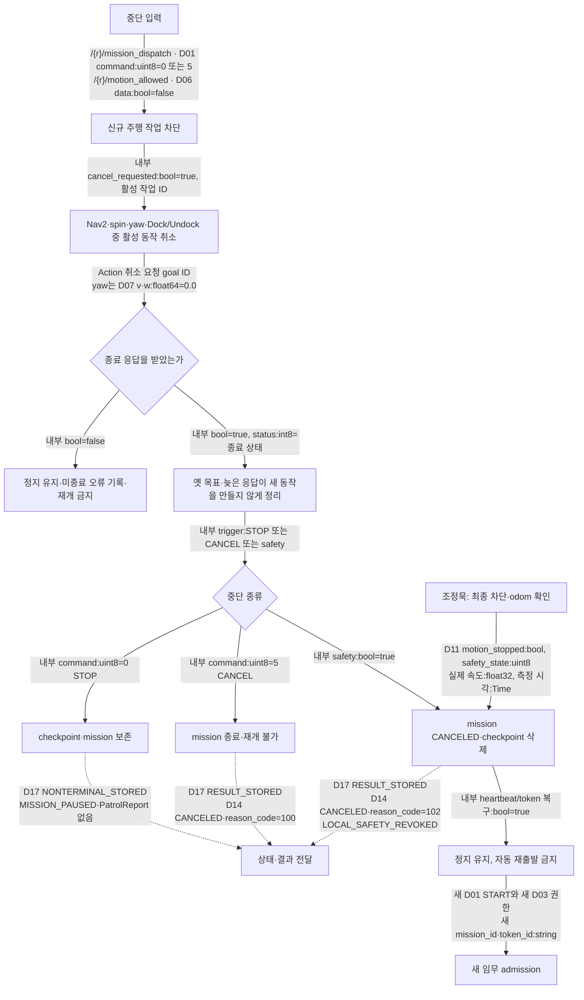
```mermaid
flowchart TD
    I[중단 입력] -->|"/{r}/mission_dispatch · D01 command:uint8=0 또는 5<br/>/{r}/motion_allowed · D06 data:bool=false"| B[신규 주행 작업 차단]
    B -->|"내부 cancel_requested:bool=true, 활성 작업 ID"| C[Nav2·spin·yaw·Dock/Undock 중 활성 동작 취소]
    C -->|"Action 취소 요청 goal ID<br/>yaw는 D07 v·w:float64=0.0"| A{종료 응답을 받았는가}
    A -->|"내부 bool=false"| W[정지 유지·미종료 오류 기록·재개 금지]
    A -->|"내부 bool=true, status:int8=종료 상태"| K[옛 목표·늦은 응답이 새 동작을 만들지 않게 정리]
    K -->|"내부 trigger:STOP 또는 CANCEL 또는 safety"| T{중단 종류}
    T -->|"내부 command:uint8=0 STOP"| P[checkpoint·mission 보존]
    P -.->|"D17 NONTERMINAL_STORED<br/>MISSION_PAUSED·PatrolReport 없음"| O[상태·결과 전달]
    T -->|"내부 command:uint8=5 CANCEL"| F[mission 종료·재개 불가]
    F -.->|"D17 RESULT_STORED<br/>D14 CANCELED·reason_code=100"| O
    T -->|"내부 safety:bool=true"| H[mission CANCELED·checkpoint 삭제]
    H -.->|"D17 RESULT_STORED<br/>D14 CANCELED·reason_code=102<br/>LOCAL_SAFETY_REVOKED"| O
    S[조정묵: 최종 차단·odom 확인] -->|"D11 motion_stopped:bool, safety_state:uint8<br/>실제 속도:float32, 측정 시각:Time"| H
    H -->|"내부 heartbeat/token 복구:bool=true"| N[정지 유지, 자동 재출발 금지]
    N -->|"새 D01 START와 새 D03 권한<br/>새 mission_id·token_id:string"| R[새 임무 admission]
```

취소를 요청했다는 사실만으로 종료 완료로 표시하지 않는다. 종료 응답이 없거나 실제 정지가 확인되지 않으면 새 임무를 실행하지 않는다. 9월 9일 공동 기준에 따라 STOP만 PAUSED로 보존하고, `motion_allowed=false`는 최종 CANCELED 처리한다. 안전 복구 뒤 이전 mission은 재개하지 않으며 새 mission ID의 START가 필요하다.

### 5.5 AMR-15 위치 검증·AMR-19 재개 — 제안 흐름

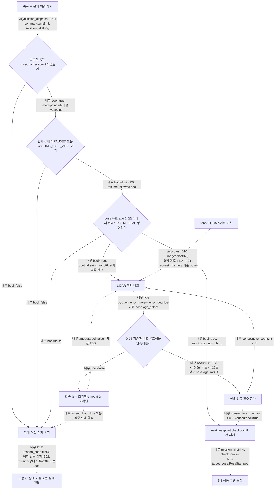
```mermaid
flowchart TD
    I[복구 후 관제 명령 대기] -->|"/{r}/mission_dispatch · D01<br/>command:uint8=3, mission_id:string"| M{보존한 동일 mission·checkpoint가 있는가}
    M -->|"내부 bool=false"| F[재개 거절·정지 유지]
    M -->|"내부 bool=true, checkpoint:int=다음 waypoint"| T{현재 상태가 PAUSED 또는 WAITING_SAFE_ZONE인가}
    T -->|"내부 bool=false"| F
    T -->|"내부 bool=true · P05 resume_allowed:bool"| P{pose 유효·age 1.5초 이내·새 token·별도 RESUME 명령인가}
    P -->|"내부 bool=false"| F
    P -->|"내부 bool=true, robot_id:string=robot1"| R[next_waypoint checkpoint에서 재개]
    P -->|"내부 bool=true, robot_id:string=robot6, 위치 검증 필요"| L[LiDAR 위치 비교]
    O[robot6 LiDAR·기준 위치] -.->|"/{r}/scan · D10 ranges:float32[]<br/>요청 통로 TBD · P04 request_id:string, 기준 pose"| L
    L -.->|"내부 P04 position_error_m·yaw_error_deg:float<br/>기준 pose age_s:float"| V{Q-06 기준과 비교 유효성을 만족하는가}
    V -->|"내부 bool=true, 거리 <=0.5m·각도 <=15도<br/>참고 pose age <=30초"| K[연속 성공 횟수 증가]
    K -->|"내부 consecutive_count:int < 3"| L
    K -->|"내부 consecutive_count:int >= 3, verified:bool=true"| R
    V -->|"내부 bool=false"| Z[연속 횟수 초기화·timeout 전 재확인]
    Z -.->|"내부 timeout:bool=false · 제한 TBD"| L
    Z -.->|"내부 timeout:bool=true 또는 검증 실패 확정"| F
    F -->|"내부 D12 reason_code:uint32<br/>위치 검증 실패=502, mission·상태 오류=204 또는 206"| E[조정묵: 상태·거절 또는 실패 전달]
    R -->|"내부 mission_id:string, checkpoint:int<br/>D13 target_pose:PoseStamped"| N[5.1 공통 주행·순찰]
```

`next_waypoint`와 허용 mission 상태는 9월 9일 공동 기준이다. 기존 30초 재개 창과 token 회수 요청은 이 흐름에서 제거했다. 마지막 pose가 30초 이내라는 Q-06만으로 현재 pose 신선도(Q-05)를 통과시키지 않는다. AMR이 token 발급·회수 결정권을 가져오지 않는다. robot6 LiDAR 검사 결과가 false 또는 불명확하면 출발시키지 않는다. 연속 샘플의 독립성·실패 재시도·timeout은 TBD-AMR-002에서 결정한다.

### 5.6 성현님 오전 작업 인계표

| 우선순위·대상 | 시작할 때 확인할 것 | 완료해서 조정묵에게 넘길 것 | 연결 시험 |
|---|---|---|---|
| P0 명령·상태 경계 | public 명령 입구가 gateway 하나인지, 내부 D01·D12 및 로봇 ID가 일치하는지 | 시작·정지·취소·성공·실패 각각의 상태/결과, 중복 goal 없음 | RT-05·06 |
| P0 AMR-18 | Nav2 외 활성 Dock/Undock·spin·yaw도 취소되는지 | 작업별 취소 종료·미종료 오류·복구 후 명령 대기 경로 | RT-04·06 |
| P0 AMR-13 | 실제 DockStatus·BatteryState 수신과 Q-09 연결 여부 | 도킹/충전 동시 2초, 60초 실패, 중복 방지, 실제 docking 단계 | RT-07 |
| P0 실제 상태 생산 | operational·docking·scan 중 직접 제공할 값과 변경 시점 | 필드 의미·타입·전이·초기값·재시작값 합의표. 임시 추정 제거 가능 여부 | RT-03·05·07 |
| P1 AMR-14 | 후보 생산자·부저 기초 기능·미연결 부분 | P01~03 합의, yaw 중재 공동 연결, 실제 스캔·증적·부저 성공/실패 | RT-10 |
| P1 AMR-15·19 | 위치 기준 공급·검증 연산·checkpoint 의미 | P04·05 합의, 위치 검증 결과, 재개/거절/시간초과 상태 | RT-11 |
| P1 AMR-08~10·16~17 | 실제 map·도크·순찰점·Keepout·안전구역·재시도/스킵 진행 현황 | 실제 주행 가능한 경로, 스킵 결과, 실패 원인과 후속 동작 | RT-05·12 |

위 표는 성현님에게 보낼 **인계 초안**이다. 실제 전달·상대 수락은 아직 기록되지 않았다. 이번 문서 작업으로 성현님 파트 코드를 수정하거나 계약이 합의됐다고 처리하지 않는다.

### 5.7 조정묵이 먼저 준비할 수 있는 부분 — 확인만 수행

2026-09-09 사용자 후속 지시 **“만들진 말고 일단 확인만”**에 따라 구현하지 않았다. 아래 평가는 현재 저장소의 `patrol_amr` 작업본 기준이며 성현님 PC의 미공유 변경까지 확인한 결과는 아니다.

| 후보 | 분리 가능성·병합 부담 | 먼저 준비할 수 있는 범위 | 성현님과 함께 해야 하는 범위 |
|---|---|---|---|
| AMR-13 도킹 완료 조건 판정 | **높음·낮음**: 센서 관측을 받아 판정만 반환하면 독립 가능 | DOCKED와 충전 여부·경과 시간을 입력받아 2초 유지·60초 초과를 판정하는 부분. 실제 센서 해석은 분리 | FULL·신선도 의미 합의, 실제 Dock Action과 입력 연결 |
| AMR-15 오차 경계·연속 횟수 판정 | **높음·낮음**: 계산된 오차를 입력받는 작은 기능 | 위치·방향 오차의 Q-06 경계와 3회 연속 성공 여부. 중복/무효 샘플 처리 계약은 선행 | LiDAR에서 위치를 계산하는 기능, 기준 위치 공급·요청/결과·timeout |
| AMR-14 연속 탐지 판정 | **조건부**: 정렬·동일 대상 판정값을 입력받는 부분만 분리 가능 | 합의한 입력으로 연속 1초 충족 여부를 판단. 실제 OAK-D·yaw·증적 송신은 제외 | 단절·동일 대상·정렬 기준 결정, 전체 감지 실행 연결 |
| 실제 운영·도킹·scan 보고 연결 | **자기 파트 안에서는 낮음** | 성현님이 전달할 실제 단계와 기존 RobotStatus 사이의 매핑 준비 | 실제 단계의 생산 시점·타입·초기/재시작 의미 합의 |
| AMR-18 Action 취소·AMR-19 재개 전체 | **낮음·높음: 선행 병렬 작성 비추천** | 현 상태·필요 입력·성공/실패 조건 정리까지 | 임무 수명·checkpoint·권한·늦은 응답 처리를 성현님 실행 흐름과 함께 수정 |
| Nav2/yaw 중재·전체 Dock 실행·이벤트 전송 계약 | **낮음·높음: 독립 선작성 비추천** | 설계·경계 합의까지 | 최종 안전 소유권·실행 노드·공용 계약을 공동 변경 |

우선 후보는 **AMR-13 판정 부분**, 다음은 **AMR-15의 계산된 오차 판정 부분**이다. 두 경우 모두 독립 기능을 작성해도 실제 센서·임무 연결 전에는 해당 AMR 항목 전체 완료가 아니다. 기존 실행 흐름을 복제하거나 별도 노드를 먼저 추가하지 않는 조건에서 병합 부담을 줄일 수 있다.

## 6. 오전 첫 합의 목록 — 미결이면 관련 기능은 완료 제외

| 결정 항목 | 근거·소유 경계 | 9월 9일 확인란 |
|---|---|---|
| 실제 센서·Action 이름·타입·QoS, namespace·map·TF | architecture의 TBD-ARCH-001, 실제 TB4 조회 | 미확인 |
| AlignmentStatus 토픽·QoS·상태 수명 | AMR·비전, TBD-IF-006 | AMR 요청안 확정: `/{robot}/vision/alignment_status`, RELIABLE/VOLATILE/KEEP_LAST(10), 비전 회신 대기 |
| DetectionCandidate 토픽·QoS·ID 수명 | AMR·비전, TBD-IF-006 | AMR 요청안 확정: `/{robot}/vision/detection_candidate`, RELIABLE/VOLATILE/KEEP_LAST(10), 비전 회신 대기 |
| Nav2·yaw 후보 중재, 정렬·탐지 판정 수치 | AMR 공동, TBD-AMR-001·006 | TBD-AMR-001 결정: confidence 0.70, 오차 0.05·0.5초, yaw 0.08~0.25rad/s, timeout 10초, 단절 0.6초, 동시 후보는 최종 0. 장애물·정지 감속은 TBD-AMR-006에 남음 |
| DOCKED+CHARGING과 FULL/높은 SOC·센서 신선도·부저 OFF | AMR 공동·관제, TBD-AMR-004, Q-09·12 | 결정: DockStatus+원본 BatteryState, 각 age≤1초·2초 연속, 60초 timeout, 다른 활성 화재 없을 때 OFF. 코드 반영 대기 |
| LiDAR 비교 대상·위치·요청/결과·timeout | AMR 공동·관제, TBD-AMR-002 | 미합의 |
| 재개 점·30초의 시작/경계·만료 보고·token 회수 요청 | 성현님·관제, TBD-AMR-005 | 미합의 |
| 실제 operational/docking/scan 값의 생산자와 재시작 의미 | AMR 공동, 임시 정책 문서·TBD-AMR-005 | 임시 구현, 교체 미합의 |
| 이벤트·증적의 분류 매핑·토픽·ACK·실패/재전송 | AMR·관제·모니터, TBD-IF-006·007 | 미합의 |
| PatrolReport 저장 확인·ACK·삭제 조건 | AMR·관제·모니터, TBD-IF-003 | AMR 요청안 확정: System monitor 단일 ACK, 1초 재발행, STORED/DUPLICATE만 삭제, 영향 팀 회신 대기 |

기존 검토 요청: [실제 정지 판단](change_requests/CR-AMR_09-08_23-02_실제_정지_safety_state_판정.md), [운영·도킹 입력 연결](change_requests/CR-AMR_09-08_23-06_운영_도킹_상태_입력_연결.md), [결과 ACK](change_requests/CR-AMR_09-08_10-42_PatrolReport_ACK와_큐_삭제_조건_검토.md). 새 합의는 관련 기준 문서의 기존 TBD에 결정일·근거·영향 범위를 남긴 뒤 구현·시험 상태를 따로 갱신한다.

## 7. 사용자가 직접 확인할 TurtleBot 4 시험

**전 항목 미실행.** 순서는 읽기 전용 연결 → 정지 상태 센서 → 통제된 저속 안전 차단 → 임무/도킹 → 두 로봇/복구 → 미완성 기능 통합이다. 실제 움직임·네트워크 단절 시험은 사용자가 현장 준비를 알린 뒤 진행한다. 단위시험·격리 ROS 검사는 별도 자동 확인이며 반복 승인을 요청하지 않는다.

각 시험에서 robot1·robot6 결과를 분리한다. 둘 중 한 대만 통과하면 두 로봇 완료로 기록하지 않는다. 기존 TB4 Onboard Discovery 설정을 유지하고 실제 설정 차이는 먼저 기록한다.

| ID·항목 | 준비·직접 할 확인 | 합격 기준·기록할 관측 | 담당·선행 |
|---|---|---|---|
| RT-01 통신·식별 | 두 TB4와 AMR/관제 사이 실제 토픽·Action 목록, 타입·QoS·publisher/subscriber, namespace·ID 확인 | D01~16 예상/실제 경로표 작성. robot1/robot6 혼선·중복 namespace 없음. 도메인·Discovery 식별자를 robot ID와 구분 | 조정묵·성현님, 읽기 전용 |
| RT-02 배터리·도크 센서 | 정지 상태에서 충전 연결/해제 전후 원본 SOC·present·충방전·DockStatus 관찰. 안전한 입력 중계 차단으로 미수신 확인 | D08→battery_status→RobotStatus.battery_state 일치, 3초 미수신 UNKNOWN. 실제 충전 status 및 높은 SOC 관측 기록. SOC 전 경계는 격리 입력 시험 결과와 구분 | 조정묵, RT-01 |
| RT-03 odom·pose·상태 | 정지와 이후 저속 이동의 odom·AMCL·RobotStatus 동시 관찰. 입력 끊김도 확인 | 정지 기준 D09, 오래된 odom은 motion_stopped=false. pose frame·시각·유효성 일치. 상태 정기 2Hz·변경 최대 10Hz. 임시 세 상태의 한계 기록 | 조정묵, RT-01; 이동은 RT-04 이후 |
| RT-04 최종 안전·AMR-11 | 최종 속도 publisher 1개 확인 후 통제된 저속에서 E-stop, token 만료/회수, heartbeat 단독 단절, 후보 단절 각각 수행 | 출력 0과 실제 정지 모두 확인. token 1초·heartbeat 1초·후보 age 0.5초 조건 준수. E-stop 반응 시간·정지 거리 실측. 해제/heartbeat/token 복구만으로 재출발 없음 | 조정묵·성현님, RT-01~03 정지 확인 |
| RT-05 명령 종단·중복·주행 | START→접수→실행→실제 goal→완료 결과를 확인. 같은 명령 재전송, 같은 ID 다른 내용, 다른 로봇 대상도 확인 | D01·02·12·14의 IDs 일치, 중복 goal 없음, 충돌 reason=203. 실제 순찰점 도착·실패/재시도·스킵은 각각 기록 | 성현님 실행·조정묵 수신, RT-04 |
| RT-06 STOP/CANCEL·AMR-18 | 주행·yaw·도킹 등 구현된 각 동작 중 STOP/CANCEL/안전 차단. 취소 중 늦은 응답·복구도 확인 | STOP은 PAUSED·checkpoint 보존·최종 보고 없음. CANCEL은 CANCELED 결과·재개 불가. 잔여 goal·회전·자동 출발 없음. 미종료 Action은 실패로 남김 | 공동, RT-04·05, 미연결 동작은 BLOCKED |
| RT-07 AMR-13 도킹·부저 해제 조건 | 두 로봇 각각 자기 도크 접근/이탈·도킹 성공, 확인 중 접점/충전 단절, 도크 미접속 timeout, 중복 DOCK | DOCKED+CHARGING 2초 연속, 단절 시 계수 초기화, 60초 제한, 중복 Action 없음. 도킹 자체 구동도 안전 정지 가능. 상태·결과 일치 | 성현님·조정묵, RT-02·04·06, 충전 판정 연결 후 |
| RT-08 두 로봇 token 교대 | 기존 holder 회수→실제 정지 확인→다른 holder 발급. 개별 E-stop과 all도 관찰 | 동시 이동 권한 없음. odom stale이면 교대 진행 금지. 개별 대상은 해당 로봇, all은 두 로봇 차단 | 공동·관제, RT-04·05 |
| RT-09 단절·재시작·결과 | 로봇 정지 후 관제 수신 단절·복구, AMR/관제 프로세스 재시작, 동일 ID 재전송 | 이전 권한·명령 자동 실행 없음, 로봇별 상태/결과 분리, 미전달 결과 복구와 같은 report ID 확인. **DB 저장 완료는 수신 측 증거가 있을 때만 PASS** | 공동·관제/모니터, RT-04·05 |
| RT-10 AMR-14 감지·증적 | 안전한 시험 영상/대상으로 정렬·1초 탐지·단절·중복·증적 수신·부저 ON/OFF. Nav2/yaw 동시 요청도 확인 | 합의한 P01~03 기준 통과, 최종 안전 우회 없음, 동일 event 중복 없음, 실제 증적/저장 결과 확인, 부저 종료. 임시 SCANNING만으로 PASS 불가 | 공동, 계약·연결 완료 및 RT-04·06·07 |
| RT-11 AMR-15·19 위치 검증·재개 | robot6 실제 LiDAR 비교, 오차 경계·3회 연속/중간 실패, 유효/무효 checkpoint | Q-06 판정과 P04 요청 ID 일치, 3회 전 재개 금지. `next_waypoint` checkpoint 재개. pose age 30초를 재개 제한시간으로 오인하지 않음 | 공동·관제, 계약·연결 완료 및 RT-03·06 |
| RT-12 Keepout·대피·전체 순찰 | 성현님 기존 진척 확인 후 실제 map/TF·마스크, 안전구역 유무, 재시도/스킵·복귀까지 관찰 | 실제 후보가 Q-08 충족, 후보 없으면 정지·400, Keepout 부분 실패 처리, W1~W7 실제 계획과 결과 일치. 연계하지 못하면 전체 순찰 완료 제외 | 성현님·관제, RT-04·05·07 |

RT-04 등 주행 시험은 통제 공간·저속·즉시 정지 수단을 준비한다. 예상치 못한 움직임, 최종 속도 중복 발행, 두 로봇 동시 권한, 취소되지 않는 Action이 나타나면 움직이는 시험을 중단하고 원인 수정 후 해당 선행 시험부터 다시 확인한다. E-stop “즉시” 반응은 로그로 측정하되 미합의 정지 거리/감속 수치를 임의 PASS 기준으로 만들지 않는다.

### 실제 접속 결과 기록표

| 로봇 | 데이터 | 예상 경로 | 실제 경로·타입·QoS | 결과 |
|---|---|---|---|---|
| robot1 / robot6 각각 | 배터리 | `/{r}/battery_state` | 미확인 | NOT RUN |
| robot1 / robot6 각각 | odom / AMCL / scan | `/{r}/odom`, `/{r}/amcl_pose`, `/{r}/scan` | 미확인 | NOT RUN |
| robot1 / robot6 각각 | 후보 / 최종 속도 | `/{r}/cmd_vel_safe`, `/{r}/cmd_vel_yaw`, `/{r}/cmd_vel` | 미확인 | NOT RUN |
| robot1 / robot6 각각 | 도크 상태 / Action | `/{r}/dock_status`, `/{r}/dock`, `/{r}/undock` | 미확인 | NOT RUN |
| robot1 / robot6 각각 | 명령 / 상태 / 결과 | `/{r}/mission_command`, `/{r}/robot_status`, `/{r}/patrol_report` | 미확인 | NOT RUN |
| 공통 | 관제 권한 / 생존 / 정지 | `/control/drive_token`, `/control/heartbeat`, `/control/estop` | 미확인 | NOT RUN |

### 시험 결과 기입 양식

모든 RT 항목에 다음 한 줄을 **로봇별·시나리오별**로 추가한다. 결과는 `PASS / FAIL / BLOCKED / NOT RUN` 중 하나다. 계획을 작성했다는 이유로 PASS를 넣지 않는다.

| 일시 KST | RT-ID·세부 조건 | robot_id | 테스트 코드 버전·작업본 식별 | ROS domain·실제 경로 | 관측값·시간·IDs | 로그/영상 위치 | 결과·남은 원인 | 확인자 |
|---|---|---|---|---|---|---|---|---|
| 미실행 | — | — | — | — | — | — | NOT RUN | — |

## 8. 9월 9일 12시까지의 실행 순서 — 제안 시간표

**08:00 시작 가정**이다. 시작이 늦어지면 남은 기능을 완료로 간주하거나 안전 선행 시험을 생략하지 않는다. 핵심 안전/명령/도킹과 감지/검증/재개를 구분해 실제 완료 범위를 11:45에 확정한다. 성현님 작업표 수락·실제 로봇 준비·관제/모니터 참여가 필요한 일정이다.

| 시간 KST | 조정묵 | 성현님 | 공동 종료 조건 |
|---|---|---|---|
| 08:00~08:20 | RT-01 읽기 전용 접속·현재 안전 파트 상태 확인 | 1절 진척 갱신, 미완성 실행 경로·실제 장비 확인 | 실행할 작업본·로봇 ID·토픽 표 일치 |
| 08:20~08:40 | 상태 입력·yaw 안전 경계·시험 순서 합의 | 도킹 충전·감지·LiDAR·재개 계약과 구현 범위 확정 | 6절의 결정을 기준 문서에 기록. 미합의 항목 BLOCKED 표시 |
| 08:40~10:00 | 실제 센서·상태 연결, 승인된 안전/보고 수정, RT-02·03 | P0 도킹·취소·상태 생산 연결, P1 감지·위치 검증·재개 구현 | 관련 단위/격리 ROS 확인. 남은 구현량을 10:00에 재평가 |
| 10:00~10:30 | RT-04 안전 차단·실제 정지 확인 | Action 취소·자동 재출발 없음 공동 확인 | 두 로봇 안전 선행 통과 후 주행 시험 진행 |
| 10:30~11:00 | 상태·결과 수신 및 실패 관측 | RT-05·06·07 명령·중단·도킹 실기 | 성공·실패·취소·timeout 증거 확보 |
| 11:00~11:30 | RT-08·09·10·11 공동 관측 | 감지·LiDAR·재개 및 RT-12 종단 확인 | 구현 완료된 항목을 두 로봇/실제 담당 수신자까지 검증 |
| 11:30~11:45 | 발견 결함 수정 및 관련 회귀 확인 | 실행부 결함 수정 및 해당 실기 재확인 | 실패를 수정한 항목만 재판정, 미실행 유지 |
| 11:45~12:00 | 결과표·남은 조건·임시 정책 갱신 | 항목별 코드 완료/실기 완료 확인 | 구현·로컬 ROS·실기·팀 통합을 나눠 최종 인계 |

AMR-14·15·19는 미합의와 미구현이 남아 있어 전 항목의 정오 완료는 아직 보장할 수 없다. 목표는 유지하되, 10:00 점검에서 남은 작업과 시험 시간을 기록하고 조정한다. **완료 판정:** 필요한 코드 연결 + 관련 로컬 검사 통과 + 해당 RT 실기 PASS + 상대 수신/연계 확인. 임시 보고 값만 연결되거나 장비 없이 통신만 확인한 항목은 그 범위까지만 완료로 표시한다.

## 9. 성현님 로봇 움직임 코드 전체 플로차트 인덱스

성현님 영역은 명령을 단순 확인하는 영역이 아니라 Nav2·Dock Action을 호출하여 실제 로봇 움직임을 요청하는 실행 영역이다. 단, 최종 바퀴 속도는 `local_safety_supervisor.py`가 통제한다. 아래 표는 [파일별 상세 Mermaid 플로차트](../src/patrol_amr/docs/mission_navigation.md)의 위치와 이 문서의 공동 흐름을 연결한다.

| 실행 묶음 | 실제 원본 파일 | 입력 → 핵심 판단 → 출력·실패/취소 | 상세 그림 |
|---|---|---|---|
| 노드 구성 | `mission_supervisor.py`, `mission_config.py` | ROS parameter·`mission_dispatch`·`motion_allowed` → 구성/준비 → worker 기동·종료 취소 | 미션·내비게이션 문서 “ROS 구성과 설정” |
| 접수·중재 | `mission_command_parser.py`, `mission_command_callback.py`, `mission_arbiter.py` | MissionCommand → ID/target/현재 상태/우선순위 → queue, duplicate, reject, supersede | “명령 콜백과 실행 수명” |
| 실행·결과 | `mission_worker.py`, `mission_controller.py` | queued request → 영속 claim·시나리오 선택 → 상태, 비종료 저장 또는 PatrolReport outbox | “명령 콜백과 실행 수명” |
| 순찰·대피·재개·중단 | `scenarios/*.py` | command·checkpoint → W1~W7/안전구역/도킹/취소 분기 → Nav2 결과·checkpoint·종료 상태 | “시나리오” |
| 실제 이동 요청 | `navigation_adapter.py`, `nav2_goal_runner.py`, `docking_runner.py` | waypoint·dock 요청·안전 취소 → Action goal/feedback/deadline → 성공·실패·취소 | “Nav2와 도킹” |
| 주행 허용 | `robot_readiness.py`, `robot_readiness_callbacks.py`, `motion_gate.py`, `motion_permission.py` | AMCL·scan·odom·`motion_allowed` → 준비/신선도 → Action 허용 또는 취소 | “ROS 구성과 설정” |
| 상태·결과 영속화 | `mission_state.py`, `mission_status_store.py`, `mission_reporter.py`, `patrol_report_outbox.py` | 실행 snapshot·completion → 검증/원자 저장 → status 파일·동일 report ID | “내부 상태와 영속성” |
| 화재·부저 기초 | `fire_event_registry.py`, `audio_note_sequence_adapter.py` | event ID·음표 → 활성 집계/Action 중복 차단 → 부저 시작·취소 | “이벤트 기능 기초” |

pull 후 원본 `mission_supervisor.py`의 Git 충돌 표식은 제거됐다. 그러나 `command_lifecycle` import가 없는 상태에서 기존 호출이 남아 있어 실행 시 `NameError`가 발생하며, `mission_dispatch` 구독 QoS도 계약의 TRANSIENT_LOCAL이 아닌 VOLATILE이다. D17 admission/event 생산부가 아직 없으므로 이 파일은 “구현 대조 완료”로 판정하지 않는다. 조정묵 승인 범위에서는 이 성현님 파일을 수정하지 않는다.

## 10. AMR 파트 전체 플로우차트 — 구현 대조

이 절은 `patrol_amr_safety`(조정묵)와 `patrol_amr`(성현님)을 하나로 이은 **AMR 파트 전체 그림**이다. 4절·5절이 담당별 설계라면 이 절은 두 패키지를 합쳐 실제 코드에서 확인한 연결만 그린다. 실선은 코드에 존재하는 연결, 점선은 계약만 있고 코드 연결이 아직 없는 경계다. 파일·모듈 단위 상세 그림은 이 절이 대체하지 않는다. 안전 파트는 아래 3절, 미션 파트는 [미션·내비게이션 구현 대조](../src/patrol_amr/docs/mission_navigation.md)를 함께 본다.

### 10.1 로봇 한 대의 프로세스 전체 구성

`N`은 `1` 또는 `6`이다. 모든 상대 토픽은 `/robotN` namespace 안에서 해석된다.

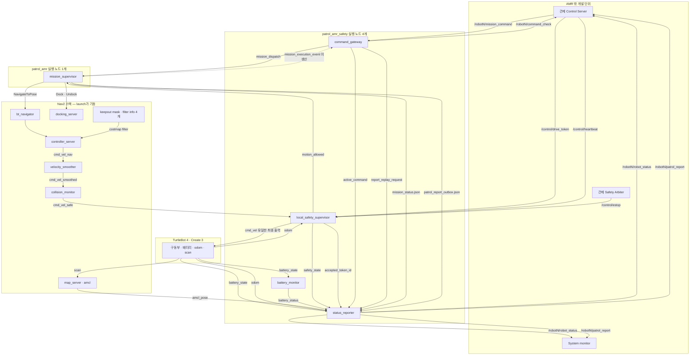
```mermaid
flowchart TB
    subgraph EXT[AMR 밖 개발 단위]
        CTRL[관제 Control Server]
        ARB[관제 Safety Arbiter]
        MON[System monitor]
    end

    subgraph SAFETY["patrol_amr_safety 실행 노드 4개"]
        GW[command_gateway]
        BAT[battery_monitor]
        LSS[local_safety_supervisor]
        SR[status_reporter]
    end

    subgraph MISSION["patrol_amr 실행 노드 1개"]
        MS[mission_supervisor]
    end

    subgraph NAV2["Nav2 스택 — launch가 기동"]
        AMCL[map_server · amcl]
        BT[bt_navigator]
        CTL[controller_server]
        VS[velocity_smoother]
        CM[collision_monitor]
        DOCK[docking_server]
        KEEP[keepout mask · filter info 4개]
    end

    subgraph HW["TurtleBot 4 · Create 3"]
        DRV[구동부 · 배터리 · odom · scan]
    end

    CTRL -->|"/robotN/mission_command"| GW
    GW -->|"/robotN/command_check"| CTRL
    GW -->|"mission_dispatch"| MS
    MS -.->|"mission_execution_event 미생산"| GW

    CTRL -->|"/control/drive_token"| LSS
    CTRL -->|"/control/heartbeat"| LSS
    ARB -->|"/control/estop"| LSS

    MS -->|"NavigateToPose"| BT
    MS -->|"Dock · Undock"| DOCK
    BT --> CTL
    CTL -->|"cmd_vel_nav"| VS
    VS -->|"cmd_vel_smoothed"| CM
    CM -->|"cmd_vel_safe"| LSS
    LSS -->|"cmd_vel 유일한 최종 출력"| DRV
    LSS -->|"motion_allowed"| MS
    KEEP -->|"costmap filter"| CTL

    DRV -->|"battery_state"| BAT
    DRV -->|"battery_state"| SR
    DRV -->|"odom"| LSS
    DRV -->|"odom"| SR
    DRV -->|"scan"| AMCL
    AMCL -->|"amcl_pose"| SR

    BAT -->|"battery_status"| SR
    LSS -->|"safety_state"| SR
    LSS -->|"accepted_token_id"| SR
    GW -->|"active_command"| SR
    GW -->|"report_replay_request"| SR
    MS -->|"mission_status.json"| SR
    MS -->|"patrol_report_outbox.json"| SR

    SR -->|"/robotN/robot_status"| CTRL
    SR -->|"/robotN/robot_status"| MON
    SR -->|"/robotN/patrol_report"| CTRL
    SR -->|"/robotN/patrol_report"| MON
```

실행 노드는 두 패키지를 합쳐 **5개**다. `setup.py`의 entry point가 그 근거다.

| 패키지 | 실행 노드 | 시작 방법 |
|---|---|---|
| `patrol_amr_safety` | `command_gateway`, `battery_monitor`, `local_safety_supervisor`, `status_reporter` | `amr_safety_status.launch.py` |
| `patrol_amr` | `mission_supervisor` | `patrol.launch.py` |

나머지 파일은 모두 이 5개 프로세스 안에서 import되는 모듈이다. 시나리오마다 노드를 만들지 않는다.

### 10.2 명령 한 건의 종단 흐름

관제가 `MissionCommand` 하나를 보낸 시점부터 `PatrolReport`가 나갈 때까지다. 굵은 분기는 실제 코드의 조건문이다.

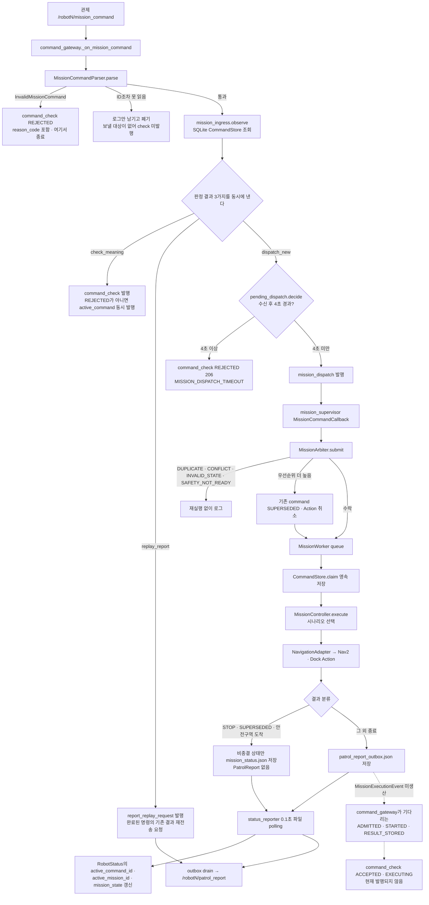
```mermaid
flowchart TD
    A["관제 /robotN/mission_command"] --> B["command_gateway._on_mission_command"]
    B --> C["MissionCommandParser.parse"]
    C -->|InvalidMissionCommand| C1["command_check REJECTED<br/>reason_code 포함 · 여기서 종료"]
    C -->|"ID조차 못 읽음"| C2["로그만 남기고 폐기<br/>보낼 대상이 없어 check 미발행"]
    C -->|통과| D["mission_ingress.observe<br/>SQLite CommandStore 조회"]
    D --> E{"판정 결과 3가지를 동시에 낸다"}
    E -->|check_meaning| F["command_check 발행<br/>REJECTED가 아니면 active_command 동시 발행"]
    E -->|replay_report| G["report_replay_request 발행<br/>완료된 명령의 기존 결과 재전송 요청"]
    E -->|dispatch_new| H{"pending_dispatch.decide<br/>수신 후 4초 경과?"}
    H -->|"4초 이상"| I["command_check REJECTED 206<br/>MISSION_DISPATCH_TIMEOUT"]
    H -->|"4초 미만"| J["mission_dispatch 발행"]

    J --> K["mission_supervisor MissionCommandCallback"]
    K --> L["MissionArbiter.submit"]
    L -->|DUPLICATE · CONFLICT · INVALID_STATE · SAFETY_NOT_READY| L1["재실행 없이 로그"]
    L -->|"우선순위 더 높음"| L2["기존 command SUPERSEDED · Action 취소"]
    L -->|수락| M["MissionWorker queue"]
    L2 --> M
    M --> N["CommandStore.claim 영속 저장"]
    N --> O["MissionController.execute<br/>시나리오 선택"]
    O --> P["NavigationAdapter → Nav2 · Dock Action"]
    P --> Q{"결과 분류"}
    Q -->|"STOP · SUPERSEDED · 안전구역 도착"| R["비종결 상태만 mission_status.json 저장<br/>PatrolReport 없음"]
    Q -->|"그 외 종료"| S["patrol_report_outbox.json 저장"]

    R --> T["status_reporter 0.1초 파일 polling"]
    S --> T
    T --> U["RobotStatus의 active_command_id ·<br/>active_mission_id · mission_state 갱신"]
    T --> V["outbox drain → /robotN/patrol_report"]
    G --> V

    S -.->|"MissionExecutionEvent 미생산"| W["command_gateway가 기다리는<br/>ADMITTED · STARTED · RESULT_STORED"]
    W -.-> X["command_check ACCEPTED · EXECUTING<br/>현재 발행되지 않음"]
```

**실행 이벤트 구간이 끊겨 있다.** `mission_supervisor`는 실행 수명을 `mission_lifecycle` 토픽에 `std_msgs/String` JSON으로 내보내려 하지만, `command_gateway`가 구독하는 것은 `mission_execution_event` 토픽의 `patrol_interfaces/MissionExecutionEvent`다. 이름과 타입이 모두 다르고 기존 producer에는 런타임 참조 오류도 있다. 따라서 현재 gateway는 잘못된 명령의 REJECTED와 admission 4초 timeout은 발행하지만, 유효 명령의 ACCEPTED·EXECUTING은 성현님 D17 producer가 연결되기 전까지 발행하지 않는다. 관련 공용 메시지 요청은 [CR-AMR 09-09 08:46](change_requests/CR-AMR_09-09_08-46_MissionExecutionEvent_공용_메시지_추가.md)에 있다.

### 10.3 최종 주행 속도 한 줄 경로

바퀴로 나가는 값은 이 경로 하나뿐이다. `local_safety_supervisor`가 `cmd_vel`의 유일한 발행자다.

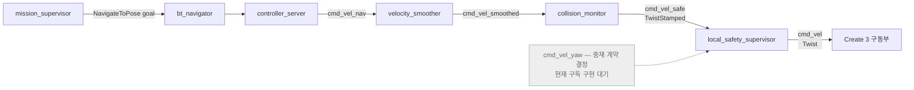
```mermaid
flowchart LR
    MS[mission_supervisor] -->|NavigateToPose goal| BT[bt_navigator]
    BT --> CTL[controller_server]
    CTL -->|cmd_vel_nav| VS[velocity_smoother]
    VS -->|cmd_vel_smoothed| CM[collision_monitor]
    CM -->|"cmd_vel_safe<br/>TwistStamped"| LSS[local_safety_supervisor]
    LSS -->|"cmd_vel<br/>Twist"| DRV[Create 3 구동부]
    YAW["cmd_vel_yaw — 중재 계약 결정<br/>현재 구독 구현 대기"]:::pending -.-> LSS
    classDef pending fill:#eee,stroke:#999,color:#666
```

`cmd_vel_yaw`의 토픽·수치·중재 계약은 2026-09-09 결정됐지만 현재 `local_safety_supervisor`는 아직 구독하지 않는다. 구현 후에는 Nav2·yaw 중 하나만 신선할 때만 통과시키고 둘 다 신선하면 0을 출력한다. 현재 코드는 후보 하나만 받아 그대로 통과시키므로 계약 반영 전 상태다. 장애물 대응 감속과 일반 속도 상한은 TBD-AMR-006으로 남아 있다.

### 10.4 안전 판정 — 세 가지 출력을 따로 만든다

`SafetyGate`는 같은 입력으로 서로 다른 세 값을 만든다. 한 값으로 합치지 않은 이유가 코드에 그대로 있다.

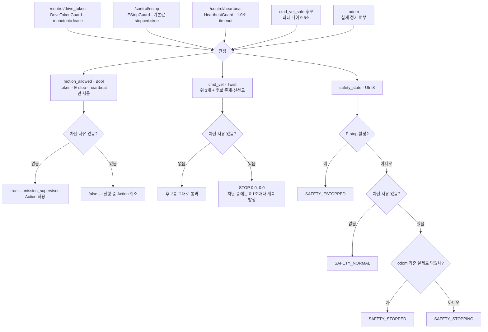
```mermaid
flowchart TD
    IN1["/control/drive_token<br/>DriveTokenGuard · monotonic lease"] --> G{판정}
    IN2["/control/estop<br/>EStopGuard · 기본값 stopped=true"] --> G
    IN3["/control/heartbeat<br/>HeartbeatGuard · 1.0초 timeout"] --> G
    IN4["cmd_vel_safe 후보<br/>최대 나이 0.5초"] --> G
    IN5["odom<br/>실제 정지 여부"] --> G

    G --> P1["motion_allowed · Bool<br/>token · E-stop · heartbeat만 사용"]
    G --> P2["cmd_vel · Twist<br/>위 3개 + 후보 존재·신선도"]
    G --> P3["safety_state · UInt8"]

    P1 --> Q1{"차단 사유 있음?"}
    Q1 -->|없음| A1["true — mission_supervisor Action 허용"]
    Q1 -->|있음| A2["false — 진행 중 Action 취소"]

    P2 --> Q2{"차단 사유 있음?"}
    Q2 -->|없음| B1["후보를 그대로 통과"]
    Q2 -->|있음| B2["STOP 0.0, 0.0<br/>차단 중에는 0.1초마다 계속 발행"]

    P3 --> Q3{"E-stop 활성?"}
    Q3 -->|예| C1[SAFETY_ESTOPPED]
    Q3 -->|아니오| Q4{"차단 사유 있음?"}
    Q4 -->|없음| C2[SAFETY_NORMAL]
    Q4 -->|있음| Q5{"odom 기준 실제로 멈췄나?"}
    Q5 -->|예| C3[SAFETY_STOPPED]
    Q5 -->|아니오| C4[SAFETY_STOPPING]
```

`motion_allowed`에 후보 신선도를 넣지 않은 것이 핵심이다. Nav2가 지금 후보를 내지 않는 것은 "낼 값이 없다"는 뜻이지 "주행 권한이 없다"는 뜻이 아니다. 두 가지를 합치면 Nav2 기동·정지마다 임무 권한이 흔들린다.

차단 사유는 `MotionBlockReason` 5개이며 우선순위 없이 해당하는 것을 모두 보고한다. 출력은 어느 사유든 STOP으로 같기 때문이다.

| 사유 | 발생 조건 | `motion_allowed`에 반영 |
|---|---|---|
| `DRIVE_TOKEN_NOT_GRANTED` | token 미보유·lease 만료·revoke | 반영 |
| `ESTOP_ACTIVE` | `/control/estop` 활성. 수신 전 기본값도 활성 | 반영 |
| `HEARTBEAT_NOT_HEALTHY` | 관제 heartbeat 1.0초 초과 | 반영 |
| `CANDIDATE_MISSING` | 후보를 한 번도 받지 못함 | 반영 안 함 |
| `CANDIDATE_STALE` | 후보 stamp가 0.5초보다 오래됨 | 반영 안 함 |

### 10.5 주기와 발행 조건

코드리뷰에서 "이 값은 언제 나가느냐"를 묻는 자리에 쓸 표다.

| 노드 | 타이머 | 발행 조건 |
|---|---|---|
| `battery_monitor` | 0.1초 신선도 확인 | 값이 바뀔 때만. 3초 이상 입력이 끊기면 즉시 `UNKNOWN` |
| `local_safety_supervisor` | 0.1초 재확인 | `cmd_vel`은 후보를 받을 때마다, 그리고 차단 중에는 매 주기. `motion_allowed`·`safety_state`·`accepted_token_id`는 값이 바뀔 때만 |
| `status_reporter` | 0.02초 tick, 0.1초 파일 polling | 기본 0.5초 주기. 값이 바뀌면 최소 간격 0.1초까지 앞당김 |
| `command_gateway` | 0.1초 pending 확인, 60초 prune | 명령 수신·실행 이벤트 수신 시점. 접수 4초 초과 시 `REJECTED` |

배터리 상태 전이에는 3초 유지 조건이 있다. 새 분류가 3초 연속 관측되어야 상태를 바꾸며, `CRITICAL`만 즉시 반영한다. 관측이 끊기거나 무효하면 유지 조건 없이 바로 `UNKNOWN`이 된다.

### 10.6 전체 그림에서 아직 끊긴 연결

문서에 그림이 있다는 이유로 완료로 처리하지 않는다. 아래는 코드를 직접 확인한 결과다.

| 끊긴 지점 | 확인한 내용 | 영향 |
|---|---|---|
| 실행 수명 이벤트 | `mission_supervisor`는 `mission_lifecycle`/`String`, `command_gateway`는 `mission_execution_event`/`MissionExecutionEvent` | `CommandCheck`가 접수 단계에서 멈춘다. 관제는 실행 시작·완료를 `CommandCheck`로 받지 못한다 |
| `mission_supervisor` 실행 | `command_lifecycle` import 없이 호출만 남아 있다 | 이벤트 발행 경로 진입 시 `NameError` |
| `mission_dispatch` 구독 QoS | 계약은 TRANSIENT_LOCAL, 코드는 VOLATILE | gateway가 먼저 발행하고 supervisor가 늦게 뜨면 명령 유실 |
| 안전 launch | `_nodes()`의 17개 인자와 status 파일 경로 전달 | 2026-09-09 수정, `--show-args` 및 격리 ROS domain 155 `AMR_SMOKE_PASS` |
| 하드웨어 launch | `command_gateway` 이름이 정의 없이 사용된다 | `hardware_patrol.launch.py` 실행 즉시 `NameError`. 11절 참조 |

앞의 세 개와 하드웨어 launch는 `patrol_amr` 파일이므로 조정묵이 수정하지 않는다. 안전 launch는 승인된 조정묵 범위에서 모든 인자와 status 경로를 연결했다.

## 11. launch 파일이 무엇을 구동하는가 — 코드리뷰용

10분 안에 끝내는 발표용 축약본은 [AMR 파트 10분 코드리뷰 진행안](development/amr-code-review-10min.md)에 따로 두었다. 이 절은 그 근거가 되는 전체 내용이다.

AMR 파트의 launch 파일은 6개다. 안전 패키지에 1개, 미션 패키지에 5개 있다. 이 절은 "이 파일을 실행하면 어떤 프로세스가 몇 개 뜨는가"만 다룬다. 노드 사이 메시지는 10절을 본다.

AGENTS.md는 launch를 코드 변경과 같은 수준으로 취급한다. 이 절은 현재 파일 내용을 옮긴 설명이며, 아래에서 지적한 결함도 문서로만 기록하고 파일을 수정하지 않았다.

### 11.1 한눈에 보는 대응표

| launch 파일 | 소유 패키지 | 직접 띄우는 프로세스 | 포함하는 다른 launch |
|---|---|---|---|
| `amr_safety_status.launch.py` | `patrol_amr_safety` | `command_gateway`, `battery_monitor`, `local_safety_supervisor`, `status_reporter` | 없음 |
| `patrol.launch.py` | `patrol_amr` | `mission_supervisor` | 없음 |
| `patrol_localization.launch.py` | `patrol_amr` | `patrol_lifecycle_manager_localization` | `nav2_bringup/localization_launch.py` |
| `patrol_nav2.launch.py` | `patrol_amr` | `patrol_lifecycle_manager_navigation` | `turtlebot4_navigation/navigation_launch.py` |
| `hardware_patrol.launch.py` | `patrol_amr` | `local_safety_supervisor`, `status_reporter` | 위 세 개 |
| `amr_nav2_keepout.launch.py` | `patrol_amr` | keepout mask·filter info 서버 4개, `keepout_lifecycle_manager` | `turtlebot4_navigation`의 `localization.launch.py`, `nav2.launch.py` |

### 11.2 포함 관계


```mermaid
flowchart TD
    HP["hardware_patrol.launch.py<br/>통합 실기 진입점"] --> LOC["patrol_localization.launch.py"]
    HP --> NAV["patrol_nav2.launch.py"]
    HP --> PAT["patrol.launch.py"]
    HP --> N1["local_safety_supervisor 직접 기동"]
    HP --> N2["status_reporter 직접 기동"]

    LOC --> LI["nav2_bringup<br/>localization_launch.py<br/>autostart=false"]
    LOC --> LM["patrol_lifecycle_manager_localization<br/>10초 뒤 map_server · amcl 활성화"]

    NAV --> NI["turtlebot4_navigation<br/>navigation_launch.py<br/>autostart=false"]
    NAV --> NM["patrol_lifecycle_manager_navigation<br/>지연 후 8개 노드만 활성화"]

    PAT --> MS["mission_supervisor"]

    SAFE["amr_safety_status.launch.py<br/>안전 파트 단독 진입점"] --> S1[command_gateway]
    SAFE --> S2[battery_monitor]
    SAFE --> S3[local_safety_supervisor]
    SAFE --> S4[status_reporter]

    KO["amr_nav2_keepout.launch.py<br/>별도 keepout 실험 경로"] --> K1["mask server 2개<br/>filter info server 2개"]
    KO --> K2["turtlebot4 localization.launch.py"]
    KO --> K3["turtlebot4 nav2.launch.py<br/>nav2_keepout_filters.yaml 덮어쓰기"]
```

`hardware_patrol.launch.py`와 `amr_nav2_keepout.launch.py`는 서로 다른 Nav2 기동 경로다. 앞은 `navigation_launch.py`를 직접 포함해 lifecycle 대상을 줄인 순찰용이고, 뒤는 TurtleBot 4 표준 `nav2.launch.py` 위에 keepout 파라미터를 덮어쓰는 경로다. 두 개를 동시에 띄우면 같은 namespace에 Nav2가 두 벌 뜬다.

### 11.3 파일별 상세

#### `amr_safety_status.launch.py` — 안전 파트 4개 노드

인자 18개를 선언한다. `robot_id`와 `source_session_id`는 기본값이 없어 반드시 넘겨야 한다.

| 인자 | 기본값 | 무엇을 정하는가 |
|---|---|---|
| `robot_id` | 없음 | 노드 파라미터이자 namespace. `robot1` 또는 `robot6` |
| `source_session_id` | 없음 | 이번 실행을 식별한다. 재시작마다 바꿔야 관제가 이전 실행과 구분한다 |
| `push_namespace` | `true` | `/robotN`을 여기서 붙일지 여부. 상위 launch가 이미 붙였다면 `false` |
| `battery_state_topic` | `battery_state` | 배터리 드라이버 위치. 장치 배치가 TBD-ARCH-001이라 밖으로 뺄 수 있다 |
| `battery_status_topic` | `battery_status` | 분류 결과 내부 토픽 |
| `candidate_topic` | `cmd_vel_safe` | Nav2 collision_monitor 출력 입구 |
| `output_topic` | `cmd_vel` | 최종 속도 출력. 시험할 때 로봇 밖 sink로 돌릴 수 있다 |
| `odom_topic` | `odom` | 실제 속도·정지 판정 입력 |
| `pose_topic` | `amcl_pose` | AMCL 위치 입력 |
| `drive_token_topic` | `/control/drive_token` | 관제 주행 권한 |
| `heartbeat_topic` | `/control/heartbeat` | 관제 생존 신호 |
| `estop_topic` | `/control/estop` | 안전 정지 |
| `motion_allowed_topic` | `motion_allowed` | 임무 허용 출력 |
| `safety_state_topic` | `safety_state` | 안전 상태 출력 |
| `accepted_token_topic` | `accepted_token_id` | 유효 token ID 출력 |
| `database_path` | `''` | `command_gateway`의 SQLite 경로. 비우면 로봇별 기본 경로 |
| `mission_status_path` | `''` | 3A `mission_status.json` 경로 |
| `report_outbox_path` | `''` | 3A `patrol_report_outbox.json` 경로 |

`push_namespace` 인자가 있는 이유가 이 파일의 설계 요점이다. namespace는 겹쳐 쌓이기 때문에 상위 launch가 이미 `/robot1`을 붙인 상태에서 이 파일이 또 붙이면 `/robot1/robot1/cmd_vel`이 된다. 그런데 `status_reporter`만은 `/{robot_id}/robot_status`를 절대 이름으로 발행하므로 겹치지 않는다. 일부만 어긋난 채 조용히 동작하는 상태가 되므로, 상위에서 namespace를 붙이는 호출자는 `push_namespace:=false`를 넘겨야 한다.

노드 목록을 만드는 `_nodes()`의 필수 인자 17개를 namespace 적용/미적용 두 `GroupAction`에서 모두 전달한다. 두 경로는 조건이 배타적이다.

```
_nodes(robot_id, source_session_id,
       battery_state_topic, battery_status_topic,
       candidate_topic, output_topic, odom_topic, pose_topic,
       drive_token_topic, heartbeat_topic, estop_topic,
       motion_allowed_topic, safety_state_topic, accepted_token_topic,
       database_path, mission_status_path, report_outbox_path)
```

`battery_status_topic`, `output_topic`, 세 관제 안전 토픽, 세 내부 상태 토픽, `database_path`, `mission_status_path`, `report_outbox_path`가 각 노드의 parameter/remapping으로 연결된다. 마지막 두 경로는 `status_reporter`에 명시적으로 전달하므로 `mission_supervisor`와 같은 파일을 지정할 수 있고, 비우면 양쪽 모두 `$ROS_HOME/patrol_amr/<robot_id>/` 기본 경로를 사용한다.

#### `patrol.launch.py` — `mission_supervisor` 하나

`patrol_params.yaml`을 먼저 적용하고 그 위에 launch 인자를 덮어쓴다. namespace는 노드에 직접 지정한다.

| 인자 | 기본값 | 설명 |
|---|---|---|
| `robot_id` | `robot1` | `robot1`·`robot6`만 허용 |
| `params_file` | `config/patrol_params.yaml` | W1~W7 좌표, 체류 시간, 재개 정책, 도킹 timeout |
| `safety_path_ready` | `false` | 최종 `cmd_vel` 경로 검증 후에만 `true` |
| `hardware_test_mode` | `false` | TurtleBot 4 기본 주행 경로로 시험할 때만 `true` |
| `motion_enable_token` | `''` | `ENABLE_<ROBOT_ID>_MOTION`과 일치해야 주행 허용 |
| `source_session_id` | 시각·PID 자동 생성 | `<robot_id>-<YYYYMMDDTHHMMSS>-<PID>` |
| `command_store_path` | `''` | 명령·checkpoint 저장소 |
| `mission_status_path` | `''` | `status_reporter`와 공유할 상태 파일 |
| `report_outbox_path` | `''` | `status_reporter`와 공유할 결과 대기열 |

기본값만으로 실행하면 `motion_enable_token`이 비어 있어 주행이 차단된 상태로 뜬다. 이 파일은 노드를 띄우는 것과 실제 주행을 허용하는 것을 일부러 분리한다.

#### `patrol_localization.launch.py` — 지도와 위치 추정

`nav2_bringup`의 `localization_launch.py`를 `autostart=false`로 포함해 `map_server`와 `amcl`을 만들되 활성화하지 않는다. 그리고 기본 10초 뒤 `patrol_lifecycle_manager_localization`이 그 두 노드만 활성화한다. Fast DDS가 lifecycle 서비스 endpoint를 발견하기 전에 전환 요청을 보내면 bringup이 통째로 막히기 때문에, 포함된 manager는 놀리고 지연된 manager 하나만 활성화 권한을 갖는다.

인자는 `namespace`(기본 `robot6`), `map`(기본 `config/final_project_map.yaml`), `use_sim_time`, `params_file`(기본 TurtleBot 4의 `localization.yaml`), `lifecycle_start_delay`(기본 10.0), `log_level`이다.

#### `patrol_nav2.launch.py` — Nav2 순찰용 축소 구성

`turtlebot4_navigation`의 `navigation_launch.py`를 역시 `autostart=false`로 포함하고, 지연된 `patrol_lifecycle_manager_navigation`이 **8개 노드만** 활성화한다.

```
controller_server, smoother_server, planner_server, behavior_server,
velocity_smoother, collision_monitor, bt_navigator, docking_server
```

`route_server`와 `waypoint_follower`는 이 목록에 없다. 현재 순찰은 W1~W7을 `NavigateToPose` 하나씩으로 보내므로 두 API를 쓰지 않고, 목록에서 빼면 route 서비스 지연이 순찰 bringup 전체를 막지 않는다.

`SetRemap`으로 `global_costmap/scan`과 `local_costmap/scan`을 로봇 namespace의 `scan`으로 돌린다. 포함할 때 namespace를 절대 이름으로 넘겨 그룹이 이미 붙인 상대 namespace와 겹치지 않게 한다.

#### `hardware_patrol.launch.py` — 실기 통합 진입점

기본 `robot_id`가 `robot6`이다. 아래를 한 번에 띄운다.

1. `command_gateway` — **이름만 있고 정의가 없다. 아래 결함 참조**
2. `local_safety_supervisor` — `start_local_safety`가 `true`일 때
3. `status_reporter` — `start_status_reporter`가 `true`일 때
4. `patrol_localization.launch.py` — `start_localization`이 `true`일 때, lifecycle 지연 10초
5. `patrol_nav2.launch.py` — `start_nav2`가 `true`일 때, lifecycle 지연 20초
6. `patrol.launch.py` — 조건 없이 항상. `safety_path_ready=true`, `hardware_test_mode=false`로 고정하고 `motion_enable_token`을 그대로 넘긴다

`start_*` 인자 5개는 모두 기본 `true`이며, 해당 노드가 이미 떠 있을 때만 `false`로 내린다. 중복 기동은 `cmd_vel` 단일 발행자 규칙을 깨뜨린다.

**현재 이 파일도 실행되지 않는다.** 반환 목록에 `command_gateway`가 들어 있는데 함수 안에서 그 이름에 아무것도 대입하지 않는다. 실행 즉시 `NameError`가 난다. `start_command_gateway` 인자는 선언되어 있으므로 노드 정의만 빠진 상태다.

**결함과 별개로 확인할 점이 두 가지 더 있다.** 이 파일은 `battery_monitor`를 띄우지 않는다. `battery_status`를 발행하는 노드가 없으므로 `status_reporter`의 `battery_state` 축은 `UNKNOWN`에서 움직이지 않는다. 그리고 여기서 띄우는 `local_safety_supervisor`와 `status_reporter`에는 remapping이 하나도 없다. 토픽 이름을 바꿔야 하는 배치에서는 `amr_safety_status.launch.py` 쪽을 써야 한다.

#### `amr_nav2_keepout.launch.py` — 두 겹 Keepout 실험 경로

`robot_id`는 기본값이 없어 반드시 넘긴다. 띄우는 것은 다음과 같다.

- `base_keepout_mask_server`, `center_corridor_keepout_mask_server` — 두 mask 지도를 `keepout/<이름>/mask`로 발행
- `base_keepout_filter_info_server`, `center_corridor_filter_info_server` — costmap이 읽을 filter info. mask 토픽 이름을 절대 이름으로 넣는다. 더 깊은 namespace의 costmap 노드가 이 값을 그대로 쓰기 때문이다
- `keepout_lifecycle_manager` — 위 4개를 관리. `autostart` 기본 `true`
- TurtleBot 4 표준 `localization.launch.py`와 `nav2.launch.py`

Nav2 포함 시 `nav2_keepout_filters.yaml`을 덮어쓴다. 이 파일에서 `<robot_namespace>`를 `/robot1` 또는 `/robot6`으로 치환한다. 빨간색 base 필터는 항상 `enabled: true`, 노란색 center corridor 필터는 `enabled: false`로 시작한다. 후자를 켜고 끄는 것은 관제가 CCTV 판단을 받아 결정하며 이 launch는 비전 토픽을 구독하지 않는다.

### 11.4 코드리뷰에서 설명할 순서

1. 실행 노드는 5개뿐이고 나머지 파일은 모듈이라는 점 — 10.1의 표
2. 안전 4개는 `amr_safety_status.launch.py`, 미션 1개는 `patrol.launch.py`가 띄운다
3. Nav2는 두 launch가 `autostart=false`로 만들어 두고 지연된 전용 lifecycle manager가 필요한 노드만 활성화한다
4. `hardware_patrol.launch.py`가 이 조각들을 묶는 실기 진입점이고, `start_*` 인자로 중복 기동을 막는다
5. `amr_safety_status.launch.py` 인자 누락은 수정됐다. `hardware_patrol.launch.py`의 미정의 `command_gateway`는 성현님 범위에 남아 있어 실기 전에 해결해야 한다

<details>
<summary>2026-09-08 이전 설계 읽기본(참고용, 위 1~11절과 충돌하면 사용하지 않음)</summary>

# `amr_patrol_safety` 문서 기준 노드·모듈·메시지 연결도

작성일: 2026-09-08 · 상태: **구현 전 설계 읽기본** · 담당 범위: AMR 로컬 안전·배터리·상태/결과·명령 식별 입구

사용자가 말한 작업 공간은 `amr_patrol_safety`다. 현재 저장소의 실제 패키지 경로와 ROS 패키지명은 `src/patrol_amr_safety/`, `patrol_amr_safety`이므로 이 문서의 파일 경로는 현재 저장소 이름을 사용한다. 패키지 이름을 바꾸는 일은 코드·빌드 설정 변경이므로 이번 문서 작업에는 포함하지 않는다.

이 문서는 저장소의 Markdown 54개를 읽고 아래 기준 문서의 확정 내용만 모아, 앞으로 코드를 정리할 때 참고할 **노드 단위 Python 파일**, **각 노드가 사용할 내부 모듈**, **박스 사이 메시지 선**을 정리한다.

- [공용 개발 규칙](../AGENTS.md)
- [시스템 구조](architecture.md)
- [공용 ROS 2 인터페이스](interfaces.md)
- [관제 인터페이스 v1.0](decisions/2026-09-08-control-interface-baseline.md)
- [AMR 기능 설계](amr.md)
- [시스템 통합 흐름](integration.md)

> 이 문서는 구현 완료를 뜻하지 않는다. 아래 그림은 **설계**이며, 코드를 재정비한 뒤 실제 코드 경로·함수·시험 결과와 대조하여 `구현 대조 완료`로 바꿔야 한다.

## 1. 내가 맡을 노드 파일

`amr_patrol_safety` 범위의 실행 노드는 아래 4개로 구분한다.

| 실행 노드 | Python 파일 | 한 문장 책임 | 하지 않는 일 |
|---|---|---|---|
| `battery_monitor` | `patrol_amr_safety/battery_monitor.py` | 로봇의 원본 배터리 관측을 7개 배터리 상태로 분류한다. | 도킹 명령·교대 로봇 선정 |
| `local_safety_supervisor` | `patrol_amr_safety/local_safety_supervisor.py` | token·heartbeat·E-stop·속도 후보 신선도를 결합해 최종 `cmd_vel`을 단독 발행한다. | 임무 선택, Nav2 목표 생성, Detection 판단 |
| `status_reporter` | `patrol_amr_safety/status_reporter.py` | 배터리·위치·실제 속도·안전·현재 임무 정보를 한 묶음의 `RobotStatus` 메시지로 만들어 관제와 모니터에 보낸다. 끝난 command의 결과는 `PatrolReport`로 보낸다. | STALE·UNREPORTED·교대 등 관제 판단 |
| `command_gateway` | `patrol_amr_safety/command_gateway.py` | MissionCommand의 ID·형식·중복을 검사하고 CommandCheck와 내부 실행 요청을 만든다. | 실제 Nav2·도킹·시나리오 실행 |

정상 순찰, 대피, 재개, 도킹, 중단은 각각 별도 모듈로 분리하되 `mission_supervisor` 아래에서 실행한다. 시나리오마다 새로운 ROS 노드를 만드는 것은 이 작업 범위가 아니다.

### 처음 읽을 때 필요한 ROS 용어

| 용어 | 쉬운 뜻 |
|---|---|
| 노드(node) | 한 가지 책임을 맡아 계속 실행되는 프로그램이다. 여기서는 실행 가능한 Python 파일 하나라고 생각하면 된다. |
| 토픽(topic) | 노드끼리 메시지를 주고받는 이름 붙은 통로다. 예: `/robot1/robot_status`. |
| 메시지 타입 | 통로로 보내는 데이터의 정해진 양식이다. 예: `Twist`는 선속도와 회전속도를 담는다. |
| 발행(publish) | 메시지를 토픽에 보내는 것이다. |
| 구독(subscribe) | 토픽에서 메시지를 받아 보는 것이다. |
| 콜백(callback) | 구독한 메시지가 도착했을 때 자동으로 실행되는 함수다. |
| 로컬 상태 | AMR 한 대 안에서만 알고 있는 현재 값이다. 배터리 판정, 실제 속도, 현재 임무 등이 이에 해당한다. |
| 후보 속도 | 아직 바퀴에 적용되지 않은 속도 제안이다. 마지막 안전 검사를 통과해야 실제 구동부로 전달된다. |

## 2. 작업 범위 전체 그림

실선은 v1.0 또는 2026-09-08 AMR 내부 결정으로 전달 방식이 확정된 연결이다. 점선은 외부 개발 단위와의 계약 또는 구현 세부가 아직 남은 경계다.

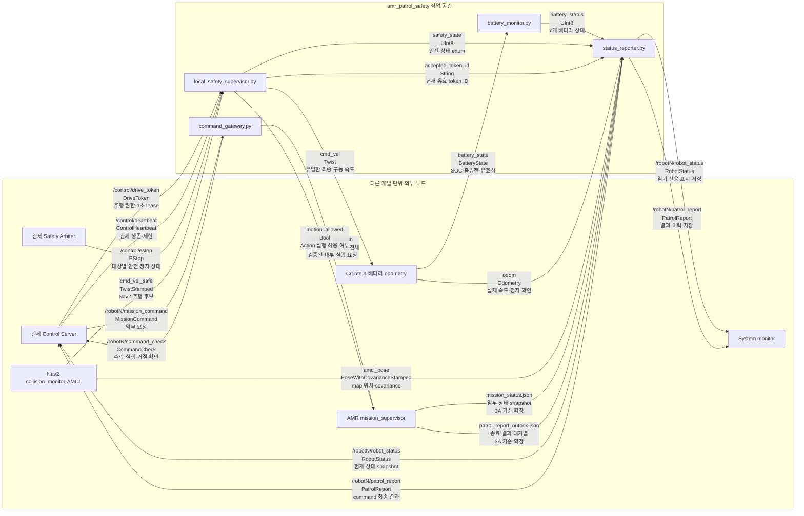
```mermaid
flowchart LR
    subgraph OUTSIDE[다른 개발 단위·외부 노드]
        CONTROL[관제 Control Server]
        ARBITER[관제 Safety Arbiter]
        MISSION[AMR mission_supervisor]
        NAV[Nav2 collision_monitor·AMCL]
        DRIVER[Create 3·배터리·odometry]
        MONITOR[System monitor]
    end

    subgraph SAFETY[amr_patrol_safety 작업 공간]
        GATEWAY[command_gateway.py]
        BATTERY[battery_monitor.py]
        LOCAL[local_safety_supervisor.py]
        STATUS[status_reporter.py]
    end

    CONTROL -->|/robotN/mission_command<br/>MissionCommand<br/>임무 요청| GATEWAY
    GATEWAY -->|/robotN/command_check<br/>CommandCheck<br/>수락·실행·거절 확인| CONTROL
    GATEWAY -->|mission_dispatch<br/>MissionCommand 전체<br/>검증된 내부 실행 요청| MISSION

    CONTROL -->|/control/drive_token<br/>DriveToken<br/>주행 권한·1초 lease| LOCAL
    CONTROL -->|/control/heartbeat<br/>ControlHeartbeat<br/>관제 생존·세션| LOCAL
    ARBITER -->|/control/estop<br/>EStop<br/>대상별 안전 정지 상태| LOCAL
    NAV -->|cmd_vel_safe<br/>TwistStamped<br/>Nav2 주행 후보| LOCAL
    LOCAL -->|cmd_vel<br/>Twist<br/>유일한 최종 구동 속도| DRIVER
    LOCAL -->|motion_allowed<br/>Bool<br/>Action 실행 허용 여부| MISSION

    DRIVER -->|battery_state<br/>BatteryState<br/>SOC·충방전·유효성| BATTERY
    BATTERY -->|battery_status<br/>UInt8<br/>7개 배터리 상태| STATUS
    DRIVER -->|odom<br/>Odometry<br/>실제 속도·정지 확인| STATUS
    NAV -->|amcl_pose<br/>PoseWithCovarianceStamped<br/>map 위치·covariance| STATUS
    LOCAL -->|safety_state<br/>UInt8<br/>안전 상태 enum| STATUS
    LOCAL -->|accepted_token_id<br/>String<br/>현재 유효 token ID| STATUS
    MISSION -->|mission_status.json<br/>임무 상태 snapshot<br/>3A 기준 확정| STATUS
    MISSION -->|patrol_report_outbox.json<br/>종료 결과 대기열<br/>3A 기준 확정| STATUS

    STATUS -->|/robotN/robot_status<br/>RobotStatus<br/>현재 상태 snapshot| CONTROL
    STATUS -->|/robotN/robot_status<br/>RobotStatus<br/>읽기 전용 표시·저장| MONITOR
    STATUS -->|/robotN/patrol_report<br/>PatrolReport<br/>command 최종 결과| CONTROL
    STATUS -->|/robotN/patrol_report<br/>PatrolReport<br/>결과 이력 저장| MONITOR
```

`N`은 첫 번째 로봇이면 `1`, 두 번째 로봇이면 `6`이다. 메시지의 `robot_id`와 namespace는 각각 `robot1`·`/robot1`, `robot6`·`/robot6`을 사용한다. 화면 이름 `AMR1`·`AMR2`를 wire 식별자로 사용하지 않는다.

### 2.1 “로컬 상태를 `RobotStatus`로 만든다”는 뜻

로봇 안에서는 배터리 노드, 안전 노드, 위치 추정 노드, 임무 노드가 각자 일부 정보만 알고 있다. `status_reporter`는 이 값들을 모아서 **“이 로봇은 지금 어떤 상태인가”를 한 번에 보여 주는 상태표**를 만든다. 그 상태표의 공식 메시지 이름이 `RobotStatus`다.

예를 들어 `RobotStatus` 한 건에는 다음 내용이 함께 들어간다.

- 어느 로봇인지: `robot_id`
- 현재 초기화·이동·충전·오류 중 무엇인지: `operational_state`
- 순찰·대피·도킹·일시정지 중 무엇인지: `mission_state`
- 배터리 상태와 SOC: `battery_state`, `battery_soc`
- 안전 정지 상태: `safety_state`
- 현재 위치와 그 위치가 유효한지: `pose`, `pose_valid`
- 실제 선속도·회전속도와 실제로 멈췄는지: `linear_velocity`, `angular_velocity`, `motion_stopped`
- 현재 처리 중인 명령·임무·token: `active_command_id`, `active_mission_id`, `accepted_token_id`

즉 `RobotStatus`는 명령이 아니라 **관제와 시스템 모니터가 읽는 현재 상태 스냅샷**이다. 사진처럼 그 시점의 상태를 묶어 보내며, 정기적으로 2 Hz(0.5초마다) 발행하고 중요한 값이 바뀌면 최대 10 Hz 범위에서 더 빨리 발행한다.

### 2.2 `mission_supervisor`의 역할

`mission_supervisor`는 AMR의 **작업 관리자**다. 안전 노드가 바퀴로 나가는 최종 속도를 검사한다면, mission supervisor는 “무슨 일을 어떤 순서로 할 것인가”를 관리한다.

1. 관제 명령을 내부 실행 요청으로 받는다.
2. 명령에 맞는 시나리오를 고른다. 예: 새 순찰, 안전구역 이동, 순찰 재개, 도킹, 중단.
3. 위치·LiDAR·odometry·주행 권한처럼 실행 준비가 되었는지 확인한다.
4. Nav2에 `NavigateToPose` 목표를 보내 W1~W7 또는 목적지까지 이동시킨다. 도킹은 Dock Action을 사용한다.
5. `motion_allowed=false`, token 상실, STOP·CANCEL 등이 생기면 실행 중인 이동을 취소한다.
6. 진행 상태는 `mission_status.json`, 끝난 결과는 `patrol_report_outbox.json` 쪽으로 넘긴다.

중요하게도 mission supervisor가 계산한 이동은 곧바로 바퀴로 가지 않는다. Nav2와 collision monitor를 거친 후보 속도가 다시 `local_safety_supervisor`의 마지막 검사를 통과해야 한다.

2026-09-08 사용자 결정 1A에 따라 `command_gateway`는 유일한 외부 명령 접수 창구, `mission_supervisor`는 실제 작업 관리자다. 두 노드 사이는 내부 `/{robot}/mission_dispatch`에서 기존 `MissionCommand` 전체를 전달한다. 재전송·수신 확인 방식은 결정 2와 함께 정한다.

### 2.3 `MissionCommand`로 요청할 수 있는 임무

`MissionCommand`는 관제가 AMR에 보내는 **작업 지시서**다. 현재 공식 종류는 6개다.

| 종류 | 값 | 쉬운 의미 | 실행 뒤 다시 이어갈 수 있나? |
|---|---:|---|---|
| `STOP` | 0 | 지금 수행 중인 이동을 멈추고 현재 진행 위치를 기억한다. 활성 임무가 없어도 안전한 “이미 멈춰 있음” 처리로 수락할 수 있다. | 예. 이후 `RESUME_PATROL` 필요 |
| `START_PATROL` | 1 | 새 mission ID로 기본 순찰 계획을 처음부터 시작한다. robot1은 `robot1_default`, robot6은 `robot6_default` 계획만 허용한다. | 해당 없음 |
| `MOVE_TO_SAFE_ZONE` | 2 | 현재 map과 안전영역을 보고 가장 가까운 유효 안전구역으로 이동한다. | 같은 mission을 유지 |
| `RESUME_PATROL` | 3 | STOP 등으로 일시정지해 둔 기존 순찰을 같은 mission ID로 이어서 수행한다. | 취소된 mission은 재개 불가 |
| `DOCK` | 4 | 지정된 자기 로봇의 도킹 스테이션으로 가서 충전을 시작한다. | 도킹 목적의 command |
| `CANCEL` | 5 | 지정한 활성 mission 전체를 끝내고 결과를 `CANCELED`로 남긴다. | 아니오. 다시 하려면 새 mission 필요 |

`STOP`은 “잠깐 멈추고 이어갈 수 있음”, `CANCEL`은 “이 임무 자체를 끝냄”이라는 차이가 있다. E-stop과 token 만료는 위 6개 명령이 아니라, 어떤 임무보다 우선하는 별도 안전 계층이다.

### 2.4 `CommandCheck`가 확인하는 것

`CommandCheck`는 **MissionCommand 한 건을 AMR이 어떻게 처리하고 있는지 알려 주는 접수 확인서**다. 로봇이 목적지에 성공적으로 도착했다는 최종 결과가 아니다.

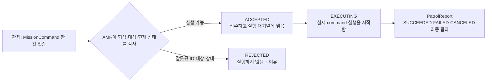
```mermaid
flowchart LR
    REQUEST[관제: MissionCommand 한 건 전송] --> ACCEPT{AMR이 형식·대상·현재 상태를 검사}
    ACCEPT -->|실행 가능| A[ACCEPTED<br/>접수하고 실행 대기열에 넣음]
    A --> E[EXECUTING<br/>실제 command 실행을 시작함]
    ACCEPT -->|잘못된 ID·대상·상태| R[REJECTED<br/>실행하지 않음 + 이유]
    E --> P[PatrolReport<br/>SUCCEEDED·FAILED·CANCELED 최종 결과]
```

- `ACCEPTED`: 그 command를 접수했고 실행 대기열에 넣었다.
- `EXECUTING`: 그 command의 실제 시나리오 실행을 시작했다.
- `REJECTED`: 그 command는 실행하지 않는다. 잘못된 대상, 잘못된 mission, command ID 충돌 같은 이유를 함께 보낸다.

따라서 “수락·실행·거절”의 대상은 **속도 값이나 로봇 자체가 아니라 `command_id`로 식별되는 MissionCommand 한 건**이다. 실제 성공·실패·취소는 나중에 `PatrolReport`로 알려 준다.

### 2.5 `patrol_report_outbox.json`과 “종료 결과”

여기서 종료 결과는 **MissionCommand 한 건이 최종적으로 어떻게 끝났는지**다.

| 결과 | 의미 | 예 |
|---|---|---|
| `SUCCEEDED` | 요청한 일을 정상적으로 끝냄 | 순찰 시작 command의 목표 구간 수행, 도킹 성공 |
| `FAILED` | 주행·위치·센서·시스템 문제로 일을 끝내지 못함 | 경로 없음, Nav2 timeout, 위치 무효 |
| `CANCELED` | 관제 취소·명령 교체·안전 정책·교대 때문에 일을 중단함 | `CANCEL`, token 상실에 따른 실행 취소 |

결과에는 `report_id`, 원래 `command_id`와 `mission_id`, 결과값, 이유, 시작·종료 시각, 마지막 waypoint, 관련 event ID가 포함된다.

`patrol_report_outbox.json`은 이 결과를 디스크에 잠시 보관하는 **발송 대기함**이다.

1. mission supervisor 쪽에서 command 종료 결과를 만든다.
2. 네트워크로 보내기 전에 JSON 파일에 먼저 저장한다.
3. `status_reporter`가 파일의 미발송 결과를 읽어 `PatrolReport` 메시지로 보낸다.
4. 관제 연결이 없거나 발행에 실패하면 파일에서 지우지 않고 다음에 다시 시도한다.
5. 프로그램이 재시작되어도 디스크 파일이 남으므로 결과를 잃지 않고 같은 `report_id`로 재전송할 수 있다.

현재는 구독자가 연결된 상태에서 publish 호출이 성공하면 대기 항목을 지우는 방식이다. 관제 또는 시스템 모니터가 실제 DB 저장을 끝냈다는 ACK를 누가 보내고 언제 지울지는 TBD-IF-003이다.

### 2.6 `cmd_vel / Twist / 최종 구동 속도`

맞다. 여기서 속도는 **로봇 바퀴가 실제로 따라야 할 이동 속도**다. `Twist`의 핵심값은 앞으로·뒤로 가는 `linear.x`(m/s)와 제자리 회전하는 `angular.z`(rad/s)다.

다만 `local_safety_supervisor`가 경로를 계획하거나 적절한 주행 속도를 새로 계산하는 것은 아니다. Nav2와 collision monitor가 만든 `cmd_vel_safe` 후보를 받아 아래처럼 **통과시키거나 0으로 막는 마지막 문지기** 역할을 한다.

| 검사 | 통과 조건 | 실패하면 |
|---|---|---|
| 관제 heartbeat | 마지막으로 수락한 heartbeat가 1초를 초과하지 않음 | `cmd_vel=(0, 0)` |
| DriveToken | 이 로봇이 holder이고 token이 회수·만료되지 않음 | `cmd_vel=(0, 0)` |
| E-stop | 자기 로봇 또는 `all` 대상 E-stop이 비활성 | `cmd_vel=(0, 0)` |
| 후보 존재·숫자 | `cmd_vel_safe`가 존재하고 속도값이 NaN·무한대가 아닌 정상 숫자 | 없거나 잘못된 표본이면 정지 방향 처리 |
| 후보 신선도 | 후보의 timestamp가 현재보다 0.5초를 초과해 오래되지 않음 | `cmd_vel=(0, 0)` |

모든 검사를 통과하면 후보의 `linear.x`와 `angular.z`를 바꾸지 않고 `cmd_vel`로 전달한다. 현재 확정 범위에는 별도 최고속도 제한, 부드러운 감속량 계산, 장애물 거리별 속도 계산이 없다. 그 정책은 TBD-AMR-006이다.

`command_gateway`는 `cmd_vel`을 발행하지 않는다. gateway는 명령 접수와 중복 방지만 담당하고, `cmd_vel`의 유일한 발행자는 `local_safety_supervisor`다.

## 3. 노드별 내부 모듈 분해

### 3.1 `battery_monitor.py`

한 노드 파일 안에서 아래 두 논리 모듈로 나눈다.

| 논리 모듈 | 입력 | 출력·책임 |
|---|---|---|
| `classify_observation` | SOC, `present`, `power_supply_status` | 유효한 충전/방전 관측을 배터리 상태 후보로 분류 |
| `BatteryStateModel` | 분류 후보, monotonic 시각 | CRITICAL 즉시, 그 외 3초 유지, 3초 미수신 UNKNOWN 적용 |

`battery_monitor`가 받는 것은 배터리 드라이버가 발행한 `sensor_msgs/BatteryState` 메시지다. 질문에 나온 값은 이 메시지 안의 필드다.

| 받은 필드 | 쉬운 뜻 | 유효하다고 보는 기준 |
|---|---|---|
| `present` | 배터리가 장착되어 있고 센서가 배터리 존재를 확인했는지 나타내는 참/거짓 값 | `true`여야 한다. `false`면 SOC 숫자가 있어도 믿지 않고 UNKNOWN |
| `percentage` | 배터리 잔량 비율. 문서에서 말하는 SOC다. | 0.0~1.0 사이의 정상 실수여야 한다. 0.37은 37%다. NaN, 무한대, 음수, 1보다 큰 값은 UNKNOWN |
| `power_supply_status` | 현재 충전 중인지 방전 중인지 나타내는 상태 | `CHARGING`·`FULL`은 충전 방향, `DISCHARGING`은 방전 방향. 그 밖의 상태는 방향이 명확하지 않아 UNKNOWN |

방향과 SOC가 유효하면 다음처럼 상태 후보를 정한다.

| 방향 | SOC | 후보 상태 |
|---|---:|---|
| 방전 | 10% 미만 | `CRITICAL` |
| 방전 | 10% 이상 20% 미만 | `LOW` |
| 방전 | 20% 이상 | `NORMAL` |
| 충전 | 50% 미만 | `CHARGING` |
| 충전 | 50% 이상 80% 미만 | `PATROL_READY` |
| 충전 | 80% 이상 | `FULL` |

여기서 **신선도 확인**은 배터리 잔량 자체가 신선한지 화학적으로 검사한다는 뜻이 아니다. **마지막 `battery_state` 메시지를 받은 지 너무 오래되지 않았는지** 확인한다는 뜻이다. 0.1초마다 마지막 수신 시각을 확인하고, 3초 동안 새 메시지가 없으면 기존 SOC를 더 이상 믿지 않고 `UNKNOWN`으로 바꾼다.

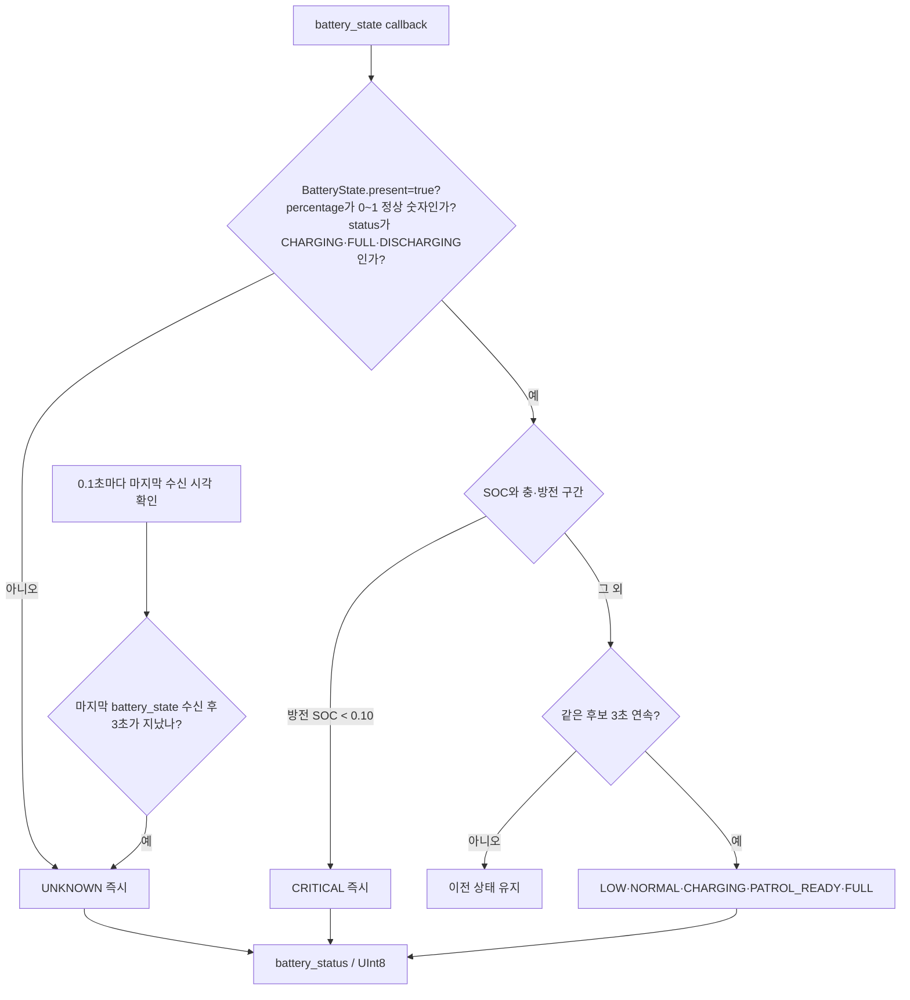
```mermaid
flowchart TD
    RX[battery_state callback] --> VALID{BatteryState.present=true?<br/>percentage가 0~1 정상 숫자인가?<br/>status가 CHARGING·FULL·DISCHARGING인가?}
    VALID -->|아니오| UNKNOWN[UNKNOWN 즉시]
    VALID -->|예| BAND{SOC와 충·방전 구간}
    BAND -->|방전 SOC < 0.10| CRITICAL[CRITICAL 즉시]
    BAND -->|그 외| HOLD{같은 후보 3초 연속?}
    HOLD -->|아니오| KEEP[이전 상태 유지]
    HOLD -->|예| APPLY[LOW·NORMAL·CHARGING·PATROL_READY·FULL]
    TIMER[0.1초마다 마지막 수신 시각 확인] --> STALE{마지막 battery_state 수신 후<br/>3초가 지났나?}
    STALE -->|예| UNKNOWN
    UNKNOWN --> PUB[battery_status / UInt8]
    CRITICAL --> PUB
    APPLY --> PUB
```

배터리 상태 숫자는 `UNKNOWN=0`, `CRITICAL=1`, `LOW=2`, `NORMAL=3`, `CHARGING=4`, `PATROL_READY=5`, `FULL=6`이다. `battery_status`는 AMR 내부 연결이며 별도 공용 `BatteryEvent` 계약이 아니다.

### 3.2 `local_safety_supervisor.py`

이 노드는 네 개의 순수 판정 모듈을 조합한다.

| 내부 모듈 | 입력 | 판단 |
|---|---|---|
| `drive_token_guard.py` | control session, token ID, holder, lease, message sequence | 자기 로봇의 유효 주행 권한인지, 회수·만료·역순인지 |
| `heartbeat_guard.py` | control session, sequence, 수신 monotonic 시각 | 관제 heartbeat가 1초 이내 정상인지 |
| `estop_guard.py` | target robot, active, 대표 reason, sequence | 자기 로봇 또는 `all` 대상 E-stop이 활성인지 |
| `motion_guard.py` | 위 세 판단, `TwistStamped` 후보와 age | 후보를 통과시킬지 최종 0 속도를 낼지 |

`heartbeat_guard.py`는 책임상 이 패키지 내부 순수 모듈로 보는 것이 자연스럽다. 현재 실제 파일 위치를 옮기는 일은 코드 재정비 단계에서 별도 승인 후 처리한다.

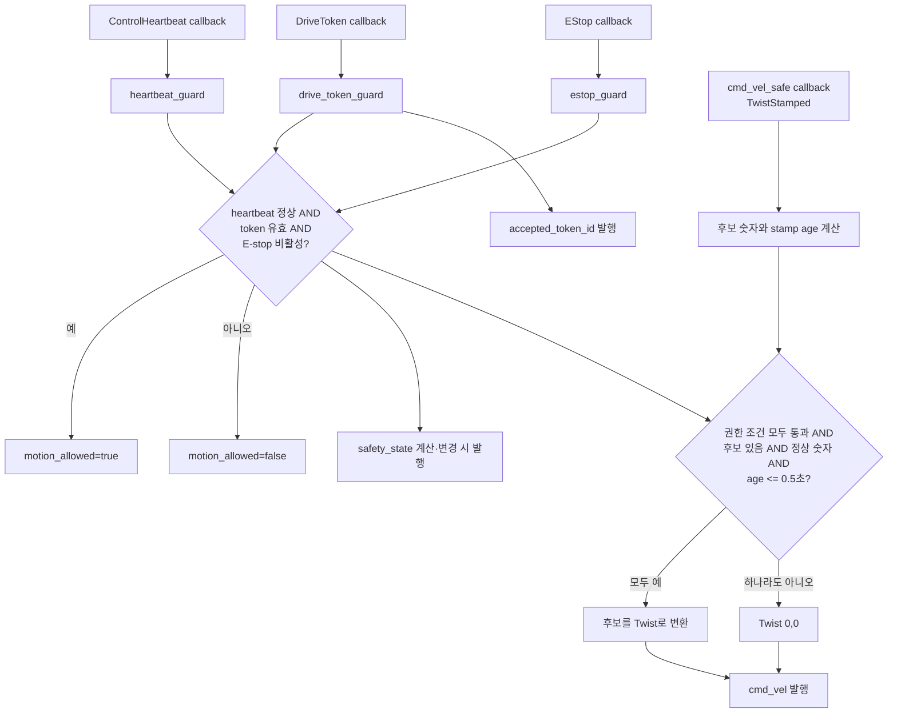
```mermaid
flowchart TD
    DT[DriveToken callback] --> DG[drive_token_guard]
    HB[ControlHeartbeat callback] --> HG[heartbeat_guard]
    ES[EStop callback] --> EG[estop_guard]
    DG --> AUTH{heartbeat 정상 AND<br/>token 유효 AND<br/>E-stop 비활성?}
    HG --> AUTH
    EG --> AUTH
    AUTH -->|예| PERMIT_TRUE[motion_allowed=true]
    AUTH -->|아니오| PERMIT_FALSE[motion_allowed=false]
    AUTH --> SAFETY[safety_state 계산·변경 시 발행]
    CAND[cmd_vel_safe callback<br/>TwistStamped] --> AGE[후보 숫자와 stamp age 계산]
    AUTH --> CHECK{권한 조건 모두 통과 AND<br/>후보 있음 AND 정상 숫자 AND<br/>age <= 0.5초?}
    AGE --> CHECK
    CHECK -->|모두 예| PASS[후보를 Twist로 변환]
    CHECK -->|하나라도 아니오| STOP[Twist 0,0]
    PASS --> CMD[cmd_vel 발행]
    STOP --> CMD
    DG --> TOKEN[accepted_token_id 발행]
```

`motion_allowed`와 최종 `cmd_vel`은 비슷해 보여도 질문이 다르다.

- `motion_allowed`: **이 로봇이 지금 주행 Action을 수행할 권한이 있는가?** heartbeat 정상, 자기 DriveToken 유효, E-stop 비활성일 때만 `true`다. Nav2 후보가 아직 오지 않았다는 이유만으로는 `false`로 바꾸지 않는다.
- `cmd_vel`: **지금 도착한 이 속도 후보를 실제 바퀴에 보내도 되는가?** 위 권한 3개에 후보 존재·정상 숫자·0.5초 신선도까지 모두 확인한다.

발행 시점은 다음과 같다.

- 노드가 시작될 때 초기 안전값을 한 번 알린다.
- DriveToken·heartbeat·E-stop을 새로 받았을 때 다시 계산한다.
- 새 메시지가 없어도 0.1초 타이머로 token lease와 heartbeat timeout을 다시 계산한다.
- 이전에 발행한 값과 달라졌을 때 `motion_allowed`와 `safety_state`를 발행한다.
- 차단 중에는 구동부가 명확히 정지 명령을 계속 받도록 `cmd_vel=(0, 0)`을 반복 발행한다.

`safety_state`는 관제와 모니터가 안전 상태를 사람이 이해할 수 있는 enum으로 볼 수 있게 하는 값이다.

| 값 | 문서상 의미 |
|---|---|
| `SAFETY_UNKNOWN` | 시작 직후처럼 아직 안전 상태를 신뢰할 수 없음 |
| `SAFETY_NORMAL` | 활성 안전 차단이 없음. 단, 이것만으로 출발 명령이 있다는 뜻은 아님 |
| `SAFETY_STOPPING` | 속도 출력을 0으로 차단했고 실제 정지를 확인하는 중 |
| `SAFETY_STOPPED` | odometry로 실제 정지 조건까지 확인됨 |
| `SAFETY_ESTOPPED` | E-stop이 활성 |
| `SAFETY_ERROR` | 로컬 안전 계층 자체 오류 |

문서 계약에서 `SAFETY_STOPPED`는 단순히 0 속도를 명령했다는 뜻이 아니라, odometry의 선속도 절댓값 ≤ 0.05 m/s와 각속도 절댓값 ≤ 0.1 rad/s가 0.5초 연속이고 측정 age ≤ 0.5초인 것까지 확인한 상태다. 그런데 현재 책임 그림에서는 odometry를 `status_reporter`가 받는다. 따라서 `STOPPING → STOPPED` 판정의 단일 소유자를 코드 재정비 전에 확정해야 한다. 이 부분은 “0을 보냈으니 이미 멈췄다”고 단순 처리하면 안 된다.

중요한 의미는 다음과 같다.

- `DriveToken`만 받아서는 출발하지 않는다. 이것은 이동 권한일 뿐 임무 명령이 아니다.
- heartbeat가 다시 들어와도 자동 재출발하지 않는다. 새 token과 별도 MissionCommand가 필요하다.
- E-stop 활성은 즉시 반영한다. 해제 역시 출발 명령이 아니다.
- `motion_allowed`는 mission Action의 실행·취소 판단용이고, 실제 물리 출력 차단은 `cmd_vel`에서 수행한다.
- 최종 `cmd_vel` 발행자는 이 노드 하나여야 한다.
- `cmd_vel_yaw` 후보와 Nav2 후보 사이의 선택은 TBD-AMR-001이므로 이 문서에서 임의로 정하지 않는다.

`cmd_vel_yaw`는 OAK-D가 발견한 대상을 카메라 중앙에 맞추기 위해 mission supervisor가 제안하는 **제자리 회전용 속도 후보**다. 이름의 `yaw`는 로봇이 수평 방향으로 고개를 돌리듯 회전하는 각도를 뜻한다. 이 값 역시 바로 바퀴로 보내면 안 되고 local safety를 통과해야 한다. 현재는 토픽과 `TwistStamped` 타입만 예약됐고, Nav2의 `cmd_vel_safe`와 동시에 들어올 때 무엇을 우선할지, 회전 속도·timeout·정렬 완료 기준은 TBD-AMR-001이라 아직 연결하지 않는다.

`command_gateway.py`는 MissionCommand의 접수·중복·거절만 판단하므로 `cmd_vel`, `cmd_vel_safe`, `cmd_vel_yaw` 어느 것도 발행하지 않는다.

### 3.3 `status_reporter.py`

상태 저장·변환·발행을 아래 모듈로 나눈다.

| 내부/연계 모듈 | 책임 |
|---|---|
| `robot_status_state.py` | operational·mission·docking·battery·safety 축, pose, odometry, token, reason snapshot |
| `PublicationGate` | 정기 2 Hz와 상태 변경 발행 최대 10 Hz 제한 |
| `StatusSequence` | 프로세스 세션 안에서 증가하는 `status_sequence` |
| `status_mission_bridge.py` | mission 팀이 남긴 mission 상태를 RobotStatus 필드로 변환. 3A에서 조정묵 소유로 확정 |
| `mission_status_store.py` | `mission_status.json` 원자 읽기·쓰기 계약. 3A에서 박성현 소유로 확정 |
| `patrol_report_outbox.py` | 아직 전송을 끝내지 못한 최종 결과 영속 보관. 3A에서 박성현 소유로 확정 |
| `patrol_report_adapter.py` | outbox record를 `PatrolReport`로 변환·발행하고, 삭제 조건이 충족되면 삭제 요청. 3A에서 조정묵 소유로 확정 |

`status_mission_bridge.py` 이하 네 파일은 mission 실행 결과의 생산자와 status reporter의 경계다. 3A에 따라 **파일 저장 형식과 쓰기는 박성현 mission 쪽**, **RobotStatus·PatrolReport 변환과 외부 발행은 조정묵 status 쪽**이 담당한다. 현재 네 파일은 모두 `patrol_amr`에 있으므로, 조정묵 소유로 확정한 bridge·adapter의 실제 패키지 이동과 import 전환은 별도 코드 변경 승인 뒤 함께 진행한다. 상태 reporter가 임무 결과를 새로 판단해서는 안 된다.

`patrol_report_outbox.json`에 관해서는 [2.5절](#25-patrol_report_outboxjson과-종료-결과)을 먼저 읽으면 된다. `status_reporter`는 결과를 새로 판단하는 노드가 아니다. mission 쪽에서 이미 확정해 대기함에 넣어 둔 결과를 읽고, 공용 `PatrolReport` 형식으로 바꿔 보내는 **우편 배달 역할**이다. 연결이 없거나 발행이 실패하면 항목을 그대로 남겨 다음 poll에서 다시 시도한다.

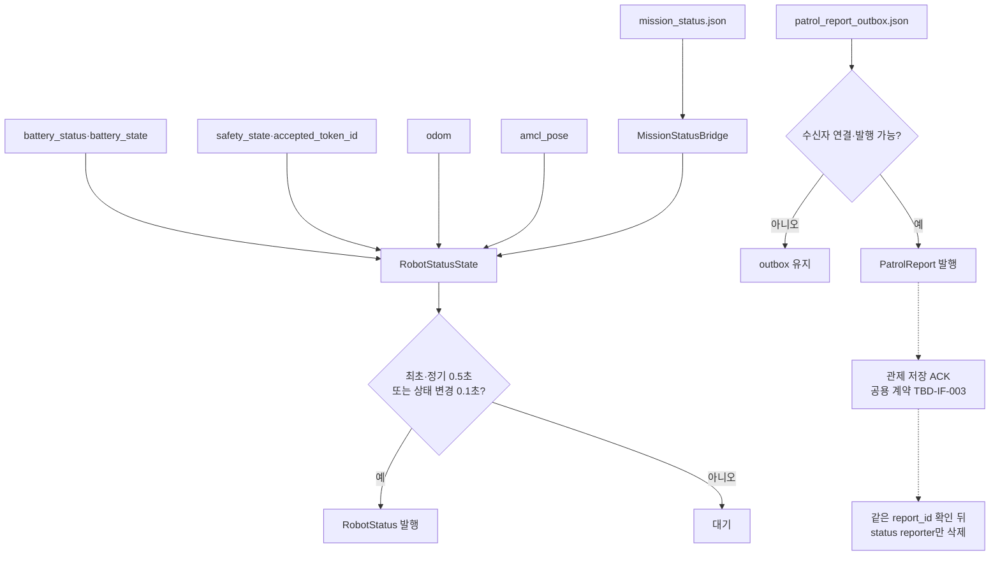
```mermaid
flowchart TD
    BAT[battery_status·battery_state] --> MODEL[RobotStatusState]
    SAFE[safety_state·accepted_token_id] --> MODEL
    ODOM[odom] --> MODEL
    POSE[amcl_pose] --> MODEL
    MISSION[mission_status.json] --> BRIDGE[MissionStatusBridge]
    BRIDGE --> MODEL
    MODEL --> GATE{최초·정기 0.5초<br/>또는 상태 변경 0.1초?}
    GATE -->|예| STATUS[RobotStatus 발행]
    GATE -->|아니오| WAIT[대기]
    OUTBOX[patrol_report_outbox.json] --> SUB{수신자 연결·발행 가능?}
    SUB -->|아니오| RETAIN[outbox 유지]
    SUB -->|예| REPORT[PatrolReport 발행]
    REPORT -.-> ACK[관제 저장 ACK<br/>공용 계약 TBD-IF-003]
    ACK -.-> DELETE[같은 report_id 확인 뒤<br/>status reporter만 삭제]
```

RobotStatus의 다섯 상태 축을 섞지 않는다.

- `operational_state`: 준비·이동·충전·오류 같은 전체 동작 상태
- `mission_state`: 순찰·대피·도킹·일시정지·완료 같은 임무 상태
- `docking_state`: 언도킹·도킹·완료·실패 상태
- `battery_state`: 7개 배터리 enum
- `safety_state`: UNKNOWN·NORMAL·STOPPING·STOPPED·ESTOPPED·ERROR

`STALE`과 `UNREPORTED`는 관제가 판단한다. status reporter가 자체 타이머로 두 상태를 만들어서는 안 된다.

### 3.4 `command_gateway.py`

명령 실행 노드가 아니라 **명령 신원과 확인 응답을 관리하는 입구**다.

쉽게 말하면 관제의 작업 지시가 들어오는 **접수 창구**다. 창구는 직접 로봇을 움직이지 않고 다음 네 가지를 확인한다.

1. 이 지시서가 어느 로봇·어느 mission을 위한 것인지 확인한다.
2. `command_id`를 보고 처음 받은 새 지시인지, 이전 지시의 재전송인지 확인한다.
3. 명령 종류·대상·필드가 공식 규칙에 맞는지 확인한다.
4. 접수했으면 `ACCEPTED`, 실행이 시작됐으면 `EXECUTING`, 실행할 수 없으면 이유를 붙여 `REJECTED`를 돌려준다.

여기서 **명령 신원**은 사람 신원을 뜻하지 않는다. “지금 받은 메시지가 정확히 어느 작업 지시 한 건인가”를 `command_id`, `mission_id`, `robot_id`로 구별한다는 뜻이다. **확인 응답**은 그 지시서의 현재 접수 상태를 `CommandCheck`로 관제에 답하는 것이다.

| 내부 모듈 | 책임 |
|---|---|
| `mission_ingress.py` | MissionCommand wire 필드를 검증 가능한 내부 값으로 복사 |
| `command_store.py` | command ID·payload·상태·완료 결과를 SQLite에 영속 보관하고 Q-14 적용 |
| `command_check.py` | ACCEPTED·EXECUTING·REJECTED 메시지 구성 |
| `report_replay.py` | 완료 command 재수신 시 같은 report ID 재전송 요청 |

`command_id`는 MissionCommand 한 건마다 붙이는 고유한 접수번호다. 예를 들어 `cmd-<관제세션>-robot1-start-0001` 같은 형태다. `mission_id`가 전체 순찰 업무 묶음의 번호라면, `command_id`는 그 안에서 발생한 START·STOP·RESUME 같은 **개별 지시 한 건의 번호**다.

저장 여부를 확인하는 이유는 네트워크에서는 같은 메시지가 다시 올 수 있기 때문이다. 관제가 5초 안에 확인 응답을 못 받으면 같은 ID와 같은 내용으로 최대 2회 재전송한다. AMR이 매번 새 명령으로 생각하면 같은 순찰이나 도킹을 두 번 실행할 수 있으므로, 먼저 저장된 ID를 찾는다.

- 처음 보는 ID: 새 command로 한 번만 접수하고 실행 요청을 만든다.
- 같은 ID·같은 payload: 새로 실행하지 않고 기존 `ACCEPTED` 또는 `EXECUTING` 상태를 다시 알려 준다.
- 같은 ID·다른 payload: 같은 접수번호로 내용이 바뀐 충돌이므로 `REJECTED / COMMAND_ID_CONFLICT`로 거절한다.
- 이미 끝난 ID: 새로 실행하지 않고 기존 `PatrolReport`를 같은 report ID로 다시 보내 달라고 요청한다.

여기서 payload는 command의 **본문 내용**이다. 중복 충돌 비교에는 `robot_id`, `command`, `target_id`, `target_pose`, `mission_id`가 들어간다.

`SQLite`는 별도 DB 서버를 띄우지 않고 하나의 로컬 파일로 사용하는 작은 관계형 데이터베이스다. JSON 메모장보다 검색·중복 제약·transaction 처리가 쉬워 command 접수번호와 상태를 안전하게 관리하기에 적합하다. **영속 보관**은 프로그램 메모리에만 두지 않고 디스크에 저장해, 노드나 PC가 재시작되어도 기억한다는 뜻이다.

영속 보관이 필요한 가장 큰 이유는 재시작 전 받은 command가 다시 왔을 때 중복 실행하지 않기 위해서다. Q-14에 따라 24시간 이내 command는 개수가 많아도 모두 남기고, 24시간이 지난 것 중에서도 최신 1,000개를 남긴다.

```mermaid
flowchart TD
    RX[MissionCommand] --> VALID{robot·command·mission·target·ID 유효?}
    VALID -->|아니오| REJECT[CommandCheck REJECTED]
    VALID -->|예| STORE{command_id가 저장돼 있나?}
    STORE -->|없음| ACCEPT[CommandCheck ACCEPTED]
    ACCEPT --> DISPATCH[mission_dispatch로 MissionCommand 전체 전달]
    STORE -->|같은 ID·같은 payload| CURRENT[기존 ACCEPTED·EXECUTING 재응답]
    STORE -->|같은 ID·다른 payload| CONFLICT[REJECTED / 203]
    STORE -->|이미 완료| REPLAY[기존 PatrolReport 재전송 요청]
    DISPATCH -.-> MISSION[mission_supervisor]
```

명령 중복 보관은 **24시간 이내 전부 + 24시간이 지난 항목 중 최신 1,000개**다. DDS 수신 시각은 command payload 충돌 비교 대상이 아니다. `parameters_json`은 v1.0에서 제거됐고 `target_pose`는 wire 필드만 유지하며 현재 합의된 명령에서는 기본값만 허용한다.

gateway와 mission supervisor의 내부 dispatch 타입·수락 후 EXECUTING 전환·완료 통지는 코드 재정비 전에 하나의 상태 수명으로 확정해야 한다. public `mission_command`를 두 노드가 각각 독립 처리하는 구조로 설계하지 않는다.

## 4. 메시지 사전

### 4.1 외부 공용 메시지

| 메시지 | 방향 | 무엇을 뜻하나 | 핵심 안전 의미 |
|---|---|---|---|
| `MissionCommand` | 관제 → command gateway | 로봇이 수행할 STOP·START·대피·재개·도킹·취소 | token과 별개이며 자체로 안전 게이트를 우회하지 못함 |
| `CommandCheck` | command gateway → 관제 | 명령이 수락·실행·거절됐는지 | 최종 결과가 아니라 명령 확인 |
| `DriveToken` | 관제 → local safety | 어느 로봇이 움직일 권한을 보유하는지 | 5 Hz, lease 1초, 빈 token ID는 회수 |
| `ControlHeartbeat` | 관제 → local safety | 현재 관제 세션이 살아 있는지 | 5 Hz, 1초 초과 미수신 시 정지 |
| `EStop` | Safety Arbiter → local safety | 대상 로봇의 E-stop 활성 여부와 대표 원인 | `robot1`·`robot6`·`all`, 활성 즉시 반영 |
| `RobotStatus` | status reporter → 관제·모니터 | 로봇 현재 상태 snapshot | `safety_state`와 실제 `motion_stopped`를 구분 |
| `PatrolReport` | status reporter → 관제·모니터 | command 하나의 최종 성공·실패·취소 | `UNREPORTED`를 결과 enum에 추가하지 않음 |

### 4.2 내부 표준·간단 메시지

| 토픽/연결 | 타입 | 뜻 |
|---|---|---|
| `battery_state` | `sensor_msgs/BatteryState` | 원본 SOC·충전 상태·센서 유효성 |
| `battery_status` | `std_msgs/UInt8` | battery monitor가 판정한 7개 enum |
| `cmd_vel_safe` | `geometry_msgs/TwistStamped` | Nav2 collision monitor까지 통과한 후보 속도 |
| `cmd_vel` | `geometry_msgs/Twist` | 구동부가 실제 받는 최종 속도 |
| `motion_allowed` | `std_msgs/Bool` | mission Action을 실행해도 되는 권한 상태 |
| `safety_state` | `std_msgs/UInt8` | RobotStatus에 실을 안전 상태 enum |
| `accepted_token_id` | `std_msgs/String` | 비어 있지 않으면 그 token이 현재 유효함 |
| `odom` | `nav_msgs/Odometry` | 실측 속도와 실제 정지 확인 자료 |
| `amcl_pose` | `geometry_msgs/PoseWithCovarianceStamped` | map 위치·시각·covariance |
| `mission_dispatch` | `patrol_interfaces/MissionCommand` | gateway 검증을 통과한 신규 command 전체를 mission owner에게 전달 |
| `mission_status.json` | 로컬 JSON | mission의 현재 상태를 reporter에 전달 |
| `patrol_report_outbox.json` | 로컬 JSON | 아직 전송 완료되지 않은 최종 결과 보관 |

## 5. 내 범위가 아닌 박스

| 박스 | 담당 | 이 작업 공간과의 경계 |
|---|---|---|
| `mission_supervisor`와 `scenarios/` | 박성현 담당 AMR mission·navigation | gateway의 실행 요청을 받고 상태·결과를 돌려줌 |
| Nav2·AMCL·costmap·collision monitor | 박성현 담당 AMR navigation | `cmd_vel_safe`, `amcl_pose`를 제공하고 Action을 수행 |
| Create 3·배터리·LiDAR·odometry driver | AMR 장치 계층 | 최종 `cmd_vel`을 받고 센서 값을 제공 |
| Control Server·Safety Arbiter | 관제 | 명령·token·heartbeat·E-stop을 발행하고 상태·결과를 수신 |
| System monitor | 시스템 모니터 | RobotStatus·PatrolReport를 표시·저장하며 제어 판단을 하지 않음 |
| OAK-D detecting node | 비전 | DetectionCandidate를 만들며 직접 속도나 Nav2 goal을 발행하지 않음 |

Detection yaw 정렬, DetectionEvent·증적, 화재 부저는 AMR 책임과 연결되지만 현재 `amr_patrol_safety` P0 정리 범위에는 넣지 않는다. 관련 계약인 TBD-AMR-001·004·006, TBD-IF-006·007이 결정되고 담당 범위가 추가 승인되면 별도 노드·모듈 그림을 만든다.

## 6. 코드를 재정비하기 전에 문서로 확정할 것

| 항목 | 현재 문서 상태 | 재정비 전 필요한 결정 |
|---|---|---|
| gateway → mission dispatch | 1A로 `mission_dispatch`·MissionCommand 전체 전달 확정 | QoS, 재전송·수신 확인, 중복 실행 방지, EXECUTING 전환 주체 |
| mission → status 상태 전달 | **3A 확정:** 로봇별 `mission_status.json` 최신 snapshot | 현재 코드가 `revision > last_revision` 규칙을 지키는지 보강·시험 |
| PatrolReport 대기열 | **3A 확정:** 로봇별 `patrol_report_outbox.json`, mission만 추가하고 status reporter만 외부 발행·삭제 | 외부 저장 ACK 메시지·주체·QoS는 공용 계약 TBD-IF-003 합의 필요 |
| `cmd_vel_yaw` 중재 | 토픽·타입만 확정 | Nav2 후보와 동시 도착 시 선택·timeout(TBD-AMR-001) |
| 추가 장애물·감속 | 미정 | 거리·감속·센서 실패 정책(TBD-AMR-006) |
| E-stop 상세 clear 원인 | v1.0 밖 | 원인별 활성·해제 조건과 depth(TBD-IF-004) |
| `SAFETY_STOPPING → STOPPED` | enum 의미는 확정, 현재 노드 책임 경계 불명확 | odometry 실제 정지를 누가 판정하고 `safety_state`에 반영할지 단일 소유자 확정 |
| RobotStatus 메시지 정의 | 의미 확정 | 중복 선언된 `SAFETY_*` 상수 한 세트로 정리 승인 |

위 미정값을 임의로 코드에 넣지 않는다. v1.0 범위 밖 항목은 차기 버전으로 남기고, 현재 확정된 token·heartbeat·E-stop·상태 enum만 기준으로 구현한다.

## 7. 기능 단위 테스트 분할안

아래는 아직 시험을 실행했다는 기록이 아니라, 코드를 재정비할 때 사용할 **설계 테스트 목록**이다. 한 번에 실제 로봇을 움직여 보는 방식으로 시작하지 않고, 작은 계산부터 차례로 쌓는다.

### 테스트 환경 원칙 — 2026-09-08 사용자 지정

1. ROS 노드는 Python 함수 호출만으로 끝내지 않는다. 로컬 PC의 격리된 `ROS_DOMAIN_ID`에서 실제 ROS 2 publisher와 subscriber를 실행해 토픽 이름·메시지 타입·QoS·namespace·발행 주기까지 확인한다.
2. TurtleBot 4 또는 Create 3가 실제로 제공하는 상태값은 로컬 시험 publisher 입력을 실제 ROS 통신으로 확인한 후, 실제 로봇에 연결해 같은 시험을 반복한다. 로컬 입력값은 시험용이지만 통신 계층은 mock이 아니라 실제 ROS 2다.
3. 실제 구동 명령을 보내는 시험은 먼저 바퀴를 지면에서 띄우거나 충분히 통제된 공간에서 수행한다. 저속 제한, E-stop, token 회수, heartbeat timeout 정지를 먼저 확인한 뒤 바닥 주행으로 넘어간다.
4. 관제가 만드는 메시지는 TurtleBot 4 센서값이 아니므로 로컬 실제 ROS publisher로 먼저 검증하고, 이후 관제 PC와 AMR PC를 연결한 통합시험으로 반복한다.
5. SQLite·JSON의 중복·재시작 시험은 파일 기능이므로 로컬 임시 경로에서 먼저 검증한다. 실제 로봇에서는 설치 후 쓰기 권한·로봇별 경로 분리·프로세스 재시작 복원만 다시 확인한다.

| 데이터·기능 | 로컬 실제 ROS 통신 시험 | TurtleBot 4 연결 시험 |
|---|---|---|
| `battery_state` | `BatteryState` 실제 publisher를 띄워 callback·QoS·`battery_status` 발행 확인 | 실제 배터리 드라이버 토픽과 타입·QoS를 조회하고 충전·방전·미수신 시 상태 확인 |
| `odom` | 실제 `Odometry` publisher로 속도 경계와 0.5초 유지·신선도 확인 | Create 3 odometry를 받아 정지·이동 시 실제 속도와 `motion_stopped` 확인 |
| `amcl_pose` | 실제 `PoseWithCovarianceStamped` publisher로 frame·timestamp·covariance 확인 | 실제 Nav2·AMCL을 실행해 이동 전후 pose와 `pose_valid` 확인 |
| `cmd_vel_safe` | 실제 `TwistStamped` publisher로 후보값·timestamp·0.5초 timeout 확인 | 실제 Nav2 `collision_monitor` 출력이 local safety에 도착하는지 확인 |
| 최종 `cmd_vel` | 실제 subscriber로 통과값과 `(0,0)`을 관찰 | Create 3 구동부 연결 후 바퀴를 띄운 시험 → 통제된 저속 바닥 주행 순서로 확인 |
| DriveToken·heartbeat·E-stop | 공용 메시지 타입과 실제 QoS를 쓰는 로컬 ROS publisher로 정상·단절·역순 시험 | 관제 또는 시험 publisher를 AMR 네트워크에 연결해 실제 로봇 정지 반응 확인 |
| `RobotStatus` | 실제 subscriber에서 모든 필드·2 Hz·변경 최대 10 Hz 확인 | 실제 battery·odom·AMCL 입력이 RobotStatus에 그대로 반영되는지 관찰 |
| MissionCommand·CommandCheck | 실제 ROS publisher/subscriber로 6종 명령과 중복·거절 확인 | 성현님 mission supervisor와 경계 합의 후 AMR 통합 실행에서 확인 |
| PatrolReport·outbox | 실제 subscriber 연결·해제와 프로세스 재시작으로 동일 report ID 재전송 확인 | AMR 프로세스 재시작과 네트워크 단절·복구에서 결과 유실 여부 확인 |
| SQLite command store | 임시 DB로 중복·충돌·Q-14·재시작 검증 | robot별 영속 경로 권한과 재기동 뒤 중복 방지만 확인 |

| 단계 | 무엇을 시험하나 | ROS·실물 로봇 필요 여부 | 실패했을 때 알 수 있는 것 |
|---|---|---|---|
| 1. 순수 모듈 단위시험 | 숫자·ID·시간을 넣었을 때 판정 결과가 맞는지 | 불필요 | 어느 계산 규칙이 틀렸는지 파일 단위로 찾기 쉬움 |
| 2. 노드 입출력 시험 | 격리 domain에서 실제 ROS publisher/subscriber를 실행하고 예상 토픽이 발행되는지 | ROS 필요, 실물 불필요 | callback·QoS·메시지 변환·발행 주기 문제 |
| 3. 재시작·파일 시험 | 임시 DB/JSON을 사용해 프로세스 재시작 뒤 복원되는지 | ROS는 기능에 따라 선택, 실물 불필요 | 중복 실행·결과 유실·손상 파일 처리 문제 |
| 4. 통합·실기 시험 | 관제·Nav2·드라이버까지 연결해 전체 선이 맞는지 | ROS 필요, 마지막 단계만 실물 필요 | 팀 간 계약·namespace·실제 센서·구동 문제 |

### 7.1 `battery_monitor` 테스트

| 시험 단위 | 넣어 볼 입력 | 기대 결과 | 단계 |
|---|---|---|---|
| SOC 방전 경계 | `present=true`, `DISCHARGING`, SOC 0.099·0.10·0.199·0.20 | 각각 CRITICAL·LOW·LOW·NORMAL. CRITICAL만 즉시, 나머지는 3초 유지 후 전환 | 순수 모듈 |
| SOC 충전 경계 | `present=true`, `CHARGING`, SOC 0.499·0.50·0.799·0.80 | 각각 CHARGING·PATROL_READY·PATROL_READY·FULL, 같은 후보 3초 뒤 전환 | 순수 모듈 |
| 배터리 존재 여부 | `present=false`, SOC는 정상값 | 즉시 UNKNOWN | 순수 모듈·노드 |
| 잘못된 SOC | NaN·무한대·-0.01·1.01 | 즉시 UNKNOWN, 노드가 죽지 않음 | 순수 모듈·노드 |
| 불명확한 충방전 상태 | CHARGING·FULL·DISCHARGING 이외 status | 즉시 UNKNOWN | 순수 모듈·노드 |
| 3초 상태 유지 | 2.999초까지 같은 비긴급 후보, 정확히 3초 도달 | 도달 전에는 이전 상태, 3초에 새 상태 | 순수 모듈 |
| 후보 흔들림 | LOW 2초 → NORMAL → LOW | 첫 LOW 대기시간을 이어 쓰지 않고 두 번째 LOW부터 3초를 다시 셈 | 순수 모듈 |
| 메시지 신선도 | 마지막 수신 후 2.999초·3.0초 | 2.999초는 유지, 3초가 되면 UNKNOWN | 시간 제어 단위시험·노드 |
| 토픽 발행 | 상태 변경과 늦게 시작한 구독자 | 변경된 UInt8 enum을 발행하고 TRANSIENT_LOCAL 구독자가 최신 상태 수신 | ROS 노드 |

### 7.2 `local_safety_supervisor` 테스트

| 시험 단위 | 넣어 볼 입력 | 기대 결과 | 단계 |
|---|---|---|---|
| 시작 기본값 | heartbeat·token·E-stop을 아직 하나도 받지 않음 | `motion_allowed=false`, `cmd_vel=(0,0)`, 신뢰 전 상태는 안전 방향 | 순수 모듈·노드 |
| DriveToken guard | 자기 holder 정상 token, 빈 ID 회수, 1초 lease 경계·초과, 다른 holder, 중복·역순 sequence | 정상 token만 GRANTED, 나머지는 권한 없음. 폐기한 메시지가 lease를 연장하지 않음 | 순수 모듈 |
| Heartbeat guard | 최초 미수신, 정상 5 Hz, 마지막 수신 1.0초·1.001초, 새 control session, 과거 session 재도착 | 1초까지 HEALTHY, 초과 시 EXPIRED. 새 session에서 이전 token 무효 | 순수 모듈 |
| E-stop guard | target이 자기 로봇·`all`·다른 로봇, active true/false, 역순 sequence | 자기와 all만 즉시 반영, 다른 대상과 역순은 상태를 잘못 바꾸지 않음 | 순수 모듈 |
| `motion_allowed` 조합 | heartbeat 정상/비정상 × token 유효/무효 × E-stop 해제/활성 | 세 조건이 모두 좋을 때만 true. 후보 속도 존재 여부는 이 Bool에 영향 없음 | 순수 모듈·노드 |
| 후보 속도 신선도 | 유효 권한에서 후보 age 0.499·0.5·0.501초 | 0.5초까지 후보 그대로, 0.5초 초과는 `(0,0)` | 순수 모듈·노드 |
| 후보 누락·비정상 숫자 | 후보 없음, NaN, 무한대 | 실제 구동 출력은 정지 방향. 잘못된 표본 때문에 안전 노드가 죽지 않음 | 순수 모듈·노드 |
| 차단 원인별 최종 출력 | heartbeat timeout만, token 만료만, E-stop만, 여러 원인 동시 | 어느 한 조건만 실패해도 `(0,0)`이며 원인 로그가 구분됨 | 노드 |
| 발행 타이밍 | 입력 callback 직후, 새 입력 없이 0.1초 timer, 값이 변하지 않은 경우 | 차단은 즉시 반영하고 timeout도 timer가 잡음. 상태 토픽은 값이 바뀔 때 발행 | 노드 |
| 실제 정지와 safety enum | 0 출력 직후, odometry가 정지 경계를 0.5초 충족하기 전·후 | 전에는 STOPPING, 실제 정지 확인 뒤 STOPPED라는 문서 의미 유지 | 책임 경계 확정 후 노드 통합 |
| 최종 발행자 검사 | 실행 중 `/robotN/cmd_vel` publisher 목록 확인 | local safety 하나만 존재. command gateway·mission supervisor의 직접 발행 없음 | ROS 통합 |
| `cmd_vel_yaw` | Nav2 후보와 yaw 후보가 각각·동시에 도착 | TBD-AMR-001 확정 전에는 합격 기준을 만들거나 임의 구현하지 않음 | 보류 |

### 7.3 `status_reporter` 테스트

| 시험 단위 | 넣어 볼 입력 | 기대 결과 | 단계 |
|---|---|---|---|
| 상태 묶기 | battery·safety·token·pose·odom·mission 값을 각각 한 번 입력 | 한 RobotStatus 안의 대응 필드에 값이 정확히 들어감 | 순수 모델·노드 |
| 다섯 상태 축 독립성 | battery만 변경, mission만 변경, docking만 변경 | 바꾼 축만 변하고 다른 상태값을 임의로 덮어쓰지 않음 | 순수 모델 |
| 위치 유효성 | map frame 정상 pose, 잘못된 frame, `pose_valid=false` | 정상 위치만 현재 위치로 인정하고 마지막 유효 위치는 보존 | 순수 모델·노드 |
| 실제 정지 판정 | 선속도 0.05·초과, 각속도 0.1·초과, 0.5초 유지, odom age 0.5·초과 | 모든 경계를 만족할 때만 `motion_stopped=true` | 순수 모델 |
| 발행 주기 | 상태 변화 없음, 상태 연속 변경 | 정기 2 Hz. 변경 발행은 최대 10 Hz를 넘지 않고 sequence 증가 | 가상 시간 단위시험·노드 |
| mission snapshot | 정상 `mission_status.json`, 같은 revision, 손상 JSON | 새 정상 revision만 반영. 손상 파일에서는 마지막 정상 상태 유지와 오류 기록 | 파일·노드 |
| outbox 미연결 | pending report가 있지만 subscriber 없음 | 파일에서 지우지 않고 대기 | 파일·ROS 노드 |
| outbox 발행 실패 | publisher 예외 또는 일시 통신 실패 | pending 유지 후 다음 poll 재시도 | 파일·ROS 노드 |
| 재시작 복원 | pending 저장 후 status reporter 재시작 | 같은 `report_id`와 payload로 재발행 | 재시작·파일 |
| 중복 결과 | 같은 report가 반복 도착 | report ID 기준으로 새 결과를 만들지 않음. 최종 삭제는 TBD-IF-003 ACK 결정 뒤 보강 | 파일·통합 |

### 7.4 `command_gateway` 테스트

| 시험 단위 | 넣어 볼 입력 | 기대 결과 | 단계 |
|---|---|---|---|
| 6종 명령 검증 | STOP·START_PATROL·MOVE_TO_SAFE_ZONE·RESUME_PATROL·DOCK·CANCEL의 정상 mission/target 조합 | 각 정상 조합은 ACCEPTED, 명령별 잘못된 필수값은 REJECTED | 순수 모듈 |
| 신규 command | 처음 보는 유효 `command_id` | DB에 저장, ACCEPTED 한 번, `mission_dispatch`로 MissionCommand 전체 전달 | 순수 모듈·노드 |
| 상태 전이 | 신규 → 실행 시작 → 완료 | ACCEPTED → EXECUTING → COMPLETED 방향만 허용, 역방향 전이 거절 | 순수 모듈 |
| 같은 ID·같은 payload | 실행 전·실행 중 동일 메시지 재수신 | 기존 ACCEPTED·EXECUTING을 다시 응답하되 두 번째 dispatch 없음 | 순수 모듈·노드 |
| 같은 ID·다른 payload | command_id는 같고 command·target·mission 중 하나를 변경 | REJECTED / 203 `COMMAND_ID_CONFLICT`, 기존 DB 행 보존 | 순수 모듈·노드 |
| 완료 ID 재수신 | 이미 PatrolReport까지 저장된 command를 다시 보냄 | 새 실행 없이 기존 report ID의 재전송 요청 | 순수 모듈·노드 |
| 잘못된 로봇·대상 | robot1 gateway에 robot6 명령, 잘못된 patrol plan·dock ID | REJECTED, dispatch 없음 | 순수 모듈·노드 |
| 재시작 중복 방지 | command 저장 뒤 gateway를 재시작하고 같은 명령 전송 | SQLite 복원 후 중복 실행하지 않음 | 재시작·DB |
| Q-14 보존 | 24시간 안쪽 자료 1,000개 초과, 24시간 밖 자료 1,000개 초과 | 24시간 이내는 전부 유지하고 오래된 항목은 최신 1,000개 유지 | DB 단위시험 |
| 두 노드 단일 소유권 | gateway와 mission supervisor를 함께 실행해 command 한 건 발행 | public 명령 처리 owner와 dispatch owner가 하나씩이며 실제 실행도 한 번 | 내부 계약 확정 후 통합 |

### 7.5 마지막 통합 확인

| 흐름 | 시험 방법 | 합격 기준 |
|---|---|---|
| 명령 종단 | 관제에서 START_PATROL 한 건 발행 | ACCEPTED → EXECUTING → 최종 PatrolReport의 세 ID가 원래 command와 일치하고 중복 실행 없음 |
| 안전 종단 | 주행 후보가 나오는 중 token 회수·heartbeat 단절·E-stop을 각각 유도 | 각 조건에서 local safety가 즉시 또는 정해진 timeout에 0을 발행하고 자동 재출발하지 않음 |
| 배터리 종단 | 시험 publisher가 실제 ROS로 BatteryState를 보내 SOC 경계·3초 단절을 유도 | battery_status와 RobotStatus battery 필드가 같은 enum이며 UNKNOWN 전환 일치 |
| 보고 종단 | PatrolReport 생성 시 관제 구독을 끊었다가 복구 | outbox가 결과를 보존하고 같은 report ID로 재전송 |
| 로봇 분리 | robot1·robot6 namespace를 동시에 실행 | 명령·status·속도·DB·JSON 경로가 서로 섞이지 않음 |

실물 주행 전에는 1~3단계가 모두 통과해야 한다. 실물 시험에서는 바퀴를 띄운 상태 또는 충분한 안전 공간에서 최종 `cmd_vel` publisher가 하나인지 먼저 확인하고, E-stop·token 회수·heartbeat timeout의 정지부터 검증한다.

## 8. 문서를 읽는 권장 순서

1. 이 문서 1~2절에서 담당 노드와 전체 선을 본다.
2. 3절에서 자신이 구현할 노드의 내부 모듈만 읽는다.
3. [interfaces.md 2~5·8·9절](interfaces.md)에서 실제 필드·enum·QoS·시간값을 확인한다.
4. [integration.md W-03~05](integration.md#3-종단-동작)에서 배터리·통신·E-stop 종단 흐름을 확인한다.
5. 구현 직전에는 [관제 인터페이스 v1.0](decisions/2026-09-08-control-interface-baseline.md)에서 이번 버전에 포함되는 범위와 차기 버전 TBD를 다시 구분한다.

코드 재정비 후에는 각 노드 flowchart에 실제 클래스, 콜백, publisher/subscriber, 실패·취소·복구 경로와 시험 ID를 추가하고 `구현 대조 완료`로 갱신한다.

## 9. 조정묵·박성현 작업 분리와 공동 테스트

이 절의 사람별 구분은 [미션·내비게이션 구현 대조 문서](../src/patrol_amr/docs/mission_navigation.md)의 “박성현 담당 미션·내비게이션 코드와 조정묵 담당 `local_safety_supervisor`” 경계를 기준으로 한다. 두 사람 모두 AMR 개발 단위지만, 동시에 같은 파일을 수정하지 않도록 패키지와 기능 책임을 나눈다.

### 9.1 조정묵 담당 — `patrol_amr_safety`

| 기능 | 담당 파일 | 책임 |
|---|---|---|
| 배터리 판정 | `battery_monitor.py` | 실제 `BatteryState`를 UNKNOWN·CRITICAL·LOW·NORMAL·CHARGING·PATROL_READY·FULL로 판정 |
| 주행 권한 | `drive_token_guard.py`, `heartbeat_guard.py`, `estop_guard.py` | token·heartbeat·E-stop 메시지 유효성과 timeout 판정 |
| 최종 속도 안전 | `motion_guard.py`, `local_safety_supervisor.py` | `cmd_vel_safe` 후보를 통과시키거나 `(0,0)`으로 차단하고 최종 `cmd_vel` 단독 발행 |
| 상태 모델·발행 | `robot_status_state.py`, `status_reporter.py` | 배터리·위치·odometry·임무·안전 상태를 RobotStatus로 묶고 PatrolReport 발행 |
| 명령 접수·중복 방지 | `command_gateway.py` | MissionCommand 검증, command ID 중복·충돌 방지, CommandCheck 발행 |
| 담당 노드 기동 | `amr_safety_status.launch.py` | robot1·robot6 namespace에서 담당 노드와 remapping 구성 |

`heartbeat_guard.py`는 기능 책임상 조정묵 안전 영역이지만 현재 실제 파일은 `patrol_amr` 패키지에 있다. 소유권 정리 전에는 박성현 파일을 임의로 이동·삭제하지 않고, 두 사람이 이동 방법과 import 전환 시점을 합의한다.

### 9.2 박성현 담당 — `patrol_amr`

| 기능 | 대표 파일 | 책임 |
|---|---|---|
| 임무 총괄 | `mission_supervisor.py`, `mission_config.py` | 임무 노드 구성·수명 관리, 명령·준비 상태·worker 연결 |
| 명령 해석·실행 순서 | `mission_command_parser.py`, `mission_command_callback.py`, `mission_arbiter.py`, `mission_worker.py`, `mission_controller.py` | 명령별 시나리오 선택, 한 번에 하나의 주행 작업 실행, STOP·CANCEL 처리 |
| 순찰 시나리오 | `scenarios/start_patrol.py`, `scenarios/patrol.py`, `scenarios/resume_patrol.py`, `scenarios/safe_zone.py`, `scenarios/docking.py`, `scenarios/interruption.py` | W1~W7 순찰·안전구역 이동·재개·도킹·중단의 실제 순서 |
| Nav2·도킹 연결 | `navigation_adapter.py`, `nav2_goal_runner.py`, `docking_runner.py` | NavigateToPose·Dock Action 전송, 취소, retry, 결과 정규화 |
| 주행 준비 확인 | `robot_readiness.py`, `robot_readiness_callbacks.py`, `motion_gate.py`, `motion_permission.py` | AMCL·LiDAR·odometry·`motion_allowed`를 보고 Action 시작·취소 판단 |
| 임무 진행·종료 결과 생산 | `mission_state.py`, `mission_reporter.py`, `mission_status_store.py` | 현재 임무 snapshot과 command 최종 결과 생성 |
| waypoint·화재 연계 | `waypoint_repository.py`, `fire_event_registry.py`, `audio_note_sequence_adapter.py` | 순찰점 검증과 화재 이벤트·부저 Action 관리 |

박성현 파트는 실제 임무와 Nav2 Action을 실행하지만 최종 `cmd_vel`을 직접 발행하지 않는다. Nav2가 만든 후보는 collision monitor를 거쳐 조정묵 파트의 local safety로 보내야 한다.

### 9.3 현재 두 패키지 사이에 걸쳐 있는 파일

아래 파일은 현재 `patrol_amr`에 있지만 `patrol_amr_safety`가 직접 import한다. 따라서 어느 한쪽이 단독으로 함수나 저장 형식을 바꾸면 상대 코드가 깨질 수 있다.

| 현재 `patrol_amr` 파일 | 사용하는 조정묵 노드 | 정리할 경계 |
|---|---|---|
| `heartbeat_guard.py` | `local_safety_supervisor.py` | 안전 패키지 이동 또는 공용 모듈 유지 방법 |
| `command_check.py`, `command_store.py`, `mission_ingress.py`, `patrol_report.py` | `command_gateway.py` | gateway 소유 모듈과 mission 실행 모듈 분리 |
| `mission_status_store.py` | `status_reporter.py`가 읽기 기능 사용 | **3A 박성현 소유:** mission snapshot schema와 원자 저장 |
| `status_mission_bridge.py` | `status_reporter.py` | **3A 조정묵 소유:** 최신 revision을 RobotStatus로 변환 |
| `patrol_report_outbox.py` | `status_reporter.py`가 읽기·삭제 기능 사용 | **3A 박성현 소유:** mission 최종 결과 추가와 outbox 원자 저장 |
| `patrol_report_adapter.py` | `status_reporter.py` | **3A 조정묵 소유:** PatrolReport 변환·외부 발행·삭제 조건 적용 |

3A로 논리 소유자는 확정했지만 실제 파일은 아직 모두 `patrol_amr`에 있다. 코드 재정비 때 박성현 소유 파일은 그 패키지에 남기고, 조정묵 소유 bridge·adapter는 `patrol_amr_safety`로 옮기는 방향을 기준으로 한다. 이동 전에는 현재 import를 임의로 끊지 않으며, 두 패키지를 함께 고치고 시험할 수 있는 별도 코드 변경 승인을 받는다.

### 9.4 두 파트 사이 메시지 흐름

```mermaid
flowchart LR
    CONTROL[관제 또는 시험 publisher]

    subgraph JM[조정묵 / patrol_amr_safety]
        GW[command_gateway]
        SAFE[local_safety_supervisor]
        STATUS[status_reporter]
    end

    subgraph PSH[박성현 / patrol_amr]
        MS[mission_supervisor]
        SCENARIO[mission worker·scenarios]
        NAV[Nav2·docking adapter]
        RESULT[mission status·completion 생산]
    end

    CONTROL -->|MissionCommand| GW
    GW -->|CommandCheck| CONTROL
    GW -->|mission_dispatch<br/>MissionCommand 전체 전달<br/>1A 기준 확정·구현 전| MS
    MS -->|실행 시작 내부 알림<br/>2A 기준 확정·타입 구현 전| GW
    MS --> SCENARIO
    SCENARIO --> NAV
    NAV -->|cmd_vel_safe / TwistStamped| SAFE
    SAFE -->|motion_allowed / Bool| MS
    SAFE -->|cmd_vel / Twist| ROBOT[TurtleBot 4 Create 3]
    SCENARIO --> RESULT
    RESULT -->|종료 저장 완료 내부 알림<br/>2A 기준 확정·타입 구현 전| GW
    RESULT -->|mission_status.json<br/>3A: 박성현 작성·조정묵 읽기| STATUS
    RESULT -->|patrol_report_outbox.json<br/>3A: 박성현 추가·조정묵 발행| STATUS
    STATUS -->|RobotStatus·PatrolReport| CONTROL
```

실선은 타입과 의미가 정해진 연결이다. `mission_dispatch`는 2026-09-08 사용자 결정 1A, 진행상태 전달은 2A, 두 JSON 파일 경계는 3A로 설계 기준이 확정됐다. 다만 이 결정들이 모두 현재 코드 구조에 반영됐다는 뜻은 아니다.

### 9.5 공동 결정 현황과 쉬운 설명

| 공동 결정 | 쉬운 질문 | 상태 |
|---|---|---|
| 1. MissionCommand 단일 입구 | 관제가 보낸 작업 지시서를 누가 처음 받아 검사할 것인가? | **1A 기준 확정** — `command_gateway`가 유일한 외부 입구 |
| 2. 명령 진행상태 전달 | 접수한 일이 실제로 시작되고 끝났다는 사실을 누가 관제에 알려 줄 것인가? | **2A 기준 확정** — gateway가 CommandCheck 단독 발행 |
| 3. mission 상태·결과 파일 | 성현님이 만든 진행상태와 결과를 어디에 저장하고 누가 읽고 지울 것인가? | **3A 기준 확정** — 로봇별 JSON과 생산자·소비자 단일 소유 |

#### 9.5.1 결정 1 — MissionCommand 단일 입구: 1A 확정

결정일: 2026-09-08  
결정 상태: **기준**  
영향 단위: AMR 조정묵 `patrol_amr_safety`, AMR 박성현 `patrol_amr`

관제가 보내는 `/{robot}/mission_command`는 조정묵의 `command_gateway` 하나만 구독한다. gateway는 접수 창구처럼 명령을 먼저 검사하고 DB에 기록한다. 박성현의 `mission_supervisor`는 외부 `mission_command`를 직접 구독하지 않고, gateway가 검사를 통과시킨 내부 `/{robot}/mission_dispatch`만 받는다.

| 1A 항목 | 쉬운 설명 | 담당 |
|---|---|---|
| 외부 입구 | 관제가 보낸 원본 MissionCommand를 처음 받는 곳이다. 한 곳만 받아야 같은 명령을 서로 다르게 판단하지 않는다. | 조정묵 `command_gateway` |
| 명령 검사 | robot ID, command ID, mission ID, 명령 종류, target이 공식 규칙에 맞는지 본다. | 조정묵 `command_gateway` |
| 중복 검사 | 같은 command ID를 처음 받았는지, 같은 내용의 재전송인지, 같은 ID인데 내용이 바뀐 충돌인지 DB에서 확인한다. | 조정묵 `command_gateway` |
| 내부 전달 | 검사를 통과한 신규 명령의 **전체 MissionCommand**를 `mission_dispatch`로 보낸다. command ID 문자열 하나만 보내지 않는다. | 조정묵 → 박성현 |
| 실제 실행 | 전달받은 명령에 맞는 순찰·안전구역·도킹·중단 시나리오를 선택해 Nav2/Dock Action을 실행한다. | 박성현 `mission_supervisor` |
| 중복 실행 방지 | gateway가 신규 명령만 전달하고 mission 쪽도 같은 command ID를 다시 실행하지 않아야 한다. 메시지가 재전송돼도 실제 임무 효과는 한 번만 발생해야 한다. | 두 사람 공동 |

내부 `mission_dispatch`는 별도 새 공용 메시지를 만들지 않고 기존 `patrol_interfaces/msg/MissionCommand` 타입을 그대로 사용한다. 토픽의 역할만 “관제 원본 입력”과 “검증된 내부 실행 요청”으로 나눈다.

```mermaid
flowchart LR
    CONTROL[관제] -->|/robotN/mission_command<br/>원본 작업 지시서| GW[조정묵 command_gateway]
    GW --> VALID{형식·대상·ID·중복 검사}
    VALID -->|거절| REJECT[실행 요청을 보내지 않음]
    VALID -->|신규·정상| SAVE[SQLite에 먼저 저장]
    SAVE -->|/robotN/mission_dispatch<br/>MissionCommand 전체| MS[박성현 mission_supervisor]
    MS --> RUN[순찰·안전구역·도킹 등 실제 실행]
```

1A 구현 때 바뀌는 부분은 다음과 같다.

- 조정묵: `command_gateway`의 `command_dispatch` String 발행을 전체 `MissionCommand` 발행으로 변경하고 launch·ROS 통신 시험을 추가한다.
- 박성현: `mission_supervisor`의 public `mission_command` 구독을 제거하고 내부 `mission_dispatch` 구독으로 바꾼다.
- 두 사람: gateway 재시작·mission supervisor 재시작·메시지 재전송에도 같은 command ID가 두 번 실행되지 않는지 공동 시험한다.
- 2A로 방향 확정: mission 쪽은 실행 시작·종료 저장 완료를 gateway에 내부 알림하고, gateway는 그 알림을 받아 외부 CommandCheck와 DB 상태를 갱신한다. 내부 알림의 정확한 타입·QoS·재전송 규칙은 구현 명세로 더 적어야 한다.

#### 9.5.2 결정 2 — 명령 진행상태 전달: 2A 확정

결정일: 2026-09-08  
결정 상태: **기준**  
영향 단위: AMR 조정묵 `patrol_amr_safety`, AMR 박성현 `patrol_amr`

이 항목은 어려운 상태 이름을 정하는 문제가 아니라, **한 건의 작업 지시가 지금 어디까지 진행됐는지를 관제에 누가 말해 줄지** 정하는 문제다.

예를 들어 관제가 `START_PATROL` 한 건을 보낸다.

| 실제 상황 | 상태 이름 | 이 사실을 직접 아는 노드 |
|---|---|---|
| gateway가 명령 형식과 중복을 검사하고 DB 저장까지 끝냈지만 아직 로봇은 움직이지 않음 | `ACCEPTED` | 조정묵 `command_gateway` |
| mission supervisor가 명령을 가져가 실제 순찰 worker·Nav2 실행을 시작함 | `EXECUTING` | 박성현 `mission_supervisor` |
| 순찰 command가 성공·실패·취소 중 하나로 끝나 최종 결과가 만들어짐 | 최종 `PatrolReport` | 박성현 mission 실행부가 먼저 알고, 조정묵 `status_reporter`가 외부 발행 |

쉽게 비유하면 다음과 같다.

```text
ACCEPTED  = 식당이 주문서를 확인하고 주문을 접수함
EXECUTING = 주방이 실제로 요리를 시작함
최종 결과 = 음식이 완성됐거나, 실패했거나, 주문이 취소됨
```

gateway는 주문 접수까지만 직접 알 수 있고, 실제 요리를 시작했는지와 끝났는지는 mission supervisor가 알려 줘야 한다. 여기서 정해야 할 핵심 질문은 **관제에 진행상태를 말하는 창구를 gateway 하나로 유지할 것인지**다.

| 선택 | 실제 동작 | 장단점 |
|---|---|---|
| **2A 확정** | gateway가 관제에 CommandCheck를 단독 발행한다. mission supervisor는 “실행 시작”, “종료 결과 저장 완료”를 내부 메시지로 gateway에 알려 준다. | 관제가 믿을 발행자가 하나라 가장 명확함. 내부 상태 알림 계약이 필요함 |
| 2B | gateway는 ACCEPTED, mission supervisor는 EXECUTING을 각각 관제에 직접 발행한다. | 구현은 일부 단순하지만 CommandCheck 발행자가 둘이라 sequence·상태 충돌 위험이 있음 |
| 2C | gateway가 ACCEPTED·REJECTED만 보내고 EXECUTING은 보내지 않는다. | 간단하지만 현재 공식 CommandCheck 진행상태 계약을 충족하지 못함 |

2A의 실제 흐름은 다음과 같다.

```mermaid
flowchart LR
    GW[command_gateway] -->|관제에 ACCEPTED<br/>접수 완료| CONTROL[관제]
    GW -->|mission_dispatch| MS[mission_supervisor]
    MS -->|내부: 실행 시작 알림<br/>2A 기준 확정·타입 구현 전| GW
    GW -->|관제에 EXECUTING<br/>실제 실행 시작| CONTROL
    MS -->|내부: 종료 결과 저장 완료<br/>2A 기준 확정·타입 구현 전| GW
    GW --> DB[command DB를 완료 상태로 기록]
    REPORT[status_reporter] -->|PatrolReport<br/>성공·실패·취소 결과| CONTROL
```

2A에서 각 항목의 담당과 의미는 다음과 같다.

| 2A 항목 | 쉬운 설명 | 담당 |
|---|---|---|
| `ACCEPTED` 판단 | 명령 형식·대상·ID가 정상이고 SQLite 저장까지 끝나 실행 대기 상태가 됐다는 뜻이다. 아직 로봇이 움직였다는 뜻은 아니다. | 조정묵 `command_gateway` |
| `ACCEPTED` 외부 발행 | 접수한 command ID를 `CommandCheck(ACCEPTED)`로 관제에 알려 준다. | 조정묵 `command_gateway` |
| 실행 시작 판단 | mission worker가 command를 실제로 가져가 시나리오 실행을 시작하는 순간이다. gateway는 이 순간을 스스로 알 수 없다. | 박성현 `mission_supervisor`·worker |
| 실행 시작 내부 알림 | “이 command ID를 실제로 실행하기 시작했다”는 정보를 gateway에 보낸다. | 박성현 → 조정묵 |
| `EXECUTING` 기록·외부 발행 | 내부 실행 시작 알림을 받은 뒤 SQLite를 EXECUTING으로 바꾸고 관제에 `CommandCheck(EXECUTING)`을 보낸다. | 조정묵 `command_gateway` |
| 종료 결과 생성 | 실행한 command가 SUCCEEDED·FAILED·CANCELED 중 무엇으로 끝났는지, reason·시각·마지막 waypoint와 함께 만든다. | 박성현 mission 실행부 |
| 종료 결과 안전 저장 | 최종 결과를 outbox에 먼저 저장한다. 저장 전에는 command가 안전하게 완료 기록됐다고 보지 않는다. | 박성현 mission 결과 생산부 |
| 종료 저장 완료 내부 알림 | outbox 저장이 끝난 command ID와 최종 결과 식별정보를 gateway에 알린다. | 박성현 → 조정묵 |
| DB 완료 기록 | 종료 알림을 받은 뒤 SQLite의 command 상태와 재전송용 최종 결과 정보를 완료 상태로 보관한다. | 조정묵 `command_gateway` |
| 최종 결과 외부 발행 | outbox의 결과를 `PatrolReport`로 관제·시스템 모니터에 보낸다. CommandCheck가 아니라 별도 최종 결과 메시지다. | 조정묵 `status_reporter` |

외부 `/{robot}/command_check`의 발행자는 `command_gateway` 하나로 고정한다. 박성현 `mission_supervisor`는 public CommandCheck를 직접 발행하지 않고, 자신만 알 수 있는 실행 시작·종료 사실을 내부 경계로 gateway에 전달한다.

2A로 방향은 확정됐지만 코드 작성 전에 아래 세부 규칙은 더 적어야 한다.

- 실행 시작 내부 알림과 종료 저장 완료 내부 알림의 토픽 이름·메시지 타입
- 같은 내부 알림이 중복되거나 역순으로 왔을 때 command ID·상태를 검증하는 규칙
- `mission_dispatch`를 mission 쪽이 못 받았을 때 재전송하는 조건과 수신 확인 방법
- gateway 또는 mission supervisor 재시작 뒤 ACCEPTED·EXECUTING command를 복구하는 방법
- 종료 알림에 report ID만 보낼지, gateway 재전송용 최종 report payload 전체를 보낼지

#### 9.5.3 결정 3 — mission 상태와 종료 결과 파일: 3A 확정

결정일: 2026-09-08  
결정 상태: **기준**  
영향 단위: AMR 조정묵 `patrol_amr_safety`, AMR 박성현 `patrol_amr`

3A는 두 프로세스 사이를 **로봇별 JSON 파일 두 개**로 연결한다. ROS 내부 토픽이나 양쪽 DB 공유로 바꾸지 않는다.

- `mission_status.json`: 지금 순찰 중인지, 어느 waypoint인지처럼 **현재 진행상태를 적는 화이트보드**다. 한 로봇당 최신 snapshot 한 건만 보관한다.
- `patrol_report_outbox.json`: 이미 끝난 command 결과 중 아직 외부 전달 완료를 보장하지 못한 것을 보관하는 **발송 대기함**이다. 여러 결과가 대기할 수 있다.

| 3A 항목 | 확정 기준 | 쉬운 설명 |
|---|---|---|
| 진행상태 작성자 | 박성현 mission 실행부만 `mission_status.json`을 쓴다. | 실제 임무 진행을 아는 쪽만 화이트보드를 고친다. |
| 진행상태 소비자 | 조정묵 `status_reporter`만 읽어 `RobotStatus`에 반영한다. | reporter는 적힌 내용을 전달할 뿐 임무 상태를 추측하지 않는다. |
| 종료 결과 추가자 | 박성현 mission 결과 생산부만 outbox에 결과를 추가한다. | 일이 끝난 이유와 결과를 실제 실행부가 확정한다. |
| 종료 결과 발행자 | 조정묵 `status_reporter`만 pending 결과를 `PatrolReport`로 보낸다. | 외부로 보내는 우편 배달 창구를 하나로 둔다. |
| outbox 삭제자 | 조정묵 `status_reporter`만 동일 `report_id`의 전달 완료를 확인한 뒤 삭제한다. | mission 쪽은 배달 여부를 추측해 지우지 않는다. |
| 저장 방식 | 두 파일 모두 임시 파일 작성·flush·`fsync`·원자 교체를 사용한다. outbox는 잠금도 사용한다. | 저장 도중 전원이 꺼져 반쪽 JSON이 되는 위험을 줄인다. |

기본 저장 경로도 로봇별로 고정한다. `ROS_HOME`을 따로 지정하지 않았다면 실제 기본값은 아래와 같다. launch에서 경로를 덮어쓸 수는 있지만, 같은 로봇의 mission supervisor와 status reporter에는 반드시 같은 절대 경로를 넣어야 한다.

```text
~/.ros/patrol_amr/robot1/mission_status.json
~/.ros/patrol_amr/robot1/patrol_report_outbox.json

~/.ros/patrol_amr/robot6/mission_status.json
~/.ros/patrol_amr/robot6/patrol_report_outbox.json
```

`mission_status.json`의 기준 schema는 `schema_version=1`과 아래 snapshot 필드다.

| 필드 | 뜻 |
|---|---|
| `mission` | 현재 임무 상태 이름. 예: PATROLLING·PAUSED·DOCKING·COMPLETED에 대응하는 내부 이름 |
| `waypoint_index`, `last_waypoint_index` | 현재 waypoint와 마지막으로 진행한 waypoint 순번 |
| `command_id`, `mission_id` | 현재 실행 중인 작업 지시와 임무의 식별자 |
| `outcome`, `reason_code`, `reason` | 종료·일시정지 결과와 그 이유 |
| `updated_monotonic_s` | 로봇 프로세스의 monotonic 시계로 기록한 마지막 변경 시각 |
| `revision` | 내용이 바뀔 때마다 1씩 증가하는 snapshot 번호 |

revision 규칙은 **새 파일의 `revision`이 마지막 적용값보다 클 때만 반영**하는 것이다. 같은 revision은 같은 snapshot의 반복 읽기이므로 무시하고, 더 작은 revision은 오래된 파일이 되돌아온 것이므로 무시하고 오류를 기록한다. 현재 `status_mission_bridge.py`는 같은 revision만 무시하므로, 더 작은 revision 거절은 코드 재정비 항목이다.

`patrol_report_outbox.json`의 기준 schema는 `schema_version=1`, 세션별 다음 번호인 `next_sequences`, 미전송 결과 모음인 `pending`이다. pending 한 건은 최소한 다음 정보를 보존한다.

| 정보 | 뜻 |
|---|---|
| `report_id`, `report_sequence`, `source_session_id` | 재시작·재전송에도 같은 결과를 식별하고 순서를 확인하는 값 |
| `robot_id`, `command_id`, `mission_id` | 어느 로봇의 어떤 작업 결과인지 식별하는 값 |
| `result`, `reason_code`, `reason` | SUCCEEDED·FAILED·CANCELED 결과와 이유 |
| `started_at_ns`, `finished_at_ns` | 작업 시작·종료 시각 |
| `final_waypoint_id`, `related_event_ids` | 마지막 waypoint와 연결된 감지 이벤트 목록 |

파일이 없으면 아직 기록이 없는 정상 시작으로 본다. JSON 문법, schema version 또는 필수 필드가 손상됐으면 자동으로 빈 파일을 덮어쓰거나 삭제하지 않는다. `mission_status.json`은 마지막으로 적용한 정상 snapshot을 유지하고 오류를 남긴다. outbox는 발행·삭제를 중단하고 원본을 보존해 결과 유실을 막는다.

```mermaid
flowchart LR
    MISSION[박성현 mission 실행부] -->|revision 증가·원자 교체| STATUS_FILE[(robot별 mission_status.json)]
    STATUS_FILE -->|더 큰 revision만 읽기| REPORTER[조정묵 status_reporter]
    MISSION -->|command 최종 결과 추가| OUTBOX[(robot별 patrol_report_outbox.json)]
    OUTBOX -->|pending을 같은 report_id로 발행| REPORTER
    REPORTER -->|RobotStatus·PatrolReport| RECEIVER[관제·시스템 모니터]
    RECEIVER -.->|저장 ACK<br/>TBD-IF-003 공용 합의 필요| REPORTER
    REPORTER -.->|같은 report_id ACK 뒤 삭제| OUTBOX
```

3A에서 **누가 삭제할지**는 status reporter 하나로 확정했다. 그러나 **무슨 외부 메시지를 ACK로 쓸지, 관제와 시스템 모니터 중 누가 ACK할지, 둘 다 필요한지**는 AMR 두 사람만 정할 수 없는 공용 인터페이스다. 따라서 이 마지막 선은 TBD-IF-003으로 남기고 관제·시스템 모니터 합의 전에는 확정 계약이라고 부르지 않는다. 현재 코드의 “구독자 연결 상태에서 publish 호출이 성공하면 즉시 삭제”는 현 구현일 뿐 3A의 최종 전달 보장 기준은 아니다.

3A 코드 재정비 때 파일 위치는 다음처럼 정리한다.

- 박성현 `patrol_amr` 유지: `mission_status_store.py`, `patrol_report_outbox.py`
- 조정묵 `patrol_amr_safety`로 이동: `status_mission_bridge.py`, `patrol_report_adapter.py`
- 두 사람 공동 시험: 경로 일치, revision 역행, 손상 JSON, 동시 접근, 재시작 후 같은 `report_id` 재발행

결정 1A가 코드에 반영되기 전에는 두 노드를 동시에 production 명령 소유자로 기동하지 않는다. 현재 `command_dispatch` String은 1A 기준의 `mission_dispatch` 전체 MissionCommand로 교체해야 한다. 1A·2A·3A는 문서 설계 기준 확정이며, 코드 반영 완료를 뜻하지 않는다.

### 9.6 각자 먼저 끝내야 하는 단독 테스트

| 담당 | 공동 테스트 전에 단독 통과할 항목 |
|---|---|
| 조정묵 | battery 경계·미수신, token lease·회수, heartbeat timeout, E-stop 대상·sequence, 후보 0.5초, 최종 0 출력, RobotStatus 실제 정지, gateway 중복·SQLite 재시작, outbox 보존 |
| 박성현 | 6종 MissionCommand 해석, mission arbiter 단일 실행, W1~W7 순서·checkpoint, Nav2 retry·cancel, 안전구역 선택, Dock Action·timeout, mission status·종료 결과 생성 |

단독 시험은 순수 함수 시험으로 끝내지 않는다. 각 담당 노드는 로컬 격리 `ROS_DOMAIN_ID`에서 실제 ROS publisher/subscriber를 사용한 smoke test까지 통과해야 공동 시험으로 넘어간다.

### 9.7 두 사람이 함께 할 로컬 실제 ROS 시험

| ID | 시험 | 조정묵 준비 | 박성현 준비 | 합격 기준 |
|---|---|---|---|---|
| JT-01 | ROS graph·단일 소유자 | gateway·local safety·status reporter 기동 | mission supervisor·Nav2 test adapter 기동 | `/robotN/cmd_vel` publisher는 local safety 1개, public MissionCommand 처리 owner도 1개 |
| JT-02 | 정상 START_PATROL | 정상 명령을 ACCEPTED하고 1회 dispatch | dispatch를 받아 mission 1회 시작 | command ID·mission ID·robot ID가 전 구간 일치, 중복 실행 없음 |
| JT-03 | 잘못된·중복 명령 | 잘못된 target 거절, 같은 ID 중복 억제 | 거절 command 미실행, 중복 dispatch 미실행 | REJECTED 명령은 Nav2 goal 0건, 동일 재전송도 실행 1회 이하 |
| JT-04 | `motion_allowed` 취소 | token·heartbeat·E-stop 조합으로 true→false 발행 | false 수신 시 활성 Nav2·Dock Action 취소 | Action 취소와 local `cmd_vel=(0,0)`이 둘 다 확인됨 |
| JT-05 | token 회수·만료 | 빈 token 또는 1초 lease 만료, 최종 속도 차단 | 활성 임무를 CANCELED 처리하고 자동 재개 금지 | 새 token과 새 MissionCommand 전까지 재출발 없음 |
| JT-06 | heartbeat·E-stop | heartbeat 1초 초과와 E-stop 활성·해제 생성 | `motion_allowed=false`에 따라 작업 취소 | 차단 즉시 0 출력, 해제·heartbeat 복구만으로 자동 재출발 없음 |
| JT-07 | Nav2 후보 속도 | `cmd_vel_safe` 정상·0.5초 stale를 받아 최종 출력 | 실제 ROS `TwistStamped` 시험 후보 제공 | 정상 후보는 그대로 통과, 0.5초 초과·중단은 0 출력 |
| JT-08 | 임무 상태 보고 | mission snapshot을 RobotStatus에 반영 | PATROLLING·PAUSED·DOCKING·COMPLETED snapshot 생성 | active IDs와 mission state가 같은 revision으로 RobotStatus에 나타남 |
| JT-09 | 종료 결과 보고 | outbox drain과 PatrolReport 발행 | SUCCEEDED·FAILED·CANCELED 결과를 각각 생성 | 세 결과가 ID·reason·시각을 보존하고 미연결 시 유실되지 않음 |
| JT-10 | 프로세스 재시작 | SQLite·outbox·status reporter 재시작 복원 | mission checkpoint·state 복원 | 같은 command가 두 번 실행되지 않고 pending report는 같은 ID로 재전송 |
| JT-11 | STOP과 CANCEL 차이 | 각 command 접수·확인 | STOP은 checkpoint 보존, CANCEL은 mission 종료·checkpoint 제거 | STOP 후 RESUME 가능, CANCEL 후 같은 mission RESUME 거절 |

이 단계의 센서·관제 입력은 시험 publisher가 만들 수 있지만 전송은 mock 함수가 아니라 실제 ROS 2 토픽·타입·QoS를 사용한다. Nav2 Action도 가능하면 test action server/client로 실제 ROS Action 통신을 사용한다.

### 9.8 두 사람이 함께 할 TurtleBot 4 연결 시험

| ID | 시험 순서 | 확인할 실제 값 | 합격 기준 |
|---|---|---|---|
| RT-01 | 연결 후 읽기 전용 확인 | 실제 `battery_state`, `odom`, `amcl_pose`, Nav2 lifecycle, 토픽 타입·QoS | robot namespace와 launch remapping이 실제 장비 토픽에 맞음 |
| RT-02 | 바퀴를 띄운 정상 후보 시험 | collision monitor의 실제 `cmd_vel_safe`, Create 3가 받는 `cmd_vel` | token·heartbeat·E-stop 정상일 때만 후보가 전달됨 |
| RT-03 | 바퀴를 띄운 안전 차단 | token 회수·lease 만료·heartbeat timeout·E-stop 각각 | local safety가 0을 발행하고 mission supervisor가 활성 Action을 취소 |
| RT-04 | 저속 START_PATROL | AMCL pose, W1~W7 목표, 실제 odom, RobotStatus | goal 순서와 상태 보고가 일치하고 최종 `cmd_vel` publisher가 하나 |
| RT-05 | 저속 STOP→RESUME | checkpoint, 실제 정지, 새 token·새 RESUME command | 실제 정지 확인 후에만 재개하고 이전 waypoint 진행상태 유지 |
| RT-06 | 저속 CANCEL | Nav2 cancel 결과, mission 상태, PatrolReport | 자동 재개 없이 CANCELED 결과와 reason이 저장·발행됨 |
| RT-07 | 도킹 | Dock Action, 접점 상태, 실제 BatteryState CHARGING/FULL | DOCKED와 CHARGING이 2초 연속일 때만 성공 보고 |
| RT-08 | 네트워크 단절·재연결 | heartbeat timeout, outbox, SQLite, checkpoint | 로봇 정지, 자동 재출발 없음, 재연결 후 결과 유실·중복 실행 없음 |

RT-01은 움직이지 않는 시험이다. RT-02·03은 바퀴를 지면에서 띄우거나 동등한 안전 조치를 한 뒤 수행한다. RT-04 이후만 통제된 공간에서 저속 바닥 주행으로 진행한다. 실제 관제 구현이 아직 없으면 관제 메시지는 실제 ROS 시험 publisher로 보내고, AMR 두 사람의 연결이 통과한 뒤 관제 팀과 같은 항목을 다시 수행한다.

### 9.9 공동 시험 진행 순서와 중단 기준

1. 두 사람 단독 단위시험과 로컬 ROS smoke를 모두 통과한다.
2. 9.5절 세 가지 내부 계약을 문서로 확정한다.
3. JT-01에서 publisher·subscriber 수와 타입·QoS를 확인한다.
4. JT-02~03 명령 접수·중복을 확인한다.
5. JT-04~07 안전 취소와 속도 경로를 확인한다.
6. JT-08~11 상태·결과·재시작을 확인한다.
7. RT-01 읽기 전용 장비 연결을 확인한다.
8. RT-02~03 바퀴 비접지 안전 시험을 통과한다.
9. RT-04~08 저속 실주행·도킹·단절 복구를 확인한다.

어느 단계든 `/robotN/cmd_vel` publisher가 둘 이상이거나, token·heartbeat·E-stop 차단 중 0이 나오지 않거나, 같은 command ID가 두 번 실행되면 즉시 다음 단계로 넘어가지 않는다. 실제 시험 결과에는 일자·robot ID·두 패키지 버전·ROS domain·입력값·관측값·로그 경로를 함께 기록한다.
</details>
