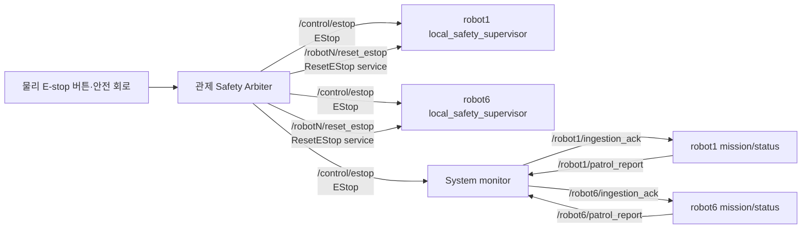
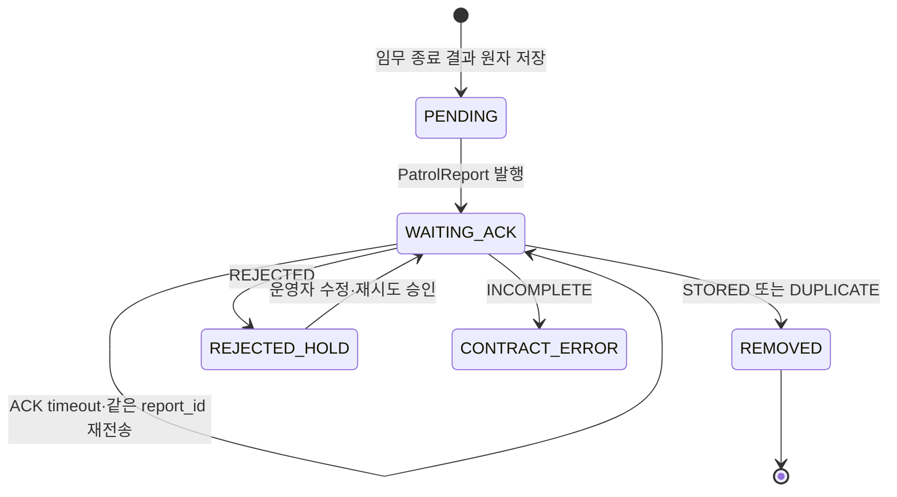

# [AMR] E-stop reset과 PatrolReport 저장 ACK 인터페이스 명세

- 상태: 부분 확정 — PatrolReport ACK는 AMR 결정·관제/System monitor 검토 요청, E-stop reset은 초안
- 최초 작성 시각: 2026-09-08 13:54 KST
- 요청자: 박성현
- 요청 단위: AMR
- 대상 단위 및 로봇: 관제·System monitor·AMR / robot1·robot6
- 관련 TBD ID: TBD-IF-003, TBD-IF-004
- 기준 문서·절: [interfaces.md 3.1·5·9절](../interfaces.md), [integration.md IT-11·IT-12](../integration.md), [기존 PatrolReport ACK 검토 요청서](CR-AMR_09-08_10-42_PatrolReport_ACK와_큐_삭제_조건_검토.md)
- 결정 일자·근거: E-stop 활성 즉시 정지와 PatrolReport 영속 outbox·동일 report ID 재전송은 기존 기준이다. 2026-09-09 사용자는 5절의 ACK 계약을 AMR 요청안으로 확정했다. E-stop reset 부분은 영향 팀 합의 전 **제안**이다.
- 코드 변경 승인 근거·범위: 이 요청은 인터페이스 명세서 작성만 승인됐다. 공용 메시지·관제·System monitor·AMR 실행 코드 변경은 미승인이다.

## 1. 목적과 상태 구분

이 문서는 다음 두 종단 동작을 팀 간 계약으로 확정하기 위한 제안서다.

1. 물리 E-stop이 해제 신호만으로 자동 복구되지 않도록 robot별 수동 reset 경로를 정의한다.
2. AMR이 발행한 PatrolReport를 System monitor가 실제 저장한 뒤 ACK를 보내고, AMR은 그 ACK를 확인한 뒤에만 영속 outbox에서 제거한다.

| 구분 | 내용 |
|---|---|
| 기준 | `/control/estop` 단일 발행자, 활성 즉시 정지, 물리 원인은 수동 reset까지 latch |
| 기준 | `/{robot}/patrol_report`와 동일 `report_id` 재전송, 수신자 중복 제거 |
| 구현 관찰 | AMR은 `patrol_interfaces/msg/EStop`을 구독한다 |
| 구현 관찰 | System monitor는 현재 같은 `/control/estop`을 `EStopState`로 구독해 ROS 타입이 일치하지 않는다 |
| 구현 관찰 | System monitor는 `/{robot}/ingestion_ack` publisher와 `IngestionAck` 메시지를 이미 구현했다 |
| 구현 관찰 | AMR은 ACK를 구독하지 않고 DDS publish 호출 성공 직후 pending report를 제거한다 |
| 제안 | `/control/estop` 타입을 `EStop` 하나로 통일하고 robot별 `reset_estop` 서비스를 추가한다 |
| 제안 | `IngestionAck.STORED` 또는 `DUPLICATE`를 받은 뒤에만 PatrolReport를 outbox에서 제거한다 |

문서에 **제안**이라고 표시한 이름·필드·timeout은 관제·System monitor 검토와 합의 후 `interfaces.md`에 반영해야 확정 계약이 된다.

## 2. 전체 노드 흐름



## 3. E-stop 상태 인터페이스

### 3.1 `/control/estop`

| 항목 | 명세 |
|---|---|
| 토픽 | `/control/estop` |
| 타입 | `patrol_interfaces/msg/EStop` |
| 발행자 | Safety Arbiter 단일 노드 |
| 수신자 | robot1·robot6 `local_safety_supervisor`, System monitor |
| QoS | `RELIABLE / TRANSIENT_LOCAL / KEEP_LAST(1)` |
| 적용 시점 | `active=true` 수신 즉시 로컬 안전 정지 |
| 대상 | `robot1`, `robot6`, 전체 대상 문자열은 합의 필요 |
| 재출발 | E-stop 해제만으로 금지. 새 DriveToken과 별도 MissionCommand가 모두 필요 |

현재 공용 메시지 필드는 다음과 같다.

```text
std_msgs/Header header
string target_robot_id
bool active
uint8 reason
bool latched
uint64 sequence
```

필드 의미:

| 필드 | 규칙 |
|---|---|
| `header.stamp` | Safety Arbiter가 상태를 결정한 ROS 시각 |
| `target_robot_id` | 해당 로봇만 상태를 적용한다. 다른 robot ID는 상태에 반영하지 않는다 |
| `active` | `true`이면 즉시 정지, `false`이면 원인이 제거됐음을 뜻한다 |
| `reason` | 원인 enum. 숫자 배정은 TBD-IF-004에서 합의한다 |
| `latched` | 물리 E-stop 등 수동 reset이 필요한 상태면 `true` |
| `sequence` | Safety Arbiter가 발행 순서대로 증가시킨다. 중복·역순 메시지는 거절한다 |

### 3.2 공용 타입 충돌 해소 제안

같은 `/control/estop`에 AMR은 `EStop`, System monitor는 `EStopState`를 사용하고 있다. ROS 2에서는 토픽 이름이 같아도 타입 해시가 다르면 연결되지 않는다.

권장안은 다음과 같다.

- `/control/estop`의 유일한 wire 타입은 `patrol_interfaces/msg/EStop`으로 정한다.
- System monitor는 `EStop.active`, `reason`, `latched`, `sequence`를 화면·DB 필드로 변환한다.
- `EStopState`를 내부 화면 모델로 유지할 수는 있지만 `/control/estop`의 ROS 타입으로 사용하지 않는다.
- 별도 상태 토픽이 필요하다면 이름·발행자·필요성을 다시 합의한다. 같은 토픽에 두 타입을 두지 않는다.

### 3.3 Safety Arbiter 재시작 처리 제안

현재 `EStop`에는 발행자 session 필드가 없어 Safety Arbiter 재시작 후 `sequence=1`로 돌아가면 AMR이 역순 메시지로 거절할 수 있다. 다음 두 방법 중 하나를 합의해야 한다.

1. **권장:** `EStop`에 `string source_session_id`를 추가하고 `safety-<YYYYMMDDTHHMMSS>[-<restart_sequence>]` 형식을 사용한다. AMR은 새 session을 수락하면서 이전 session을 폐기한다.
2. `sequence`를 관제 디스크에 영속 저장하고 프로세스 재시작 뒤에도 계속 증가시킨다.

안전 상태의 재시작 경계를 메시지 자체에서 식별할 수 있으므로 1안을 권장한다. 공용 `.msg` 변경이므로 관제·System monitor·AMR을 동시에 반영해야 한다.

## 4. 물리 E-stop 수동 reset 서비스

### 4.1 서비스 이름과 책임

| 항목 | 제안 명세 |
|---|---|
| robot1 서비스 | `/robot1/reset_estop` |
| robot6 서비스 | `/robot6/reset_estop` |
| 타입 | `patrol_interfaces/srv/ResetEStop` 신규 추가 |
| 서버 | 각 로봇의 `local_safety_supervisor` |
| 클라이언트 | Safety Arbiter 또는 승인된 로컬 조작 노드 |
| 응답 timeout | 1초 |
| 반복 요청 | 동일 `request_id`는 같은 결과를 반환하는 멱등 처리 |

권장 서비스 필드:

```text
# Request
string request_id
string robot_id
string requested_by
string source_session_id
uint64 expected_estop_sequence
---
# Response
bool accepted
uint8 result_code
string detail
uint64 reset_sequence

uint8 RESET=0
uint8 ALREADY_RESET=1
uint8 ESTOP_STILL_ACTIVE=100
uint8 SESSION_MISMATCH=101
uint8 SEQUENCE_MISMATCH=102
uint8 UNAUTHORIZED=103
uint8 INTERNAL_ERROR=104
```

### 4.2 reset 승인 조건

AMR은 다음 조건을 모두 만족할 때만 로컬 latch를 해제한다.

1. 요청의 `robot_id`가 서비스 namespace의 robot ID와 같다.
2. 요청 주체가 합의된 승인 주체다.
3. 가장 최근에 수락한 E-stop의 `active=false`다.
4. `source_session_id`와 `expected_estop_sequence`가 가장 최근 E-stop과 일치한다.
5. 물리 버튼·안전 회로가 해제됐다는 판단은 Safety Arbiter가 책임진다.

reset 성공은 주행 승인이 아니다. reset 후에도 AMR은 정지 출력을 유지하며 Safety Arbiter의 `active=false, latched=false` 상태, 새 DriveToken, 새 MissionCommand를 모두 확인한 뒤에만 새 이동을 시작한다.

```mermaid
flowchart TD
    A[active=true 또는 latched=true] --> STOP[최종 cmd_vel 0]
    STOP --> RELEASE[물리 버튼·원인 해제]
    RELEASE --> STATE[Safety Arbiter: active=false, latched=true]
    STATE --> RESET[/robotN/reset_estop 요청]
    RESET --> CHECK{robot·권한·session·sequence<br/>최신이며 active=false인가?}
    CHECK -->|아니오| DENY[거절·정지 유지]
    CHECK -->|예| CLEAR[AMR local latch 해제]
    CLEAR --> FINAL[Safety Arbiter: active=false, latched=false]
    FINAL --> HOLD[정지 유지]
    HOLD --> GATE{새 DriveToken + 새 MissionCommand?}
    GATE -->|아니오| HOLD
    GATE -->|예| MOVE[새 임무 주행 허용]
```

## 5. PatrolReport 저장 ACK 인터페이스 — AMR 확정 요청안

### 5.1 토픽과 역할

| 항목 | 제안 명세 |
|---|---|
| 입력 보고 | `/{robot}/patrol_report`, `patrol_interfaces/msg/PatrolReport` |
| ACK 토픽 | `/{robot}/ingestion_ack` |
| ACK 타입 | `patrol_interfaces/msg/IngestionAck` |
| 보고 발행자 | 해당 robot의 `status_reporter` |
| 저장·ACK 발행자 | System monitor 단일 저장 어댑터 |
| ACK 수신자 | 해당 robot의 `status_reporter` |
| QoS | 양방향 모두 `RELIABLE / VOLATILE / KEEP_LAST(20)` |
| 상관관계 키 | `IngestionAck.source_message_id == PatrolReport.report_id` |

System monitor가 현재 구현한 `IngestionAck` 필드를 그대로 사용한다.

```text
std_msgs/Header header
string message_id
string robot_id
uint8 entity_type
string source_message_id
string entity_id
uint8 status
uint32[] missing_chunks
string detail
```

PatrolReport ACK의 필드 매핑:

| ACK 필드 | PatrolReport 적용 규칙 |
|---|---|
| `message_id` | ACK 자체의 고유 ID. AMR은 불투명 문자열로 취급한다 |
| `robot_id` | ACK 토픽의 `{robot}` 및 pending report의 `robot_id`와 같아야 한다 |
| `entity_type` | 반드시 `PATROL_REPORT=1` |
| `source_message_id` | 반드시 원본 `PatrolReport.report_id` |
| `entity_id` | System monitor 내부 저장 엔터티 ID. 진단용이며 AMR 상관관계 키로 사용하지 않는다 |
| `status` | `STORED`, `DUPLICATE`, `INCOMPLETE`, `REJECTED` 중 하나 |
| `missing_chunks` | PatrolReport에는 사용하지 않으며 빈 배열이어야 한다 |
| `detail` | 저장·중복·거절 원인의 짧은 진단 문자열, 최대 240자 |

### 5.2 outbox 상태 전이와 삭제 조건



| ACK 상태 | System monitor 의미 | AMR 처리 |
|---|---|---|
| `STORED=0` | DB commit 완료 | 해당 `report_id`를 outbox에서 제거 |
| `DUPLICATE=1` | 같은 `report_id`가 이미 동일 내용으로 저장됨 | 저장 완료와 동일하게 제거 |
| `INCOMPLETE=2` | chunk형 데이터 일부 누락 | PatrolReport에서는 계약 오류로 기록하고 제거하지 않음 |
| `REJECTED=3` | 검증 실패 또는 저장 실패 | 제거하지 않고 재시도 보류·운영 오류 보고 |

AMR은 다음 ACK를 무시하고 경고 로그만 남긴다.

- 다른 robot ID
- `entity_type != PATROL_REPORT`
- pending outbox에 없는 `source_message_id`
- 토픽 namespace와 메시지 `robot_id`가 다른 ACK
- enum 범위를 벗어난 ACK

### 5.3 재전송 제안

- 첫 발행 이후 ACK가 없으면 같은 `report_id`와 같은 payload를 다시 발행한다.
- 재전송 간격은 1초이며 최대 횟수 없이 영속 보관한다.
- 30초 동안 ACK가 없으면 RobotStatus 또는 관제 운영 경고에 `REPORT_ACK_TIMEOUT`을 표시하는 방식을 별도 합의한다.
- 재시작 후에도 outbox의 원본 payload와 `report_id`를 복구한다.
- System monitor는 `report_id`에 unique 제약 또는 동등한 중복 제거를 적용한다.
- `DUPLICATE`는 기존 저장 내용이 동일할 때만 반환한다. 같은 ID에 다른 payload가 오면 `REJECTED`를 반환한다.

1초 재전송, 30초 경고와 무기한 영속 보관은 2026-09-09 AMR 요청안이다. 관제·System monitor 회신 전에는 팀 간 합의 완료로 표시하지 않는다.

## 6. 혼합 버전과 적용 순서

현재 System monitor에는 ACK publisher가 있지만 AMR에는 ACK subscriber가 없다. 다음 순서로 적용한다.

1. 공용 `interfaces.md`에 `/control/estop`, reset 서비스, `/{robot}/ingestion_ack` 계약을 합의한다.
2. `patrol_interfaces`에 합의된 `EStop` 변경과 `ResetEStop.srv`를 반영한다.
3. System monitor의 `/control/estop` subscriber 타입을 `EStop`으로 통일하고 PatrolReport ACK 필드 매핑을 검증한다.
4. 관제 Safety Arbiter에 source session·sequence와 수동 reset 요청을 구현한다.
5. AMR에 reset 서비스와 ACK subscriber를 구현한다.
6. ACK 방식 활성화 전 System monitor publisher가 실제로 연결되는지 확인한다.
7. robot1·robot6 각각 IT-11·IT-12 종단시험을 수행한다.

ACK 기능을 한 번 활성화한 뒤에는 subscriber 연결 여부나 DDS publish 성공만으로 report를 제거하지 않는다. 구버전 System monitor와 혼합 실행해야 한다면 launch parameter로 ACK 필수 모드를 명시하고, ACK 미지원 상태를 자동 추정하지 않는다.

## 7. 요청 작업

| 대상 단위 | 필요한 변경·검토 | 대상 경로 또는 기능 | 담당 |
|---|---|---|---|
| AMR | `reset_estop` service server, local latch reset, `ingestion_ack` subscriber, ACK 기반 outbox 상태 전이 | `local_safety_supervisor`, `estop_guard`, `status_reporter`, report outbox | 박성현·조정묵 협의 |
| 관제 | EStop source session·sequence, 물리 해제 확인, robot별 reset client, 새 token·command 재개 절차 | Safety Arbiter·Control Server | 관제 담당 |
| System monitor | `/control/estop`을 `EStop`으로 통일, PatrolReport ACK의 `source_message_id=report_id` 보장 | ROS adapter·저장 서비스 | System monitor 담당 |
| 공용 인터페이스 | `EStop` 재시작 경계, `ResetEStop.srv`, IngestionAck 토픽·필드·QoS를 합의 후 반영 | `patrol_interfaces`, `interfaces.md` | 영향 팀 공동 |
| 비전 | 해당 없음. E-stop reset과 PatrolReport 저장 경로에 참여하지 않음 | 해당 없음 | 해당 없음 |

## 8. 영향과 실패 시 안전 동작

- E-stop 상태 타입이 일치하지 않으면 AMR과 System monitor 중 한쪽이 안전 상태를 받지 못한다. 타입 통일 전에는 통합 완료로 표시하지 않는다.
- reset 요청 timeout·거절·서버 부재 시 AMR은 latch와 정지 출력을 유지한다.
- E-stop reset 성공 후 token이나 mission이 없으면 정지 상태를 유지한다.
- ACK 유실 시 같은 report ID가 반복될 수 있으므로 System monitor 저장은 멱등이어야 한다.
- System monitor DB 장애 시 `REJECTED`를 보내며 AMR은 원본 report를 보존한다.
- outbox 손상 시 파일을 자동 초기화해 결과를 버리지 않고 오류 상태로 전환한다.
- robot1 ACK로 robot6 pending report를 제거할 수 없다.

## 9. 단위별 반영 상태

| 단위·로봇 | 상태 | 반영 버전·근거 | 남은 작업 |
|---|---|---|---|
| AMR / robot1 | 일부 구현 | EStop local latch, PatrolReport outbox·publisher | reset ROS 경로·ACK subscriber |
| AMR / robot6 | 일부 구현 | EStop local latch, PatrolReport outbox·publisher | reset ROS 경로·ACK subscriber |
| 관제 | 검토 필요 | `/control/estop` 단일 발행 책임은 기준 | source session·reset client·전체 대상 값 |
| System monitor | 일부 구현 | robot별 IngestionAck publisher·PatrolReport 저장 callback 존재 | EStop 타입 통일·AMR 실제 ACK 종단시험 |
| 공용 인터페이스 | 초안 | `EStop`, `EStopState`, `IngestionAck` 타입 존재 | 중복 E-stop 타입 정리·ResetEStop 추가 승인 |
| 비전 | 변경 불필요 | 경로 비참여 | 없음 |

## 10. 완료 조건과 검증

- 관련 integration.md 시험 ID: IT-11 E-stop, IT-12 pose·보고
- robot1·robot6에서 물리 E-stop 활성 시 최종 `cmd_vel`이 즉시 0이어야 한다.
- 물리 원인이 제거돼도 reset 전에는 `motion_allowed=false`여야 한다.
- active 상태, 잘못된 robot, stale session·sequence의 reset은 모두 거절돼야 한다.
- reset 후에도 기존 token·기존 mission으로 자동 재출발하지 않아야 한다.
- System monitor 미실행 중 종료 report가 outbox에 남아야 한다.
- System monitor 실행 후 같은 report ID가 저장되고 `STORED` ACK 뒤 pending이 제거돼야 한다.
- ACK 유실을 주입하면 같은 report ID가 재전송되고 DB에는 한 건만 남아야 한다.
- `DUPLICATE` ACK 뒤 pending이 제거돼야 한다.
- `REJECTED`·잘못된 robot·알 수 없는 report ID ACK 뒤 pending이 제거되지 않아야 한다.
- AMR과 System monitor를 각각 재시작한 뒤에도 같은 동작을 확인한다.
- 실제 실행 결과와 증거: 문서 작성 시점에는 위 신규 종단시험을 실행하지 않았다.
- 미실행 또는 BLOCKED 항목: 계약 합의, 공용 메시지 변경 승인, 관제·System monitor·AMR 동시 반영 전까지 BLOCKED.

## 11. PM·영향 팀 회신 요청

1. `/control/estop`의 유일한 타입을 `EStop`으로 정하고 System monitor의 `EStopState` 구독을 변경해도 되는가?
2. Safety Arbiter 재시작 구분을 위해 `EStop.source_session_id`를 추가할 것인가, sequence를 영속할 것인가?
3. 전체 대상 `target_robot_id` 문자열을 무엇으로 정할 것인가?
4. `/{robot}/reset_estop`와 `ResetEStop.srv` 필드·권한·1초 timeout을 승인하는가?
5. PatrolReport outbox는 `IngestionAck.STORED` 또는 `DUPLICATE`에서만 제거하는가?
6. PatrolReport ACK 재전송 1초, 30초 경고·미삭제 기준을 승인하는가?
7. System monitor가 PatrolReport 저장 ACK의 유일한 발행자인가?

## 12. 검토·결정 이력

| 일자 | 검토자·단위 | 결정·의견 | 근거 |
|---|---|---|---|
| 2026-09-08 13:54 | 박성현·AMR | 물리 E-stop reset과 PatrolReport 저장 ACK의 권장 인터페이스 초안 작성 | 현재 AMR·System monitor 구현 및 TBD-IF-003·004 대조 |
| 2026-09-09 | 조정묵·AMR | System monitor 단일 ACK, STORED/DUPLICATE 삭제, REJECTED/INCOMPLETE 보존, 1초 재발행, 30초 경고·미삭제를 AMR 요청안으로 확정 | 사용자 결정 |
