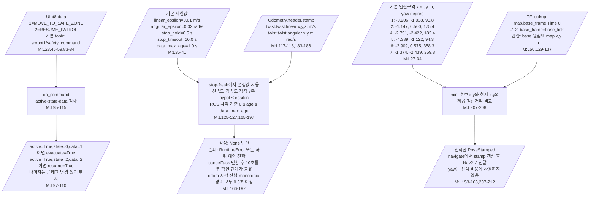

# 도표에 함께 표시하는 좌표·입출력값

아래 값은 이번에 고정한 Python 소스에서 읽었다. 버전은 [source_manifest.json](source_manifest.json)을 따른다. G는 genius_patrol.py, M은 move_to_safetyzone.py, R은 recheck_event.py, T는 turtlebot4_navigator.py다. 이 문서는 PNG와 draw.io만 열어도 값과 단위를 확인할 수 있도록 추가한 값 설명 페이지다.

## V1 — 정상 순찰 목표의 순서와 좌표

아래는 모든 단계가 성공했을 때의 index 순서다. 대피·재확인·실패 분기는 [전체·상세 실행 흐름](genius_patrol.md)을 따른다. 각 Pose의 `frame_id=map`, position.z=0, quaternion.x/y=0이며 `qz=sin(yaw×π/360)`, `qw=cos(yaw×π/360)`이다(T:L74-94). stamp는 각 Pose 생성 당시 ROS 시각이다. 이동 9회·spin 8회이며 마지막 원점 뒤에는 spin이 없다.

```mermaid
flowchart TD
    A([정상 순찰 index 순서<br/>G:L95-141]) --> F[/모든 위치는 map, 단위 m<br/>yaw 입력 단위 degree<br/>PoseStamped 생성 시 stamp 설정<br/>T:L74-94/]
    F --> P0[[index 0: goToPose<br/>x=-0.206, y=-1.038, WEST=90°<br/>G:L97,127]]
    P0 --> S1[[index 1: Spin<br/>target_yaw=2π rad, time_allowance=20 s<br/>G:L98,41-50]]
    S1 --> P2[[index 2: goToPose<br/>x=-1.147, y=0.500, SOUTH=180°<br/>G:L99,127]]
    P2 --> S3[[index 3: Spin 2π rad, 20 s<br/>G:L100,41-50]]
    S3 --> P4[[index 4: goToPose<br/>x=-2.029, y=-0.916, EAST=270°<br/>G:L101,127]]
    P4 --> S5[[index 5: Spin 2π rad, 20 s<br/>G:L102,41-50]]
    S5 --> P6[[index 6: goToPose<br/>x=-2.751, y=-2.422, SOUTH=180°<br/>G:L103,127]]
    P6 --> S7[[index 7: Spin 2π rad, 20 s<br/>G:L104,41-50]]
    S7 --> P8[[index 8: goToPose<br/>x=-4.389, y=-1.122, WEST=90°<br/>G:L105,127]]
    P8 --> S9[[index 9: Spin 2π rad, 20 s<br/>G:L106,41-50]]
    S9 --> P10[[index 10: goToPose<br/>x=-2.909, y=0.575, NORTH=0°<br/>G:L107,127]]
    P10 --> S11[[index 11: Spin 2π rad, 20 s<br/>G:L108,41-50]]
    S11 --> P12[[index 12: goToPose<br/>x=-2.029, y=-0.916, EAST=270°<br/>G:L109,127]]
    P12 --> S13[[index 13: Spin 2π rad, 20 s<br/>G:L110,41-50]]
    S13 --> P14[[index 14: goToPose<br/>x=-1.374, y=-2.439, NORTH=0°<br/>G:L111,127]]
    P14 --> S15[[index 15: Spin 2π rad, 20 s<br/>G:L112,41-50]]
    S15 --> P16[[index 16: goToPose<br/>x=0.0, y=0.0, NORTH=0°<br/>G:L113,127]]
    P16 --> END([index=17 → active=False → 최종 dock<br/>G:L141-150])
```

## V2 — 대피에 전달되는 명령·기본값·위치

이 그림의 화살표는 **데이터 전달 관계**다. 여러 ROS 입력 사이의 실행 순서나 동시 실행을 의미하지 않는다. 표시된 제한값과 안전구역은 CLI 옵션을 지정하지 않았을 때의 기본값이다.

`--safe X Y YAW_DEG`를 한 번 이상 지정하면 기본 안전구역 전체를 대체한다(M:L51-52,61). namespace는 robot1/robot6 선택이고 command·odom topic도 별도 지정할 수 있다. Float32 재확인 입력과 필수 설정값은 [Recheck 의존 경로](recheck_event_dependency.md)의 값 표·도표를 따른다. 위 기본 시간값은 모든 blocking API에 적용되는 전체 실행 timeout이 아니다.
