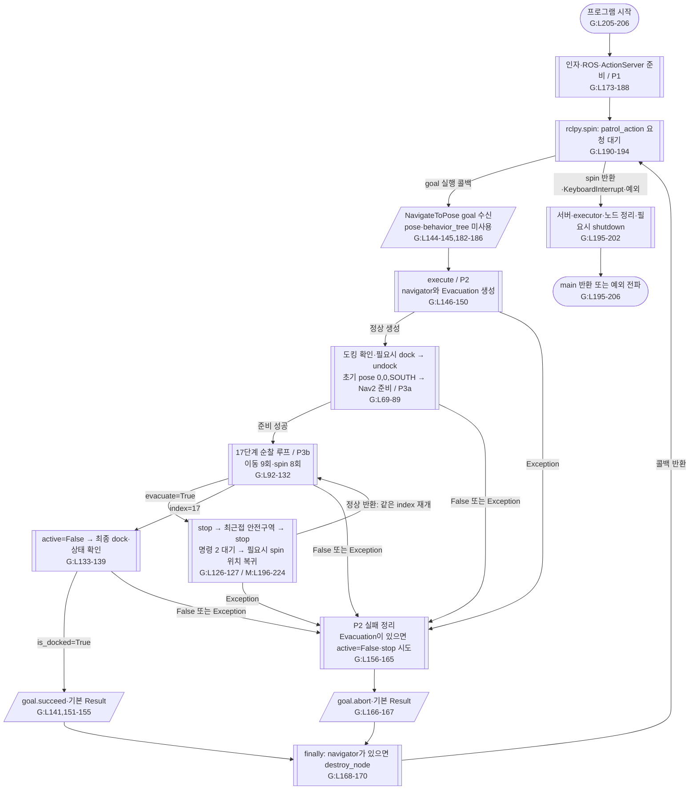
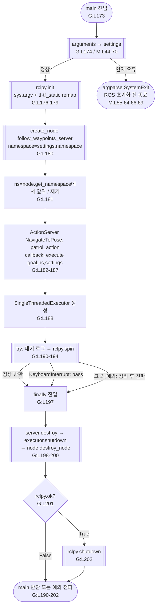
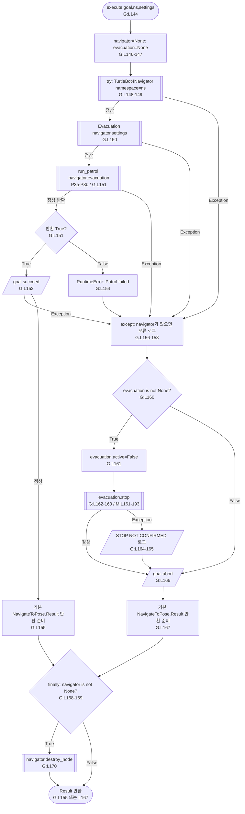
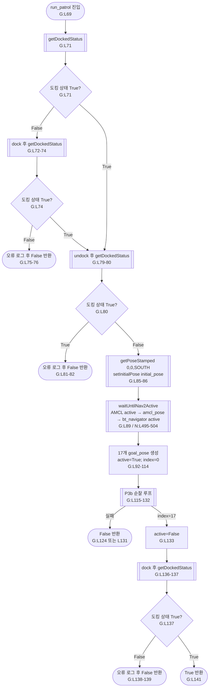
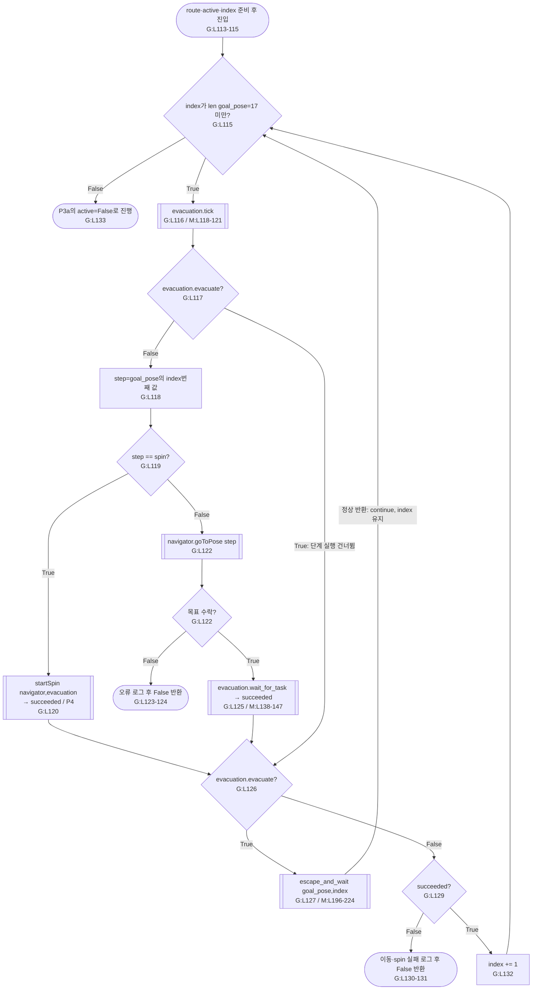
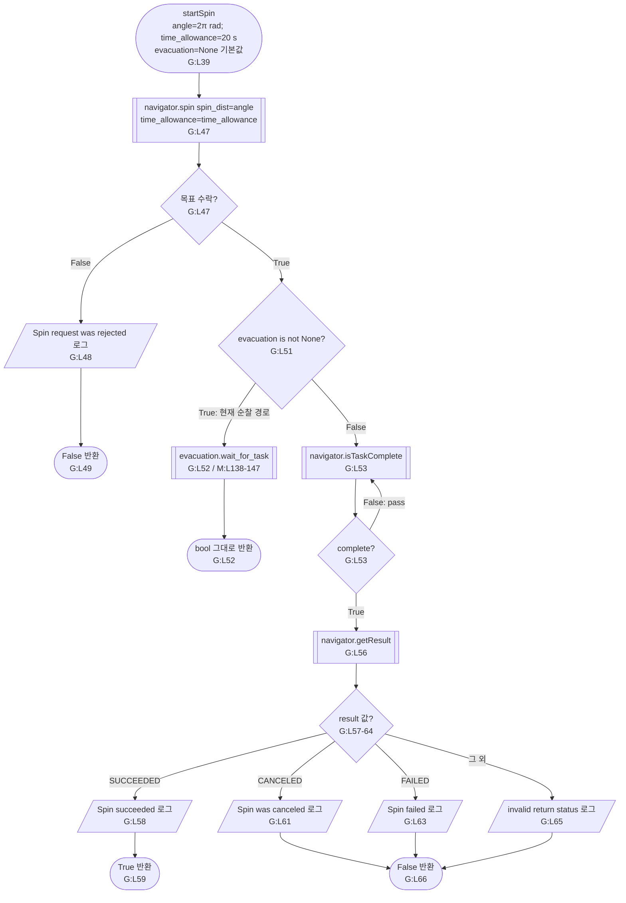

# genius_patrol.py — 코드 기준 전체·상세 흐름

**구현 대조 완료: 2026-09-11 07:39:45 KST.** [genius_patrol.py](../../src/patrol_amr_safety/patrol_amr_safety/genius_patrol.py) 206행, SHA-256 `12344529c2f84c9817348b721127efd435d3a014eaf867a1b0cd4fe3b181383a`. 기존 Markdown은 동작 근거로 사용하지 않았다. Python과 설치된 ROS 메시지 정의를 직접 대조했다. 현재 소스에는 Recheck 연결이 없다.

G:L번호는 이 파일, M:L번호는 [move_to_safetyzone.py](../../src/patrol_amr_safety/patrol_amr_safety/move_to_safetyzone.py)의 줄 번호다. T는 TurtleBot4Navigator, N은 BasicNavigator다. 파일 경로·해시는 [source_manifest.json](source_manifest.json), 좌표·설정 그림은 [data_values.md](data_values.md), 대피 상세는 [move_to_safetyzone.md](move_to_safetyzone.md)에 있다.

기호는 [ISO 5807:1985](https://www.iso.org/standard/11955.html)의 의미에 맞춘다. 둥근 양끝은 진입·반환, 직사각형은 처리, 마름모는 판단, 평행사변형은 입출력, 양쪽 이중선은 상세가 따로 있는 호출·구간이다. 실행 그림의 화살표는 제어 흐름이며 조건·예외 분기를 구별한다. 각 도형의 줄 번호는 해당 동작의 근거다.

## 0. 전체 실행 흐름

전체 그림은 main과 execute의 수명, 순찰·대피·재개를 연결한다. P1~P4와 M 상세에서 호출 상자를 확장한다. 실패 처리의 세부 생성·정리 예외는 P2를 따른다.

콜백 `on_command()`는 플래그만 설정한다. `tick()`이나 navigator 내부 spin으로 콜백을 처리한 뒤 순찰 루프가 `evacuate`를 읽어 대피를 호출한다. 도표의 대피 재개 선은 직접 콜백 호출을 의미하지 않는다.

## 1. 실제 전달값

| 경계 | 값·의미 | 근거 |
|---|---|---|
| arguments → main | `settings`: argparse.Namespace; namespace 기본 robot1, 선택 robot1/robot6 | G:L174; M:L44-70 |
| main → execute | ServerGoalHandle `goal`, 실제 namespace에서 `/`를 제거한 `ns`, `settings` | G:L181,186 |
| 외부 Action → 서버 | 상대 `patrol_action`, nav2_msgs/action/NavigateToPose. 요청의 pose·behavior_tree를 읽지 않음 | G:L144-145,182-186 |
| execute → 순찰·대피 | 동일 TurtleBot4Navigator 인스턴스 공유 | G:L149-151; M:L75 |
| 순찰/대피 → Nav2 | `navigate_to_pose`, NavigateToPose.Goal.pose=PoseStamped, behavior_tree='' | G:L122; M:L154; N:L185-219 |
| 회전 → Nav2 | `spin`, Spin.Goal.target_yaw=2π rad, time_allowance.sec=20, nanosec=0 | G:L39,47; N:L269-289 |
| Nav2 → 호출자 | goToPose/spin의 True는 목표 수락. 별도로 isTaskComplete와 getResult로 완료·성공 판정 | G:L47-56,122-125 |
| 순찰 단계 반환 | `succeeded: bool`; 대피 감지·실패·취소 등은 False. 이후 evacuate를 먼저 검사 | G:L120-131; M:L138-147 |
| 순찰 → 대피 | `route=goal_pose`, `index=현재 0기반 단계`. 정상 복귀 후 index 유지 | G:L127-128 |
| 서버 → 외부 Action | 성공 succeed, 실패 abort. 양쪽 모두 NavigateToPose.Result() 기본 error_code=0, error_msg='' | G:L152-167; 설치된 NavigateToPose.action |

방향 상수는 NORTH=0°, WEST=90°, SOUTH=180°, EAST=270°다(T:L40-48). getPoseStamped는 map 프레임, 생성 당시 ROS stamp, 위치 `(x,y,0)`, quaternion `(0,0,sin(yaw×π/360),cos(yaw×π/360))`를 만든다(T:L74-94). 초기 pose는 `(0,0,SOUTH=180°)`다(G:L85). 순찰 Pose stamp는 goToPose 때 갱신하지 않으며, 대피 navigate는 전달 객체의 stamp를 갱신한다(M:L150). 초기 pose 발행도 생성 당시 stamp를 그대로 복사한다(N:L813-821).

TaskResult는 UNKNOWN=0, SUCCEEDED=1, CANCELED=2, FAILED=3. ROS action 상태 4/5/6을 각각 SUCCEEDED/CANCELED/FAILED로 바꾼다(N:L484-493). 결과 메시지의 error_code를 직접 검사하지 않는다. dock/undock 반환값은 None이며 순찰은 별도 DockStatus.is_docked 구독값을 검사한다(T:L159-264).

command/odom 기본 경로는 일반 인자의 namespace로 `/{namespace}/safety_command`, `/{namespace}/odom`을 만든다(M:L56-58). 실제 서버 namespace는 ROS `__ns` remap으로 달라질 수 있다. TF 토픽의 `/tf:=tf`, `/tf_static:=tf_static` remap과 프레임 문자열 `map`, `base_link`는 별개다(G:L176-181; M:L129).

외부 feedback 발행·외부 cancel callback·직접 cmd_vel 발행은 두 파일에 없다. 설치된 rclpy 기본 goal callback은 ACCEPT, cancel callback은 REJECT다. 내부 Nav2 취소와 외부 patrol_action 취소는 별개다.

## 2. P1 — main

G:L174-188은 try 바깥이므로 생성 실패가 해당 finally를 거치지는 않는다. 정리 함수가 예외를 내면 뒤 정리가 보장되지 않는다. Nav2/localization 프로세스를 자동 기동하는 코드는 없다.

## 3. P2 — execute

BaseException(KeyboardInterrupt 등)은 except Exception이 잡지 않는다. finally는 try 탈출 시 실행된다. abort·로그·Result 생성·destroy 자체의 예외까지 별도로 복구하지 않는다. Evacuation 생성 중 실패하면 대입 전이므로 stop을 건너뛴다. stop까지 실패해도 로그 후 abort하므로 ABORTED를 실제 정지 확인과 동치로 볼 수 없다.

## 4. P3a — run_patrol 준비와 최종 도킹

준비·최종 도킹 동안 active=False다. 모든 하위 예외는 execute로 전파된다. getDockedStatus는 최초 상태 수신까지 기다리며 이 파일은 준비 전체에 별도 timeout을 씌우지 않는다.

## 5. P3b — 순찰 루프·대피 후 동일 단계 재개

대피가 True라 단계 실행을 건너뛰면 succeeded를 새로 대입하지 않는다. 하지만 escape 뒤 continue하므로 그 값을 읽지 않는다. 대피가 완료와 같은 확인 시점에 관측되면 대피 분기가 우선한다. 이동 goal 수락 실패는 즉시 False 반환하여 이후 대피 검사를 거치지 않는다. spin 수락 실패는 P4의 False 반환 후 대피 검사를 거친다.

## 6. P4 — startSpin

현재 순찰은 evacuation을 넘기므로 G:L56-66 결과별 로그 구간으로 진행하지 않는다. 20초는 Spin Goal 시간 허용값이며 Python 함수 전체의 벽시계 timeout이 아니다. 코드를 실행하지 않고 도형·호출값·소스 줄을 대조했다. 실기 시험은 수행하지 않았다.
