# move_to_safetyzone.py — 코드 기준 함수별 흐름

**구현 대조 완료: 2026-09-11 07:39:45 KST.** [move_to_safetyzone.py](../../src/patrol_amr_safety/patrol_amr_safety/move_to_safetyzone.py) 228행, SHA-256 `34637ffd14929c85b1f054e6970ea9ee93c93c2807f035d0b71aba5069883430`. 아래 L번호는 이 소스의 줄 번호다. 기존 Markdown 대신 Python과 설치 라이브러리 코드를 직접 대조했다. 호출자는 [genius_patrol](genius_patrol.md), 값 설명 그림은 [data_values](data_values.md)를 참조한다.

## 1. 입력·공유 변수

| 값 | 타입·초기값·용도 | 소스 |
|---|---|---|
| MOVE_TO_SAFE_ZONE / RESUME_PATROL | 정수 1 / 2; UInt8.data로 수신 | L23,93-113 |
| PATROLLING / EVACUATING / WAITING | 정수 0 / 1 / 2; 내부 상태이며 별도 상태 토픽 발행 없음 | L24-25 |
| active, evacuate, resume | bool; 모두 False. 호출자가 active를 바꾸고 명령 콜백이 플래그를 설정 | L77,95-100 |
| saved_index | 초기 None, 대피 때 현재 정수 index 저장; 영속 저장 없음 | L76,198 |
| odom | 초기 None, 콜백이 최신 Odometry 객체 대입; stop 중 캐시를 지움 | L78,115-116,170 |
| safe | args.safe 각 x,y,yaw를 PoseStamped로 바꾼 목록 | L85 |
| 기본 namespace | robot1; robot6 선택 가능. --robot-id와 --namespace는 같은 인자 | L46-47 |
| 기본 command / odom | /robot1/safety_command / /robot1/odom; namespace 또는 옵션으로 변경 | L56-58 |
| 기본 base_frame | base_link; TF frame 이름에 namespace를 자동 추가하지 않음 | L50,129 |
| command QoS / odom QoS | 깊이 10 / qos_profile_sensor_data | L81-84 |
| 초기 TF 구성 | Buffer(), TransformListener(self.tf,nav). 별도 navigator 생성 없음 | L75,79-80 |

기본 안전구역은 WP 1·2·4·5·6·7이며 순서대로 `(-0.206,-1.038,90.8)`, `(-1.147,0.500,175.4)`, `(-2.751,-2.422,182.4)`, `(-4.389,-1.122,94.3)`, `(-2.909,0.575,358.3)`, `(-1.374,-2.439,359.8)`이다(L27-34). x/y 단위는 m, yaw 입력 단위는 degree. 순찰의 방향 enum 값과 혼용하지 않는다.

기본값은 linear_epsilon=0.01 m/s, angular_epsilon=0.02 rad/s, stop_hold=0.5 s, stop_timeout=10.0 s, data_max_age=1.0 s다(L35-41). CLI가 이 값을 대체할 수 있다. --safe를 한 번 이상 지정하면 기본 안전구역 전체를 대체한다. 입력 순서·yaw를 보존하며 중복 제거·yaw 정규화는 하지 않는다.

## 2. M1 — arguments

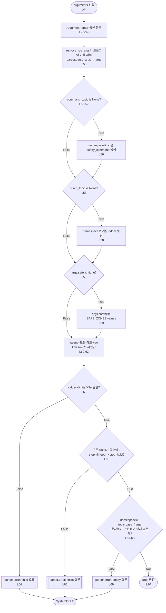

parse_args 자체의 구문·choices 오류는 뒤의 검증 이전에 종료한다. --help는 도움말 후 종료한다. 이 함수에는 configure callback 인자가 없다. topic/frame 문자열이 실제 ROS에서 유효한 이름인지 추가 검증하는 코드도 없다.

## 3. M2 — Evacuation.__init__

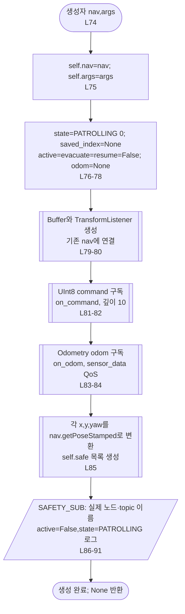

TurtleBot4Navigator의 getPoseStamped는 map 프레임, 생성 시각 stamp, `(x,y,0)`, quaternion `(0,0,sin(yaw×π/360),cos(yaw×π/360))`를 만든다. TransformListener의 TF callback은 Buffer를 갱신한다. 생성자가 on_command를 직접 호출하는 구조는 아니다. 실제 TF 토픽은 호출자의 remap 영향을 받고, 프레임 문자열은 별개다.

## 4. M3 — on_command

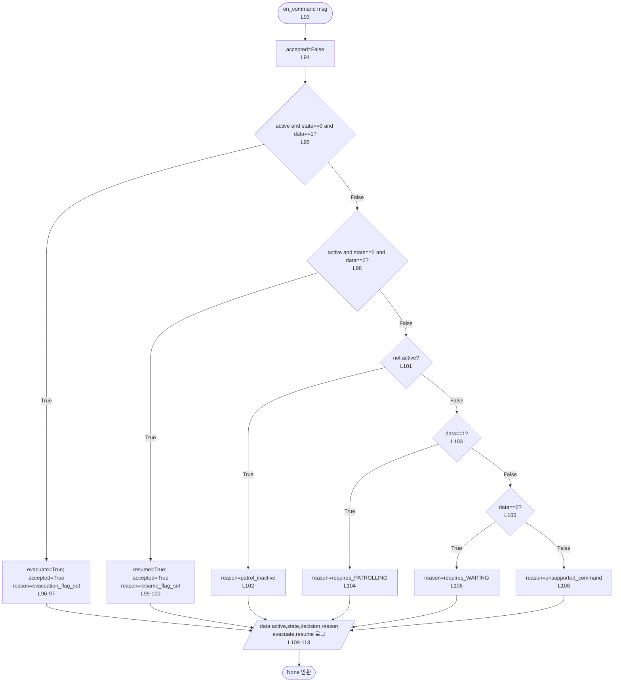

decision은 accepted에 따라 ACCEPTED/IGNORED다. ACCEPTED는 플래그 설정을 의미하며 동작 완료가 아니다. 조건은 발행 시각이 아니라 콜백 실행 시점의 상태다. 중복 허용 명령은 같은 True를 다시 설정한다. 미수락 명령을 나중에 수행하도록 저장하지 않는다.

## 5. M4 — on_odom

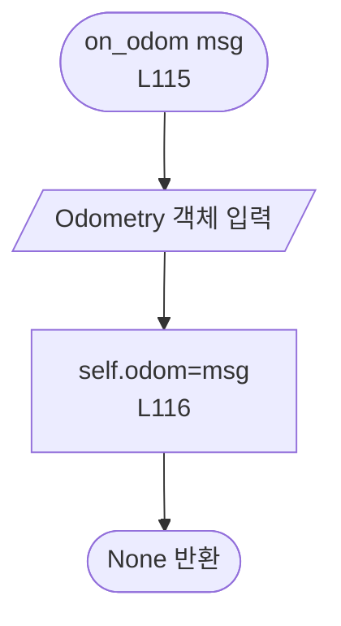

복사·검증 없이 객체를 저장한다. pose·covariance·frame 문자열은 stop 판정에 사용하지 않는다.

## 6. M5 — tick

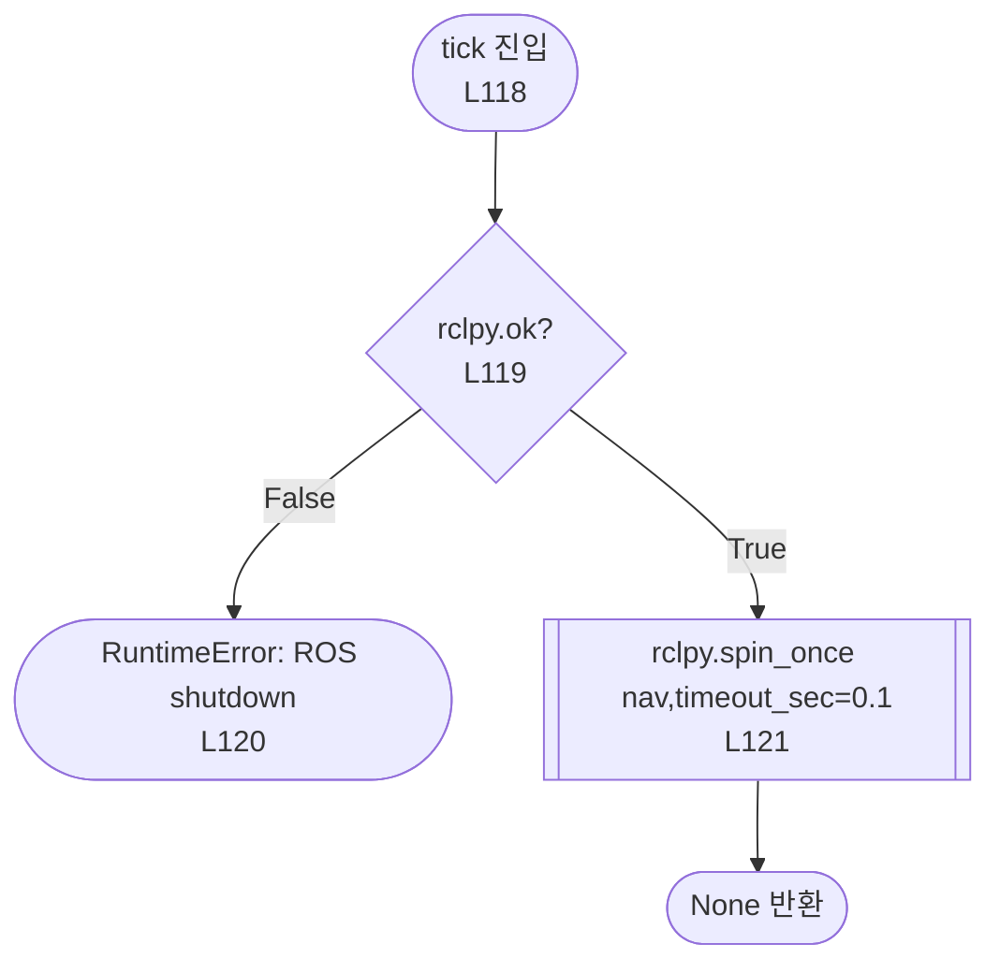

tick 및 Nav2 API 내부 spin이 준비된 command·odom·TF callback을 처리할 수 있다. spin_once 한 번에 모든 callback이 처리된다는 뜻은 아니다. 0.1초는 호출의 timeout 인자이며 주기 타이머가 아니다.

## 7. M6 — fresh

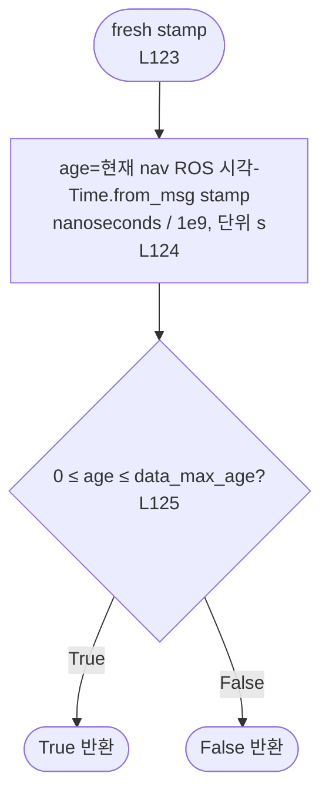

기본 허용 나이는 0..1.0초다. 미래 timestamp도 False다. 여기서는 monotonic이 아니라 navigator의 ROS 시계를 쓴다.

## 8. M7 — position

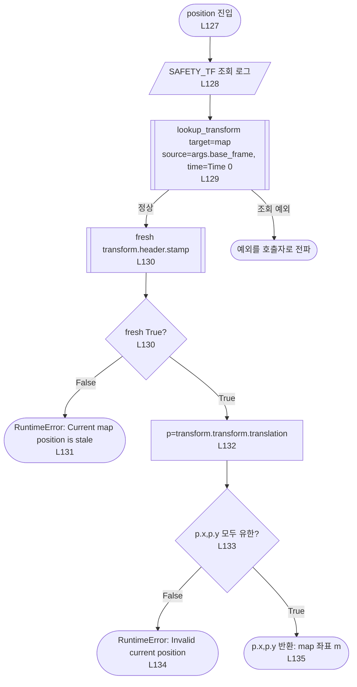

최신 TF로 base 원점을 map에서 표현한 x,y다. z·quaternion·odom pose는 선택에 사용하지 않는다. timeout 인자를 주지 않아 설치된 TF API 기본 0초를 사용한다. TF 없음·연결 없음·외삽 오류에 재조회 루프는 없다.

## 9. M8 — wait_for_task

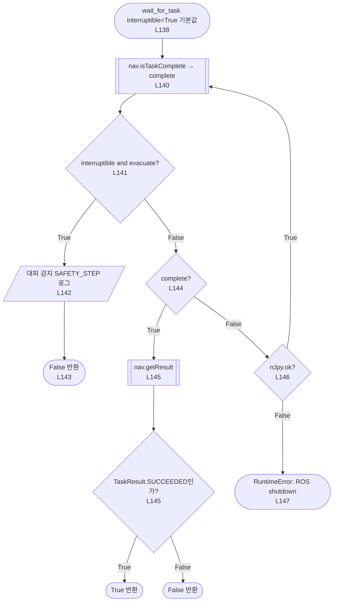

완료 여부를 얻은 뒤 대피를 먼저 검사한다. 이 함수는 대피 False 반환 시 직접 취소하지 않는다. 이어지는 escape_and_wait의 stop이 취소한다. interruptible=False이면 대피 플래그를 무시한다. 전체 이동 timeout은 없다. complete=True는 성공과 다르며 TaskResult를 별도로 검사한다.

## 10. M9 — navigate

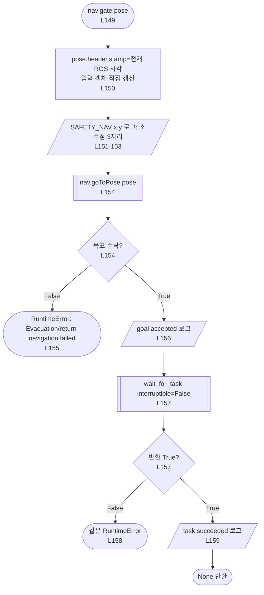

좌표의 원래 정밀도는 유지하고 로그만 반올림해 표시한다. 이 함수 안에는 stop이 없다. Nav2 Goal은 pose와 기본 behavior_tree=''를 사용한다. 일반 순찰 goToPose와 달리 stamp를 갱신하며 spin 복귀 시 경로의 직전 Pose 객체도 갱신된다.

## 11. M10 — stop: 취소와 Action 종료

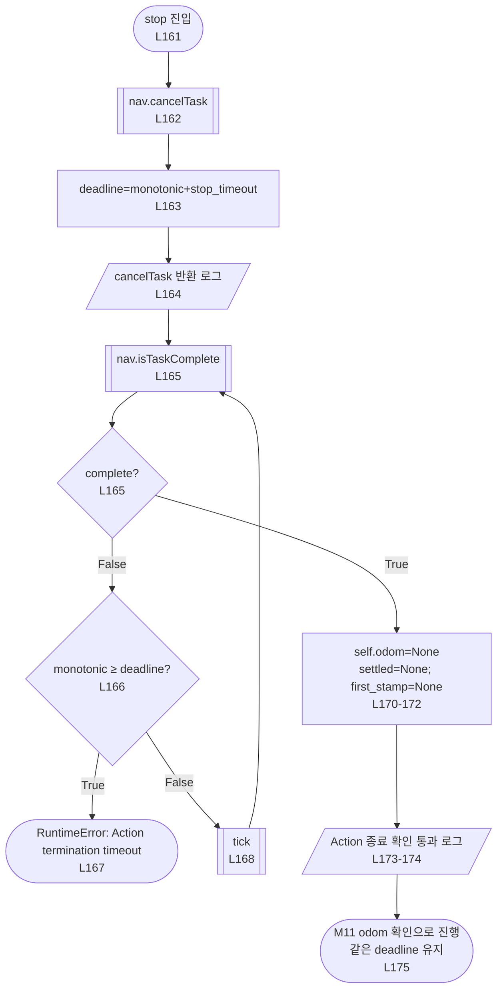

기본 10초는 cancelTask가 반환한 **뒤** 시작한다. cancelTask의 취소 응답 대기는 포함하지 않는다. 설치된 BasicNavigator.cancelTask는 응답 내용을 검사하지 않는다. Action 종료와 새 odom 확인은 하나의 deadline을 공유한다. 현재 Nav2 goal 취소이며 Dock/Undock 전용 goal handle을 취소하는 함수가 아니다.

## 12. M11 — stop: odom 정지와 두 시각 조건

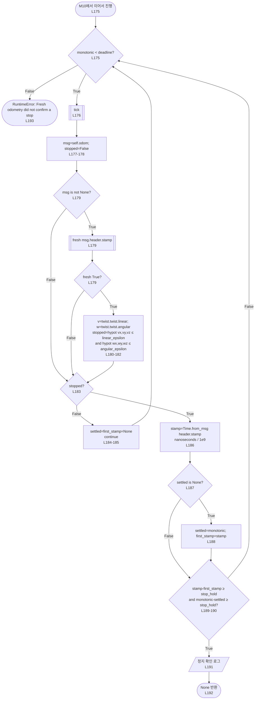

조건은 최신 odom, 3축 선속도 크기≤0.01 m/s, 3축 각속도 크기≤0.02 rad/s, odom stamp 진행과 monotonic 경과 **둘 다 ≥0.5초**다(기본값). 신선도·속도 조건 실패 시 유지 시작점을 지운다. 같은 stamp만 반복 확인하여서는 stamp 진행 조건을 만족하지 못한다. 샘플 수·각 연속 stamp의 단조 증가·누락 샘플 보간은 검사하지 않는다.

self.odom=None은 캐시 초기화이며, 이후 모든 메시지의 측정시각이 취소 이후라는 별도 검사는 없다. deadline은 tick 전에 검사하므로 tick 뒤 같은 반복에서 제한시간을 조금 넘겨 성공할 수 있다. 직접 cmd_vel=0은 발행하지 않는다.

## 13. M12 — escape_and_wait

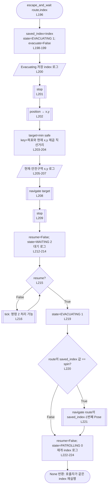

min 비용은 map의 m² 제곱 직선거리이며 yaw·실제 경로 길이·장애물은 사용하지 않는다. 동률이면 목록의 앞 항목을 고른다. 목표 이동 실패 시 다른 후보 재선택 없이 예외를 전파한다.

안전구역의 두 번째 stop 성공 뒤 WAITING에 들어간다. 대기는 시간제한·지속적인 odom 정지 재검사가 없다. 이동 중단점은 같은 목표를 재요청하고, spin 중단점은 직전 Pose로 복귀 후 2π 전체를 재실행한다. 복귀 navigate 뒤 별도 stop은 없다. saved_index와 active는 반환 시 초기화하지 않는다. 함수는 index·직전 항목 타입을 검증하지 않는다. 현재 경로에서는 모든 spin 앞에 Pose가 있다.

## 14. M13 — 모듈 직접 실행

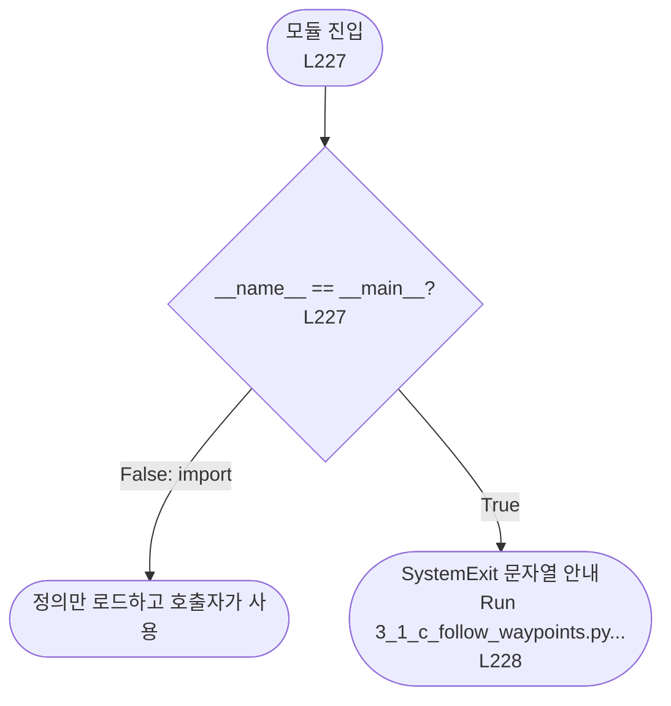

직접 실행 안내와 docstring에는 이전 호출자 이름이 남아 있다. 실제 이번 대조 호출자는 genius_patrol.py다. 이 모듈에는 try/except가 없어 명시한 RuntimeError와 하위 ROS/TF/API 예외가 호출자로 전파된다. 호출자의 execute가 active=False·stop 재시도·abort·navigator 정리를 수행한다. 실기·ROS 통신 시험은 수행하지 않았다.
