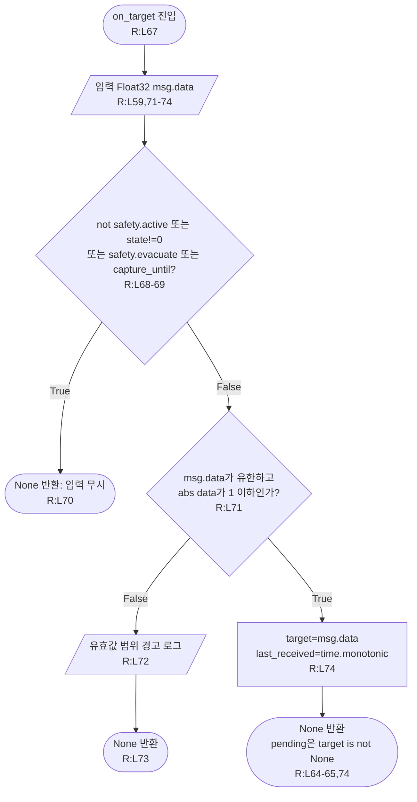
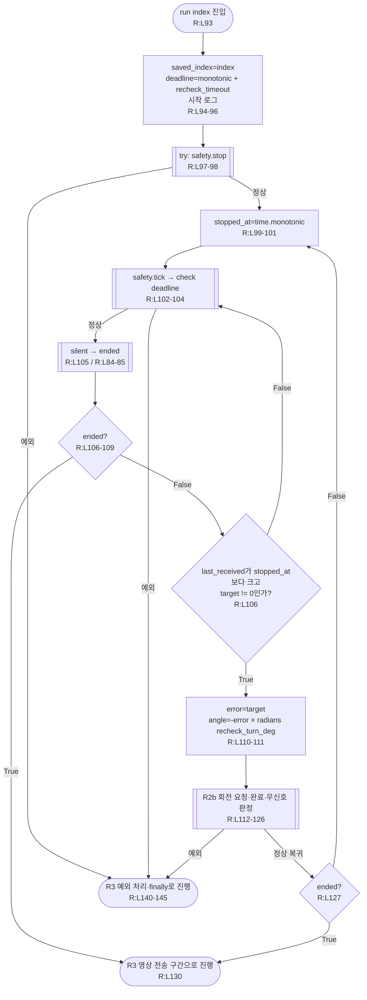
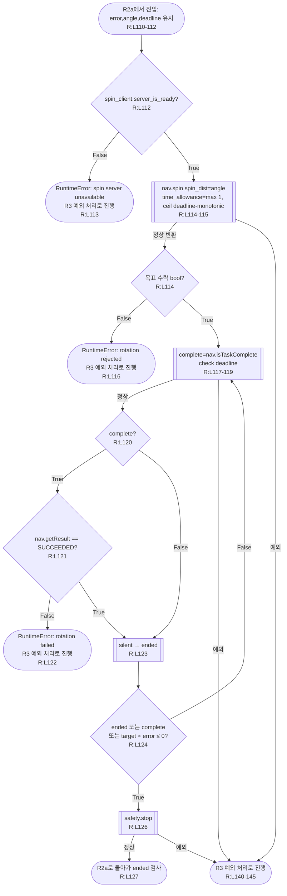
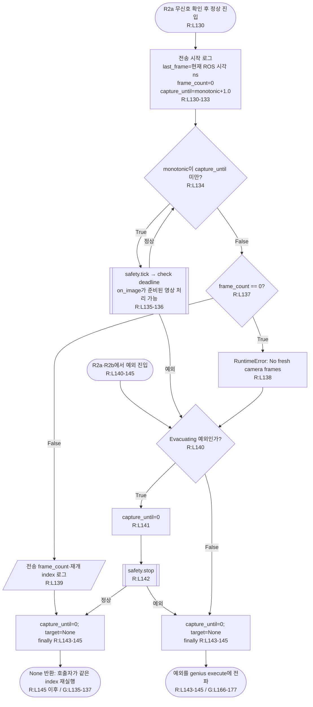
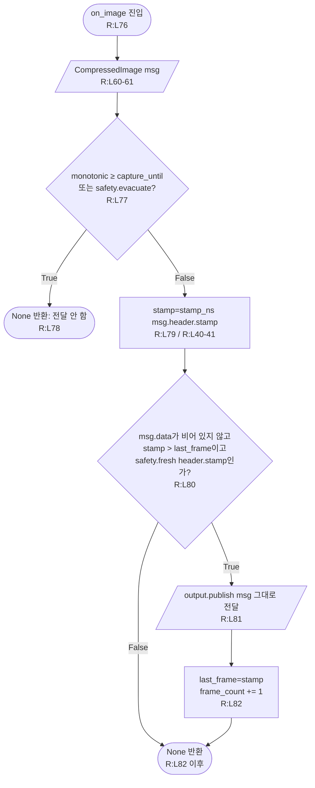

# recheck_event.py — 현재 순찰 코드가 호출하는 의존 경로

**구현 대조 완료: 2026-09-11 07:33:59 KST 소스 스냅샷.** [recheck_event.py](../../src/patrol_amr_safety/patrol_amr_safety/recheck_event.py) 145행, SHA-256 `416520abb1300d42e5dccb14f6b0ea650e247b0439226b426a8acb586a5f43fc`. 기존 Markdown 대신 Python 소스를 근거로 작성했다. 이 부록은 [genius_patrol 전체·상세 흐름](genius_patrol.md)의 실제 호출 경로를 보충한다. R:L번호는 이 파일의 줄 번호다.

현재 입력은 **`std_msgs/msg/Float32`의 `data`**이며 `vision/detecting_event`를 구독한다. `event_id`, `detected`, 카메라 stamp가 있는 JSON을 받는 코드가 아니다. 입력이 일정 시간 끊기면 정지·1초 영상 전달·원래 순찰 단계 재개로 진행한다. 무신호만으로 정렬 성공·대상 소실·연결 단절 중 어느 원인인지 구분하지 않는다.

## 1. 생성·설정·입출력값

| 항목 | 정확한 값·사용 | 소스 |
|---|---|---|
| 필수 `--recheck-no-signal-timeout` | float, 유한 v>0 s. `silent()`의 수신 공백 기준. 기본값 없음 | R:L24-32,84-85 |
| 필수 `--recheck-turn-deg` | float, 유한 0<v≤180 degree. 회전량 계수 | R:L24-34,111 |
| 필수 `--recheck-timeout` | float, 유한 v>1 s. 전체 check의 deadline. 기본값 없음 | R:L24-36,95 |
| `--camera-topic` | 기본 상대 이름 `oakd/rgb/image_raw/compressed` | R:L37,60-61 |
| 객체 공유 | `safety=evacuation`, `nav=evacuation.nav`, `args=settings` | R:L49-50 |
| 초기 변수 | `target=None`, `saved_index=None`, `last_received=0.0`, `capture_until=last_frame=frame_count=0` | R:L51-53 |
| 목표 입력 | 상대 `vision/detecting_event`, Float32.data, 허용 유한 `[-1,1]`; QoS KEEP_LAST(1), BEST_EFFORT, VOLATILE | R:L55-59,71-74 |
| 목표 값 의미 | 소스 docstring의 `(bbox_center_x-width/2)/(width/2)`, 음수=왼쪽, 양수=오른쪽. 이 모듈이 bbox 좌표로부터 계산하지는 않음 | R:L3-4,74 |
| 카메라 입력 | `args.camera_topic`, CompressedImage, qos_profile_sensor_data | R:L60-61 |
| 영상 출력 | 상대 `vision/recheck_frames`, CompressedImage, publisher 깊이 10. 입력 메시지 자체를 발행하여 header·format·data 유지 | R:L54,76-82 |
| `pending` | `target is not None`; 0.0도 True | R:L63-65 |
| `stamp_ns(stamp)` | `stamp.sec × 1_000_000_000 + stamp.nanosec` | R:L40-41 |
| `silent()` | `time.monotonic() - last_received >= args.recheck_no_signal_timeout` | R:L84-85 |
| `check(deadline)` | 먼저 evacuate이면 Evacuating, 다음 monotonic≥deadline이면 RuntimeError, 그 외 None | R:L87-91 |

토픽은 navigator namespace와 ROS remap에 따라 실제 이름이 결정된다. Float32에는 카메라 timestamp가 없으므로 목표의 신선도는 카메라 촬영 시각이 아니라 **유효 입력을 콜백에서 처리한 monotonic 시각**으로 판단한다. 입력값이 0이어도 수신 시각이 갱신되어, 0이 계속 수신되는 동안에는 무신호 조건이 성립하지 않는다.

`add_arguments()`는 parser를 수정하고 None을 반환한다(R:L23-37). 내부 `bounded`는 float 변환·유한성·범위를 검사하는 parser 함수를 반환한다. 필수 인자 누락 또는 값 오류는 ROS 초기화 전 argparse에서 종료된다. `Evacuating`은 Exception의 하위 클래스이며 특별한 추가 메서드가 없다(R:L44-45).

## 2. R1 — on_target: 입력 수락과 pending 생성

영상 전송 중 `capture_until`이 0이 아니면 목표 입력을 받지 않는다. ID별 중복 관리나 완료 ID 저장소는 없다. 콜백은 값만 저장하고 직접 `run()`을 호출하지 않는다. genius_patrol이 `pending`을 검사하여 호출한다.

## 3. R2a — run: 정지 후 입력 대기와 회전 반복

`run()`은 R2a·R2b·R3에 나누어 그렸다. 세 그림은 별도 Python 함수가 아니라 R:L93-145의 연속된 구간이다. R2b의 `ended`는 R2a로 돌아올 때의 지역 변수다.

정지 이후에 처리한 새 **0이 아닌 입력** 또는 무신호를 기다린다. 입력 0은 회전을 시작하지 않지만 `last_received`를 갱신하므로 입력이 계속 오면 timeout까지 기다릴 수 있다. `silent`는 수신 공백을 검사하며 bbox가 실제 중앙에 왔는지 별도로 판정하지 않는다.

## 4. R2b — 회전 Action과 중단 조건

`target × error ≤ 0`은 목표 오차가 0이 되거나 처음 회전 방향의 반대로 바뀌었음을 나타낸다. 무신호·Action 완료·0/방향 반전 중 하나면 정지 확인을 하고, `ended=False`이면 새 입력 대기로 돌아간다. 완료된 Action이 SUCCEEDED가 아니면 무신호를 검사하기 전에 실패한다. spin의 time_allowance는 양의 정수 초이며, blocking API 전체에 대한 강제 timeout은 아니다.

## 5. R3 — 1초 영상 전달과 예외·finally

이 그림에는 정상 경로 진입과 예외 경로 진입을 별도로 둔다. R2a·R2b 안에서 예외가 나면 정상 캡처 경로를 거치지 않는다.

전송 구간에서는 목표값이나 무신호를 재검사하지 않는다. `check()`는 대피와 전체 deadline만 검사한다. 전송은 nominal 1.0초 창이며 별도의 FPS·최소 샘플 수는 없다. `frame_count>0`이어야 정상 종료한다. stop·spin 내부 대기는 이 deadline으로 강제로 끊지 못하므로 전체 함수의 실제 소요시간 상한을 보장하지 않는다.

`Evacuating`은 이 함수 안에서 정지 후 정상 None 반환으로 바뀐다. 대피 플래그 자체는 지우지 않아, genius_patrol의 다음 반복이 대피를 먼저 처리한다. 정지 함수가 예외를 내면 finally 후 외부 execute로 전파된다. 그 외 일반 Exception도 finally 후 전파된다. 초기 index·deadline·시작 로그(R:L94-96)는 try 바깥이다. 모든 finally 이후 상태는 `capture_until=0`, `target=None`이며 저장 index와 last_received는 지우지 않는다.

## 6. R4 — on_image: 새 영상만 전달

영상 timestamp는 ROS 시계, 무신호·전송 창·deadline은 monotonic 시계다. 첫 `last_frame`은 전송 창 시작 때 ROS 시각으로 설정되므로 이보다 새롭고, 이후 전달 영상보다도 timestamp가 증가해야 한다. 영상 신선도 검사는 [대피 모듈 fresh](move_to_safetyzone.md)의 조건을 재사용한다. 메시지의 header·format·data를 재작성하지 않는다.

## 7. 범위와 검증

근거는 위 소스 스냅샷과 Float32/CompressedImage 메시지 정의다. 실제 ROS 통신·카메라·회전·물리적 정지 시험은 수행하지 않았다. 이 부록의 기준 소스가 변하면 해시·줄 번호·도형을 다시 대조해야 한다.
