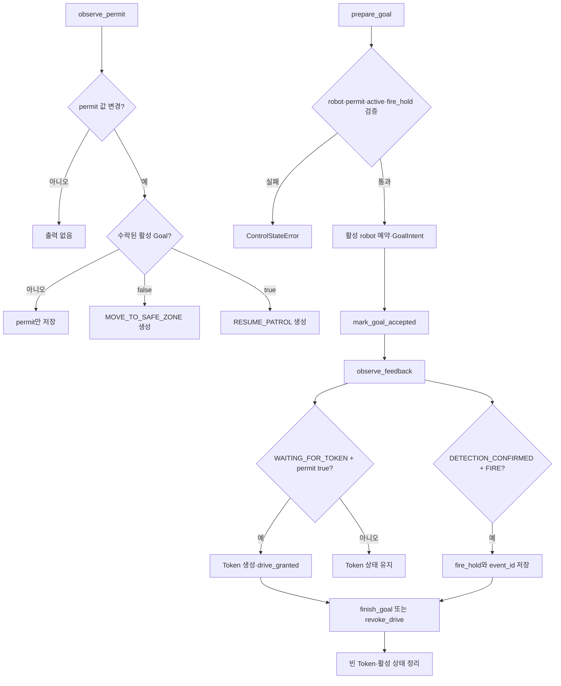
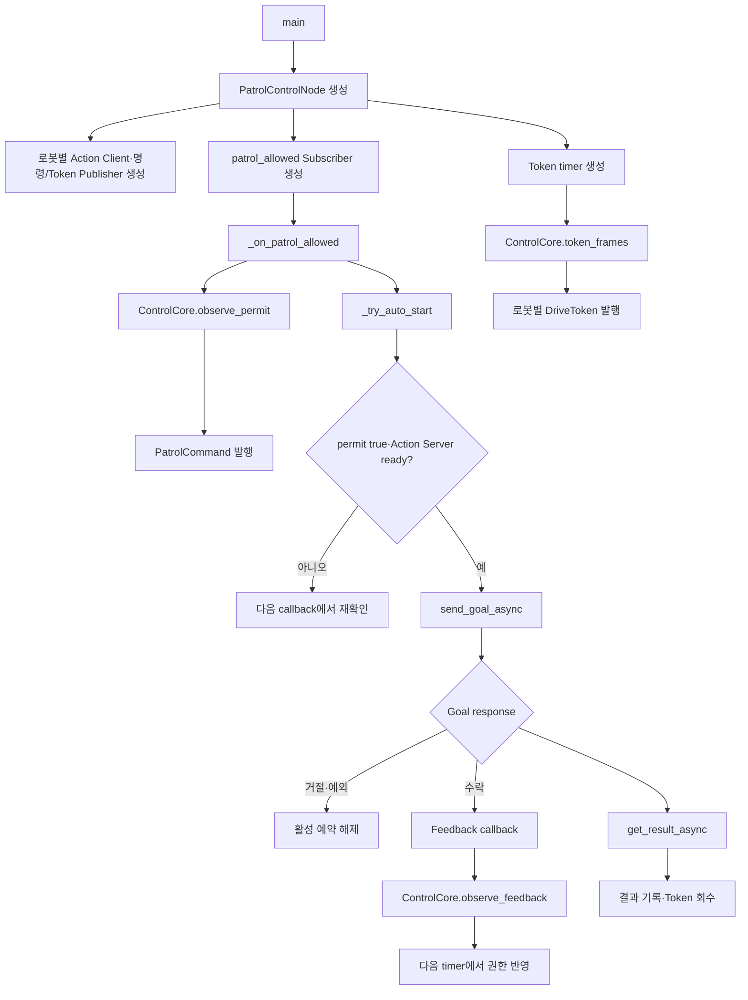

# Control Server 기능 설계

> 상태: `patrol_interfaces 2.0.0` 기본 관제 노드 구현 대조 완료 · 종단 통합시험 전
>
> 담당: 관제 팀
>
> 통합 실행 위치: PC 3

공용 타입·토픽·Action·Service 필드는 [공용 인터페이스](interfaces.md)를 기준으로 한다. 이 문서는 `src/patrol_control`이 소유하는 판단과 코드 흐름만 정의한다.

## 1. 구현 범위

- `robot1`, `robot6` Patrol Action Client
- 시스템 전체에서 한 번에 하나의 활성 Patrol Goal
- `patrol_allowed` 구독과 `PatrolCommand` 발행
- 로봇별 Drive Token 5 Hz 발행과 1초 lease
- Action Feedback·Result 처리
- 화재 확정 시 다음 순찰을 막는 내부 `fire_hold`
- Action 취소 시 즉시 Token 회수

현재 구현하지 않는 범위:

- EStop 동작
- 외부 운영 UI·인증 API
- 자동 역할 교대와 배터리 정책
- 시스템 모니터용 운행 상태 API
- 실제 AMR·CCTV 종단 통합시험

## 2. 기본 제어 규칙

1. Action Server가 준비되고 `patrol_allowed=true`일 때만 Patrol Goal을 보낸다.
2. Goal 수락 후에도 `WAITING_FOR_TOKEN` Feedback 전에는 빈 Token을 유지한다.
3. `WAITING_FOR_TOKEN`과 permit을 모두 확인한 뒤 활성 로봇에 Token을 발급한다.
4. `patrol_allowed=false` 전이에는 `MOVE_TO_SAFE_ZONE`을 한 번 보낸다.
5. `patrol_allowed=true` 전이에는 `RESUME_PATROL`을 한 번 보낸다.
6. Action이 끝나거나 취소되면 Token을 회수하고 활성 슬롯을 해제한다.
7. `DETECTION_CONFIRMED + FIRE`에서는 현재 Action의 Token은 유지하고, Action 종료 후 `fire_hold`가 해제되기 전까지 새 순찰을 시작하지 않는다.

## 3. 파일별 구현

| 파일 | 진입점 | 입력 | 출력 |
|---|---|---|---|
| `src/patrol_control/patrol_control/control_core.py` | `ControlCore` | permit, Goal 수락, Patrol Feedback, 완료·취소 | Goal·PatrolCommand·Token 상태, fire hold |
| `src/patrol_control/patrol_control/patrol_control_node.py` | `PatrolControlNode`, `main` | ROS Action Feedback·Result, `patrol_allowed`, timer | Patrol Goal, PatrolCommand, DriveToken |

### 3.1 `control_core.py` — 구현 대조 완료 (`patrol_control 0.2.0`)



실패·복구:

- 알 수 없는 robot, permit 미허용, 이미 존재하는 활성 Goal, fire hold는 Goal 생성을 거절한다.
- 다른 로봇 또는 알 수 없는 상태의 Feedback은 상태를 바꾸지 않는다.
- permit false에서는 `WAITING_FOR_TOKEN`을 받아도 Token을 발급하지 않는다.
- fire hold는 `clear_fire_hold()`의 명시적 호출로만 해제한다.

### 3.2 `patrol_control_node.py` — 구현 대조 완료 (`patrol_control 0.2.0`)



실패·취소:

- Action Server가 준비되지 않으면 비동기로 기다리며 5초 간격으로 경고한다.
- Goal 거절·전송 오류는 활성 예약을 해제한다.
- 취소 요청은 Drive Token을 먼저 회수하고 Action Cancel을 비동기로 보낸다.
- Result 수신 오류도 활성 상태와 Token을 정리한다.

## 4. 실행

기본값은 자동 시작하지 않는다. 기본 경로 순찰 한 번을 자동 시작하는 통합용 실행 예시는 다음과 같다.

```bash
ros2 run patrol_control patrol_control_node --ros-args \
  -p auto_start:=true \
  -p initial_robot_id:=robot1
```

자동 시작은 `patrol_allowed=true`를 받은 뒤에만 시도한다. 새 순찰을 반복 실행하거나 로봇을 운영 중 선택하는 기능은 향후 관제 소유 UI/API가 `start_patrol(robot_id)`를 호출하도록 연결한다.

<<<<<<< HEAD
#### `tests/integration/publish_control_inputs.py`

~~~mermaid
flowchart TD
    A[scenario 선택] --> B[patrol_allowed 5 Hz 발행]
    B -->|permit-steady| C[선택한 true 또는 false 유지]
    B -->|permit-cycle| D[true 2초 → false 2초 → true]
    B -->|detection| E[permit true 유지]
    E --> F[지연 후 v1.1 DetectionEvent 1회 발행]
    F --> G[설정 duration 또는 Ctrl+C까지 permit 유지]
~~~

이 테스트 노드는 정상 시나리오에서 비전 생산자만 대체하며 AMR 소유 토픽을 발행하지 않는다. 설치 executable과 launch에는 포함하지 않고 관제 PC에서 직접 실행한다. 관제 처리는 노드 로그, 시스템 모니터 수신은 기존 화면·API로 각각 확인한다.

## 8. 결정 기록과 공동 반영 대기
=======
## 5. 검증 상태
>>>>>>> b46ec32f379a0011fd1900ad93724e026921a8e9

- 순수 상태 머신 단위시험: permit 게이트, Token 발급 순서, 차량 회피 명령 중복 방지, 화재 hold, 취소 회수, 잘못된 Feedback 무시
- ROS 패키지 빌드: `patrol_interfaces`, `patrol_control` 함께 성공
- 노드 생성 smoke test: 로봇별 Action Client·PatrolCommand·DriveToken과 CCTV permit 토픽 생성 확인
- 실제 Action Server·CCTV·AMR 연결: 미실행
