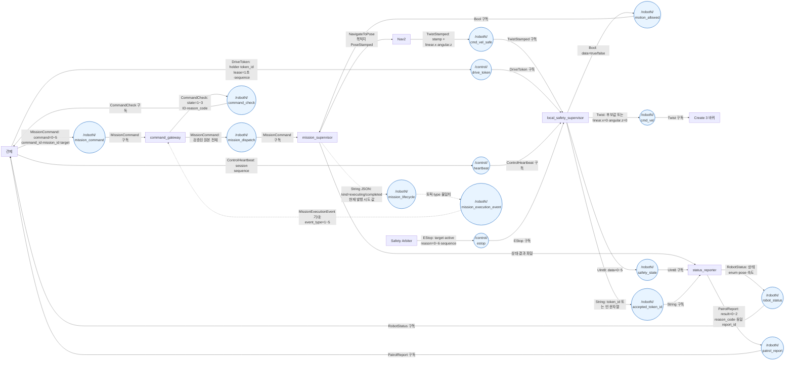
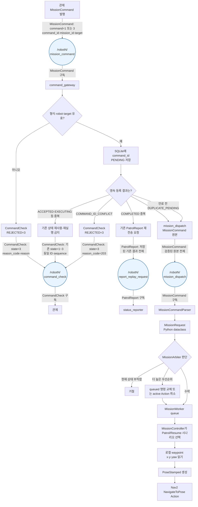
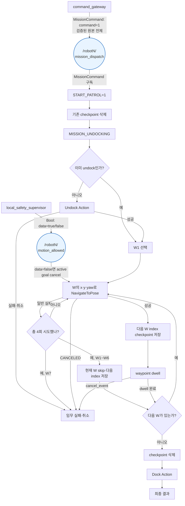

# AMR 코드리뷰 발표안 — 설계도 → 코드 → 테스트 결과 + Nav2 API 부록

작성: **2026-09-09 KST**

대상: `patrol_amr_safety` + `patrol_amr`

구현 대조 기준: **2026-09-09 현재 작업 트리**, 기준 commit `1933d4c`

전체 발표 시간은 **30분**이며, Q&A를 제외한 본 설명은 **15분**으로 잡는다.
발표 요구사항에 맞춰 반드시 다음 순서로 진행한다.

> 기존 공유 링크가 끊기지 않도록 파일명에는 `10min`을 유지했지만, 본문의 최신
> 시간 기준은 **본 설명 15분 + Q&A 15분**이다.

1. 설계도
2. 실제 솔루션 코드
3. 테스트 및 검증 결과
4. Q&A
5. Q&A 때 펼쳐볼 Nav2 API·값 사전 부록

표기 기준은 다음과 같다.

| 표기 | 뜻 |
|---|---|
| 구현 대조 완료 | 아래 그림의 연결·분기가 현재 production 코드와 같음 |
| 부분 구현 | 코드가 있으나 종단 연결 또는 실제 장비 검증이 남음 |
| 불일치 | 설계 계약과 현재 코드가 다름 |
| PASS | 이번 점검에서 직접 실행해 통과함 |
| FAIL | 이번 점검에서 직접 실행해 실패함 |
| NOT RUN | 실행 증거가 없으므로 완료로 말하지 않음 |

플로우차트에서 **원형 노드는 ROS 토픽**이다. 발행자에서 원형 토픽으로 들어가는
화살표에는 `메시지 타입: 실제 발행 값 또는 핵심 field`를 쓰고, 토픽에서 소비자로
나가는 화살표에는 구독 관계를 표시한다. Nav2·Dock·Undock Action과 파일 저장은
토픽이 아니므로 기존 사각형 노드로 구분한다.

## 0. 전체 30분 발표 시간표 — 본 설명 15분 + Q&A 15분

| 시간 | 발표 단계 | 보여줄 자료 | 핵심 문장 |
|---|---|---|---|
| 0:00~5:00 | 1. 설계 설명 | 전체 설계도, 명령·순찰·속도 flow, message interface | “목적을 정하는 임무 경로와 움직여도 되는지 정하는 안전 경로가 분리돼 있습니다.” |
| 5:00~11:00 | 2. 코드 설명 | 패키지 tree, 노드 5개, `[코드리뷰 N]` 주석 위치 | “callback은 접수만 하고 worker 한 개가 Nav2 side effect를 소유합니다.” |
| 11:00~15:00 | 3. 테스트 결과 | PASS/FAIL/NOT RUN 표와 terminal 결과 | “순수 로직과 local DDS는 확인했지만 실제 Nav2·바퀴 종단 시험은 아직 아닙니다.” |
| 15:00~30:00 | 4. Q&A | 질문별 표, Nav2 API·enum 부록 | type → 값 종류/번호 → 판단 → 출력 순으로 답함 |

부록 A·B는 앞의 15분에 전부 읽지 않는다. 설계와 코드에서 필요한 표만 짚고,
Nav2 API나 enum 질문이 나오면 Q&A 15분 동안 해당 부록을 펼쳐 답한다.

---

## 1. 설계 설명

### 1.1 전체 시스템에서 이번 코드리뷰 범위 — 구현 대조 완료/부분 구현

`N`은 `1` 또는 `6`이다. 상대 토픽은 각 로봇의 `/robotN` namespace 안에서 해석된다.



쉬운 설명:

- `MissionCommand`는 **무엇을 할지** 정한다.
- `DriveToken`, `ControlHeartbeat`, `EStop`은 **움직여도 되는지** 정한다.
- Nav2는 목적지까지 갈 경로와 매 순간의 속도 후보를 계산한다.
- `local_safety_supervisor`는 마지막 차단기다. 모든 조건이 맞을 때만 후보 속도를 바퀴로 보낸다.

### 1.2 전체 통합 Function Flow — 리뷰 대상 모든 핵심 로직

아래 한 장이 발표의 기준 설계도다. 명령 입력부터 최종 바퀴 속도와 상태·결과
보고까지 모두 연결한다. 뒤의 분할 flowchart는 이 그림을 읽기 쉽게 확대한 것이다.

```mermaid
%%{init: {"themeVariables": {"fontSize": "22px"}}}%%
flowchart TB
    subgraph CONTROL["A. 관제·Safety Arbiter 입력"]
        MC["관제 MissionCommand 발행"]
        T_MC(("/robotN/<br/>mission_command"))
        DT["관제 DriveToken 발행"]
        T_DT(("/control/<br/>drive_token"))
        HB["관제 ControlHeartbeat 발행"]
        T_HB(("/control/<br/>heartbeat"))
        ES["Safety Arbiter EStop 발행"]
        T_ES(("/control/<br/>estop"))
        T_CC(("/robotN/<br/>command_check"))
        T_RS(("/robotN/<br/>robot_status"))
        T_PR(("/robotN/<br/>patrol_report"))
        OBS["관제·시스템 모니터<br/>상태·결과 수신"]
    end

    subgraph GATEWAY["B. command_gateway — 접수·영속·중복"]
        GV["ID·robot·command·target·빈 target_pose 검증"]
        GOK{유효한가?}
        GREJ["CommandCheck<br/>REJECTED=3 + reason_code"]
        GDB["SQLite에 command_id와 원본 field 저장"]
        GREG{RegisterVerdict}
        GTO{수신 후 4초 미만인가?}
        GDIS["mission_dispatch 발행 준비"]
        T_MDIS(("/robotN/<br/>mission_dispatch"))
        GSTATE["기존 ACCEPTED·EXECUTING·REJECTED 상태 재응답"]
        GREPLAY["완료된 PatrolReport replay 요청"]
        T_ACTIVE(("/robotN/<br/>active_command"))
        T_REPLAY(("/robotN/<br/>report_replay_request"))
        GIGNORE["NONTERMINAL·SUPERSEDED<br/>재실행하지 않음"]
        GCONFLICT["같은 ID·다른 내용<br/>REJECTED=3 / code=203"]
        GTIMEOUT["admission timeout<br/>REJECTED=3 / code=206"]
        GRESTART["gateway 0.1초 주기 점검<br/>저장된 PENDING scan"]
        GPACTION{"PendingAction<br/>age + 이 프로세스 재전송 여부"}
        GWAIT["WAIT<br/>이미 1회 재전송했으므로 발행 안 함"]
    end

    MC -->|"MissionCommand: command=0~5<br/>ID·robot·target·target_pose"| T_MC
    T_MC -->|"MissionCommand 구독"| GV --> GOK
    GOK -->|아니오| GREJ
    GOK -->|예| GDB --> GREG
    GREG -->|NEW| GTO
    GREG -->|DUPLICATE_PENDING| GTO
    GTO -->|예| GDIS
    GTO -->|아니오| GTIMEOUT
    GREG -->|ACCEPTED·EXECUTING·REJECTED 중복| GSTATE
    GREG -->|COMPLETED 중복| GREPLAY
    GREG -->|NONTERMINAL·SUPERSEDED 중복| GIGNORE
    GREG -->|COMMAND_ID_CONFLICT| GCONFLICT
    GRESTART --> GPACTION
    GPACTION -->|REDISPATCH| GDIS
    GPACTION -->|WAIT| GWAIT
    GPACTION -->|REJECT_TIMEOUT| GTIMEOUT
    GDIS -->|"MissionCommand: 검증된 원본 전체"| T_MDIS
    GREJ -->|"CommandCheck: REJECTED=3<br/>reason_code"| T_CC
    GSTATE -->|"CommandCheck: 기존 state=1~3<br/>ID·sequence"| T_CC
    GCONFLICT -->|"CommandCheck: REJECTED=3<br/>reason_code=203"| T_CC
    GTIMEOUT -->|"CommandCheck: REJECTED=3<br/>reason_code=206"| T_CC
    T_CC -->|"CommandCheck 구독"| OBS
    GSTATE -->|"CommandCheck: 거절 아닌 현재 명령"| T_ACTIVE

    subgraph SUPERVISOR["C. mission_supervisor — 변환·중재·실행"]
        SUB["MissionCommand 수신 callback"]
        PARSE["MissionCommandParser<br/>ROS uint8 → MissionType"]
        POK{내부 변환 성공?}
        SLOG["supervisor log로만 거절 기록<br/>현재 typed lifecycle 회신 없음"]
        ARB["MissionArbiter<br/>ID·mission 상태·priority 검사"]
        AOK{수락 가능한가?}
        LAUNCHOK["launch 허가<br/>drive path 선택 + 로봇별 enable token"]
        AMCL["AMCL"]
        T_AMCL(("/robotN/<br/>amcl_pose"))
        LIDAR["LiDAR"]
        T_SCAN(("/robotN/<br/>scan"))
        BASE["Create 3"]
        T_ODOM(("/robotN/<br/>odom"))
        POSEOK["AMCL map pose 유효<br/>일반 mode age≤1.5초"]
        SENSOROK["LaserScan 1회 이상<br/>Odometry 1회 이상"]
        MREADY["motion_ready<br/>모든 readiness AND"]
        MOVEOK{"STOP/CANCEL인가<br/>또는 motion_ready=true인가?"}
        PREEMPT{더 높은 priority로<br/>기존 작업을 교체하는가?}
        ACTIVE{교체 대상이 active인가?}
        CANCEL_OLD["기존 cancel_event 설정<br/>SUPERSEDED 표시"]
        REPLACE_QUEUED["queued request 교체<br/>stale queue item은 begin에서 skip"]
        QUEUE["단일 worker queue"]
        CLAIM["worker가 side effect 전<br/>command_id 영속 claim"]
        CRESULT{ClaimResult}
        DUP["DUPLICATE 무시"]
        CONFLICT["CONFLICT 오류"]
        CTRL["MissionController<br/>command별 시나리오 선택"]
    end

    T_MDIS -->|"MissionCommand 구독"| SUB --> PARSE --> POK
    POK -->|아니오| SLOG
    POK -->|예| ARB --> AOK
    AOK -->|아니오| SLOG
    AOK -->|예| MOVEOK
    AMCL -->|"PoseWithCovarianceStamped:<br/>map pose·stamp·covariance"| T_AMCL
    T_AMCL -->|"pose 구독"| POSEOK
    LIDAR -->|"LaserScan: ranges·stamp"| T_SCAN
    T_SCAN -->|"scan 구독"| SENSOROK
    BASE -->|"Odometry: pose·twist·stamp"| T_ODOM
    T_ODOM -->|"odom 구독"| SENSOROK
    LAUNCHOK --> MREADY
    POSEOK --> MREADY
    SENSOROK --> MREADY
    MREADY --> MOVEOK
    MOVEOK -->|아니오| SLOG
    MOVEOK -->|예| PREEMPT
    PREEMPT -->|예| ACTIVE
    ACTIVE -->|예| CANCEL_OLD --> QUEUE
    ACTIVE -->|아니오, queued| REPLACE_QUEUED --> QUEUE
    PREEMPT -->|아니오| QUEUE
    QUEUE --> CLAIM --> CRESULT
    CRESULT -->|DUPLICATE| DUP
    CRESULT -->|CONFLICT| CONFLICT
    CRESULT -->|NEW| CTRL

    subgraph SCENARIO["D. command별 시나리오와 Patrol loop"]
        CMD{MissionType}
        STOP["STOP=0<br/>Nav2 cancel → PAUSED<br/>checkpoint 보존·report 없음"]
        START["START=1<br/>checkpoint 삭제"]
        UNDOCK["Undock Action"]
        UOK{undock 성공?}
        SAFESEL["SAFE_ZONE=2<br/>후보 선택<br/>현재 provider 미주입 → 빈 후보"]
        SAFEOK{후보가 있는가?}
        SAFENAV["선택한 안전구역으로 이동"]
        WAITSAFE["MISSION_WAITING_SAFE_ZONE<br/>mission 유지·report 없음"]
        RESUME["RESUME=3<br/>다음 waypoint checkpoint 읽기"]
        CPOK{checkpoint가 있는가?}
        DOCKONLY["DOCK=4<br/>Dock Action + dock_status 안정 확인<br/>timeout 60초·stable 2초"]
        CANCEL["CANCEL=5<br/>Nav2 cancel·checkpoint 삭제<br/>CANCELED report"]
        PATROL["W1부터 또는 checkpoint부터<br/>waypoint 한 개 선택"]
        WNAV["같은 W를 Nav2 runner로 전달"]
        WRESULT{최종 NavigationResult}
        WSAVE["성공: 다음 index 저장·dwell"]
        NOSCAN["waypoint 카메라 scan·<br/>Detection 완료 대기 구현 없음"]
        WLAST{마지막 W인가?}
        WSKIP["중간 W 실패: skip<br/>다음 index 저장"]
        WMORE{남은 W가 있는가?}
        WCLEAR["모든 W 완료<br/>checkpoint 삭제"]
        FROMSTART{START에서 왔는가?}
        FINALDOCK["START만 최종 Dock Action<br/>dock_status 안정 확인"]
        TERMINAL["ExecutionResult<br/>SUCCEEDED·FAILED·CANCELED 등"]
    end

    CTRL --> CMD
    CMD -->|0| STOP --> TERMINAL
    CMD -->|1| START --> UNDOCK --> UOK
    UOK -->|예| PATROL
    UOK -->|아니오| TERMINAL
    CMD -->|2| SAFESEL --> SAFEOK
    SAFEOK -->|아니오| TERMINAL
    SAFEOK -->|예| SAFENAV
    CMD -->|3| RESUME --> CPOK
    CPOK -->|아니오| TERMINAL
    CPOK -->|예| PATROL
    CMD -->|4| DOCKONLY --> TERMINAL
    CMD -->|5| CANCEL --> TERMINAL
    PATROL --> WNAV
    WRESULT -->|SUCCEEDED| WSAVE --> WMORE
    WSAVE -.-> NOSCAN
    WRESULT -->|CANCELED| TERMINAL
    WRESULT -->|FAILED·REJECTED·UNKNOWN| WLAST
    WLAST -->|아니오| WSKIP --> WMORE
    WLAST -->|예| TERMINAL
    WMORE -->|예| PATROL
    WMORE -->|아니오| WCLEAR --> FROMSTART
    FROMSTART -->|예| FINALDOCK --> TERMINAL
    FROMSTART -->|아니오, RESUME| TERMINAL

    subgraph NAV2["E. Nav2 API와 속도 후보 생성"]
        POSE["Waypoint x·y·yaw<br/>→ map PoseStamped"]
        GOTO["goToPose"]
        ACCEPT{명시적 False인가?}
        LOOP["isTaskComplete 반복<br/>getFeedback 저장"]
        NAVCANCEL{cancel_event 또는<br/>motion_ready 상실?}
        CANCELTASK["cancelTask 1회"]
        TASK["getResult<br/>TaskResult 0~3"]
        NRESULT["NavigationResult<br/>5종으로 변환"]
        RETRY{일반 실패이고<br/>시도 횟수 &lt; 4인가?}
        CALLER{최종 결과를 기다린<br/>시나리오는?}
        SAFERESULT{안전구역 goal이<br/>성공했는가?}
        BT[bt_navigator]
        PLAN[planner_server]
        CTL["controller_server"]
        T_NAV(("/robotN/<br/>cmd_vel_nav"))
        SMOOTH["velocity_smoother"]
        T_SMOOTH(("/robotN/<br/>cmd_vel_smoothed"))
        COLLISION["collision_monitor<br/>감속 또는 0"]
        CANDIDATE(("/robotN/<br/>cmd_vel_safe"))
        FOOTPRINT["footprint 설정"]
    end

    WNAV --> POSE
    SAFENAV --> POSE
    POSE --> GOTO --> ACCEPT
    ACCEPT -->|예| NRESULT
    ACCEPT -->|아니오| LOOP --> NAVCANCEL
    NAVCANCEL -->|예| CANCELTASK --> LOOP
    NAVCANCEL -->|아니오·완료| TASK --> NRESULT
    NRESULT --> RETRY
    RETRY -->|예| POSE
    RETRY -->|아니오| CALLER
    CALLER -->|Patrol W| WRESULT
    CALLER -->|안전구역| SAFERESULT
    SAFERESULT -->|예| WAITSAFE --> TERMINAL
    SAFERESULT -->|아니오| TERMINAL
    GOTO --> BT --> PLAN --> CTL
    CTL -->|"TwistStamped: stamp +<br/>linear.x·angular.z"| T_NAV
    T_NAV -->|"TwistStamped 구독"| SMOOTH
    SMOOTH -->|"TwistStamped: 평활화한<br/>linear.x·angular.z"| T_SMOOTH
    T_SMOOTH -->|"TwistStamped 구독"| COLLISION
    COLLISION -->|"TwistStamped: 감속값 또는 0<br/>stamp·linear.x·angular.z"| CANDIDATE
    T_SCAN -->|"LaserScan 구독"| COLLISION
    FOOTPRINT --> COLLISION

    subgraph SAFETY["F. local_safety_supervisor — 최종 속도와 주행 허가"]
        TG["DriveTokenGuard<br/>GRANTED·MISSING·EXPIRED"]
        HG["HeartbeatGuard<br/>HEALTHY·MISSING·EXPIRED"]
        EG["EStopGuard<br/>active true/false"]
        AUTH{"token GRANTED<br/>AND heartbeat HEALTHY<br/>AND E-stop false?"}
        MALLOW(("/robotN/<br/>motion_allowed"))
        CG["후보 존재·유한수·age≤0.5초 검사"]
        OSTOP["odom 선속도·각속도<br/>실제 정지 판정"]
        ALL{"권한 3조건 +<br/>후보 조건 모두 정상?"}
        PASS["후보 linear.x·angular.z 통과"]
        ZERO["Twist(0.0, 0.0)"]
        T_CMD(("/robotN/<br/>cmd_vel"))
        WHEEL["Create 3 바퀴"]
    end

    DT -->|"DriveToken: session·token_id·holder<br/>lease Duration·sequence"| T_DT
    T_DT -->|"DriveToken 구독"| TG --> AUTH
    HB -->|"ControlHeartbeat: session·sequence"| T_HB
    T_HB -->|"ControlHeartbeat 구독"| HG --> AUTH
    ES -->|"EStop: target·active<br/>reason=0~6·sequence"| T_ES
    T_ES -->|"EStop 구독"| EG --> AUTH
    AUTH -->|"Bool.data=true"| MALLOW
    AUTH -->|"Bool.data=false"| MALLOW
    MALLOW -->|"Bool 구독"| MREADY
    MALLOW -->|"data=false면 active goal cancel"| ARB
    CANDIDATE -->|"TwistStamped 구독"| CG --> ALL
    T_ODOM -->|"Odometry 구독:<br/>twist.linear.x·angular.z·stamp"| OSTOP
    AUTH --> ALL
    ALL -->|예| PASS
    PASS -->|"Twist: 후보 linear.x·angular.z"| T_CMD
    ALL -->|아니오| ZERO
    ZERO -->|"Twist: linear.x=0<br/>angular.z=0"| T_CMD
    T_CMD -->|"Twist 구독"| WHEEL

    subgraph REPORT["G. 상태·결과 보고"]
        MSTATE["mission 상태·checkpoint·결과 영속"]
        SSTATE["safety_state·token·odom 상태"]
        BSTATE[배터리 상태]
        REPORTABLE{PatrolReport 대상인가?}
        OUTBOX["patrol_report_outbox.json<br/>먼저 영속 저장"]
        NOREPORT["REJECTED·PAUSED·SUPERSEDED·<br/>안전구역 대기는 report 없음"]
        BATTERY_DRIVER["Create 3 battery driver"]
        BATT(("/robotN/<br/>battery_state"))
        BMON["battery_monitor<br/>SOC·충전·3초 hysteresis"]
        T_BSTATUS(("/robotN/<br/>battery_status"))
        SR[status_reporter]
        T_SSTATE(("/robotN/<br/>safety_state"))
        T_TOKEN(("/robotN/<br/>accepted_token_id"))
        LIFECYCLE["STARTED·최종 completion만<br/>mission_lifecycle/String 발행 시도<br/>현재 import도 누락"]
        T_LIFE(("/robotN/<br/>mission_lifecycle"))
        EXPECT(("/robotN/<br/>mission_execution_event"))
    end

    TERMINAL --> MSTATE
    TERMINAL --> REPORTABLE
    REPORTABLE -->|예| OUTBOX --> SR
    REPORTABLE -->|아니오| NOREPORT
    CLAIM --> LIFECYCLE
    OUTBOX --> LIFECYCLE
    LIFECYCLE -.->|"String JSON: kind=executing/completed"| T_LIFE
    T_LIFE -.->|"토픽·type 불일치"| EXPECT
    EXPECT -.->|"MissionExecutionEvent 기대:<br/>event_type=1~5"| GSTATE
    MSTATE --> SR
    T_AMCL -->|"PoseWithCovarianceStamped 구독:<br/>현재 pose·stamp·covariance"| SR
    T_ODOM -->|"Odometry 구독:<br/>linear.x·angular.z"| SR
    TG --> SSTATE
    HG --> SSTATE
    EG --> SSTATE
    OSTOP --> SSTATE
    SSTATE -->|"UInt8: data=0~5"| T_SSTATE
    SSTATE -->|"String: token_id 또는 빈 문자열"| T_TOKEN
    T_SSTATE -->|"UInt8 구독"| SR
    T_TOKEN -->|"String 구독"| SR
    BATTERY_DRIVER -->|"BatteryState: percentage·present<br/>power_supply_status·stamp"| BATT
    BATT -->|"BatteryState 구독"| BMON
    BATT -->|"BatteryState 원본 SOC·stamp 구독"| SR
    BMON -->|"UInt8: data=0~6"| T_BSTATUS
    T_BSTATUS -->|"UInt8 구독"| BSTATE --> SR
    T_ACTIVE -->|"CommandCheck 구독"| SR
    GREPLAY -->|"PatrolReport: 저장된 기존 결과 전체"| T_REPLAY
    T_REPLAY -->|"PatrolReport 구독"| SR
    SR -->|"RobotStatus: 상태 enum·pose·속도<br/>ID·battery·safety"| T_RS
    SR -->|"PatrolReport: result=0~2<br/>reason_code·동일 report_id"| T_PR
    T_RS -->|"RobotStatus 구독"| OBS
    T_PR -->|"PatrolReport 구독"| OBS

    classDef gap fill:#ffe7e7,stroke:#b00020,stroke-width:2px;
    classDef topic fill:#e8f4ff,stroke:#1565c0,stroke-width:2px;
    class T_MC,T_DT,T_HB,T_ES,T_CC,T_RS,T_PR,T_MDIS,T_ACTIVE,T_REPLAY,T_AMCL,T_SCAN,T_ODOM,T_NAV,T_SMOOTH,CANDIDATE,MALLOW,T_CMD,BATT,T_BSTATUS,T_SSTATE,T_TOKEN,T_LIFE,EXPECT topic;
    class SLOG,NOSCAN,LIFECYCLE,EXPECT gap;
```



빨간 블록의 점선은 설계 의도가 아니라 **현재 코드의 연결 불일치**다.
`mission_supervisor`는 STARTED와 최종 completion만 `mission_lifecycle/String`으로
내려고 하지만 `command_lifecycle` import가 빠져 있고, gateway는 별도 topic의
`mission_execution_event/MissionExecutionEvent`를 기다린다. 또한 supervisor는
`ADMITTED`, `REJECTED`, `NONTERMINAL_STORED` typed event를 만들지 않는다. 따라서
수정 전에는 접수·실행·완료 사실이 gateway의 CommandCheck 상태로 정상 연결되지 않는다.

### 1.3 message interface 한눈에 보기

| 연결 | ROS type | 핵심 field type | 값의 종류 | 현재 상태 |
|---|---|---|---|---|
| 관제 → gateway | `patrol_interfaces/msg/MissionCommand` | `command:uint8` | `0~5` 명령 enum | 구현 |
| gateway → supervisor | `patrol_interfaces/msg/MissionCommand` | 외부 메시지와 같은 type·같은 field | 검증된 원본 전체 | 구현. 구독 QoS 불일치 있음 |
| supervisor → gateway | `patrol_interfaces/msg/MissionExecutionEvent` | `event_type:uint8` | `1~5` 실행 수명 enum | **현재 종단 연결 불일치** |
| gateway → 관제 | `patrol_interfaces/msg/CommandCheck` | `check_state:uint8` | `0~3` 접수·실행 enum | gateway 구현, 실행부 event 연결 필요 |
| 관제 → local safety | `patrol_interfaces/msg/DriveToken` | 문자열 ID, `Duration`, `uint64` | 소유 로봇·1초 lease·증가 sequence | 구현 |
| 관제 → local safety | `patrol_interfaces/msg/ControlHeartbeat` | `control_session_id:string`, `sequence:uint64` | 세션과 증가 번호 | 구현 |
| Safety Arbiter → local safety | `patrol_interfaces/msg/EStop` | `active:bool`, `reason:uint8`, `sequence:uint64` | 활성/해제, 원인 `0~6`, 증가 번호 | 구현 |
| local safety → supervisor | `std_msgs/msg/Bool` | `data:bool` | `false` 차단, `true` 허용 | 구현 |
| Nav2 → local safety | `geometry_msgs/msg/TwistStamped` | `linear.x:float64`, `angular.z:float64` | m/s, rad/s의 실수 | 구현 |
| local safety → 구동부 | `geometry_msgs/msg/Twist` | `linear.x:float64`, `angular.z:float64` | 후보 그대로 또는 `0.0, 0.0` | 구현, 단일 publisher 실기 미검증 |
| AMR → 관제·모니터 | `patrol_interfaces/msg/RobotStatus` | 여러 `uint8` 상태 enum | operational·mission·dock·safety·battery | 구현, 일부 임시 projection |
| AMR → 관제·모니터 | `patrol_interfaces/msg/PatrolReport` | `result:uint8`, `reason_code:uint32` | 결과 `0~2`, 원인 코드 | 구현, 관제 ACK 연계 미완료 |

모든 번호의 상세 의미는 [부록 B — type과 enum 번호 사전](#부록-b--type과-enum-번호-사전)에 빠짐없이 정리했다.

### 1.4 Function flow 1 — START/RESUME MissionCommand가 Nav2 목적지가 되는 과정

이 확대도는 여섯 command 중 로컬 patrol waypoint를 쓰는
`START_PATROL=1`, `RESUME_PATROL=3` 경로만 보여준다. `STOP/CANCEL`은 goal을
취소하고, `DOCK`은 별도 Dock Action을 쓰며, safe-zone은 후보 pose를 쓴다.



핵심은 두 가지다.

1. `command_gateway`는 Nav2를 실행하지 않는다.
2. `mission_dispatch`는 변환된 새 메시지가 아니라 **검증을 통과한 MissionCommand 원본 전체**다. `NEW`와 4초 admission timeout 전의 `DUPLICATE_PENDING`만 전달하며, 실제 내부 변환은 supervisor가 다시 수행한다.

### 1.5 Function flow 2 — 실제 Patrol 이동 로직



현재 좌표와 동작은 다음과 같다.

| 항목 | production 값·동작 |
|---|---|
| waypoint type | 내부 Python `Waypoint` dataclass: `name:str`, `x:float`, `y:float`, `yaw_deg:float` |
| 순서 | W1 → W2 → W3 → W4 → W5 → W6 → W7 |
| 좌표 | W1 `(-0.206,-1.038,90.8°)`, W2 `(-1.147,0.500,175.4°)`, W3 `(-2.029,-0.916,266.3°)`, W4 `(-2.751,-2.422,182.4°)`, W5 `(-4.389,-1.122,94.3°)`, W6 `(-2.909,0.575,358.3°)`, W7 `(-1.374,-2.439,359.8°)` |
| goal 단위 | 동시에 W 하나만 보냄. 실패하면 같은 W를 새 `NavigateToPose` Action으로 다시 보내 최대 4회 시도 |
| 재시도 | 최초 1회 + 재시도 3회 = 최대 4회 |
| skip | W1~W6이 4회 실패하면 다음 W로 이동, W7 실패는 전체 실패 |
| dwell | `waypoint_dwell_s:float=0.0`초 |
| 스캔 | 현재 loop에는 카메라 스캔·Detection 완료 대기가 없음 |
| START 종료 | W7 뒤 Dock 수행 |
| RESUME | 저장된 다음 waypoint부터 재개. 현재 코드에서는 undock과 마지막 dock을 호출하지 않음 |

### 1.6 Function flow 3 — Nav2 속도 후보에서 최종 바퀴 속도까지

```mermaid
%%{init: {"themeVariables": {"fontSize": "22px"}}}%%
flowchart LR
    BT[bt_navigator] --> PL[planner_server]
    PL --> CTL[controller_server]
    CTL -->|"TwistStamped: stamp +<br/>linear.x·angular.z"| T_NAV(("/robotN/<br/>cmd_vel_nav"))
    T_NAV -->|"TwistStamped 구독"| VS[velocity_smoother]
    VS -->|"TwistStamped: 평활화한<br/>linear.x·angular.z"| T_SMOOTH(("/robotN/<br/>cmd_vel_smoothed"))
    T_SMOOTH -->|"TwistStamped 구독"| CM[collision_monitor]
    CM -->|"TwistStamped: 감속값 또는 0<br/>stamp·linear.x·angular.z"| T_SAFE(("/robotN/<br/>cmd_vel_safe"))
    T_SAFE -->|"TwistStamped 구독"| G{local safety}

    TOKEN[관제] -->|"DriveToken: holder·token_id<br/>lease=1초·sequence"| T_DT(("/control/<br/>drive_token"))
    T_DT -->|"DriveToken 구독"| G
    HB[관제] -->|"ControlHeartbeat: session·sequence"| T_HB(("/control/<br/>heartbeat"))
    T_HB -->|"ControlHeartbeat 구독"| G
    ESTOP[Safety Arbiter] -->|"EStop: target·active<br/>reason=0~6·sequence"| T_ES(("/control/<br/>estop"))
    T_ES -->|"EStop 구독"| G

    G -->|4조건 모두 정상| PASS[후보 linear.x·angular.z 그대로]
    G -->|하나라도 실패| ZERO[0.0·0.0]
    G -->|"Bool: data=true/false<br/>후보 조건은 제외"| T_MA(("/robotN/<br/>motion_allowed"))
    T_MA -->|"Bool 구독"| MS[mission_supervisor]
    PASS -->|"Twist: 후보 linear.x·angular.z"| T_CMD(("/robotN/<br/>cmd_vel"))
    ZERO -->|"Twist: linear.x=0<br/>angular.z=0"| T_CMD
    T_CMD -->|"Twist 구독"| W[Create 3 바퀴]

    classDef topic fill:#e8f4ff,stroke:#1565c0,stroke-width:2px;
    class T_NAV,T_SMOOTH,T_SAFE,T_DT,T_HB,T_ES,T_MA,T_CMD topic;
```



| local safety 확인값 | type | 정상 조건 | 실패 시 내부 구분값 |
|---|---|---|---|
| 주행 권한 | `DriveAuthority` Python enum | `GRANTED` | `DRIVE_TOKEN_NOT_GRANTED` |
| E-stop | `bool` | `active=false` | `ESTOP_ACTIVE` |
| heartbeat | `HeartbeatState` Python enum | `HEALTHY` | `HEARTBEAT_NOT_HEALTHY` |
| 속도 후보 | `(float, float)` + `float age` | 후보 존재, 유한수, age ≤ 0.5초 | `CANDIDATE_MISSING` 또는 `CANDIDATE_STALE` |

`motion_allowed:Bool`에는 앞의 token·E-stop·heartbeat만 들어간다. 후보가 없다는 것은 “지금 내보낼 속도가 없다”는 뜻이지 “주행 권한이 없다”는 뜻이 아니기 때문이다.

---

## 2. 실제 솔루션 코드 설명

테스트 스크립트가 아니라 아래 `src/`의 production 코드를 리뷰한다.

### 2.1 발표 때 열어둘 패키지 디렉토리 구조

```text
src/
├── patrol_interfaces/
│   └── msg/                         # 팀 간 ROS message type
├── patrol_amr/
│   ├── README.md                    # 실행 개요·현장 절차
│   ├── launch/                      # mission·localization·Nav2 bringup
│   ├── config/                      # waypoint·Nav2 parameter
│   └── patrol_amr/
│       ├── mission_supervisor.py    # mission 실행 노드
│       ├── mission_command_*.py     # wire message 검증·내부 저장
│       ├── mission_arbiter.py       # 상태·우선순위 중재
│       ├── mission_worker.py        # side effect를 소유하는 worker
│       ├── mission_controller.py    # command별 시나리오 선택
│       ├── scenarios/               # patrol·resume·dock·중단
│       ├── navigation_adapter.py    # Nav2·Dock API 경계
│       ├── nav2_goal_runner.py      # goal·feedback·result·cancel
│       ├── heartbeat_guard.py       # safety가 사용하는 순수 로직(현재 위치)
│       ├── mission_state.py         # 실행 중 mission 상태 모델
│       ├── mission_status_store.py  # mission 상태 파일 영속화
│       ├── mission_command_store.py # worker 명령 claim·checkpoint 영속화
│       └── patrol_report_outbox.py  # 최종 결과 우선 저장·재전송
└── patrol_amr_safety/
    ├── launch/
    └── patrol_amr_safety/
        ├── command_gateway.py       # 외부 명령 단일 입구
        ├── local_safety_supervisor.py # 최종 cmd_vel 단일 발행자
        ├── drive_token_guard.py
        ├── estop_guard.py
        ├── motion_guard.py
        ├── battery_monitor.py
        └── status_reporter.py
```

같이 열어둘 문서:

- [patrol_amr README](/home/mu-01/patrol/src/patrol_amr/README.md)
- [파일별 function flow](/home/mu-01/patrol/src/patrol_amr/docs/mission_navigation.md)
- [공용 message interface](/home/mu-01/patrol/docs/interfaces.md)

주의: README의 일부 큰 그림은 gateway 분리 이전 표현이 남아 있으므로, 발표의 구현 기준은 이 문서와 실제 코드로 삼는다.

### 2.2 실행 노드는 몇 개인가

AMR 자체 production 노드는 두 패키지를 합쳐 **5개**다. Nav2 프로세스는 별도 stack이다.

| 패키지 | 실행 노드 | 역할 |
|---|---|---|
| `patrol_amr_safety` | `command_gateway` | MissionCommand 검증·중복 저장·dispatch·CommandCheck |
| `patrol_amr_safety` | `battery_monitor` | BatteryState를 계약 battery enum으로 변환 |
| `patrol_amr_safety` | `local_safety_supervisor` | token·heartbeat·E-stop·후보를 검사하고 최종 `cmd_vel` 발행 |
| `patrol_amr_safety` | `status_reporter` | `RobotStatus`, `PatrolReport`의 외부 단일 발행자 |
| `patrol_amr` | `mission_supervisor` | 명령 중재·순찰·Nav2/Dock Action 실행 |

### 2.3 설계 블록과 production 파일 매칭

| 설계 블록 | production 코드 | 입력 → 판단 → 출력 |
|---|---|---|
| 외부 명령 입구 | [command_gateway.py](/home/mu-01/patrol/src/patrol_amr_safety/patrol_amr_safety/command_gateway.py:264) | MissionCommand → 검증·영속 중복 판정 → mission_dispatch/CommandCheck |
| wire → 내부 type | [mission_command_parser.py](/home/mu-01/patrol/src/patrol_amr/patrol_amr/mission_command_parser.py:41) | ROS field → ID·enum·target 검증 → `MissionRequest` |
| 명령 중재 | [mission_arbiter.py](/home/mu-01/patrol/src/patrol_amr/patrol_amr/mission_arbiter.py:66) | request·현재 mission·우선순위 → queue/reject/cancel |
| 실행 수명 | [mission_worker.py](/home/mu-01/patrol/src/patrol_amr/patrol_amr/mission_worker.py:105) | queued request → 영속 claim·시나리오 실행 → 상태·결과 |
| 시나리오 선택 | [mission_controller.py](/home/mu-01/patrol/src/patrol_amr/patrol_amr/mission_controller.py:65) | `MissionType` → START/STOP/RESUME/DOCK 등 |
| W1~W7 loop | [patrol.py](/home/mu-01/patrol/src/patrol_amr/patrol_amr/scenarios/patrol.py:38) | checkpoint·waypoint → Nav2 결과·다음 checkpoint |
| Nav2 Action | [nav2_goal_runner.py](/home/mu-01/patrol/src/patrol_amr/patrol_amr/nav2_goal_runner.py:35) | Waypoint → PoseStamped goal → feedback/result/cancel |
| 최종 속도 | [local_safety_supervisor.py](/home/mu-01/patrol/src/patrol_amr_safety/patrol_amr_safety/local_safety_supervisor.py:209) | 후보·안전 입력 → 후보 통과 또는 `(0,0)` |
| 안전 조건 AND | [motion_guard.py](/home/mu-01/patrol/src/patrol_amr_safety/patrol_amr_safety/motion_guard.py:99) | 4조건 → output·모든 block reason |

### 2.4 코드 주석을 따라 설명하는 순서

핵심 production 파일에 동작을 바꾸지 않는 `[코드리뷰 N]` 주석을 추가했다. 발표 때 이 순서대로 검색하면 line-by-line 설명을 피할 수 있다.

| 순서 | 검색할 주석 | 파일·함수 | 설명할 내용 |
|---:|---|---|---|
| 1 | `[코드리뷰 1]`, `1-1` | `command_gateway._on_mission_command` | gateway는 검증·저장·원본 dispatch만 하고 Nav2는 실행하지 않음 |
| 2 | `[코드리뷰 2]`, `2-1` | `MissionSupervisor.__init__`, `_motion_ready` | 내부 명령 입구와 sensor/local-safety 이중 허가 |
| 3 | `[코드리뷰 3]` | `MissionCommandParser.parse` | `uint8 command`를 Python `MissionType`으로 변환 |
| 4 | `[코드리뷰 4]` | `MissionArbiter.submit` | 중복·현재 상태·우선순위·취소 |
| 5 | `[코드리뷰 5]` | `MissionWorker._execute` | worker 한 개가 영속 저장과 실제 side effect 소유 |
| 6 | `[코드리뷰 6]` | `MissionController.execute` | command 값별 시나리오 선택 |
| 7 | `[코드리뷰 7]` | `PatrolScenario.run` | W1~W7·checkpoint·retry 후 skip |
| 8 | `[코드리뷰 8]`, `8-1` | `Nav2GoalRunner.go_to`, `_go_to_once` | Nav2 API와 총 4회 시도, cancel은 재시도 안 함 |
| 9 | `[코드리뷰 9]`, `9-1`, `9-2` | `SafetyGate.output`, candidate callback, output publisher | 후보 type·두 시계·유일한 최종 출력 |
| 10 | `[코드리뷰 10]` | `MotionGuard.evaluate` | 4조건 중 하나라도 실패하면 STOP |

추가한 것은 설명 주석뿐이며 조건식·topic·QoS·파라미터·반환값은 바꾸지 않았다.

### 2.5 MissionCommand 각 field의 type과 실제 사용

| field | type | 값 예시·종류 | gateway/supervisor 판단 | Nav2에 직접 전달? |
|---|---|---|---|---|
| `header` | `std_msgs/Header` | stamp·frame ID | 현재 명령 판단에는 사용하지 않음 | 아니오 |
| `command_id` | `string` | `cmd-ctrl-...-robot1-start-0001` | 중복·충돌·결과 연결 ID | 아니오 |
| `mission_id` | `string` | `msn-ctrl-...-robot1-0001` | 동일 순찰 수명·checkpoint·재개 판단 | 아니오 |
| `robot_id` | `string` | `robot1`, `robot6` | node namespace 대상과 같은지 | 아니오 |
| `command` | `uint8` | `0~5`; 아래 enum 표 | 시나리오와 우선순위 선택 | 아니오 |
| `target_id` | `string` | START=`robotN_default`, DOCK=`dock_1/6`, 나머지 빈 값 | 알려진 plan/dock ID인지 검증 | 아니오 |
| `target_pose` | `geometry_msgs/PoseStamped` | 현재 계약에서는 기본 빈 값만 허용 | 비어 있지 않으면 `INVALID_PARAMETERS=205` | 아니오 |
| `issued_by` | `string` | 발행자 ID | 내부 request에는 보관하지만 실행 분기·fingerprint에는 미사용 | 아니오 |

`command:uint8` 번호:

| 번호 | enum | 뜻 |
|---:|---|---|
| 0 | `STOP` | 현재 동작을 멈추고 mission·checkpoint를 보존해 `PAUSED`로 둠 |
| 1 | `START_PATROL` | 새 mission으로 처음부터 W1~W7 순찰 후 dock |
| 2 | `MOVE_TO_SAFE_ZONE` | 같은 mission을 유지한 채 계산된 안전구역으로 이동 |
| 3 | `RESUME_PATROL` | `PAUSED/WAITING_SAFE_ZONE`의 같은 mission을 checkpoint부터 재개 |
| 4 | `DOCK` | Dock Action 수행 |
| 5 | `CANCEL` | mission을 끝내고 checkpoint 삭제, CANCELED 결과 생성 |

중재 우선순위는 Python `int`이며 숫자가 클수록 먼저 실행된다.

| 우선순위 | MissionType | 의미 |
|---:|---|---|
| 60 | `STOP` | 가장 먼저 현재 동작을 보존 정지 |
| 50 | `MOVE_TO_SAFE_ZONE` | 안전구역 이동 |
| 40 | `DOCK` | 도킹 |
| 30 | `CANCEL` | mission 취소 종료 |
| 20 | `RESUME_PATROL` | 기존 순찰 재개 |
| 10 | `START_PATROL` | 새 순찰 시작 |

### 2.6 supervisor가 Nav2 goal 전 확인하는 값

| 판단 | type·값 | true 조건 | false일 때 |
|---|---|---|---|
| 명령 상태 | `MissionType`, 현재 `mission:str`, `priority:int`(10~60) | 현재 mission 수명 규칙에 맞음 | 거절 또는 더 높은 명령으로 기존 작업 교체 |
| launch 허가 | `safety_path_ready:bool`, `hardware_test_mode:bool`, `motion_enable_token:str` | `(safety_path_ready OR hardware_test_mode) AND token == ENABLE_<ROBOT>_MOTION` | navigation 초기화/명령 차단 |
| 위치 | `PoseWithCovarianceStamped`, `bool pose_valid`, `float age` | map pose 유효, age ≤ 1.5초 | `AMCL_POSE_INVALID_OR_MISSING/STALE` |
| LiDAR | `LaserScan` 수신 여부 `bool` | 한 번 이상 수신 | `LIDAR_SCAN_NOT_RECEIVED` |
| odometry | `Odometry` 수신 여부 `bool` | 한 번 이상 수신 | `ODOMETRY_NOT_RECEIVED` |
| local safety | `std_msgs/Bool.data` | `true` | 새 이동 거절, 실행 중이면 cancel |
| command 영속성 | `ClaimResult` enum | `NEW` | `DUPLICATE` 무시, `CONFLICT` 오류 |

최종 goal은 MissionCommand 전체가 아니다. 로컬 설정의 `x:float`, `y:float`, `yaw_deg:float`를 `geometry_msgs/PoseStamped`로 바꾼 값 하나다.

### 2.7 DriveToken·heartbeat·속도 후보는 “무슨 type의 무슨 값”인가

#### DriveToken

ROS type은 `patrol_interfaces/msg/DriveToken`이다. 속도가 아니라 **주행 권한 lease**다.

| field | type | 종류·의미 |
|---|---|---|
| `header` | `std_msgs/Header` | transport stamp·frame. lease 만료 계산에는 사용하지 않음 |
| `control_session_id` | `string` | 관제 프로세스 실행 세션. 바뀌면 이전 token 무효 |
| `token_id` | `string` | `tok-...`; 빈 문자열이면 권한 회수 |
| `holder_robot_id` | `string` | `robot1` 또는 `robot6`; 자기 ID만 권한 인정 |
| `lease_duration` | `builtin_interfaces/Duration` | `sec:int32`, `nanosec:uint32`; 계약값 1.0초 |
| `message_sequence` | `uint64` | guard 허용범위 `1~18,446,744,073,709,551,615`. 같은 관제 세션에서 계속 증가하며 0·이전 값 이하는 거절 |

내부 판정 type은 `DriveAuthority` Python enum이며 숫자 enum이 아니다.

| enum 멤버 | 문자열 `.value` | 뜻 |
|---|---|---|
| `GRANTED` | `granted` | 자기 token이 있고 현재 monotonic 시각이 만료 전 |
| `MISSING` | `missing` | 미수신·회수·세션 변경 또는 더 최신 sequence가 다른 holder를 지정해 유효 token이 없음 |
| `EXPIRED` | `expired` | 현재 시각이 lease 만료 시각 이상 |

이전 sequence의 다른-holder 메시지는 `other_holder`로 폐기하므로, 그것만으로
이미 유효한 자기 token이 `MISSING`으로 바뀌지는 않는다.

메시지 한 건을 받아들였는지 구분하는 `TokenVerdict`도 Python 문자열 enum이며
숫자 enum은 아니다.

| 문자열 값 | 의미 |
|---|---|
| `accepted` | 자기 로봇의 유효한 token과 양수 lease를 수락 |
| `revoked` | 자기 holder의 `token_id=""`를 받아 권한 회수 |
| `holder_changed` | 더 최신 sequence가 다른 로봇을 holder로 지정해 자기 권한 무효화 |
| `other_holder` | 이미 처리한 sequence 이하인 타 로봇 holder 메시지를 폐기 |
| `stale_control_session` | 이미 끝난 관제 session의 메시지를 폐기 |
| `stale_message_sequence` | 현재 session에서 증가하지 않은 자기 holder sequence를 폐기 |
| `invalid_lease` | lease가 유한한 양수가 아니어서 수락하지 않음 |

#### ControlHeartbeat

ROS type은 `patrol_interfaces/msg/ControlHeartbeat`다. 방향은 **관제 → 로봇**이다. 관제가 RobotStatus를 받아 heartbeat를 검사하는 구조가 아니다.

| field | type | 종류·의미 |
|---|---|---|
| `header` | `std_msgs/Header` | transport stamp·frame. freshness는 이 stamp가 아니라 AMR의 로컬 수신 시각으로 계산 |
| `control_session_id` | `string` | 어느 관제 실행에서 온 heartbeat인지 |
| `sequence` | `uint64` | guard 허용범위 `1~18,446,744,073,709,551,615`. 같은 세션에서 증가해야 하며 0·이전 값 이하는 거절 |

내부 `HeartbeatState`는 숫자가 아닌 Python 문자열 enum이며 다음 세 종류다.

| enum 멤버 | 문자열 `.value` | 뜻 |
|---|---|---|
| `MISSING` | `missing` | 수락한 heartbeat가 아직 없음 |
| `HEALTHY` | `healthy` | 마지막 정상 수신 뒤 1.0초 이하 |
| `EXPIRED` | `expired` | 마지막 정상 수신 뒤 1.0초 초과 |

마지막 정상 callback의 **로컬 monotonic 수신 시각**으로 age를 계산한다.
pose·odom·배터리·속도는 heartbeat 판단에 사용하지 않는다.

수신 한 건의 판정인 `HeartbeatVerdict` 역시 숫자가 아닌 Python 문자열 enum이다.

| 문자열 값 | 의미 |
|---|---|
| `accepted` | 새 session 또는 증가한 sequence를 정상 수락 |
| `stale_control_session` | 이미 retired 처리된 과거 관제 session이라 폐기 |
| `stale_sequence` | 같은 session에서 이전 값 이하의 sequence라 폐기 |

#### 속도 후보

ROS type은 `geometry_msgs/msg/TwistStamped`다.

| 사용 field | type | 단위·의미 |
|---|---|---|
| `header.stamp.sec` | `int32` | 후보가 만들어진 ROS 시각의 초 |
| `header.stamp.nanosec` | `uint32` | 후보 시각의 나노초 부분 |
| `twist.linear.x` | `float64` | 전진/후진 선속도, m/s |
| `twist.angular.z` | `float64` | 좌/우 회전 각속도, rad/s |

출처는 `controller_server → velocity_smoother → collision_monitor`이며 마지막 `cmd_vel_safe`를 local safety가 받는다. 고정 숫자가 아니라 제어 주기마다 달라지는 실수다. 현재 upstream 상한 설정은 선속도 `0.26 m/s`, 각속도 `1.0 rad/s`지만 local safety 자체는 다시 clamp하지 않는다.

### 2.8 속도를 끊는 경우와 구분값

| 층 | 조건 | 구분 type·값 | `cmd_vel` | 임무 Action |
|---|---|---|---|---|
| local safety | token 없음·만료·회수 | `MotionBlockReason.DRIVE_TOKEN_NOT_GRANTED` | `(0.0,0.0)` | `motion_allowed=false`로 cancel |
| local safety | E-stop 활성 또는 첫 메시지 전 | `MotionBlockReason.ESTOP_ACTIVE` | `(0.0,0.0)` | cancel |
| local safety | heartbeat 없음·1초 초과 | `MotionBlockReason.HEARTBEAT_NOT_HEALTHY` | `(0.0,0.0)` | cancel |
| local safety | 후보 한 번도 없음 | `MotionBlockReason.CANDIDATE_MISSING` | `(0.0,0.0)` | 권한 Bool은 유지 |
| local safety | 후보 age > 0.5초 | `MotionBlockReason.CANDIDATE_STALE` | `(0.0,0.0)` | 권한 Bool은 유지 |
| collision monitor | 장애물 접근 | block reason이 아니라 후보 값 자체가 0 | 0을 그대로 통과 | Nav2가 계속 상황 처리 |
| mission | STOP=0 | `MissionType.STOP`, outcome `PAUSED` | Nav2 후보 중단 후 stale/0 | checkpoint 보존 |
| mission | CANCEL=5 | `MissionType.CANCEL`, outcome `CANCELED` | Nav2 후보 중단 후 stale/0 | checkpoint 삭제 |
| mission | 더 높은 우선순위 명령 | integer priority 비교 | 기존 Action cancel | 기존 결과 `SUPERSEDED` |
| mission | AMCL 신선도 상실·내부 장애 | blocker string·`motion_disabled_reason` | 후보 중단 후 local safety가 0 | cancel 또는 실행 차단 |

정확한 local-safety 원인은 현재 node log의 `blocked_reasons` 문자열로 구분한다. `RobotStatus.safety_state:uint8`는 원인을 그대로 싣지 않고 NORMAL/STOPPING/STOPPED/ESTOPPED/ERROR로 압축한다. heartbeat와 후보 MISSING/STALE을 RobotStatus field 하나만으로 각각 구분하는 기능은 현재 없다.

### 2.9 현재 설계와 코드가 맞지 않거나 빠진 부분

| 항목 | 현재 코드 | 영향 |
|---|---|---|
| 실행 수명 event | supervisor는 `mission_lifecycle/String`을 발행하려 하고 gateway는 `mission_execution_event/MissionExecutionEvent`를 기다림 | 정상 ACCEPTED·EXECUTING·완료 연결이 끊김 |
| `command_lifecycle` 참조 | `mission_supervisor.py`에서 import 없이 사용 | 실행 시작/완료 경로에서 `NameError` 가능 |
| mission_dispatch QoS | gateway publisher는 TRANSIENT_LOCAL, supervisor subscriber는 VOLATILE | live 통신은 가능하지만 late join/restart retained 복구 보장 안 됨 |
| hardware launch | `command_gateway` 변수가 정의되지 않았는데 LaunchDescription에 사용하고 `battery_monitor` Node도 없음 | `--show-args` 단계에서 우선 `NameError`; 이것만 고쳐도 5개 AMR 노드 전체가 뜨지 않음 |
| patrol scan | waypoint 도착 후 실제 scan/Detection callback 없음 | 현재는 “이동 순찰”까지만 구현 |
| safe-zone 후보 | `MissionWorker`가 `MissionController`에 후보 provider를 주입하지 않아 기본 빈 tuple 사용 | `MOVE_TO_SAFE_ZONE=2`는 현재 항상 `SAFE_ZONE_NOT_FOUND(400)` 경로 |
| RESUME | patrol loop만 실행 | 현재 코드상 undock·마지막 dock 없음 |
| Nav2 상세 오류 | `getResult()`의 큰 상태만 저장 | NavigateToPose의 상세 `error_code/error_msg`가 결과에서 유실 |

---

## 3. 테스트 및 검증 결과

### 3.1 테스트 원칙

- 리뷰 대상 코드는 `src/`의 production 코드다.
- `tests/`는 production 동작을 자극하고 결과를 확인하는 자료이며 코드 리뷰 대상이 아니다.
- dummy publisher를 쓴 시험은 해당 AMR node의 기능까지만 PASS로 말한다.
- 실제 Nav2·Create 3·두 로봇·관제 종단 연결을 실행하지 않았다면 통합 PASS라고 말하지 않는다.

### 3.2 2026-09-09 직접 실행 결과

| 시험 | 사용한 production 범위 | 결과 | 정확한 해석 |
|---|---|---|---|
| `python3 -m compileall -q src/patrol_amr/patrol_amr src/patrol_amr_safety/patrol_amr_safety` | 주석을 넣은 production Python 전체 | **PASS** | 주석 추가 후 문법·bytecode 생성 확인. runtime import·이름 해석은 확인하지 않음 |
| `env PYTEST_DISABLE_PLUGIN_AUTOLOAD=1 pytest -q tests` | AMR parser·arbiter·patrol·Nav2 adapter·safety·status 등 순수 로직 | **PASS: 397 passed, 315 subtests passed** | fake/test double 중심 회귀 테스트. 실제 Nav2·바퀴 증거 아님 |
| 기본 `pytest -q tests` | 테스트 runner 시작 | **환경 FAIL** | `launch_testing` plugin과 pytest hookspec 버전 불일치로 collection 전 중단. 코드 기능 실패와 구분 |
| `python3 tests/integration/amr_safety_status_smoke.py` | 실제 safety/status 노드 + local DDS | **PASS: AMR_SMOKE_PASS** | dummy token·heartbeat·E-stop·후보로 gate와 상태 경로 확인. Nav2·실물 바퀴 아님 |
| `python3 tests/integration/command_lifecycle_smoke.py` | 실제 gateway + mission-side probe | **PASS: MISSION_EXECUTION_EVENT_SMOKE_PASS** | 6종 명령·invalid·duplicate·conflict·timeout 확인. 실제 supervisor/Nav2 없음 |
| `python3 tests/integration/command_gateway_persistence_smoke.py` | 실제 gateway 재시작·SQLite | **FAIL, 단독 재실행도 동일 실패** | `timeout waiting for replayed pending command admitted`; 현재 해결 필요 |
| `hardware_patrol.launch.py --show-args` | 실제 통합 launch 구성 | **FAIL** | `hardware_patrol.launch.py`의 `command_gateway` undefined |
| `python3 -m flake8` (주석 대상 파일) | 정적 style·이름 검사 | **FAIL** | 기존 docstring/import/E501 부채와 `mission_supervisor.py`의 기존 `command_lifecycle` F821. 새 `[코드리뷰]` 주석 줄에서 추가 위반은 없음 |
| 실제 W1~W7·Nav2·Dock·Create 3 | 전체 종단 | **NOT RUN** | 영상·rosbag·실물 결과 없음 |

ROS smoke는 처음 sandbox 안에서 UDP socket 권한 때문에 실패했고, 로컬 격리 ROS domain을 허용해 다시 실행한 결과만 위 기능 판정에 사용했다.

### 3.3 설계 → 코드 → 테스트 매칭표

| 설계 기능 | production 코드 | 현재 테스트 자료 | 판정 |
|---|---|---|---|
| MissionCommand 검증·중복 | gateway·parser·ingress·store | unit PASS, lifecycle smoke PASS | 기능 단위 PASS |
| gateway 재시작 PENDING 복구 | gateway·SQLite store | persistence smoke 같은 timeout 2회 | **FAIL** |
| 명령 상태·우선순위 | arbiter·worker·controller | unit PASS | 기능 단위 PASS, ROS 종단 미검증 |
| W1~W7·retry·skip | patrol·nav2_goal_runner | fake navigation unit PASS | 로직 PASS, 실제 Nav2 NOT RUN |
| Nav2 goal·feedback·cancel·result | navigation_adapter·runner | fake navigator unit PASS | 로직 PASS, 실제 Action server NOT RUN |
| token·heartbeat·E-stop·후보 gate | local safety·guards | unit PASS, local DDS smoke PASS | node 기능 PASS, 바퀴 NOT RUN |
| RobotStatus·PatrolReport | status reporter·outbox | unit 및 관련 smoke | node 기능 범위, 관제 ACK NOT RUN |
| 전체 launch | hardware_patrol | `--show-args` FAIL | **실행 불가** |

### 3.4 발표용 테스트 자료 준비 상태

| 자료 | 준비 상태 | 발표 때 보여줄 것 |
|---|---|---|
| unit terminal 결과 | 현재 세션에서 확인, 캡처·로그 저장 필요 | `397 passed, 315 subtests passed` 마지막 줄 |
| local safety 기능 결과 | 현재 세션에서 확인, 캡처·로그 저장 필요 | `AMR_SMOKE_PASS`, `cmd_vel_publishers=['local_safety_supervisor']`, token/heartbeat/후보 차단 결과 |
| command lifecycle 결과 | 현재 세션에서 확인, 캡처·로그 저장 필요 | `MISSION_EXECUTION_EVENT_SMOKE_PASS` |
| 재시작 실패 전후 | 현재 세션에서 2회 재현, 캡처·로그 저장 필요 | 같은 timeout이 두 번 재현된 terminal 결과와 해결 전 상태 |
| 실제 Nav2 RViz/terminal 영상 | 없음 | 촬영 전에는 NOT RUN 표시 |
| 실물 W1~W7·정지 영상 | 없음 | 실제 시험 뒤 goal·cmd_vel·바퀴 정지를 한 화면/영상에 기록 |
| rosbag | 없음 | 실제 시험 시 MissionCommand, CommandCheck, RobotStatus, cmd_vel_safe, cmd_vel을 함께 저장 권장 |

발표에서는 테스트를 통과한 것처럼 보이게 만드는 자료보다 현재 FAIL/NOT RUN을 분리해서 보여준다.

---

## 4. Q&A — 먼저 type과 번호부터 답하기

| 질문 | 먼저 말할 type | 짧은 답 |
|---|---|---|
| 주행 token이 무슨 값인가? | `patrol_interfaces/msg/DriveToken` | 속도가 아니라 문자열 ID·holder·`Duration`·`uint64 sequence`로 된 1초 주행 권한 lease다. |
| heartbeat가 무슨 값인가? | `patrol_interfaces/msg/ControlHeartbeat` | `string control_session_id`와 `uint64 sequence`; 로봇이 관제의 마지막 정상 수신 age를 본다. |
| 속도 후보가 무슨 값인가? | `geometry_msgs/msg/TwistStamped` | `float64 linear.x` m/s, `float64 angular.z` rad/s와 stamp다. collision monitor에서 받는다. |
| MissionCommand는 어떻게 바뀌나? | ROS `MissionCommand` → Python `MissionRequest` | gateway는 원본을 dispatch하고 supervisor parser가 `uint8 command`를 `MissionType` enum으로 바꾼다. |
| supervisor가 Nav2에 무엇을 보내나? | START/RESUME은 `geometry_msgs/PoseStamped` | 로컬 W의 x·y·yaw로 만든 map 목적지를 보낸다. safe-zone은 후보 pose, DOCK은 별도 Dock Action이며 STOP/CANCEL은 새 goal을 보내지 않는다. |
| Nav2가 무엇을 돌려주나? | NavigateToPose feedback/result | feedback 객체와 `TaskResult 0~3`; 현재 코드는 큰 결과만 5종 NavigationResult로 바꾼다. |
| 속도를 언제 끊나? | `MotionBlockReason` Python enum | token, E-stop, heartbeat, 후보 missing/stale 중 하나라도 해당하면 `Twist(0,0)`이다. |
| patrol은 어떻게 움직이나? | `Waypoint` dataclass + `NavigationResult` enum | Undock → W1~W7 한 점씩 → 일반 실패 총 4회 → 중간점 skip → Dock이다. |

---

## 부록 A — 이 AMR 코드가 실제로 사용하는 Nav2 API

### A.1 Action과 topic부터 구분

쉬운 비유로 `mission_supervisor`는 택시 승객처럼 **목적지**만 준다. Nav2가 길과 순간 속도를 만들고, local safety가 마지막 차단기처럼 속도를 통과시키거나 0으로 막는다.

| 방식 | 의미 | 이 프로젝트 예 |
|---|---|---|
| Action | 오래 걸리는 작업 하나. goal 1회, feedback 여러 번, result 1회, 필요 시 cancel | `NavigateToPose` |
| Topic | 최신 값을 계속 흘려보내는 stream | `cmd_vel_nav`, `cmd_vel_smoothed`, `cmd_vel_safe`, `cmd_vel` |

### A.2 실제 호출 순서

```text
PatrolScenario.run()의 waypoint loop
  → NavigationAdapter.go_to(Waypoint, cancel_event)
  → Nav2GoalRunner.go_to()
  → getPoseStamped([x, y], yaw_deg)
  → goToPose(pose)
  → isTaskComplete() 반복
       ├─ getFeedback()
       └─ cancel 조건이면 cancelTask()
  → getResult()
  → NavigationResult로 변환
```

### A.3 사용하는 Nav2/TurtleBot API와 type

| API | 입력 type·값 | 반환 type·값 | 현재 코드에서 하는 일 |
|---|---|---|---|
| `TurtleBot4Navigator(namespace=...)` | Python `str`: `/robot1` 또는 `/robot6` | `TurtleBot4Navigator` 객체 | worker thread가 한 개 소유 |
| `waitUntilNav2Active()` | 없음 | `None` | Nav2 active까지 blocking 대기한 뒤 controller 생성 |
| `getPoseStamped([x,y], yaw_deg)` | 길이 2인 `list[float]`, `float` degree | `geometry_msgs/PoseStamped` | W 좌표를 map pose와 quaternion으로 변환 |
| `goToPose(pose)` | `PoseStamped` | `bool`: `True` 수락, `False` 거절 | W 하나를 NavigateToPose goal로 전송 |
| `isTaskComplete()` | 없음 | `bool` | 0.02초 loop에서 완료 확인 |
| `getFeedback()` | 없음 | `NavigateToPose.Feedback` 또는 `None` | 최근 한 개를 `_last_feedback`에 저장만 함 |
| `getResult()` | 없음 | `TaskResult` enum | 프로젝트 `NavigationResult`로 변환 |
| `cancelTask()` | 없음 | `None` | STOP·CANCEL·권한 상실 시 cancel 요청을 한 번 보냄 |
| `destroy_node()` | 없음 | 없음 | worker 종료 뒤 navigator node 정리 |

Dock/Undock은 NavigateToPose가 아니다. `irobot_create_msgs/action/Dock`와 `Undock`의 빈 Goal을 별도 Action client로 보낸다.

### A.4 NavigateToPose Action message type

#### Goal

| field | type | 뜻 | 현재 값 |
|---|---|---|---|
| `pose` | `geometry_msgs/PoseStamped` | map 기준 목적지 위치·방향 | W의 x·y·yaw로 생성 |
| `behavior_tree` | `string` | 사용할 BT XML 경로 | 별도 값을 안 넣어 Nav2 기본 BT 사용 |

#### Feedback

| field | type | 뜻 | 현재 사용 여부 |
|---|---|---|---|
| `current_pose` | `PoseStamped` | 현재 추정 위치 | 객체 안에 받지만 개별 사용 안 함 |
| `navigation_time` | `Duration` | 주행 경과 시간 | 사용 안 함 |
| `estimated_time_remaining` | `Duration` | 예상 남은 시간 | 사용 안 함 |
| `number_of_recoveries` | `int16` | Nav2 복구 동작 횟수 | 사용 안 함 |
| `distance_remaining` | `float32` | 남은 거리 | 사용 안 함 |

현재는 feedback 객체 전체를 최근값으로만 보관한다. 관제 진행률, RobotStatus, retry 판단에는 연결되지 않는다.

#### Result와 프로젝트 변환

Nav2 Simple Commander의 `TaskResult` type은 다음 네 번호다.

| 번호 | TaskResult | 뜻 | 프로젝트 변환 |
|---:|---|---|---|
| 0 | `UNKNOWN` | 알 수 없는 종단 상태 | `NavigationResult.UNKNOWN` |
| 1 | `SUCCEEDED` | 목적지 도착 성공 | `NavigationResult.SUCCEEDED` |
| 2 | `CANCELED` | 취소됨 | `NavigationResult.CANCELED` |
| 3 | `FAILED` | Nav2 실패 | `NavigationResult.FAILED` |

NavigateToPose 원래 result에는 `error_code:uint16`, `error_msg:string`이 있지만 현재 `getResult()` 경로는 큰 Action 상태만 사용한다. 그래서 상세 Nav2 오류는 결과 보고에서 유실된다. `goToPose()`가 명시적으로 `False`를 반환하면 프로젝트가 별도 `NavigationResult.REJECTED`로 만든다.

### A.5 Nav2 내부 노드는 무엇을 하는가

| 노드 | 입력 | 하는 일 | 출력 |
|---|---|---|---|
| `bt_navigator` | NavigateToPose goal | planner·controller·복구 동작 순서를 관리 | Action feedback/result |
| `planner_server` | 목표 pose, map, 현재 pose | 전역 경로 계산 | path |
| `controller_server` | path, odom, local costmap | 다음 순간 속도 계산 | `cmd_vel_nav` |
| `velocity_smoother` | `cmd_vel_nav` | 가감속·속도 범위 적용 | `cmd_vel_smoothed` |
| `collision_monitor` | smoothed 속도, scan, footprint | 충돌 접근에 따라 속도 감소·0 처리 | `cmd_vel_safe` |
| `behavior_server` | 기본 BT의 복구 요청 | spin·backup·wait 등 복구 행동 | 행동 결과·속도 |

### A.6 직접 사용하는 API와 활성화만 된 기능 구분

| 구분 | 내용 |
|---|---|
| 순찰 코드가 직접 사용 | `goToPose`, task complete, feedback, result, cancel |
| 순찰 코드가 직접 사용하지 않음 | `goThroughPoses`, `followWaypoints`, path 계산 API, smoothPath, costmap clear API |
| lifecycle에서 제외 | `route_server`, `waypoint_follower`는 순찰용 manager가 활성화하지 않음 |
| YAML에 있으나 직접 호출 안 함 | `NavigateThroughPoses` plugin 설정 |
| 기본 BT가 내부 사용 가능 | behavior server의 spin·backup·wait 등. Python 코드가 직접 호출하지 않는다는 뜻이지 Nav2 내부에서도 절대 안 쓴다는 뜻은 아님 |

### A.7 Nav2 부분의 현재 한계

| 한계 | 영향 |
|---|---|
| feedback을 보관만 함 | 관제에서 남은 거리·예상 시간을 볼 수 없음 |
| 상세 error_code/error_msg 유실 | 실패 원인을 큰 FAILED 하나보다 세밀하게 보고하기 어려움 |
| waypoint별 별도 timeout 없음 | Nav2가 끝내거나 cancel/readiness 상실 전까지 loop 지속 |
| retry 전 별도 backoff·costmap clear 없음 | 같은 goal을 최대 4회 다시 보냄. Nav2 기본 BT 내부 복구와는 별개 |
| 실제 Action server 시험 없음 | fake navigator unit PASS를 실물 Nav2 PASS로 말할 수 없음 |

---

## 부록 B — type과 enum 번호 사전

### B.1 기본 ROS type 읽는 법

| type | 뜻 | 예 |
|---|---|---|
| `bool` | 참/거짓 | `active=true`, `motion_allowed=false` |
| `uint8` | 0~255 정수. 주로 작은 enum 번호 | `command=1` |
| `uint16` | 0~65535 정수 | Nav2 `error_code` |
| `uint32` | 0~약 42억 정수 | `reason_code=301` |
| `uint64` | `0~18,446,744,073,709,551,615`의 부호 없는 정수 | `sequence=42`; 이 프로젝트 guard는 별도로 1 이상만 허용 |
| `int16`, `int32` | 음수도 가능한 정수 | recovery 횟수, Time 초 |
| `float32`, `float64` | 실수 | 속도·좌표·남은 거리 |
| `string` | 문자열 | robot ID, command ID |
| `Header` | ROS stamp와 frame ID 묶음 | 후보 생성 시각, `map` frame |
| `Duration` | 시간 길이 | token lease 1.0초 |
| `PoseStamped` | stamp·frame이 붙은 위치와 quaternion 방향 | Nav2 목적지 |
| `TwistStamped` | stamp가 붙은 선속도·각속도 | Nav2 속도 후보 |

### B.2 MissionCommand.command:uint8

| 번호 | 이름 | 의미 |
|---:|---|---|
| 0 | STOP | 보존 정지, mission PAUSED, PatrolReport 없음 |
| 1 | START_PATROL | 새 순찰 시작 |
| 2 | MOVE_TO_SAFE_ZONE | 안전구역으로 이동 |
| 3 | RESUME_PATROL | 기존 mission 재개 |
| 4 | DOCK | 도킹 수행 |
| 5 | CANCEL | mission 취소 종료, CANCELED 보고 |

### B.3 CommandCheck.check_state:uint8

| 번호 | 이름 | 의미 |
|---:|---|---|
| 0 | CHECK_UNKNOWN | 초기·해석 불가. 정상 응답으로 쓰지 않음 |
| 1 | CHECK_ACCEPTED | 형식·상태 검증 통과, 실행 queue에 들어감 |
| 2 | CHECK_EXECUTING | worker가 실제 command 실행을 시작함 |
| 3 | CHECK_REJECTED | command를 실행하지 않음. reason 확인 필요 |

### B.4 MissionExecutionEvent.event_type:uint8

| 번호 | 이름 | 의미 |
|---:|---|---|
| 1 | ADMITTED | mission 실행부가 queue 수락을 확인 |
| 2 | REJECTED | mission 실행부가 수락하지 않음 |
| 3 | STARTED | worker가 실제 실행 시작 |
| 4 | NONTERMINAL_STORED | PAUSED·안전구역 대기 등 비종료 상태를 영속 저장 |
| 5 | RESULT_STORED | 최종 PatrolReport까지 영속 저장 |

### B.5 MissionArbiter.SubmissionResult Python enum

| enum 멤버 | 문자열 `.value` | 의미 |
|---|---|---|
| `ACCEPTED` | `accepted` | queue 수락 |
| `INVALID_STATE` | `invalid_state` | 현재 mission 상태나 우선순위에 맞지 않음 |
| `BUSY` | `invalid_state` | `INVALID_STATE`와 같은 값을 쓰는 호환 alias |
| `DUPLICATE` | `duplicate` | 같은 ID·같은 내용이 이미 살아 있음 |
| `COMMAND_ID_CONFLICT` | `command_id_conflict` | 같은 ID인데 내용이 다름 |
| `SAFETY_NOT_READY` | `safety_not_ready` | 주행 준비 또는 local safety 허가 없음 |
| `SHUTTING_DOWN` | `shutting_down` | node 종료 중 |

### B.6 EStop

| field | type | 의미 |
|---|---|---|
| `header` | `std_msgs/Header` | 메시지 stamp·frame |
| `target_robot_id` | `string` | `robot1`, `robot6`, `all` 중 하나 |
| `active` | `bool` | `true=정지 활성`, `false=해제` |
| `reason` | `uint8` | 아래 `0~6` 대표 원인 |
| `sequence` | `uint64` | guard는 1 이상 증가값만 수락 |

`reason:uint8` 번호는 다음과 같다.

| 번호 | 이름 | 의미 |
|---:|---|---|
| 0 | ESTOP_REASON_UNKNOWN | 원인을 신뢰할 수 없거나 아직 분류 못함 |
| 1 | ESTOP_REASON_OPERATOR | 시스템 모니터 UI를 통한 운영자 정지 요청 |
| 2 | ESTOP_REASON_COMMUNICATION | 관제·AMR 안전 통신 상실/timeout |
| 3 | ESTOP_REASON_TOKEN | token 누락·만료·회수 |
| 4 | ESTOP_REASON_OBSTACLE | 로컬 장애물 안전 차단 |
| 5 | ESTOP_REASON_KEEPOUT_FAILURE | Keepout 적용·확인·rollback 실패 |
| 6 | ESTOP_REASON_SYSTEM_FAULT | 센서·구동·안전 감독 시스템 고장 |

`sequence:uint64`는 guard에서 `1~18,446,744,073,709,551,615`만 허용하며,
마지막으로 본 값 이하이면 `stale_sequence`로 폐기한다.

로컬 `EStopGuard`가 메시지 한 건을 처리한 결과는 숫자가 아닌
`EStopVerdict` 문자열 enum으로 구분한다.

| 문자열 값 | 의미 |
|---|---|
| `accepted` | 자기 로봇 또는 `all` 대상의 최신 sequence를 반영 |
| `other_target` | 최신 sequence지만 다른 로봇 대상이라 상태에는 반영하지 않음 |
| `stale_sequence` | 마지막 값 이하의 sequence라 폐기 |

### B.7 RobotStatus 상태 enum

#### operational_state:uint8

| 번호 | 이름 | 의미 |
|---:|---|---|
| 0 | OP_UNKNOWN | 상태 신뢰 불가 |
| 1 | OP_INITIALIZING | 초기화 중 |
| 2 | OP_READY | 동작 준비 |
| 3 | OP_MOVING | 이동 중 |
| 4 | OP_STOPPED_SAFETY | 안전 사유로 정지 |
| 5 | OP_CHARGING | 충전 중 |
| 6 | OP_ERROR | 운영 오류 |

#### mission_state:uint8

| 번호 | 이름 | 의미 |
|---:|---|---|
| 0 | MISSION_NONE | 활성 mission 없음 |
| 1 | MISSION_UNDOCKING | 도크 이탈 중 |
| 2 | MISSION_PATROLLING | 순찰 이동 중 |
| 3 | MISSION_MOVING_TO_SAFE_ZONE | 안전구역 이동 중 |
| 4 | MISSION_WAITING_SAFE_ZONE | 안전구역 대기 |
| 5 | MISSION_RETURNING_TO_DOCK | 도크 복귀 중 |
| 6 | MISSION_DOCKING | 도킹 중 |
| 7 | MISSION_PAUSED | STOP으로 재개 가능 정지 |
| 8 | MISSION_COMPLETED | 완료 |
| 9 | MISSION_FAILED | 실패 |
| 10 | MISSION_CANCELED | 취소 종료 |

#### docking_state:uint8

| 번호 | 이름 | 의미 |
|---:|---|---|
| 0 | DOCK_UNKNOWN | dock 상태 신뢰 불가 |
| 1 | DOCK_UNDOCKED | dock에서 나와 있음 |
| 2 | DOCK_UNDOCKING | 이탈 중 |
| 3 | DOCK_DOCKING | 도킹 중 |
| 4 | DOCK_DOCKED | 도킹됨 |
| 5 | DOCK_FAILED | 도킹 실패 |

#### safety_state:uint8

| 번호 | 이름 | 의미 |
|---:|---|---|
| 0 | SAFETY_UNKNOWN | 안전 상태 초기화 전/신뢰 불가 |
| 1 | SAFETY_NORMAL | 활성 local safety 차단 없음 |
| 2 | SAFETY_STOPPING | 출력 차단 후 실제 정지 확인 중 |
| 3 | SAFETY_STOPPED | 출력 차단 + odom 정지 조건 확인 |
| 4 | SAFETY_ESTOPPED | E-stop 활성 |
| 5 | SAFETY_ERROR | 안전 계층 오류 |

#### battery_state:uint8

| 번호 | 이름 | 의미 |
|---:|---|---|
| 0 | UNKNOWN | 무효·미수신 |
| 1 | CRITICAL | 방전 중 SOC < 0.10 |
| 2 | LOW | 방전 중 0.10 ≤ SOC < 0.20 |
| 3 | NORMAL | 방전 중 SOC ≥ 0.20 |
| 4 | CHARGING | 충전 중 SOC < 0.50 |
| 5 | PATROL_READY | 충전 중 0.50 ≤ SOC < 0.80 |
| 6 | FULL | 충전 중 SOC ≥ 0.80 |

### B.8 PatrolReport

#### result:uint8

| 번호 | 이름 | 의미 |
|---:|---|---|
| 0 | SUCCEEDED | 요청 목표 정상 달성 |
| 1 | FAILED | 주행·센서·시스템 실패 |
| 2 | CANCELED | 관제 취소·명령 교체·안전 정책 중단·역할 교대 |

#### reason_code:uint32

| 번호 | 이름 | 의미 |
|---:|---|---|
| 0 | NONE | 추가 실패 원인 없음 |
| 100 | CONTROL_CANCELED | 관제 CANCEL |
| 101 | COMMAND_SUPERSEDED | 더 높은 우선순위 명령으로 교체 |
| 102 | SAFETY_POLICY_CANCELED | local safety 정책으로 취소 |
| 200 | INVALID_COMMAND | 명령 형식 오류 |
| 201 | INVALID_TARGET | target ID 오류 |
| 202 | UNSUPPORTED_COMMAND | 지원하지 않는 command 번호 |
| 203 | COMMAND_ID_CONFLICT | 같은 command ID에 다른 내용 |
| 204 | INVALID_MISSION | mission ID/수명 오류 |
| 205 | INVALID_PARAMETERS | command별 field 값 오류 |
| 206 | INVALID_STATE | 현재 상태에서 실행 불가 |
| 300 | NAV_NO_PATH | Nav2 경로 없음 |
| 301 | NAV_TIMEOUT | Nav2 timeout |
| 302 | NAV_GOAL_REJECTED | Nav2 goal 거절 |
| 303 | NAV_GOAL_ABORTED | Nav2 goal 중단/실패 |
| 400 | SAFE_ZONE_NOT_FOUND | 안전구역 후보 없음 |
| 401 | KEEPOUT_APPLY_FAILED | Keepout 적용 실패 |
| 402 | KEEPOUT_ROLLBACK_FAILED | Keepout rollback 실패 |
| 500 | LOCALIZATION_INVALID | 위치 추정 무효 |
| 501 | POSE_STALE | 위치 정보가 오래됨 |
| 502 | LIDAR_VERIFICATION_FAILED | LiDAR 검증 실패 |
| 600 | DRIVE_TOKEN_MISSING | token 없음 |
| 601 | DRIVE_TOKEN_EXPIRED | token 만료 |
| 602 | COMMUNICATION_LOST | 통신 상실 |
| 700 | E_STOP_ACTIVE | E-stop 활성 |
| 701 | OBSTACLE_BLOCKED | 장애물 차단 |
| 702 | FIRE_DETECTED | 화재 감지 |
| 800 | BATTERY_LOW | 배터리 부족 |
| 801 | BATTERY_CRITICAL | 배터리 임계 |
| 900 | DOCKING_TIMEOUT | 도킹 시간 초과 |
| 901 | ROLE_HANDOFF | 로봇 역할 교대 |
| 1000 | SENSOR_ERROR | 센서 오류 |
| 1001 | INTERNAL_ERROR | 내부 예외·시스템 오류 |

### B.9 내부 속도·Nav2 enum

#### MotionBlockReason Python enum

| 문자열 값 | 의미 |
|---|---|
| `drive_token_not_granted` | token 권한 없음 |
| `estop_active` | E-stop 활성 |
| `heartbeat_not_healthy` | heartbeat 없음·timeout |
| `candidate_missing` | 속도 후보 미수신 |
| `candidate_stale` | 후보 age > 0.5초 |

#### NavigationResult Python enum

| 문자열 값 | 의미 |
|---|---|
| `SUCCEEDED` | 목표 성공 |
| `FAILED` | 일반 실패 |
| `CANCELED` | 취소 |
| `REJECTED` | goal 명시적 거절 |
| `UNKNOWN` | 알 수 없는 결과 |

### B.10 명령 저장·재전송 내부 enum

아래 값은 ROS 메시지 번호가 아니라 Python 문자열 enum이다. gateway의 SQLite와
supervisor의 JSON 저장소는 서로 다른 역할이므로 같은 “중복”도 type 이름이 다르다.

#### gateway `CommandState`

| 문자열 값 | 의미 |
|---|---|
| `pending` | gateway가 저장했지만 mission 실행부 수락 event를 아직 못 받음 |
| `accepted` | 실행부가 queue 수락 |
| `executing` | worker 실행 시작 |
| `nonterminal` | STOP·안전구역 대기처럼 mission은 끝나지 않은 저장 상태 |
| `rejected` | 실행하지 않기로 확정 |
| `completed` | 최종 결과와 PatrolReport가 저장됨 |
| `superseded` | 더 높은 우선순위 명령으로 교체됨 |

#### gateway `RegisterVerdict`

| 문자열 값 | 의미 |
|---|---|
| `new` | 처음 보는 command ID |
| `duplicate_pending` | 같은 내용의 PENDING 재수신; 4초 전이면 다시 dispatch 가능 |
| `duplicate_accepted` | 이미 수락된 같은 명령 |
| `duplicate_executing` | 이미 실행 중인 같은 명령 |
| `duplicate_nonterminal` | 이미 비종료 상태로 저장된 같은 명령 |
| `duplicate_rejected` | 이미 거절된 같은 명령 |
| `duplicate_completed` | 이미 완료된 같은 명령; 기존 report replay 대상 |
| `duplicate_superseded` | 이미 다른 명령으로 교체된 같은 명령 |
| `command_id_conflict` | 같은 ID인데 fingerprint 내용이 달라 code 203 거절 |

#### PENDING 처리 `PendingAction`

| 문자열 값 | 의미 |
|---|---|
| `wait` | 이번 프로세스에서 이미 재전송했으므로 event를 기다림 |
| `redispatch` | 재시작 뒤 아직 안 보낸 만료 전 PENDING을 한 번 재전송 |
| `reject_timeout` | 최초 수신 후 4초 이상이거나 시계가 역행해 code 206 거절 |

#### supervisor worker `ClaimResult`

| 문자열 값 | 의미 |
|---|---|
| `new` | 이 worker 저장소에서 처음 claim해 실제 side effect 진행 |
| `duplicate` | 같은 ID·같은 fingerprint라 다시 실행하지 않음 |
| `conflict` | 같은 ID·다른 fingerprint라 오류 처리 |

---

## 발표 중 실제 코드를 여는 순서

1. [command_gateway.py의 외부 접수](/home/mu-01/patrol/src/patrol_amr_safety/patrol_amr_safety/command_gateway.py:264)
2. [mission_supervisor의 두 허가 AND](/home/mu-01/patrol/src/patrol_amr/patrol_amr/mission_supervisor.py:169)
3. [mission_command_parser의 type 변환](/home/mu-01/patrol/src/patrol_amr/patrol_amr/mission_command_parser.py:41)
4. [mission_arbiter의 상태·우선순위](/home/mu-01/patrol/src/patrol_amr/patrol_amr/mission_arbiter.py:66)
5. [mission_worker의 실제 실행](/home/mu-01/patrol/src/patrol_amr/patrol_amr/mission_worker.py:105)
6. [mission_controller의 시나리오 선택](/home/mu-01/patrol/src/patrol_amr/patrol_amr/mission_controller.py:65)
7. [patrol.py의 W1~W7](/home/mu-01/patrol/src/patrol_amr/patrol_amr/scenarios/patrol.py:38)
8. [nav2_goal_runner의 API 대화](/home/mu-01/patrol/src/patrol_amr/patrol_amr/nav2_goal_runner.py:35)
9. [local_safety_supervisor의 최종 판정](/home/mu-01/patrol/src/patrol_amr_safety/patrol_amr_safety/local_safety_supervisor.py:209)
10. [motion_guard의 네 조건](/home/mu-01/patrol/src/patrol_amr_safety/patrol_amr_safety/motion_guard.py:99)

각 파일에서는 `[코드리뷰`를 검색해 해당 설명 블록만 보여준다.
