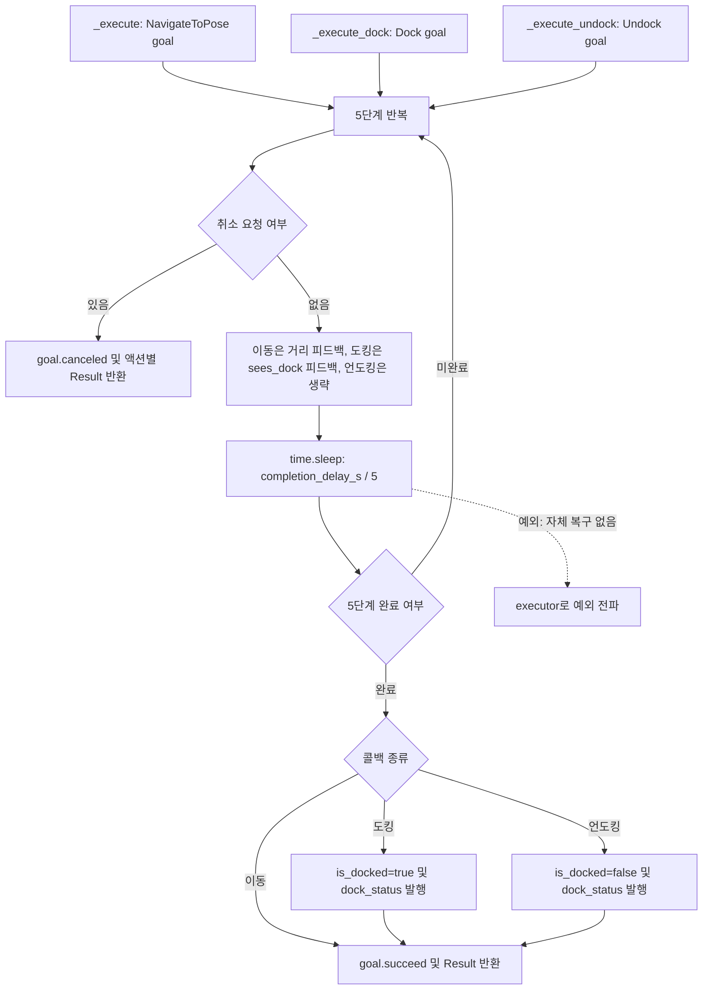

# Nav2 stub 액션 대기 수정

- 일자: 2026-09-10.
- 승인 범위: 사용자가 요청한 `/home/mu-01/Downloads/nav2_stub.py`의 액션 대기 방식 수정.
- 대상: `_execute`, `_execute_dock`, `_execute_undock`.
- 기준: 기존 `MultiThreadedExecutor(num_threads=4)`에서 동기 콜백으로 실행하고, 각 단계에서 `time.sleep(completion_delay_s / 5)`로 대기한다. asyncio 이벤트 루프는 필요하지 않다. 액션 하나는 실행 중 worker 하나를 점유한다.
- 기존 단계별 취소 검사, 피드백, 도킹 상태 변경, 성공 결과를 유지한다. 마지막 대기 직후에는 기존과 같이 추가 취소 검사가 없다.
- localization QoS와 누락된 Spin 액션은 이번 승인 범위에 포함되지 않는다.

## 코드별 flowchart

구현 대조 완료: 대상 파일 SHA-256 `b4accc6a9f41806095f97ec869ddf2890c6676a42f47bec7744b5db51281be49`.
다음 그림은 위 파일의 세 실행 콜백을 나타낸다. 기존 `main()`의 executor가 해당 콜백을 실행한다.

## 검증

- Python 구문 검사 통과.
- ROS 노드를 생성하지 않고 로컬 `rclpy.Task`에서 세 콜백을 실행했다. 실제 ROS 액션 메시지와 가짜 goal을 사용했다.
- 각 콜백의 성공 및 시작 시 취소 경로 총 6건 통과. 설정한 대기 시간 경과, 도킹 상태 및 결과 값, 취소 시 상태 유지도 확인했다.
- 실제 DDS 액션 통신, 동시 요청, 대기 중 취소, 실제 로봇 주행은 시험하지 않았다. 순찰 전체 완주 검증을 의미하지 않는다.
