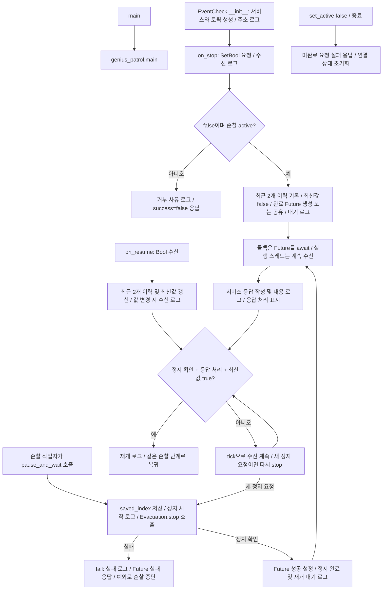
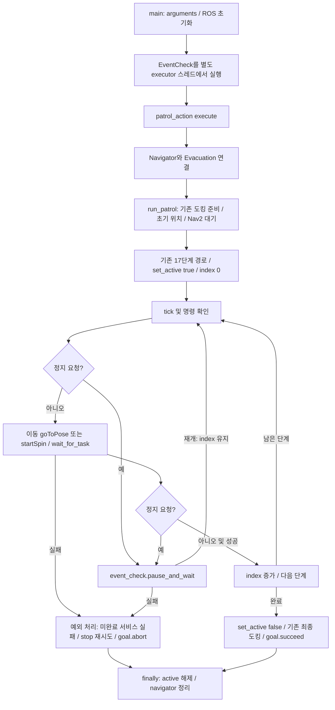
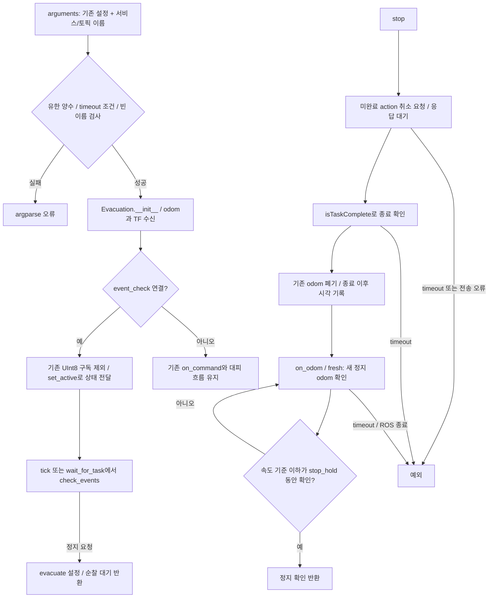
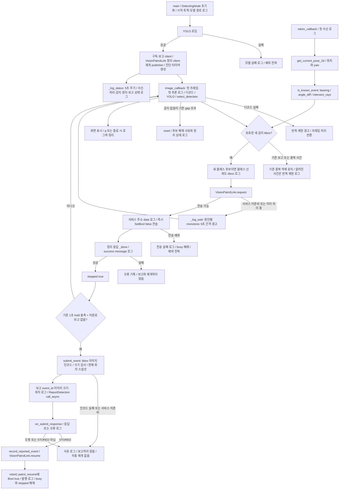

# event_check 구현 대조

2026-09-11 최신 사용자 승인 범위: 첫 유효 bbox에서 즉시 현재 위치 정지 서비스 요청, 정지 완료 후 감지 보고, 시스템 모니터 STORED 응답 후 Bool 토픽 재개.
기존 Markdown 문서는 참조하지 않고 지정된 Python 코드와 추가 지정된 vision_node_v2.py에 대조했다.
비전 연계 검토: [AMR 요청서](change_requests/CR-AMR_09-11_08-00_정지서비스_재개토픽.md).

## 대상 코드 버전 — 구현 대조 완료

경로 기준: `src/patrol_amr_safety/patrol_amr_safety/`. SHA-256:

| 파일 | SHA-256 |
|---|---|
| event_check.py | 71075b7bc793e0d4f52b270205180375c9a87967b47fc92280631bfc371da0bd |
| genius_patrol.py | 5fae34a8ba2e9775b99d5076d7cec04889399a53dd11d1e8f4a6885fafef0970 |
| move_to_safetyzone.py | 1934f394a2799540d16ab9f9982057ce847efdeb1a5dbebda63aebe20d6fad72 |
| vision_node_v2.py | a9b8bd4e6726941bda0985f5ffc2ce2878cb5f7ad678765018356f504b3f5470 |

## event_check.py

`false` 토픽은 재개를 보류하며 정지 서비스를 대신하지 않는다. 순찰 준비·도킹 구간의 정지 요청은 실패 응답한다. 초기 true는 새로운 순찰을 시작하지 않는다. 중복 서비스 요청은 진행 중인 정지 결과를 공유한다.

## genius_patrol.py

이동은 같은 목적지로 재요청한다. 회전은 현재 위치에서 기존 360도 회전을 다시 실행한다. event_check가 연결된 실행에서는 안전구역 이동을 호출하지 않는다. 연결하지 않은 호출의 기존 `escape_and_wait` 분기는 유지한다.

## move_to_safetyzone.py — 연결 및 공통 정지

정지 수치는 기존 시험값을 유지했다: 선속도 0.01 m/s, 각속도 0.02 rad/s, 유지 0.5초, timeout 10초, 자료 유효기간 1초. 취소 응답만으로 성공 처리하지 않는다. 콜백은 Nav2 이동·취소를 직접 호출하지 않는다.

## vision_node_v2.py 및 event_check.VisionPatrolLink

2026-09-11 후속 사용자 결정으로 `vision_node_v2.py`의 ROBOT_ID를 robot1로 변경했다. 현재 카메라·odom 토픽은 `/robot1/...`로 지정되어 있고 정지 서비스·재개 토픽·감지 보고 robot_id는 ROBOT_ID를 사용한다. AMR 실행은 `event_check.py --robot-id robot1`로 맞춘다. 첫 bbox의 정지 요청은 1초 hold를 기다리지 않는다. 기존 신뢰도·중복 억제·보고 hold 조건은 유지한다. 정지 요청 후 감지가 hold 전에 사라져 보고가 없으면 STORED 응답도 없으므로 자동 재개하지 않는다. 보고가 진행 중일 때는 다른 보고를 겹쳐 보내지 않는다. 카메라 토픽은 robot1 namespace로 변경했고 모델·보고 서비스 설정은 유지했다.

현재 작업본의 모델 경로는 `/home/mu-01/patrol/detection_best/detection_best.pt`이며, 이번 연결 복구에서는 이 절대경로를 유지했다. 앞선 확인에서 YOLO 모델 로딩과 fire·leak·obstacle 클래스 확인에 성공했으나, 이번 검사는 모델 대역을 사용했다. 카메라 수신·실제 추론 및 주행 검증을 뜻하지 않는다.

2026-09-11 후속 복구 요청으로 빠져 있던 `VisionPatrolLink` import와 `DetectingNode.__init__`의 생성을 다시 연결했다. `VisionPatrolLink`는 전달받은 비전 노드에서 정지 service client와 재개 publisher를 생성하므로 ROS 그래프에서는 둘 다 `/detecting_node_test`에 속한다. 감지 시 `request()`, 정지 확인 후 이미지 보고, STORED 후 `resume()` 및 기존 진단 로그를 복구했다. 현재 파일의 모델 경로·감지 수치·중복 판정은 유지했다.

### 진단 로그 — 2026-09-11 사용자 요청 반영

시작 시 `VISION START`, `YOLO loading`, `YOLO ready`, `VISION READY`로 로봇·토픽·모델 로딩 단계를 확인한다. 카메라·odom 첫 수신과 첫 추론 시작을 기록하며, `VISION STATUS`는 5초 주기로 카메라 발행자 수, 수신·처리 프레임 수, 마지막 카메라·odom 수신 후 경과 시간, bbox·감지 결과, 정지·보고 대기 상태와 보고 서비스 준비 여부를 출력한다. 이 주기는 진단 출력용이며 안전 timeout이나 정지·재개 판단에 사용하지 않는다.

새 후보의 클래스·신뢰도·bbox 다음에 정지 서비스 미준비, 기존 처리 대기, 요청 전송, 응답 성공·실패가 이어진다. `VisionPatrolLink._log_wait`는 같은 대기 사유를 monotonic 기준 최소 5초 간격으로 출력한다. `EventCheck`에서는 요청 수신·거부, 순찰 작업자의 실제 정지 시작·확인, 서비스 응답, 재개 수신·실행을 구분한다. 보고 단계는 `SUBMIT request`와 결과 또는 생략·실패 사유를 기록하고, STORED 후 재개 발행을 기록한다. 기존 정지 조건·검증 수치·중복 억제·보고 및 재개 정책은 변경하지 않았다.

## 검증

연결 복구 후 `test_event_check.py`와 `test_vision_event_link.py`의 총 27개 검사가 통과했다. 추가한 검사는 실제 `DetectingNode.__init__`를 실행해 robot1 정지 client·재개 publisher·이미지 보고 client의 연결을 확인한다. ROS 엔티티와 YOLO는 시험 대역을 사용하며, 실행 중인 비전 프로세스 재시작·실기 정지 및 재개는 수행하지 않았다.

2026-09-11 진단 로그 추가 후 아래 26개 검사를 다시 통과했다. 모델을 시험 대역으로 바꾸고 localhost·별도 ROS domain에서 노드를 실행해, 카메라가 없는 상태의 시작 로그와 5초 `VISION STATUS` 출력을 확인했다. 이 확인에서 정지 서비스 요청은 보내지 않았으며 실제 모델 추론·카메라·로봇 정지 성공을 검증한 것은 아니다. 시험 환경의 pytest 플러그인 호환 문제는 자동 플러그인 로딩을 끄고, ROS 로그 저장 경로는 `/tmp`로 지정해 검사했다.

`test/test_event_check.py`, `test/test_vision_event_link.py`: 26개 검사 통과. 실제 로컬 ROS executor의 서비스·토픽 왕복, 완료 전 응답 금지, 먼저 도착한 재개, 중복 정지, 이동·회전 동일 단계 재실행, 오래된 odom·움직이는 odom·취소 미완료 실패를 확인했다. 비전 코드의 첫 bbox 정지 요청과 hold/정지 응답 순서, 시스템 모니터 STORED 이후에만 재개하는 것도 확인했다. Nav2/odom/카메라/YOLO/시스템 모니터는 시험 대역을 사용했다. 실기 주행 및 실제 비전·모니터 통합시험은 수행하지 않았다. 기존 패키지 전체 빌드·배포는 검증 범위에 포함하지 않았다.
