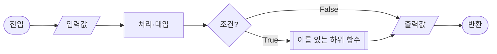
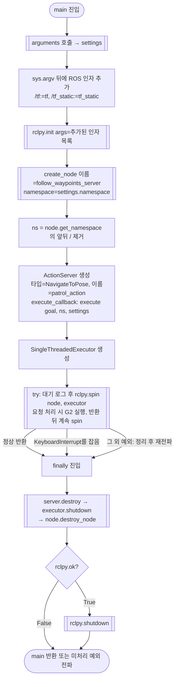
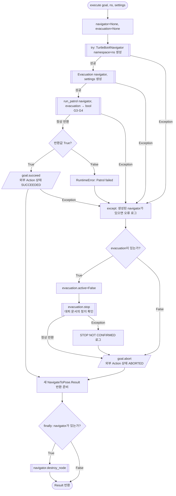
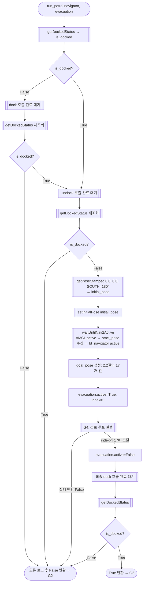
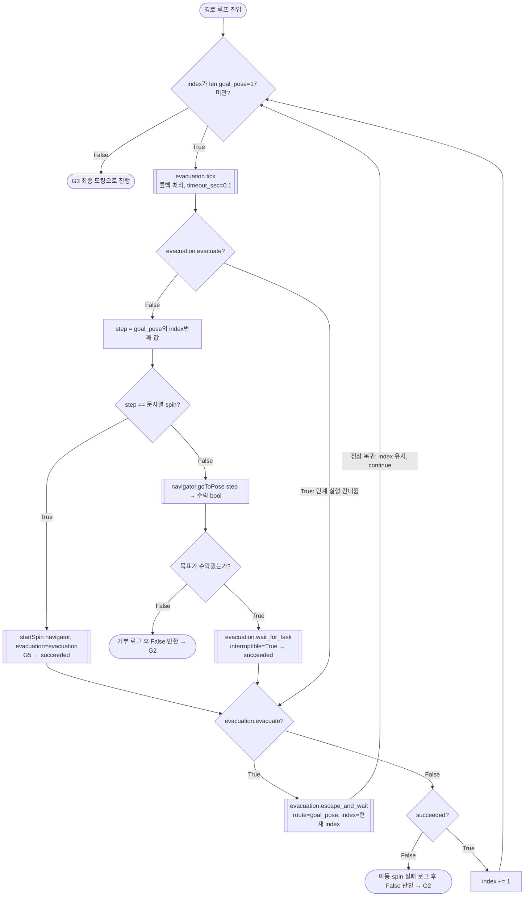
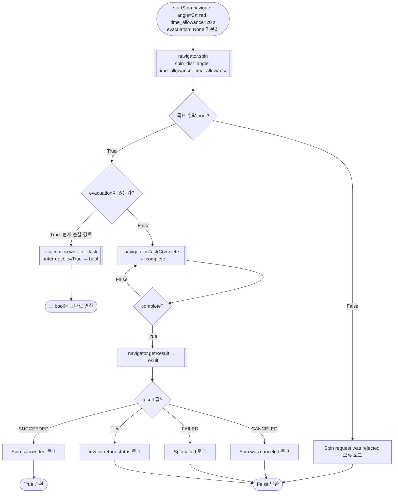

# genius_patrol.py 현재 코드 흐름과 데이터

**구현 대조 완료: 2026-09-11 KST.** 저장된 현재 작업본을 정적으로 대조했다. 실행·실기 시험 결과를 의미하지 않는다.

| 대상 | 대조 버전 |
|---|---|
| [genius_patrol.py](../src/patrol_amr_safety/patrol_amr_safety/genius_patrol.py) | 206행, SHA-256 `12344529c2f84c9817348b721127efd435d3a014eaf867a1b0cd4fe3b181383a` |
| [move_to_safetyzone.py](../src/patrol_amr_safety/patrol_amr_safety/move_to_safetyzone.py) | 228행, SHA-256 `34637ffd14929c85b1f054e6970ea9ee93c93c2807f035d0b71aba5069883430` |
| 저장소 기준 | HEAD `dd63a49142f269cd526237bbd0f08cb8bc1db9f9` + 위 작업본. `genius_patrol.py`의 미커밋 변경을 포함한다. |

순찰 코드는 아래 G1~G5, 대피 코드는 [move_to_safetyzone.py 함수별 상세 그림](move_to_safetyzone_flowchart.md)을 읽는다. **현재 진입 Action은 `patrol_action`이고, 총 17단계(이동 9회·spin 8회)를 실행한다.** 이전 문서의 `patrol_start`, WP1만 이동, 초기 방향 NORTH, `startToPose()` 호출 설명은 이 버전에 적용하지 않는다.

그림만 모은 [HTML 보기본](patrol_safety_flowcharts.html)은 외부 렌더러 없이 열 수 있다. 아래 Mermaid 원본을 수정하면 HTML도 다시 생성해야 한다.

이 문서는 AMR 개별 시험 코드의 관찰 결과다. UInt8 명령·고정 좌표·동일 index 재실행을 공용 계약으로 확정하지 않는다. 공용 명령과 책임 경계는 [interfaces.md](interfaces.md), 재개 계약은 [2026-09-09 AMR 명령·임무 기준](decisions/2026-09-09-amr-command-mission-contract.md), 담당 기능·TBD는 [amr.md](amr.md)를 따른다. 새로운 계약 결정·코드 변경·수정 요청서는 이번 문서 작업에 포함하지 않았다.

## 1. 순서도 작성 기준과 읽는 법

기호와 분기 표현은 정보처리 순서도 표준 [ISO 5807:1985](https://www.iso.org/standard/11955.html)를 기준으로 한다. 데이터·처리·기정의 처리·판단·흐름선은 [표준 미리보기 9.1~9.3절](https://preview.sist.si/sist-preview/11955/1b7dd254a2a54fd7a89d616dc0570e18/ISO-5807-1985.pdf)의 의미에 맞춰 Mermaid로 표현했다. 아래 범례는 이 문서의 표기 규칙이며, 도형 치수까지 인증한 도면이라는 뜻은 아니다.

| 표현 | 의미와 사용 |
|---|---|
| 둥근 양끝 `([…])` | 함수 진입·반환·예외로 종료 |
| 직사각형 `[…]` | 값 대입·계산·상태 변경 |
| 평행사변형 `[/…/]` | 외부 데이터 입력·출력 |
| 마름모 `{…}` | 조건 평가. 나가는 선에 True/False 또는 해당 값을 명시 |
| 양쪽 이중선 `[[…]]` | 다른 절·모듈에서 설명하는 함수 호출 |
| 화살표 `-->` | 해당 그림의 실행 순서. 값은 선 또는 연결된 상자에 명시 |

함수별 그림의 화살표는 제어 흐름이다. ROS 콜백은 메시지가 도착하고 executor가 처리할 때 호출되므로, `on_command()`에서 `escape_and_wait()`로 직접 호출하는 화살표를 그리지 않는다. 콜백이 바꾸는 `evacuate`·`resume`·`odom`을 다른 함수가 읽는 관계는 데이터 표와 분기에서 표시한다. 하위 호출에서 전파된 `Exception`은 G2의 실패 처리로 모인다.

## 2. 실제 오가는 값

### 2.1 프로세스·ROS 경계

`settings.namespace`는 일반 인자 `--robot-id`/`--namespace`로 정한 값이고, `ns`는 생성된 서버 노드의 **실제** namespace에서 앞뒤 `/`를 제거한 값이다. ROS `__ns` remap은 후자를 바꿀 수 있다. 기본 실행에서 둘 다 `robot1`이며, `--robot-id robot6`이면 둘 다 `robot6`이다.

| 송신 → 수신 | 이름·타입 | 사용되는 값 / 반환 |
|---|---|---|
| 외부 Action 클라이언트 → 서버 | 실제 서버 namespace의 `patrol_action`, `nav2_msgs/action/NavigateToPose` | goal의 `pose: PoseStamped`, `behavior_tree: string` **모두 읽지 않는다**. 요청은 고정 순찰 시작 신호다. `execute`의 `goal`은 ServerGoalHandle이다. |
| 서버 → 외부 Action 클라이언트 | 위 Action의 종료 상태와 Result | 성공 `goal.succeed()`, 실패 `goal.abort()`; 양쪽 모두 새 `NavigateToPose.Result()` 반환. 설치된 Jazzy 기본값은 `error_code=0`, `error_msg=''`. 실패 원인을 Result 필드에 채우지 않는다. |
| 순찰/대피 코드 → Nav2 | navigator namespace의 `navigate_to_pose`, 같은 Action 타입 | `goal.pose=step` 또는 안전구역/복귀 `PoseStamped`; `behavior_tree=''` 기본값. `goToPose()`의 True는 **목표 수락**, 완료는 별도로 검사한다. |
| `startSpin()` → Nav2 | navigator namespace의 `spin`, `nav2_msgs/action/Spin` | `target_yaw=2π` rad, `time_allowance.sec=20`, `.nanosec=0`. `spin()`의 True는 목표 수락이다. |
| navigator → 도킹 서버 | navigator namespace의 `dock` / `undock`, `irobot_create_msgs/action/Dock` / `Undock` | Goal에 사용자 필드 없음. 라이브러리가 Action 완료를 기다린다. 함수 반환은 None이며 호출자는 `getDockedStatus()`를 따로 검사한다. |
| 로봇 상태 → navigator | navigator namespace의 `dock_status`, `irobot_create_msgs/msg/DockStatus` | `is_docked: bool` 저장·조회. `run_patrol`은 충전 상태나 도킹 Action 결과 필드를 직접 판정하지 않는다. |
| `setInitialPose()` → 위치 추정 | navigator namespace의 `initialpose`, `geometry_msgs/msg/PoseWithCovarianceStamped` | `map`, 위치 `(0,0,0)`, SOUTH에 해당하는 quaternion. 생성한 initial_pose의 stamp를 그대로 복사하며 재발행 때도 유지한다. covariance 36개는 기본 0이다. |
| 외부 시험 명령 → `on_command()` | `settings.command_topic`, `std_msgs/msg/UInt8` | `data=1`: 순찰 중 대피 플래그, `data=2`: 안전구역 대기 중 재개 플래그. 상세 수락 조건은 대피 문서. |
| odom/TF → 대피 helper | `settings.odom_topic`, Odometry; TF Buffer | header 시각, 3축 선속도·각속도, map에서 본 base 위치 x/y. [상세 입력과 검사](move_to_safetyzone_flowchart.md) 참조. |

두 파일에는 직접 `cmd_vel` 발행, 외부 Action feedback 발행, 외부 취소 처리 콜백이 없다. 설치된 `rclpy.action.ActionServer`의 기본 goal callback은 ACCEPT, 기본 cancel callback은 REJECT다. **Nav2 내부 작업 취소**와 **외부 `patrol_action` 취소**는 별개다. 위 이름은 remap 전 상대 이름 또는 기본 해석이며 실제 ROS remap이 있으면 달라진다.

`arguments()`는 ROS remap 적용 전에 명령/odom의 기본값을 `/{settings.namespace}/…`라는 절대 경로로 만든다. 일반 인자는 기본 robot1인데 `__ns:=/robot6`만 주면 서버/navigator는 robot6, 명령/odom 기본 경로는 robot1이다. TF 토픽 remap `/tf:=tf`, `/tf_static:=tf_static`은 navigator namespace로 해석되며 TF **프레임 이름** `map`, `base_link`에는 namespace를 붙이지 않는다.

### 2.2 좌표와 순찰 순서

`TurtleBot4Navigator.getPoseStamped(position, rotation)`에서 위치 단위는 m, `rotation` 숫자의 단위는 **degree**다. `header.frame_id='map'`으로 고정되며 생성 시 `header.stamp=현재 ROS 시각`, `pose.position.z=0`, quaternion `(x,y,z,w)=(0,0,sin(θ/2),cos(θ/2))`, `θ=degree×π/180`이다. 방향 상수는 **NORTH=0°, WEST=90°, SOUTH=180°, EAST=270°**다. 명칭을 다른 방위 규칙으로 다시 해석하지 않는다.

| `goal_pose` index | 코드의 값 | x (m) | y (m) | 방향 / yaw |
|---:|---|---:|---:|---|
| 0 | PoseStamped | -0.206 | -1.038 | WEST / 90° |
| 1 | 문자열 `'spin'` | — | — | +2π rad 회전 |
| 2 | PoseStamped | -1.147 | 0.500 | SOUTH / 180° |
| 3 | `'spin'` | — | — | +2π rad |
| 4 | PoseStamped | -2.029 | -0.916 | EAST / 270° |
| 5 | `'spin'` | — | — | +2π rad |
| 6 | PoseStamped | -2.751 | -2.422 | SOUTH / 180° |
| 7 | `'spin'` | — | — | +2π rad |
| 8 | PoseStamped | -4.389 | -1.122 | WEST / 90° |
| 9 | `'spin'` | — | — | +2π rad |
| 10 | PoseStamped | -2.909 | 0.575 | NORTH / 0° |
| 11 | `'spin'` | — | — | +2π rad |
| 12 | PoseStamped | -2.029 | -0.916 | EAST / 270° (index 4 재방문) |
| 13 | `'spin'` | — | — | +2π rad |
| 14 | PoseStamped | -1.374 | -2.439 | NORTH / 0° |
| 15 | `'spin'` | — | — | +2π rad |
| 16 | PoseStamped | 0.0 | 0.0 | NORTH / 0° (뒤에 spin 없음) |

초기 pose는 경로와 별도로 `(0,0,SOUTH=180°)`다. pose 목록은 순찰 루프 전에 한 번 만든다. 일반 순찰 `goToPose(step)`는 stamp를 갱신하지 않지만, 대피의 `navigate(pose)`는 입력 객체의 stamp를 현재 시각으로 갱신한다. spin 복귀 때 직전 경로 pose를 넘기면 해당 경로 객체도 갱신된다.

### 2.3 함수 사이 반환값과 저장값

| 값 | 생산 → 소비 | 정확한 의미 |
|---|---|---|
| `settings` | `arguments()` → `main`, `execute`, `Evacuation` | argparse Namespace. [인자·기본값](move_to_safetyzone_flowchart.md) 참조 |
| `navigator` | `execute()` → 순찰 함수와 대피 helper | 한 목표 실행에서 같은 TurtleBot4Navigator 인스턴스 공유 |
| `evacuation.active` | `run_patrol`/실패 처리 → `on_command` | 준비 중 False, 경로 루프 직전 True, 루프 정상 완료·실패 정리에서 False |
| `index` | `run_patrol` → `escape_and_wait(route,index)` | 0부터 시작하는 현재 단계. 성공 때만 +1. 대피 복귀 때 유지 |
| `saved_index` | `escape_and_wait` → 재개 분기 | 현재 index의 메모리 사본. 디스크 저장·재시작 복원 없음 |
| `succeeded: bool` | `startSpin`/`wait_for_task` → 순찰 루프 | 정상 완료 True; 거부·실패·취소·대피 감지 False. 대피 플래그를 먼저 검사해 후속 처리 구분 |
| `TaskResult` | `navigator.getResult()` → 완료 판정 | UNKNOWN=0, SUCCEEDED=1, CANCELED=2, FAILED=3. ROS Action 상태 4/5/6을 각각 SUCCEEDED/CANCELED/FAILED로 변환하며 그 외는 UNKNOWN |

`wait_for_task()`가 작업 완료와 대피 플래그를 함께 관찰하면 **대피 분기가 우선**이다. 완료 판정은 `TaskResult.SUCCEEDED`와 비교하며 Nav2 결과의 `error_code`를 직접 읽지 않는다.

## 3. G1 — main(): 인자, 서버 생성, 실행과 종료

대상: `genius_patrol.py:173–206`. `arguments()` 검증은 [대피 모듈 그림](move_to_safetyzone_flowchart.md)을 참조한다. 대피 모듈은 import해서 쓰며 별도 프로세스로 실행하지 않는다.

`arguments()`부터 executor 생성까지는 `main`의 try/finally 바깥이다. 인자 오류는 argparse `SystemExit`, 초기화/생성 오류는 해당 예외로 종료하며 위 finally에 들어가지 않는다. 정리 함수 자체가 예외를 내면 뒤 정리가 모두 보장되지는 않는다. localization·Nav2 프로세스를 자동 실행하는 코드는 없다.

## 4. G2 — execute(goal, ns, settings): 외부 Action 결과와 실패 처리

대상: `genius_patrol.py:144–170`. G3/G4의 실패 반환 False는 `RuntimeError('Patrol failed')`로 바뀐다. 하위 함수의 예외도 같은 except에서 처리한다.

그림은 코드가 명시적으로 처리하는 정상/Exception 경로다. `finally`는 반환·예외 탈출 때 실행된다. `KeyboardInterrupt` 등 `BaseException`은 이 `except Exception`으로 처리하지 않으며, `abort()`·오류 로그·`destroy_node()` 자체의 예외도 정상 Result 반환을 보장하지 않는다. `Evacuation()` 생성 도중 실패하면 대입이 끝나지 않아 `evacuation=None`이므로 해당 stop 호출을 건너뛴다.

실패 시 정지 확인까지 실패해도 `STOP NOT CONFIRMED`를 기록한 뒤 abort한다. 따라서 **ABORTED는 실제 정지가 확인됐다는 신호가 아니다**. Action Result 내용은 성공/실패 모두 2.1절의 기본값이다.

## 5. G3 — run_patrol(): 준비, 초기 pose, 최종 도킹

대상: `genius_patrol.py:69–114, 133–141`. `getDockedStatus()`는 첫 상태가 들어올 때까지 기다린다. `dock()`/`undock()`의 반환값을 검사하는 그림으로 바꾸면 실제 코드와 달라진다.

이 그림의 하위 호출에서 발생한 예외는 `run_patrol`에서 잡지 않고 G2로 전파한다. 준비와 최종 도킹 중에는 `active=False`라 명령 1·2를 수락하지 않는다. Nav2 준비·Action 서버/응답 대기에 이 코드가 별도의 전체 timeout을 씌우지는 않는다.

## 6. G4 — run_patrol(): 이동·spin·대피 후 동일 단계 재개

대상: `genius_patrol.py:115–132`. G3에서 `goal_pose`, `active=True`, `index=0`을 준비한 다음 진입한다. G4는 별도 Python 함수가 아니라 `run_patrol`의 while 구간을 확대한 그림이다.

`evacuate=True`로 단계 실행을 건너뛴 경우 `succeeded`를 새로 대입하지 않지만, 대피 함수 뒤 `continue`하므로 그 값을 읽지 않는다. **이동 요청 거부는 즉시 False 반환**하여 대피 플래그 재검사에 도달하지 않는다. spin 요청 거부는 `startSpin=False` 뒤 대피 플래그를 다시 검사한다. 하위 호출의 미처리 예외는 G2로 전파한다.

재개 예: index 2 이동 중 대피 → 안전구역에서 명령 2 → G4의 index 2 목표를 다시 요청한다. index 3 spin 중 대피 → index 2 위치로 복귀 → G4의 index 3에서 **+2π 전체 회전**을 다시 요청한다. 남은 각도만 계산하지 않는다. [escape_and_wait 상세 그림](move_to_safetyzone_flowchart.md)을 참조한다.

## 7. G5 — startSpin(): 회전 요청과 두 완료 대기 경로

대상: `genius_patrol.py:39–66`. G4는 항상 `evacuation`을 넘긴다. `evacuation=None`인 독립 호출 경로도 함수에 있으므로 함께 표시한다.

현재 순찰 호출은 함수 아래쪽의 성공/취소/실패별 로그 구간에 도달하지 않는다. `20 s`는 Spin Goal의 time allowance이며 이 Python 함수 전체의 벽시계 timeout이 아니다. 하위 호출 예외는 호출자에게 전파된다.

## 8. 라이브러리 경계와 검증 범위

위 이중선 상자에서 쓰는 공통 동작은 다음과 같다. 이 두 파일이 직접 구현한 로직은 G1~G5 및 [대피 모듈 그림](move_to_safetyzone_flowchart.md)이다.

| 공통 호출 | 로컬 구현에서 대조한 동작 |
|---|---|
| `getPoseStamped` | degree/방향 enum을 quaternion으로 바꾼 PoseStamped 생성. 기본 frame `map` |
| `goToPose` / `spin` | Action 서버 대기 → Goal 전송 → goal handle 수락 확인 → result future 보관 → bool 반환 |
| `isTaskComplete` / `getResult` | future 진행을 spin으로 처리 → 완료 여부·Action 상태 저장 → TaskResult 변환. 완료 대기 중 navigator의 구독 콜백도 처리 가능 |
| `cancelTask` | 현재 result future가 있으면 해당 goal handle의 취소 요청과 응답 대기. 응답 코드를 검사하지 않음. Dock/Undock 전용 goal handle을 취소하는 함수는 아님 |
| `dock` / `undock` / `getDockedStatus` | 도킹 계열 Action 수행·완료 대기와 별도 `dock_status.is_docked` 구독값 조회 |
| `waitUntilNav2Active` | 기본 localizer `amcl`과 `bt_navigator` 활성 및 초기 위치 수신 대기 |

근거: [로컬 TurtleBot4Navigator](../src/turtlebot4_navigation/turtlebot4_navigation/turtlebot4_navigator.py), `/opt/ros/jazzy/lib/python3.12/site-packages/nav2_simple_commander/robot_navigator.py`, `rclpy/action/server.py`, `/opt/ros/jazzy/share/nav2_msgs/action/{NavigateToPose,Spin}.action`, `irobot_create_msgs/action/{Dock,Undock}.action`. 설치 라이브러리가 바뀌면 경계 설명도 재대조해야 한다.

검증: 두 문서의 Mermaid 18개(범례 1개 포함)를 Mermaid 11.16.1로 구문 검사하고 SVG·PNG로 렌더링했다. 함수·분기·값·링크와 대상 소스 해시도 확인했다. ROS Action/topic 종단간 시험, TF/odom 실제 수신, 물리적 정지·주행·회전·도킹 검증은 수행하지 않았다. 안전구역·정지 임계값은 현재 시험 설정이며 실기 적합성은 미확인이다. 공용 정책의 남은 TBD는 [amr.md](amr.md)와 [interfaces.md](interfaces.md)에 유지하며, 이번에 임의로 해결하거나 재정의하지 않았다.
