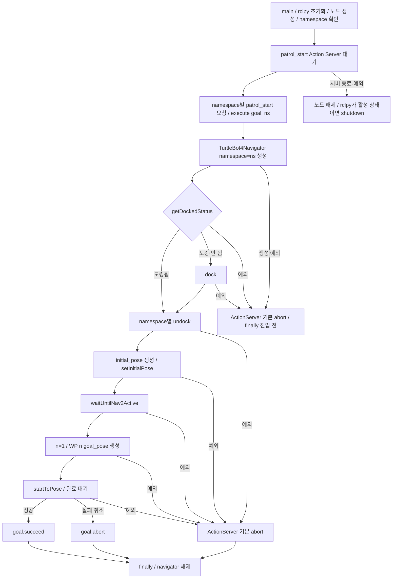

# genius_patrol Action 콜백 시험

2026-09-09 사용자 요청: execute를 제공된 TurtleBot4Navigator 순서로 교체.
[genius_patrol.py](../src/patrol_amr_safety/patrol_amr_safety/genius_patrol.py)

- `TurtleBot4Navigator(namespace=ns)` → 도킹 상태 확인 및 필요 시 `dock()` → `undock()` → 초기 pose 설정 → `waitUntilNav2Active()` → `n=1` → `startToPose(WP[n])`.
- 2026-09-09 사용자 결정: 노드의 실제 namespace를 execute에 전달한다. 기본은 robot1이며 `--ros-args -r __ns:=/robot6`으로 변경한다. 요청은 `/{ns}/patrol_start`, undock은 `/{ns}/undock`이다. navigator의 다른 Action·토픽도 같은 namespace를 사용한다.
- 기준 (2026-09-10 사용자 변경 및 정리 요청): main의 localization·Nav2 자동 실행이 제거되었다. localization·Nav2는 같은 namespace로 별도 실행해야 하며 execute의 `waitUntilNav2Active()`가 준비를 확인한다. 사용하지 않는 launch 프로세스 목록·종료 루프와 `signal`·`subprocess` import를 제거했다. 서버 종료 시 노드를 해제하고 rclpy를 종료한다.
- 초기 pose는 사용자 예제의 `[0.0, 0.0], NORTH`다. 실제 위치 확인값으로 간주하지 않는다.
- `startToPose`가 내부에서 이동 완료를 기다린다. 설치된 라이브러리의 600초 navigation timeout도 그대로 적용된다.
- 결과에 따라 외부 goal을 성공/실패 처리하고 navigator를 해제한다. Action 취소·feedback은 아직 연결하지 않았다.

## 코드별 flowchart

구현 대조 완료: 2026-09-10 localization·Nav2 자동 실행 제거 후 잔여 코드 정리 버전. 실기 검증 미실행.



```bash
source /home/mu-01/patrol/install/setup.bash
ros2 run patrol_amr_safety genius_patrol --ros-args -r __ns:=/robot1
```

```bash
ros2 action send_goal /robot1/patrol_start nav2_msgs/action/NavigateToPose '{}'
```

robot6 시험은 실행 명령과 요청 명령의 robot1을 모두 robot6으로 변경한다.
