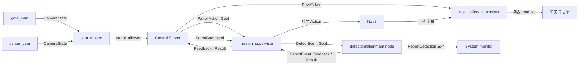

# 공용 ROS 2 인터페이스

> 기준일: 2026-09-10
>
> 상태: 공용 타입 구현 완료 · 소비 코드 전환 및 통합시험 전
>
> 공용 패키지: `patrol_interfaces`

이 문서는 Control Server, AMR, CCTV 비전, 시스템 모니터 사이에서 기본 순찰 시나리오에 사용하는 ROS 2 인터페이스의 기준이다. 실제 코드 반영과 장비 검증 결과는 별도로 기록한다.

## 1. 공통 규칙

- `{robot}`은 `robot1` 또는 `robot6`이다.
- 로봇별 인터페이스는 `/{robot}/...` 아래에 둔다.
- 메시지의 `robot_id`는 토픽 namespace와 일치해야 한다.
- `map` 좌표계를 사용한다.
- Control Server만 외부 순찰 Action을 호출한다.
- AMR의 `mission_supervisor`가 Nav2 Action을 내부적으로 사용한다.
- Action Goal이 수락되어도 유효한 Drive Token을 받기 전에는 주행하지 않는다.
- 모든 최종 속도 출력은 AMR의 `local_safety_supervisor`를 통과한다.

## 2. 전체 인터페이스 트리

다음 그림은 목표 설계이며 현재 ROS 그래프의 구현 완료 상태를 의미하지 않는다.



```text
순찰 시스템
├── Control Server
│   ├── Action Client  /{robot}/patrol_action
│   ├── Publisher      /{robot}/patrol_command
│   ├── Publisher      /{robot}/drive_token
│   ├── Subscriber     /vision/cctv/patrol_allowed
│   └── 향후 구현      /control/estop
├── AMR /{robot}
│   ├── mission_supervisor
│   │   ├── Action Server  patrol_action
│   │   ├── Subscriber     patrol_command
│   │   └── Action Client  detect_event
│   ├── local_safety_supervisor
│   │   └── Subscriber     drive_token
│   └── detection/alignment node
│       ├── Action Server  detect_event
│       └── Service Client /system_monitor/report_detection
├── CCTV 비전
│   ├── gate_cam      → /vision/cctv/gate_event
│   ├── center_cam    → /vision/cctv/center_event
│   └── cam_master    → /vision/cctv/patrol_allowed
└── System monitor
    └── Service Server /system_monitor/report_detection
```

## 3. 인터페이스 목록

| 이름 | 타입 | 송신 → 수신 | 용도 |
|---|---|---|---|
| `/{robot}/patrol_action` | `patrol_interfaces/action/Patrol` | Control Server ↔ AMR `mission_supervisor` | 순찰 시작, 진행 상태, 방문 완료, 최종 결과 |
| `/{robot}/patrol_command` | `patrol_interfaces/msg/PatrolCommand` | Control Server → AMR `mission_supervisor` | 안전구역 이동과 순찰 재개 |
| `/{robot}/drive_token` | `patrol_interfaces/msg/DriveToken` | Control Server → AMR `local_safety_supervisor` | 주행 권한 부여·갱신·회수 |
| `/{robot}/detect_event` | `patrol_interfaces/action/DetectEvent` | AMR `mission_supervisor` ↔ AMR 감지 노드 | AMR 내부 정렬·연속 검증 |
| `/system_monitor/report_detection` | `patrol_interfaces/srv/ReportDetection` | AMR 감지 노드 → System monitor | 확정 사건과 증거 사진 저장 |
| `/vision/cctv/gate_event` | `patrol_interfaces/msg/CameraState` | `gate_cam` → `cam_master` | 차량 진입·이탈 상태 |
| `/vision/cctv/center_event` | `patrol_interfaces/msg/CameraState` | `center_cam` → `cam_master` | 차량 주차·출차 상태 |
| `/vision/cctv/patrol_allowed` | `std_msgs/msg/Bool` | `cam_master` → Control Server | 순찰 허용 조건 |
| `/control/estop` | `patrol_interfaces/msg/EStop` | 향후 Safety Arbiter → AMR | 예약된 비상정지 인터페이스, 현재 미구현 |

## 4. Patrol Action

### 4.1 Goal

```text
string command_id
string robot_id
```

- 각 AMR은 자체 설정에 등록된 기본 순찰 경로를 실행한다.
- 같은 Goal을 재시도할 때는 같은 `command_id`를 사용한다.
- Goal이 수락되어도 AMR은 `WAITING_FOR_TOKEN` 상태를 먼저 보고한다.

### 4.2 Feedback

```text
uint8 task_state
string current_waypoint_id
string last_command_id
uint8 command_status
bool token_valid
uint32 accepted_token_sequence
geometry_msgs/PoseStamped current_pose
string event_id
uint8 event_type
```

`task_state`:

```text
WAITING_FOR_TOKEN     = 1
UNDOCKING             = 2
INITIAL_POSE_READY    = 3
PATROLLING            = 4
MOVING_TO_SAFE_ZONE   = 5
DETECTION_PROCESSING  = 6
DETECTION_CONFIRMED   = 7
RESUMING              = 8
DOCKING               = 9
BLOCKED               = 10
WAYPOINT_REACHED      = 11
```

`command_status`:

```text
NONE       = 0
ACCEPTED   = 1
EXECUTING  = 2
REJECTED   = 3
```

`event_type`:

```text
FIRE     = 1
LEAK     = 2
OBSTACLE = 3
```

- `INITIAL_POSE_READY`에서는 `current_pose`가 유효하다.
- `WAYPOINT_REACHED`에서는 `current_waypoint_id`가 유효하다. Control Server는 Feedback 수신 시각을 방문 시각으로 저장한다.
- `DETECTION_CONFIRMED`에서는 `event_id`와 `event_type`이 유효하다.
- 명령 수락 여부는 `last_command_id`와 `command_status`로 보고한다.
- 최신 Token 수신 여부는 `token_valid`와 `accepted_token_sequence`로 보고한다.

### 4.3 Result

```text
uint8 outcome
uint16 reason_code
string reason
```

`outcome`:

```text
SUCCEEDED = 0
FAILED    = 1
CANCELED  = 2
```

`reason_code`:

```text
CONTROL_CANCELED  = 1
SAFETY_STOP       = 2
TOKEN_EXPIRED     = 3
INVALID_COMMAND   = 4
NAVIGATION_FAILED = 5
OBSTACLE_BLOCKED  = 6
LOCALIZATION_LOST = 7
DOCKING_FAILED    = 8
TIMEOUT           = 9
INTERNAL_ERROR    = 10
```

- `SUCCEEDED`에서는 `reason_code`와 `reason`을 사용하지 않는다.
- `FAILED`와 `CANCELED`에서는 `reason_code`를 설정한다.
- Control Server의 취소 요청은 ROS 2 Action Cancel을 사용한다.

### 4.4 정상 시작 순서

```text
1. Control Server → Patrol Goal
2. AMR → Goal 수락
3. AMR → WAITING_FOR_TOKEN Feedback
4. Control Server → DriveToken 발행
5. AMR → token_valid=true Feedback
6. AMR → UNDOCKING
7. AMR → INITIAL_POSE_READY + current_pose
8. AMR → PATROLLING
```

## 5. PatrolCommand

```text
std_msgs/Header header
string command_id
string robot_id
uint8 command
```

`command`:

```text
MOVE_TO_SAFE_ZONE = 1
RESUME_PATROL     = 2
```

`command_id` 형식:

```text
cmd-<robot_id>-<command>-<sequence>
```

- 같은 명령의 재전송에는 같은 `command_id`를 사용한다.
- 새로운 명령 의도에만 새 sequence를 발급한다.
- 이 명령은 실행 중인 Patrol Action을 종료하지 않고 내부 상태만 변경한다.
- 수락과 실행 상태는 Patrol Feedback으로 반환한다.

## 6. DriveToken

```text
std_msgs/Header header
string token
string holder_robot_id
builtin_interfaces/Duration lease_duration
uint32 sequence
```

- 권장 발행 주기는 5 Hz이고 lease는 1초다.
- `holder_robot_id`는 토픽의 `{robot}`과 일치해야 한다.
- `sequence`는 발행할 때마다 증가한다.
- 과거 sequence와 이미 만료된 Token은 폐기한다.
- 빈 `token`은 주행 권한 회수를 의미한다.
- Token은 주행 명령이 아니라 주행 권한이다.
- Token 수신만으로 자동 출발하지 않는다.
- Token이 만료되면 `local_safety_supervisor`가 주행을 차단하고 정지한다.

권장 QoS:

```text
reliability: BEST_EFFORT
durability: VOLATILE
history: KEEP_LAST(3)
deadline: 200 ms
lifespan: 500 ms
```

## 7. DetectEvent Action

이 Action은 AMR 내부 인터페이스다. Control Server는 직접 호출하지 않는다.

### 7.1 Goal

```text
string detection_id
uint8 event_type
float32 min_confidence
```

- `detection_id`는 소문자 UUID v4를 사용한다.
- 확정된 경우 같은 값을 `ReportDetection.event_id`와 Patrol Feedback의 `event_id`로 사용한다.
- 검증 시간은 내부적으로 1초로 고정한다.

### 7.2 Feedback

```text
uint8 state
float32 confirm_elapsed
float32 current_confidence
float32 average_confidence
```

```text
ALIGNING  = 1
VERIFYING = 2
```

- confidence가 `min_confidence` 이상인 상태가 1초 연속 유지되면 확정한다.
- 기준 미달이나 Detection 단절 시 `confirm_elapsed`를 0으로 초기화한다.

### 7.3 Result

```text
bool confirmed
string robot_id
geometry_msgs/PoseStamped current_pose
uint8 event_type
float32 average_confidence
builtin_interfaces/Time event_time
```

- `confirmed=true`이면 `mission_supervisor`가 Patrol Feedback으로 `detection_id`와 `event_type`을 보고한다.
- 감지 노드는 같은 사건을 `ReportDetection` 서비스로 시스템 모니터에 보고한다.

## 8. ReportDetection Service

서비스 이름:

```text
/system_monitor/report_detection
```

System monitor가 Service Server이고 감지 확정 측이 Service Client다.

Request:

```text
string robot_id
string event_id
builtin_interfaces/Time detected_at
geometry_msgs/Point position
uint8[] image
uint8 event_type
```

```text
FIRE     = 1
LEAK     = 2
OBSTACLE = 3
```

Response:

```text
uint8 status
string detail
```

```text
STORED    = 0
DUPLICATE = 1
REJECTED  = 2
```

- `event_id`는 소문자 UUID v4이며 중복 판정의 기준이다.
- `position`은 `map` 좌표계이고 `z=0`으로 설정한다.
- `image`는 JPEG 또는 PNG 원본이며 최대 크기는 1 MiB다.
- 같은 사건은 한 번만 보고한다.
- 응답을 받지 못했을 때만 같은 `event_id`와 같은 내용으로 재시도한다.
- 같은 `event_id`에 다른 내용을 보내면 `REJECTED`다.

## 9. CCTV 차량 상태

`CameraState`:

```text
std_msgs/Header header
string event_id
string camera_id
string source_session_id
uint64 source_sequence
uint8 state
float32 confidence
```

```text
STATE_UNKNOWN  = 0
STATE_ENTERING = 1
STATE_EXITED   = 2
STATE_PARKED   = 3
STATE_EXITING  = 4
```

- `/vision/cctv/gate_event`는 `gate_cam`의 `ENTERING`, `EXITED`만 허용한다.
- `/vision/cctv/center_event`는 `center_cam`의 `PARKED`, `EXITING`만 허용한다.
- `cam_master`는 상태를 종합해 `/vision/cctv/patrol_allowed`를 발행한다.
- `patrol_allowed=false`이면 Control Server는 `MOVE_TO_SAFE_ZONE`을 보낸다.
- `patrol_allowed=true`이면 필요한 조건을 확인한 뒤 `RESUME_PATROL`을 보낸다.
- `patrol_allowed`는 주행 명령이 아니라 허용 조건이다.

## 10. EStop 예약 인터페이스

```text
std_msgs/Header header
string target_robot_id
bool active
uint8 reason
uint64 sequence
```

- 토픽 이름은 `/control/estop`으로 예약한다.
- 공용 타입은 `patrol_interfaces/msg/EStop`을 유지한다.
- 현재 기본 구현에는 publisher, subscriber, 상태 판단을 포함하지 않는다.
- 세부 reason과 활성·해제 정책은 구현 승인 시 별도로 확정한다.

## 11. 기본 시나리오

### 11.1 순찰

```text
Patrol Goal → WAITING_FOR_TOKEN → DriveToken → UNDOCKING
→ INITIAL_POSE_READY → PATROLLING → WAYPOINT_REACHED 반복
→ DOCKING → Patrol Result
```

### 11.2 차량 회피와 재개

```text
patrol_allowed=false → MOVE_TO_SAFE_ZONE → MOVING_TO_SAFE_ZONE
patrol_allowed=true  → RESUME_PATROL → RESUMING → PATROLLING
```

### 11.3 감지 보고

```text
감지 후보 → DetectEvent Action → confirmed
├── Patrol Feedback: DETECTION_CONFIRMED
└── ReportDetection: 사건과 증거 사진 저장
```

### 11.4 화재 Token hold

`DETECTION_CONFIRMED`와 `FIRE`를 받은 Control Server는 내부 `fire_hold`를 활성화한다. 현재 순찰 중인 AMR의 Token 갱신은 임무 종료까지 허용하고 다음 AMR의 Token 발행은 보류한다. `fire_hold`는 운영자가 명시적으로 해제하며 자동 해제하지 않는다.

## 12. 공용 패키지 목표 구조

```text
src/patrol_interfaces/
├── action/
│   ├── Patrol.action
│   └── DetectEvent.action
├── msg/
│   ├── PatrolCommand.msg
│   ├── DriveToken.msg
│   ├── EStop.msg
│   └── CameraState.msg
└── srv/
    └── ReportDetection.srv
```

위 구조는 `patrol_interfaces 2.0.0` 소스에 반영됐다. 각 개발 단위의 소비 코드 변경과 실제 통합시험은 별도 반영 상태로 관리한다.
