# move_to_safetyzone.py 코드 흐름과 전달값

> 아래는 명시된 해시 버전의 대피 흐름 기록이다. 현재 감지 정지·재개 연결과 2026-09-11 spin 정지 확인 보강은 [최신 구현 대조 및 코드별 흐름도](event_check.md)를 따른다.

**구현 대조 완료: 2026-09-11 KST.** 대상은 현재 작업 트리의 [move_to_safetyzone.py](../src/patrol_amr_safety/patrol_amr_safety/move_to_safetyzone.py)다. 기준 HEAD는 `dd63a49142f269cd526237bbd0f08cb8bc1db9f9`, 대상 파일 SHA-256은 `34637ffd14929c85b1f054e6970ea9ee93c93c2807f035d0b71aba5069883430`이다. 이 표시는 소스와 그림의 대조 상태이며 실제 ROS 통신·주행·물리적 정지 시험 완료를 뜻하지 않는다.

호출자와 공통 기호 기준은 [genius_patrol.py 코드 흐름](genius_patrol.md)을 참조한다. 시작·반환·예외 전파는 단말 기호, 계산·대입은 처리 기호, 수신·로그·값 출력은 입출력 기호, 조건은 판단 기호, 다른 함수 호출은 미리 정의된 처리 기호로 표시한다. 판단 분기는 `True`/`False`를 명시한다. 함수의 예외 전파 단말은 프로그램 전체 종료를 뜻하지 않는다.

그림만 모은 [HTML 보기본](patrol_safety_flowcharts.html)에서도 확인할 수 있다. 두 문서의 Mermaid 18개(범례 포함)는 Mermaid 11.16.1 구문 검사·SVG/PNG 렌더링을 통과했다.

이 모듈은 전달받은 `TurtleBot4Navigator`를 공유하는 보조 클래스다. 독립 ROS 노드·순찰 경로·spin 실행·속도 발행 기능은 없다. `UInt8`은 AMR 시험용 명령이며 공용 `MissionCommand` 계약을 대체하거나 변경하지 않는다. 모듈의 docstring과 직접 실행 안내에는 이전 호출자 이름 `3_1_c_follow_waypoints.py`가 남아 있으나, 이번에 대조한 실제 호출자는 `genius_patrol.py`다.

## 1. 상수·설정·자료형

### 1.1 명령·상태·공유 변수

소스 L23–41, L74–85 기준이다.

| 이름 | 값·자료형 | 의미·변경 위치 |
|---|---|---|
| `MOVE_TO_SAFE_ZONE` | 정수 `1` | `on_command()`에서 대피 플래그 설정 요청 |
| `RESUME_PATROL` | 정수 `2` | `on_command()`에서 재개 플래그 설정 요청 |
| `PATROLLING`, `EVACUATING`, `WAITING` | 정수 `0`, `1`, `2` | 내부 상태값. 별도 상태 토픽으로 발행하지 않음 |
| `STATE_NAMES` | `{0: "PATROLLING", 1: "EVACUATING", 2: "WAITING"}` | 수신 로그에 표시. 등록되지 않은 상태는 `UNKNOWN` |
| `SPIN` | 문자열 `"spin"` | 호출자의 경로에서 회전 단계를 식별 |
| `active` | `bool`, 초기 `False` | 호출자가 준비 완료 후 `True`, 정상 경로 종료·실패 처리 시 `False`로 설정 |
| `evacuate` | `bool`, 초기 `False` | 명령 1 수락 시 `True`, 대피 진입 시 `False` |
| `resume` | `bool`, 초기 `False` | 명령 2 수락 시 `True`; 안전구역 대기 진입 직전·복귀 완료 시 `False` |
| `state` | 초기 `PATROLLING=0` | 대피 진입 `1` → 안전구역 정지 확인 후 `2` → 재개 시 `1` → 복귀 처리 후 `0` |
| `saved_index` | `None` 또는 호출자의 정수 `index` | 대피 직전 단계 번호. 함수 종료 후에도 저장값 유지 |
| `odom` | `None` 또는 `nav_msgs/msg/Odometry` | 최신 콜백 메시지 객체. 정지 절차의 action 종료 확인 후 `None`으로 초기화 |
| `safe` | `list[geometry_msgs/msg/PoseStamped]` | 설정의 안전구역을 생성자에서 변환한 목록 |

### 1.2 기본 안전구역

`SAFE_ZONES`의 삽입 순서 `1, 2, 4, 5, 6, 7`로 `args.safe`와 `self.safe`가 만들어진다. dict의 번호는 이후 PoseStamped에 보존하지 않는다. 아래 yaw는 순찰 경로의 방향 enum과 별도로 선언된 안전구역 값이다.

| 원래 WP 번호 | `x` (m) | `y` (m) | `yaw` (degree) |
|---|---:|---:|---:|
| 1 | -0.206 | -1.038 | 90.8 |
| 2 | -1.147 | 0.500 | 175.4 |
| 4 | -2.751 | -2.422 | 182.4 |
| 5 | -4.389 | -1.122 | 94.3 |
| 6 | -2.909 | 0.575 | 358.3 |
| 7 | -1.374 | -2.439 | 359.8 |

WP 3은 안전구역에 없다. `--safe X Y YAW_DEG`를 한 번 이상 지정하면 기본 목록 전체를 대체한다. 입력 순서를 유지하며 yaw 범위 제한·정규화·중복 제거는 없다.

### 1.3 CLI 값과 실제 데이터 경로

| 옵션·인터페이스 | 기본값·전달값 | 사용 위치 |
|---|---|---|
| `--robot-id` / `--namespace` | `namespace="robot1"`; 허용값 `robot1`, `robot6` | 호출자 노드 namespace 및 미지정 토픽 문자열 생성 |
| `--command-topic` | `/{args.namespace}/safety_command` | `UInt8.data`, uint8 `0..255`; 1·2만 지원 |
| `--odom-topic` | `/{args.namespace}/odom` | `Odometry.header.stamp`, `twist.twist.linear.{x,y,z}`, `twist.twist.angular.{x,y,z}` |
| `--base-frame` | 문자열 `"base_link"` | TF source frame. 앞에 namespace를 자동으로 붙이지 않음 |
| `--linear-epsilon` | `0.01` m/s | 선속도 3차원 크기의 허용 상한, 이하 허용 |
| `--angular-epsilon` | `0.02` rad/s | 각속도 3차원 크기의 허용 상한, 이하 허용 |
| `--stop-hold` | `0.5` s | 정지 메시지의 stamp 진행량과 실제 경과시간 각각의 하한 |
| `--stop-timeout` | `10.0` s | `cancelTask()` 반환 후 action 종료·odom 확인에 공유하는 제한시간 |
| `--data-max-age` | `1.0` s | 현재 ROS 시각에서 측정 stamp까지의 허용 나이 |
| TF 구독 | 기본 실행에서 `/{실제 navigator namespace}/tf`, `.../tf_static` | `TFMessage.transforms[]`를 TF Buffer에 반영 |
| Nav2 목표 action | 기본 실행에서 `/{실제 navigator namespace}/navigate_to_pose` | `NavigateToPose.Goal.pose=pose`, `behavior_tree=""` |

기본 topic은 절대 이름이고, 사용자가 지정한 상대 topic은 navigator namespace 아래에서 해석된다. 모든 ROS 이름은 추가 remap의 영향을 받을 수 있다. CLI의 `args.namespace`로 만든 command·odom 기본 문자열과 ROS `__ns` remap 후 실제 navigator namespace는 서로 다를 수 있다. 실제 command·odom·TF 구독 이름은 생성자의 `[SAFETY_SUB]` 로그에 출력된다. TF **토픽** namespace와 TF **프레임** 이름은 별개다.

command 구독에는 QoS 깊이 `10`, odom 구독에는 `qos_profile_sensor_data`를 전달한다. `Odometry`의 pose·covariance·frame 문자열은 이 모듈의 정지 판정에 사용하지 않는다. 선속도 단위는 m/s, 각속도 단위는 rad/s이며 twist의 기준 프레임은 메시지 계약상 `child_frame_id`다.

## 2. arguments() — 인자 파싱·검증

소스 L44–70. 입력은 프로세스 인자, 반환은 `argparse.Namespace`다. ROS 인자를 제거한 뒤 프로그램 이름을 제외하고 파싱한다. 다섯 제한값은 모두 양수이며 `stop_timeout > stop_hold`여야 한다. argparse의 구문·choices 검증 실패와 `parser.error()`는 오류 출력 후 `SystemExit(2)`를 발생시킨다. `--help`는 도움말 출력 후 `SystemExit(0)`로 종료한다.

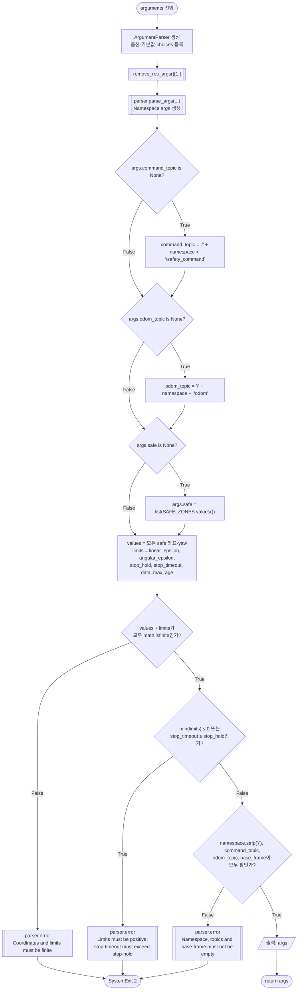

topic·frame 문자열에는 비어 있지 않은지만 확인한다. 유효한 ROS 이름인지에 대한 이 함수 자체의 추가 검사는 없다. `parse_args()` 단계의 도움말·구문 오류는 위의 `parser.error()` 검증 세 단계에 들어가기 전에 종료한다.

## 3. Evacuation.__init__(nav, args) — 상태·구독 준비

소스 L74–91. `nav`는 호출자가 생성한 navigator 객체이고 `args`는 위에서 반환한 설정 객체다. 인자로 받은 객체를 보존하며 navigator를 새로 생성하지 않는다.

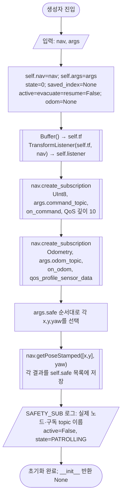

`getPoseStamped()` 결과의 정확한 값은 `header.frame_id="map"`, `header.stamp=생성 시 nav ROS 시각`, `position=(x,y,0)`, `orientation=(0,0,sin(radians(yaw)/2),cos(radians(yaw)/2))`다. 구현 근거는 [turtlebot4_navigator.py](../src/turtlebot4_navigation/turtlebot4_navigation/turtlebot4_navigator.py) L74–94다.

`TransformListener`는 기존 nav에 `/tf`, `/tf_static` 구독을 만들며 기본 `spin_thread=False`다. 호출자의 `/tf:=tf`, `/tf_static:=tf_static` remap이 기본 실행에서 이를 navigator namespace 아래로 연결한다. TF callback은 메시지의 각 transform을 `Buffer.set_transform()` 또는 `set_transform_static()`에 저장한다. 생성자는 콜백을 직접 호출하지 않는다.

## 4. on_command(msg) — 명령 수락 조건과 값

소스 L93–113. `UInt8.data`를 읽고 플래그·로그만 변경한다. 이 함수 안에서 action 취소·이동·대기를 실행하지 않는다. 아래 조건의 순서 자체가 현재 구현이다.

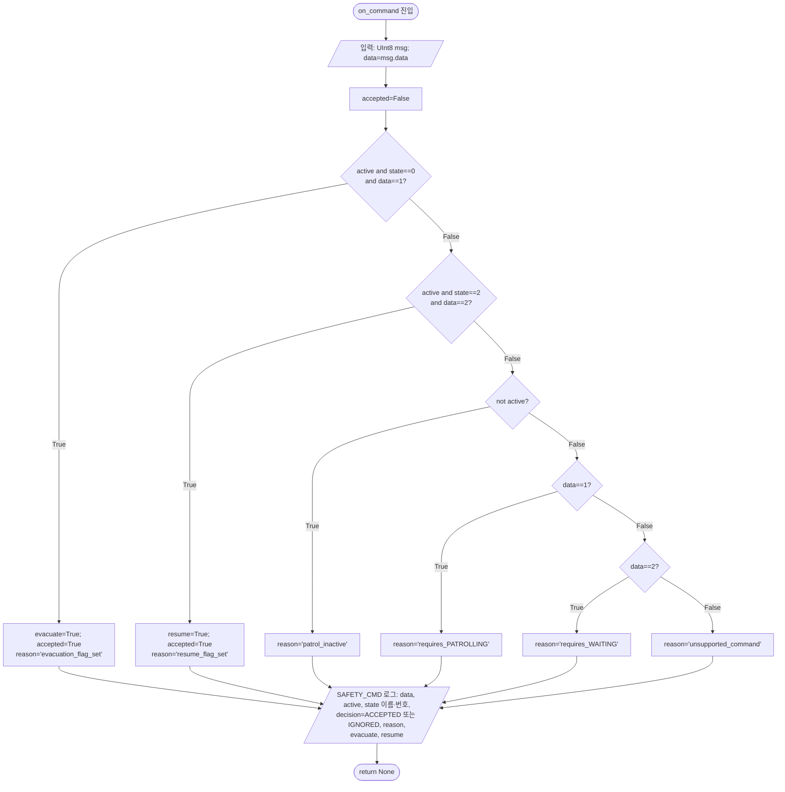

| 콜백 처리 시점의 조건 | 명령 1 | 명령 2 | 그 외 data |
|---|---|---|---|
| `active=False` | 무시, `patrol_inactive` | 무시, `patrol_inactive` | 무시, `patrol_inactive` |
| `active=True, state=0` | `evacuate=True` | 무시, `requires_WAITING` | 무시, `unsupported_command` |
| `active=True, state=1` | 무시, `requires_PATROLLING` | 무시, `requires_WAITING` | 무시, `unsupported_command` |
| `active=True, state=2` | 무시, `requires_PATROLLING` | `resume=True` | 무시, `unsupported_command` |

허용 상태에서 같은 명령을 반복 수신하면 이미 `True`인 플래그를 다시 `True`로 만들고 `ACCEPTED`를 기록한다. 허용되지 않은 명령을 나중에 수행하도록 저장하지 않는다. 조건은 발행 시각이 아니라 **콜백 실행 시점**의 상태를 검사한다. 수신 로그의 `ACCEPTED`는 플래그 설정을 뜻하며 동작 완료 확인이 아니다.

## 5. on_odom(msg)와 콜백 실행 관계

소스 L115–116. 메시지를 복사하거나 검사하지 않고 `self.odom`에 최신 콜백 메시지 객체를 대입한다.

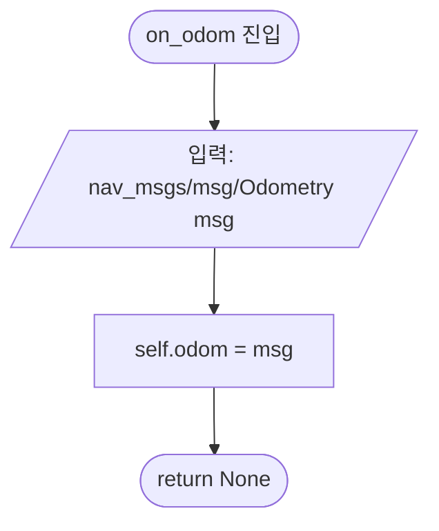

`tick()`의 `rclpy.spin_once(nav, timeout_sec=0.1)`와 Nav2 API 내부의 spin이 준비된 콜백을 실행한다. `wait_for_task()`도 내부에서 `isTaskComplete()`가 spin하기 때문에 명령을 처리할 수 있다. `on_command()`가 `escape_and_wait()`를 직접 부르는 구조가 아니다. 콜백은 플래그를 설정하고, 호출자의 순찰 루프 또는 이 모듈의 대기 루프가 이후 그 값을 읽는다. `spin_once()` 한 번으로 command·odom·TF의 모든 준비 콜백이 반드시 처리된다는 보장도 없다.

## 6. tick() — ROS 상태 확인과 콜백 처리

소스 L118–121. 명시적 반환값은 없으므로 정상 반환은 `None`이다.

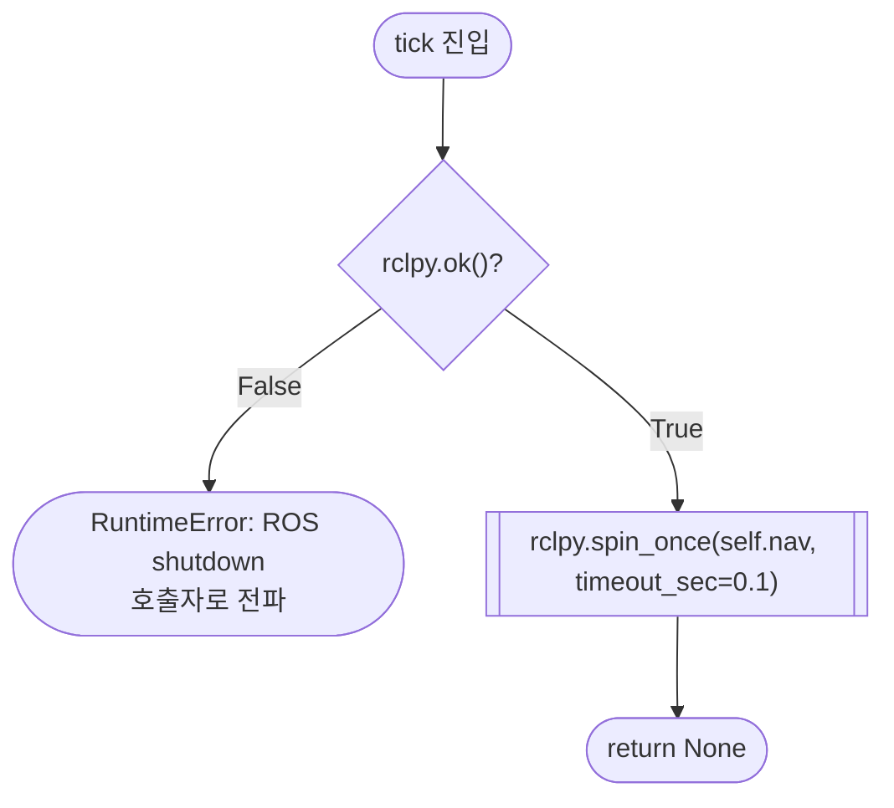

`0.1`초는 `spin_once()`의 대기 timeout 인자다. 이 함수는 별도의 주기·sleep을 예약하지 않는다. 호출 중 ROS 라이브러리가 발생시키는 예외도 자체 처리 없이 전파한다.

## 7. fresh(stamp) — ROS timestamp 신선도

소스 L123–125. 입력은 `builtin_interfaces/msg/Time` stamp, 출력은 `bool`이다.

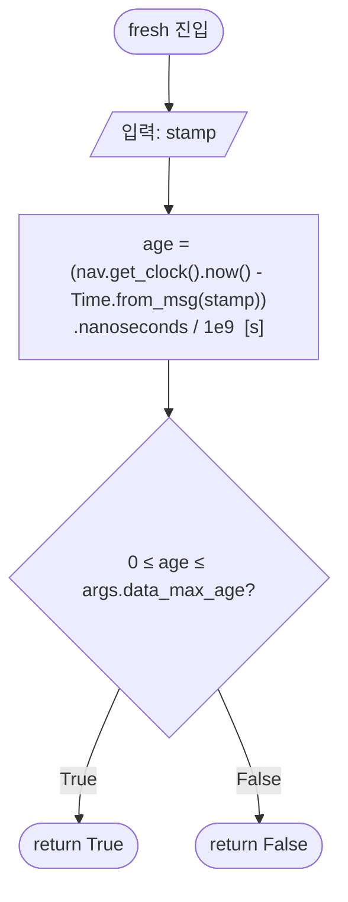

기본 허용 범위는 `0 ≤ age ≤ 1.0 s`다. 미래 stamp(`age<0`)와 너무 오래된 stamp를 모두 거부한다. 단조시계가 아니라 navigator의 현재 ROS 시계를 사용한다. 시간 변환·시계 연산에서 발생한 예외는 전파한다.

## 8. position() — 현재 base 원점의 map 좌표

소스 L127–135. TF 조회 인자는 `target_frame="map"`, `source_frame=args.base_frame`, `time=Time()`이다. `Time()`의 0 시각은 최신 변환을 요청한다. 결과는 **base 프레임 원점을 map 좌표로 표현한 `(x,y)`**이며 `map` 원점을 base 좌표로 표현한 값이 아니다.

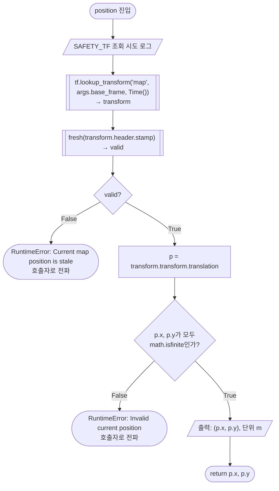

별도 TF 대기 timeout 인자를 주지 않아 설치된 API의 기본 `Duration()`(0초)을 사용한다. TF 없음·연결 없음·외삽 불가 등의 조회 예외는 즉시 호출자로 전파하며 다른 후보 선택이나 재조회 루프가 없다. `p.z`, quaternion, odom pose는 현재 위치 선택에 사용하지 않는다.

## 9. wait_for_task(interruptible=True) — action 완료·대피 판정

소스 L138–147. 반환 `False`는 대피 요청 또는 action 비성공을 모두 나타내므로 호출자는 별도로 `evacuate`를 읽는다. **`complete` 값을 얻은 뒤 대피 플래그를 먼저 판단**하는 순서를 유지한다.

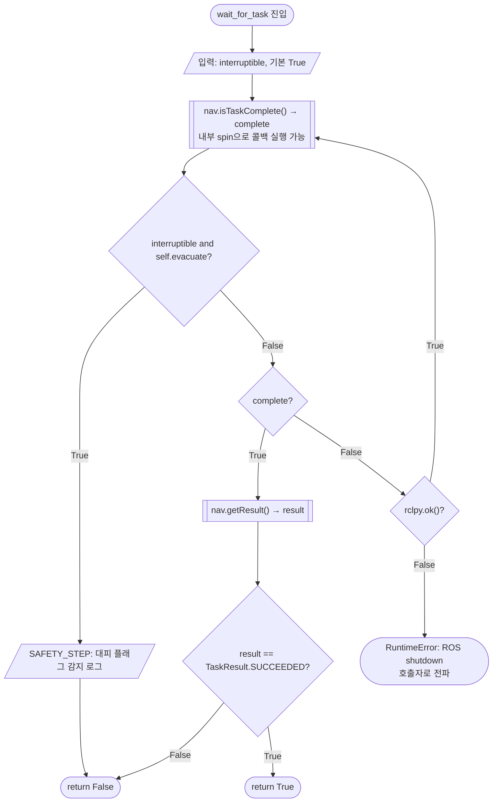

`navigate()`는 `interruptible=False`로 호출하므로 대피 플래그 때문에 반환하지 않는다. 이 함수에는 전체 이동 제한시간이 없다. `complete=True`와 대피 플래그가 같은 확인 시점에 관측되면 interruptible 경로는 성공 여부 확인 전에 `False`를 반환한다.

설치된 Jazzy `BasicNavigator.isTaskComplete()`는 결과 future가 없으면 `True`, 결과가 아직 없으면 `False`, 성공·취소·중단 등 결과가 있으면 상태를 저장하고 `True`를 반환한다. future 확인 시 내부 spin timeout은 `0.10`초다. `getResult()`는 ROS action status `SUCCEEDED=4 → TaskResult.SUCCEEDED=1`, `ABORTED=6 → FAILED=3`, `CANCELED=5 → CANCELED=2`, 나머지는 `UNKNOWN=0`으로 변환한다. 여기서 `complete=True` 자체는 성공을 의미하지 않는다.

## 10. navigate(pose) — 대피·복귀 목표 전송

소스 L149–159. 입력 `pose`는 `PoseStamped` 객체다. 해당 객체의 stamp를 **직접 변경**한다. 정상 반환은 `None`이다.

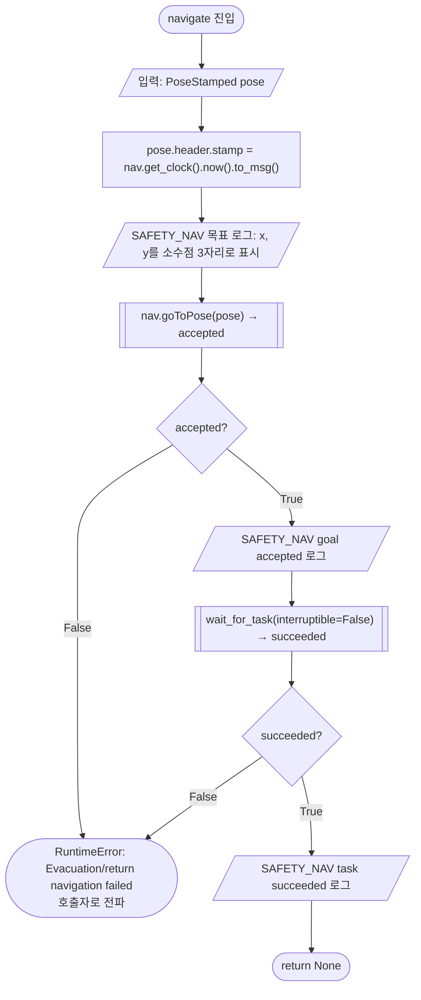

action에 전달하는 좌표·orientation은 원래 정밀도를 유지한다. 소수점 3자리 표시는 로그에만 적용된다. `goToPose()`의 목표는 `NavigateToPose.Goal(pose=pose, behavior_tree="")`이며 Nav2 action goal 수락 실패는 `False`다. 완료 후 `SUCCEEDED` 이외 결과는 모두 위 RuntimeError로 바뀐다. 서버 발견·goal 응답 대기에는 이 모듈의 `stop_timeout`이 적용되지 않는다. 이동 성공 후 정지 확인은 이 함수에 포함되어 있지 않으며 호출자가 필요 위치에서 `stop()`을 호출한다.

## 11. stop() — action 종료와 새 odom 정지 확인

### 11.1 취소 요청·action 종료 확인

소스 L161–174. 입력은 공유 navigator의 현재 task와 설정이다. 정상 반환은 다음 절의 odom 확인까지 성공했을 때만 이루어진다.

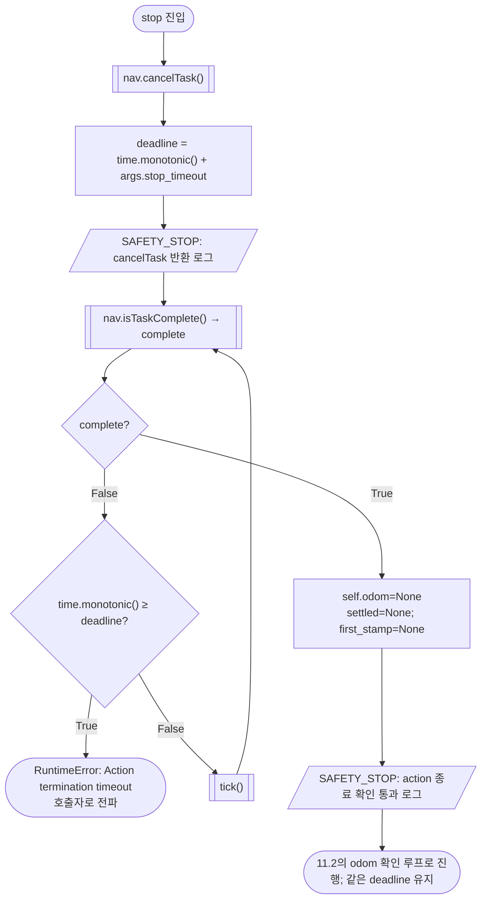

`cancelTask()`는 설치된 구현상 결과 future가 있으면 현재 goal에 `cancel_goal_async()`를 보내고 취소 응답 future를 기다린다. 응답 내용을 검사하지 않고 반환한다. 따라서 이 단계 로그는 취소 수락·action 종료·물리적 정지 확인과 다르다. 결과 future가 없으면 취소 요청을 보내지 않는다. `stop()`은 종료 결과가 성공인지 취소인지 구분하지 않고 `isTaskComplete()`가 `True`인지 확인한다.

기본 10초 deadline은 **`cancelTask()` 반환 후** 생성된다. 취소 응답을 기다리는 시간은 포함하지 않는다. 이후 action 종료 대기에 사용한 시간과 odom 정지 확인 시간이 같은 10초를 나눠 쓴다. 각 API·콜백 실행시간을 강제로 제한하는 전체 함수 deadline은 아니다.

### 11.2 stamp 진행과 정지 유지시간 확인

소스 L175–193. `mono`는 `time.monotonic()`의 초 값이다. 다이어그램의 `stopped` 식은 선속도와 각속도 **각각의 3차원 크기**를 사용한다.

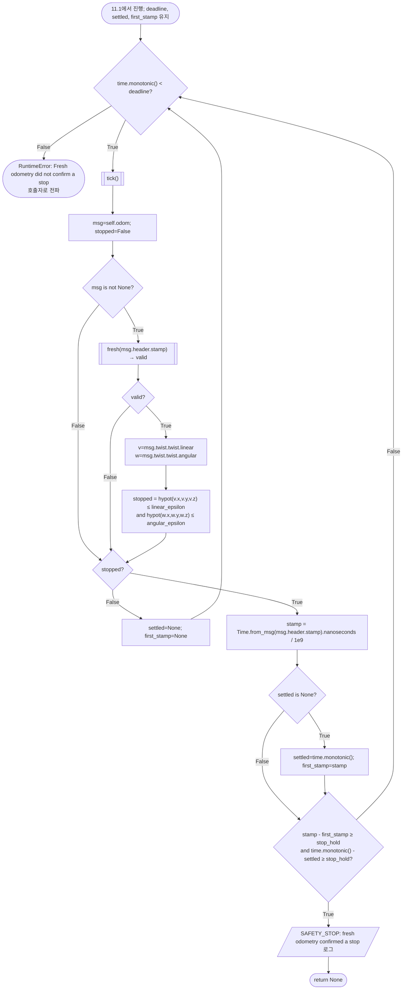

기본값에서 성공 조건은 다음을 모두 충족하는 것이다.

1. 검사한 odom이 있고, 검사 시점 ROS 기준 `0 ≤ age ≤ 1.0 s`다.
2. `sqrt(vx²+vy²+vz²) ≤ 0.01 m/s`이고 `sqrt(wx²+wy²+wz²) ≤ 0.02 rad/s`다.
3. 정지로 판정한 첫 메시지 stamp에서 현재 메시지 stamp까지 `≥ 0.5 s`다.
4. 첫 정지 판정 시점부터 현재 monotonic 시각까지 `≥ 0.5 s`다.

조건 1·2가 실패하면 정지 유지 시작점을 지운다. 같은 stamp 메시지를 반복 검사하는 것만으로는 조건 3을 만족하지 못한다. 별도의 샘플 개수·연속 두 stamp 간 증가 검사·누락 샘플 보간은 없다. `self.odom=None`은 이전에 저장해 둔 객체를 지우는 것이며, 이후 처리하는 모든 메시지가 취소 이후에 측정되었다는 별도의 stamp 비교는 없다. 위 신선도와 진행량을 그대로 검사한다.

deadline 검사는 각 반복의 `tick()` **전**에 한다. `tick()` 실행 중 시간이 흐른 후 같은 반복에서 성공할 수 있으므로 정확히 10.000초에 함수를 강제로 종료시키는 보장은 없다. 이 함수는 직접 `cmd_vel=0`을 발행하지 않는다. 예외는 호출자로 전파한다.

## 12. escape_and_wait(route, index) — 대피·대기·원래 단계 복귀

소스 L196–224. 입력 `route`는 호출자의 `list[PoseStamped | "spin"]`, `index`는 현재 처리 중인 0 기반 단계 번호다. 현재 호출자의 경로 길이는 17이며 `index=0..16`이다. `index`의 증가와 실제 spin 재실행은 호출자가 맡는다.

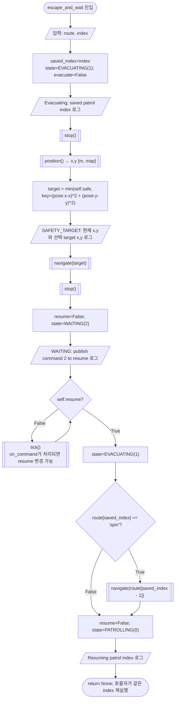

`min()` 비교값은 map 평면의 **제곱 직선거리(m²)**다. 경로 길이·장애물·안전구역 yaw는 선택 비용에 사용하지 않는다. 동률이면 `self.safe` 목록의 앞 항목을 고른다. 후보의 yaw는 선택 뒤 목표 PoseStamped의 quaternion으로 Nav2에 전달된다. 선택 목표의 이동이 실패하면 예외를 전파하며 다른 후보를 자동으로 선택하지 않는다.

안전구역 목표에 도착한 후 두 번째 `stop()`까지 성공해야 `WAITING`으로 바뀐다. 대기에는 제한시간이 없고, 대기 중 지속적인 odom 정지 확인도 없다. 명령 2를 수락하면 상태를 다시 `EVACUATING`으로 바꾼다. 저장 단계가 이동이면 별도 복귀 이동 없이 호출자로 반환하며, 호출자가 같은 이동 목표를 다시 요청한다. 저장 단계가 `"spin"`이면 `route[saved_index-1]`의 PoseStamped로 이동 성공을 확인한 뒤 반환하고, 호출자가 원래 index의 `2π rad` spin 전체를 다시 요청한다. 이전 spin의 잔여 각도를 저장하지 않는다. 복귀 `navigate()` 뒤 별도 `stop()`은 없다.

현재 경로에서 모든 spin 앞에는 PoseStamped가 있으므로 `saved_index-1`이 직전 회전 위치를 가리킨다. 함수 자체에는 index 범위·선행 항목 타입 검사가 없다. `saved_index`와 `active`는 정상 반환 시 초기화하지 않는다. 어떤 내부 함수에서든 예외가 발생하면 이후 정상 단계는 수행하지 않고 호출자 `execute()`의 실패 처리로 전파한다.

## 13. 직접 실행과 예외 처리 경계

소스 L227–228의 직접 실행은 `SystemExit("Run 3_1_c_follow_waypoints.py; this file is an imported helper.")`다. 문자열 안내를 출력하고 실패 종료하며 서버를 시작하지 않는다. import하면 클래스·함수·상수만 정의된다. 실제 현재 서버 진입점은 [genius_patrol.py](../src/patrol_amr_safety/patrol_amr_safety/genius_patrol.py)다.

이 모듈에는 예외를 잡는 `try/except`가 없다. 위 그림은 각 함수의 정상 흐름과 명시적으로 발생시키는 RuntimeError를 보여준다. TF·ROS·메시지·Nav2 호출 자체의 예외도 동일하게 호출자로 전파한다. 호출자 `execute()`는 일반 `Exception`을 잡아 `evacuation.active=False`로 바꾸고 `evacuation.stop()`을 다시 시도한다. 그 정지 확인까지 실패하면 `STOP NOT CONFIRMED`를 기록하고 외부 patrol goal을 `abort()` 처리한다. 자세한 생성 실패·종료 정리 경로는 [호출자 문서](genius_patrol.md)를 참조한다.

`wait_for_task()`가 대피 플래그를 발견해 반환할 때 action을 취소하는 것은 아니다. 이후 `escape_and_wait()`의 첫 `stop()`이 취소한다. action 완료와 명령 1이 같은 확인에서 관측되면 현재 index를 증가시키기 전에 대피하며, 재개 후 같은 단계를 실행한다.

## 14. 대조 근거와 검증 범위

- 대상 보조 모듈 전체 L1–228, 호출자 `genius_patrol.py`의 인자 전달·순찰 루프·실패 처리와 대조했다.
- PoseStamped 생성은 저장소의 [turtlebot4_navigator.py](../src/turtlebot4_navigation/turtlebot4_navigation/turtlebot4_navigator.py) L74–94를 확인했다.
- 설치된 `/opt/ros/jazzy/lib/python3.12/site-packages/nav2_simple_commander/robot_navigator.py`의 `goToPose` L185–219, `cancelTask` L454–460, `isTaskComplete` L462–478, `getResult` L484–493을 확인했다.
- 설치된 `tf2_ros/transform_listener.py`의 구독 생성·callback, `tf2_ros/buffer.py`의 `lookup_transform` 기본 timeout과 최신 시각 해석을 확인했다. 설치된 `nav_msgs/msg/Odometry`, `std_msgs/msg/UInt8`, `nav2_msgs/action/NavigateToPose` 정의와 필드를 대조했다.
- 문서 작성 범위에서 코드·실행 설정을 변경하지 않았다. 실제 ROS action/topic, TF, odom 수신, 로봇 주행·정지·도킹 시험은 수행하지 않았다. 임계값의 실기 적합성과 실제 base 프레임 확인은 기존 시험 항목으로 남는다.

새 정책·timeout·인터페이스를 결정한 문서가 아니므로 새 TBD나 팀 간 코드 수정 요청서는 만들지 않았다. 현재 공유 계약과 개발 책임 경계는 [interfaces.md](interfaces.md), [amr.md](amr.md)를 따른다.
