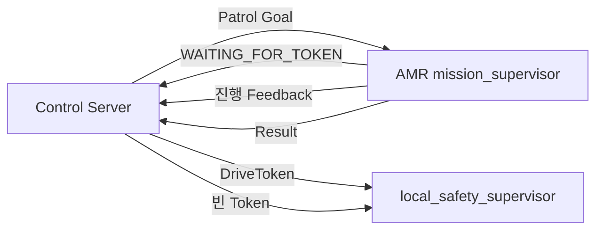
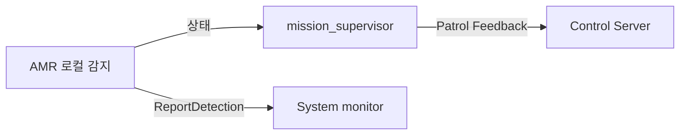

# 공용 시스템 시나리오

> 기준일: 2026-09-13 · 계약: `patrol_interfaces 2.0.0`

이 문서는 최종 공용 인터페이스로 수행하는 기본 시나리오만 정의한다. 필드와
QoS는 [interfaces.md](interfaces.md), 실제 통합시험은
[integration.md](integration.md)를 따른다.

## 1. 순찰 시작과 완료

사전 조건:

- 대상은 `robot1` 또는 `robot6`이다.
- CCTV `patrol_allowed=true`다.
- 다른 활성 Patrol Goal과 `fire_hold`가 없다.
- 대상 AMR의 Patrol Action Server가 준비됐다.

정상 흐름:

1. 관제가 `/{robot}/patrol_action` Goal을 보낸다.
2. AMR은 Goal을 수락하고 `WAITING_FOR_TOKEN` Feedback을 보낸다.
3. 관제가 해당 로봇에 유효한 `DriveToken`을 발급한다.
4. AMR은 `token_valid=true`를 보고한 뒤 도킹 해제와 순찰을 진행한다.
5. waypoint 도착은 `WAYPOINT_REACHED` Feedback으로 보고한다.
6. 도킹 후 Patrol Result를 반환한다.
7. 관제는 Result 또는 Cancel 완료 후 Token을 회수한다.

## 2. 차량 진입과 순찰 재개

1. CCTV가 차량 진입을 확정하면 `patrol_allowed=false`를 발행한다.
2. 관제는 활성 AMR에 `MOVE_TO_SAFE_ZONE`을 한 번 보낸다.
3. AMR은 실행 중인 Patrol Action을 유지하며 안전구역으로 이동한다.
4. 이동에 필요하므로 기존 Token은 유지한다.
5. CCTV가 다시 `patrol_allowed=true`를 발행하면 관제가
   `RESUME_PATROL`을 한 번 보낸다.
6. AMR은 `RESUMING` 후 `PATROLLING`으로 돌아간다.

같은 permit 값의 반복 수신은 같은 명령을 반복 생성하지 않는다. permit은 주행
명령이 아니라 관제 판단 조건이다.

## 3. AMR 로컬 감지와 보고

AMR 제어와 로컬 감지 사이의 세부 호출 방식은 AMR 내부 구현이다. 별도 공용 감지
Action은 사용하지 않는다.

1. AMR이 순찰 중 로컬 감지를 처리한다.
2. 처리 중에는 Patrol Feedback의 `DETECTION_PROCESSING`을 사용한다.
3. 확정 시 `DETECTION_CONFIRMED`, `event_id`, `event_type`을 관제에 보낸다.
4. 감지 확정 측은 `/system_monitor/report_detection`을 호출해 사건과 사진을
   시스템 모니터에 저장한다.
5. 응답이 없을 때만 같은 `event_id`와 같은 내용으로 재시도한다.

`DetectionEvidence`는 이미지와 식별자를 묶는 공용 타입이지만 별도 토픽은 현재
확정하지 않았다. 기본 저장 경로는 `ReportDetection.image`다.

## 4. 화재 확정

- 관제가 `DETECTION_CONFIRMED + FIRE`를 받으면 내부 `fire_hold`를 활성화한다.
- 현재 Patrol Action의 Token은 임무가 끝날 때까지 유지할 수 있다.
- Action 종료 후에는 `fire_hold`가 해제되기 전까지 새 순찰을 시작하지 않는다.
- 자동 해제하지 않으며 운영자의 명시적인 해제가 필요하다.

## 5. 취소와 실패

- 관제가 취소할 때는 Token을 먼저 회수하고 ROS 2 Action Cancel을 요청한다.
- AMR은 `CANCELED` Result와 reason을 반환한다.
- Goal 거절, Result 오류, Action 실패에도 관제는 활성 슬롯과 Token을 정리한다.
- Token 만료 시 `local_safety_supervisor`가 최종 주행 출력을 차단한다.
- 통신 복구나 permit 복구만으로 새로운 Goal을 자동 생성하지 않는다.

## 6. CCTV 상태

- `gate_cam`: `ENTERING`, `EXITED`
- `center_cam`: `PARKED`, `EXITING`
- `cam_master`: 두 상태를 종합해 `/vision/cctv/patrol_allowed` 발행

CCTV는 AMR에 직접 주행 명령을 보내지 않는다.

## 7. 시스템 모니터

- `ReportDetection` 요청을 저장하고 `STORED`, `DUPLICATE`, `REJECTED`로 응답한다.
- Patrol Action 상태와 결과를 표시하기 위한 소비 방식은 시스템 모니터 구현에서
  정하되 새로운 공용 타입을 추가하지 않는다.
- 시스템 모니터는 Goal, PatrolCommand, DriveToken을 발행하지 않는다.

## 8. EStop 예약 범위

`/control/estop`과 `EStop.msg`는 향후 구현을 위해 예약한다. 현재 기본 시나리오와
통합 합격 조건에는 publisher, subscriber, reason 판단, 해제 정책을 포함하지 않는다.
