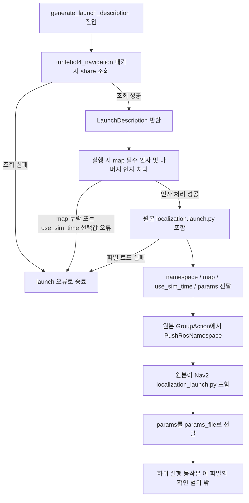

# patrol_amr_safety localization

## 범위와 기준

- 작성일: 2026-09-10.
- 참고한 기존 파일은 `/home/mu-01/turtlebot4_ws/src/turtlebot4/turtlebot4_navigation/launch/localization.launch.py` 하나뿐이다.
- 사용자 승인 범위: localization 전용 launch 추가. 기존 패키지 설정, 지도, YAML, 다른 launch 내용은 확인하거나 변경하지 않았다.
- 원본에서 확인한 기준: `namespace`, `map`, `use_sim_time`, `params`를 받고, namespace를 적용한 뒤 Nav2 launch에 `params`를 `params_file`로 전달한다.
- 이번 구성: 설치된 `turtlebot4_navigation`의 원본 launch를 포함한다. 부모 launch에서 namespace를 추가 적용하지 않는다. `map`은 필수이며 `params` 기본값은 원본과 같은 패키지의 `config/localization.yaml`, `use_sim_time` 기본값은 `false`다.
- 실행 환경에서 선택되는 `turtlebot4_navigation` 패키지가 지정된 소스와 일치하는지는 검증하지 않았다.

## 실행

ROS 2 및 필요한 패키지가 실행 환경에 준비되어 있을 때 다음과 같이 소스 launch 경로로 실행할 수 있다. 지도와 namespace는 실제 값으로 대체한다.

```bash
ros2 launch /home/mu-01/patrol/src/patrol_amr_safety/launch/localization.launch.py map:=/absolute/path/to/map.yaml namespace:=<robot_namespace> use_sim_time:=false
```

namespace를 사용하지 않는 환경은 해당 인자를 생략한다. 별도 파라미터 파일을 사용하려면 `params:=/absolute/path/to/localization.yaml`을 추가한다.

패키지 이름으로 실행하려면 새 launch가 패키지 share에 설치되어야 한다. 기존 설치 설정을 읽지 않았으므로 `ros2 launch patrol_amr_safety localization.launch.py` 실행 가능 여부는 확인하지 않았다. 빌드 설정과 의존성은 변경하지 않았다.

## 코드별 flowchart

대상: [launch/localization.launch.py](../launch/localization.launch.py)의 `generate_launch_description()`.

상태: 구현 대조 완료. 아래 SHA-256의 소스와 대조했으며 실제 ROS 실행 검증을 뜻하지 않는다.

대상 코드 SHA-256: `7a4a9d557fd768e7710218cef590c0ab42605d513f9ff6f32cb13835fc61b5f2`



이 진입점에는 별도 콜백, 재시도, 복구 또는 취소 처리 코드가 없다. 하위 launch의 내부 실패·종료 동작은 읽지 않았으므로 확정하지 않는다.

## 검증 범위

추가한 Python 파일의 구문 및 네 인자 전달 구조를 정적으로 검사한다. 실제 노드 기동, 지도 로딩, 센서 입력, TF 연결, 초기 위치 설정, 위치 추정 품질은 검증하지 않았다. 실제 실행은 별도 검증이 필요하며 이 문서를 주행 시험 완료 기록으로 사용하지 않는다.
