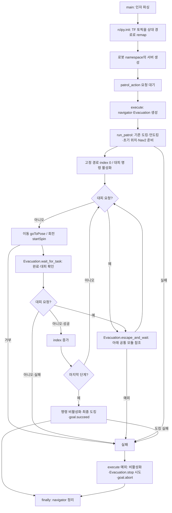
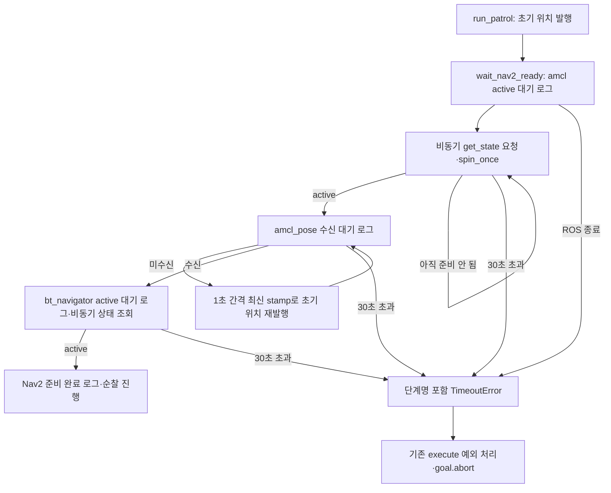
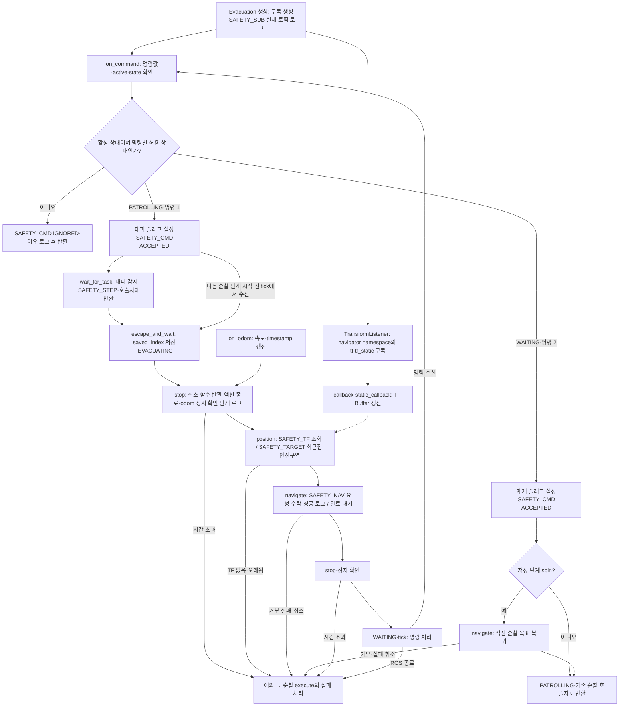

# 순찰 중 안전구역 대피·재개

## 역할 및 결정

2026-09-10 사용자 결정: 순찰은 [3_1_c_follow_waypoints.py](3_1_c_follow_waypoints.py)가 담당한다. [move_to_safetyzone.py](move_to_safetyzone.py)는 같은 navigator를 전달받아 명령 수신·취소·안전구역 이동·대기·복귀만 담당한다. 별도 프로세스로 실행하지 않는다. 현재 사용자가 변경한 `move_to_safetyzone.py` 파일명을 유지한다.

- 기존 순찰 경로·도킹·언도킹·초기 위치 및 `patrol_action` 진입 방식을 유지한다. 원본의 기존 사용자 변경은 유지하고 대피 연결 부분을 추가했다.
- 안전구역은 사용자 제공 WP 1·2·4·5·6·7이다. WP 3은 안전구역에서만 제외되며 순찰에는 남는다.
- 명령 1은 이동·spin 중 대피, 명령 2는 안전구역 대기 중 재개다. spin 중 대피했다면 직전 순찰 목표로 복귀한 뒤 원래 파일에서 360도를 다시 실행한다.
- 대피·복귀 이동 중 명령 2는 무시한다. 초기 준비와 최종 도킹에는 대피 기능이 적용되지 않는다.
- AMR 시험용 UInt8 토픽이며 공용 MissionCommand 계약 변경이 아니다. Nav2와 기존 로컬 안전 제어를 사용하며 직접 속도를 발행하지 않는다. launch·패키지 및 다른 팀 코드는 변경하지 않았다.

## 실행

ROS 2 Jazzy 및 TurtleBot4 환경을 source한 뒤 기존 파일만 실행한다. **이 명령은 순찰 서버를 시작하며, 아직 주행을 시작하지 않는다.**

```bash
python3 src/patrol_amr_safety/patrol_amr_safety/3_1_c_follow_waypoints.py --robot-id robot1
```

다른 터미널에서 원래 action을 호출하면 고정 경로 순찰을 시작한다. 입력 pose는 기존 코드처럼 사용하지 않는다.

```bash
ros2 action send_goal /robot1/patrol_action nav2_msgs/action/NavigateToPose '{}'
# 이동·spin 중 대피
ros2 topic pub --once /robot1/safety_command std_msgs/msg/UInt8 '{data: 1}'
# WAITING 로그 확인 후 재개
ros2 topic pub --once /robot1/safety_command std_msgs/msg/UInt8 '{data: 2}'
```

robot6은 실행 인자의 `robot1` 및 토픽/action 경로의 `robot1`을 모두 `robot6`으로 바꾼다. 대피 모듈을 직접 실행하면 안내와 함께 종료하며 로봇을 시작하지 않는다.

## 시험용 설정

사용자 위임으로 선정한 시험용 기본값이며 실기 검증 전이다.

| 설정 | 기본값 |
|---|---|
| robot-id | robot1 (`robot6` 선택 가능, `--namespace` 별칭) |
| command-topic / 타입 | `/{robot_id}/safety_command` / `std_msgs/msg/UInt8` |
| odom-topic | `/{robot_id}/odom` (사용자 지정) |
| TF 구독 토픽 | navigator namespace의 `tf`, `tf_static` (`robot1`: `/robot1/tf`, `/robot1/tf_static`; `robot6`: `/robot6/tf`, `/robot6/tf_static`) |
| TF 프레임 | `map` → `base_link` |
| linear-epsilon / angular-epsilon | 0.01 m/s / 0.02 rad/s |
| stop-hold / stop-timeout | 0.5 s / 10.0 s |
| data-max-age | 1.0 s |

대피 모듈 상단 `SAFE_ZONES`, `TEST_DEFAULTS` 또는 순찰 서버 실행 옵션으로 변경한다. `--safe X Y YAW_DEG`를 지정하면 기본 안전구역 목록 전체를 대체하며 여러 번 지정할 수 있다. `--base-frame`, `--odom-topic`, `--command-topic`도 변경 가능하다. TF **토픽**에는 navigator의 namespace를 적용하지만 TF **프레임 이름**에는 자동으로 붙이지 않는다. 실제 프레임 이름이 `robot1/base_link`라면 `--base-frame robot1/base_link`를 지정한다. odom timestamp는 현재 ROS 시계와 일치해야 한다.

### TF 토픽 namespace 수정 (2026-09-10)

기준: 사용자 승인 범위는 TF 구독 경로 불일치 수정이다. 실행 로그에서 정지 확인 이후 `position()`이 `"map" passed to lookupTransform argument target_frame does not exist.`로 실패하는 것을 확인했다. 설치된 Jazzy `TransformListener`는 `/tf`, `/tf_static`을 구독하지만 TB4/Nav2 localization은 해당 토픽을 로봇 namespace 아래로 remap한다.

`3_1_c_follow_waypoints.py`의 `main()`에서 기존 실행 인자 뒤에 `/tf:=tf`, `/tf_static:=tf_static` remap을 추가하여 `rclpy.init()`에 전달한다. 같은 프로세스의 기존 navigator와 `TransformListener`가 이 규칙을 사용한다. 기존 명령행에 명시한 TF remap은 먼저 일치하는 규칙으로 우선 적용된다. 별도 노드나 프로세스는 만들지 않으며 TF 프레임, 정지 판정, 대피·재개 상태 전환은 변경하지 않는다.

검증: 현재 `main()`의 실제 초기화 인자 표현식을 추출하여 설치된 ROS의 인자 파서·토픽 remap 함수로 robot1, robot6, 기존 ROS 인자 블록, 명시적 TF remap 우선 적용, 종료된 ROS 인자 블록 뒤의 일반 인자 보존, `__ns`로 지정한 namespace 적용을 확인한 6개 사례가 통과했다. 현재 `main()`의 ROS 호출을 모의 처리한 robot1·robot6 검사 2개와 두 Python 파일 구문 검사도 통과했다. ROS 노드 생성·실제 TF 수신·로봇 주행 시험은 수행하지 않았다.

### 명령 수신·수행 단계 로그 (2026-09-10)

기준: 사용자 승인에 따라 `move_to_safetyzone.py`에 INFO 진단 로그를 추가했다. 명령 수락 조건, 플래그, 정지 임계값·제한시간, 대피·재개 상태 전환은 유지한다. 로그는 명령 수신과 단계 전환 때만 출력하며 odom 수신·대기 반복마다 출력하지 않는다.

로그는 `3_1_c_follow_waypoints.py`를 실행한 터미널에서 확인한다. `[SAFETY_SUB]`는 순찰 action 요청으로 navigator와 Evacuation이 생성될 때 출력된다. 서버가 action 요청을 기다리는 동안에는 아직 이 구독이 없다. 기본 INFO 로그가 보이는 설정을 사용한다.

| 로그 | 의미 |
|---|---|
| `[SAFETY_SUB]` | 노드 이름과 remap 후 실제 command·odom·TF 구독 토픽. 초기 `active=False`는 순찰 준비 상태다. |
| `[SAFETY_CMD] received` | 실제 `on_command()` 콜백 실행. 명령값, active, 상태 이름·번호, 수락/무시, 이유와 플래그를 출력한다. |
| `decision=ACCEPTED` | 명령에 따라 대피 또는 재개 플래그를 설정했다. 이동 완료를 뜻하지 않는다. |
| `decision=IGNORED` | `patrol_inactive`, `requires_PATROLLING`, `requires_WAITING`, `unsupported_command`로 이유를 구분한다. |
| `[SAFETY_STEP]` | 순찰 action 완료 대기에서 대피 플래그를 확인하고 호출자에게 반환한다. 다음 순찰 단계 시작 전 명령을 처리한 경우에는 이 대기 함수를 거치지 않고 바로 `Evacuating`이 출력될 수 있다. |
| `[SAFETY_STOP]` | `cancelTask()` 반환, action 종료 확인 통과, 최신 odom 정지 확인 완료를 구분한다. 취소 함수 반환만으로 취소 수락이나 물리적 정지를 확정하지 않는다. |
| `[SAFETY_TF]`, `[SAFETY_TARGET]` | 현재 위치 TF 조회 시도와, 조회 성공 후 현재 위치·선택한 안전구역 좌표를 출력한다. |
| `[SAFETY_NAV]` | 목표 요청, Nav2 목표 수락 후 결과 대기, 이동 성공을 구분한다. |

명령 1 수신·수락 예시:

```text
[SAFETY_CMD] received data=1 active=True state=PATROLLING(0) decision=ACCEPTED reason=evacuation_flag_set evacuate=True resume=False
```

`ros2 topic pub`의 `publishing #1`과 위 수신 로그를 구분한다. 해당 실행에서 `[SAFETY_SUB]`가 보이지만 명령 발행 후 `[SAFETY_CMD]`가 없다면 대상 토픽·구독자, 메시지 전달, 콜백 실행 여부를 확인한다. `ACCEPTED` 이후에는 `Evacuating`, 정지 단계, TF·목표 선택, 이동 단계를 차례로 확인한다. 기존 `WAITING`, `Resuming patrol index=...`, `Patrol error` 로그도 유지한다.

검증: 두 Python 파일 구문 검사와 설치된 ROS 라이브러리 import 확인을 완료했다. ROS 초기화 없이 실제 콜백을 호출해 순찰 중 명령 1 수락, WAITING 중 명령 1 무시, 비활성 명령 1 무시, WAITING 중 명령 2 수락 로그를 확인했다. 변경 전후 수락 조건·시간 제한·정지 조건·상태 전환·이동 호출 순서를 대조했다. 실제 ROS 수신·주행 검증은 미실행이다.

## 코드별 flowchart

구현 대조 완료: 2026-09-10. 코드 버전 SHA-256:
- `3_1_c_follow_waypoints.py`: `12344529c2f84c9817348b721127efd435d3a014eaf867a1b0cd4fe3b181383a`
- `move_to_safetyzone.py`: `34637ffd14929c85b1f054e6970ea9ee93c93c2807f035d0b71aba5069883430`

### 3_1_c_follow_waypoints.py



`startSpin`은 Nav2 spin을 시작하고 대피 객체의 `wait_for_task`를 사용한다. 객체 없는 기존 호출은 원래 완료 대기·결과 처리를 유지한다. 순찰 인덱스는 성공 시에만 증가하며 대피 후에는 같은 인덱스를 다시 실행한다.

### Nav2 준비 대기 수정 (2026-09-10)

아래 내용은 과거 수정 기록이다. 이번 TF 수정 시점의 현재 소스는 `waitUntilNav2Active()`를 호출하며, 아래 `wait_nav2_ready()` flowchart는 현재 구현 대조 범위에 포함하지 않는다.

사용자 승인 범위: 초기 위치 발행 이후 Nav2 준비 대기의 단계별 로그와 제한시간만 수정.
`waitUntilNav2Active()` 호출을 `wait_nav2_ready()`로 교체했다. `NAV2_READY_TIMEOUT = 30.0`은 각 단계별 시험용 제한시간이다. AMCL 서비스 발견·응답·active 전환을 합쳐 30초, amcl_pose 수신 30초, bt_navigator 발견·응답·active 전환을 합쳐 30초다. 준비 확인을 생략하고 주행하지 않는다.



각 lifecycle 단계는 종료 시 미완료 future를 취소하고 클라이언트를 정리한다. `cancelTask()`의 취소 응답 대기 및 기존 실패 후 정지 절차는 이번 수정 범위에 포함하지 않았다. 제한시간은 Nav2 준비 단계에 대한 것이며 예외 후 전체 정리 종료시간을 보장하지 않는다.

검증: 준비 성공, 서비스 미발견, 서비스 무응답, AMCL 비활성, 위치 미수신, bt_navigator 비활성의 모의 테스트 6개 통과. 구문 및 import 검사 통과. 실제 로봇 재시험은 미실행.

### move_to_safetyzone.py



`tick`은 ROS 콜백 처리 및 종료 감지, `fresh`는 timestamp 검증, `stop`은 최신 odom의 속도와 증가하는 timestamp로 정지를 확인하는 공통 함수다. 취소 응답을 물리적 정지로 간주하지 않는다. 모듈에는 순찰 경로·spin 실행·도킹·자체 navigator 생성이 없다.

## 검증 및 남은 확인

- 완료: 두 파일 구문 검사, 설치된 ROS/TB4 라이브러리 import 및 기존 서버 `--help`, 모의 테스트 8개.
- 이전 버전 모의 시험 기록: 정상 순찰 9회 이동·9회 spin, 이동 중 대피 후 같은 목표 재실행, spin 중 대피 후 원래 위치 복귀·360도 재실행, 명령 상태 제한, 안전구역 이동 거부, action 실패 시 정지·abort, robot1/robot6 토픽 기본값, 반복 timestamp·움직이는 odom 거부 및 새 정지 odom 확인. 현재 소스는 마지막 원점 복귀 뒤 spin이 없으며, 이번 로그 추가에서 순찰 경로를 변경하지 않았다.
- 미실행: 실제 ROS action/topic 종단간 시험 및 로봇 주행·정지·TF·odom·도킹. 모의 검증은 실기 성공을 뜻하지 않는다.
- 남은 확인: 실제 base 프레임과 시험 임계값의 실기 적합성. 공용 안전 정책 확정으로 취급하지 않는다.
- 최근접은 map 직선거리 기준이다. 선택한 안전구역 이동 실패 시 중단하며 다른 후보를 자동 선택하지 않는다.
- `stop-timeout`은 `cancelTask()` 반환 이후에 적용된다. Nav2/TB4 동기 API 내부의 서버 대기까지 제한하지 않으며 통신 단절 시 물리적 정지는 기존 로컬 안전 제어가 담당한다.
- 초기 위치 `(0, 0, 180°)`와 경로는 원본과 같아 실제 map과 일치해야 한다. 프로세스 종료 후 중단 위치는 복원하지 않는다. 외부 action 취소 기능은 이번 범위에서 추가하지 않았다.

실기 시험 계획: 순찰 action 시작 → 이동 중 1 → WAITING → 2 → 기존 목표 재개; 다시 spin 중 1 → WAITING → 2 → 회전 위치 복귀·360도 회전. 계획만 작성했으며 실제 시험 결과는 아직 없다.
