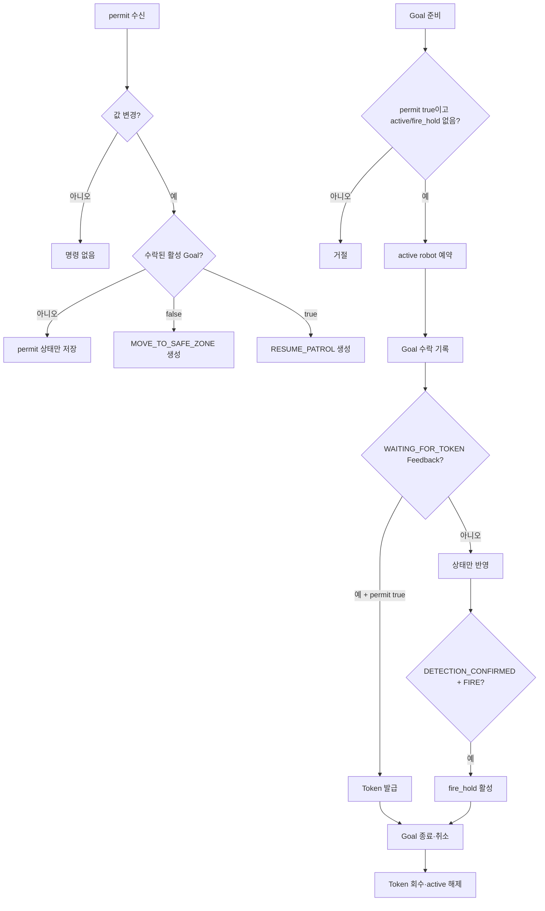
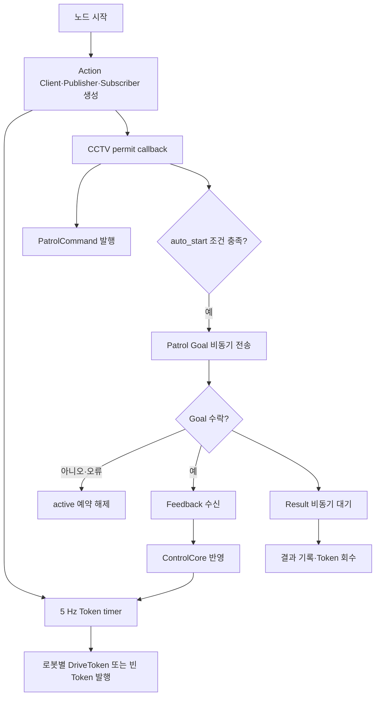

# patrol_control

`patrol_interfaces 2.0.0`의 기본 순찰 흐름을 담당하는 Control Server 패키지다. 한 번에 하나의 AMR만 활성화하고 Action Goal, Drive Token, 차량 회피 명령과 화재 hold를 관리한다.

## 실행

기본 실행은 외부 호출을 기다리고 자동으로 순찰을 시작하지 않는다.

```bash
ros2 run patrol_control patrol_control_node
```

CCTV permit이 `true`가 된 뒤 `robot1` 순찰을 한 번 자동 시작하려면 다음처럼 실행한다.

```bash
ros2 run patrol_control patrol_control_node --ros-args \
  -p auto_start:=true \
  -p initial_robot_id:=robot1
```

주요 파라미터:

| 이름 | 기본값 | 의미 |
|---|---|---|
| `robot_ids` | `[robot1, robot6]` | 관리할 로봇 ID와 namespace |
| `initial_robot_id` | `robot1` | 자동 시작 대상 |
| `auto_start` | `false` | permit 이후 순찰 한 번 자동 시작 |
| `token_publish_hz` | `5.0` | Drive Token 발행 주기 |
| `token_lease_seconds` | `1.0` | Drive Token lease |

## 동작

- Action Server가 준비되고 `patrol_allowed=true`일 때만 Patrol Goal을 보낸다.
- Goal 수락만으로 Token을 발급하지 않는다.
- 활성 AMR의 `WAITING_FOR_TOKEN` Feedback을 받은 뒤 Token을 발급한다.
- `patrol_allowed=false` 전이에는 `MOVE_TO_SAFE_ZONE`, `true` 전이에는 `RESUME_PATROL`을 한 번 발행한다.
- `DETECTION_CONFIRMED + FIRE` Feedback은 `fire_hold`를 활성화한다.
- Action 종료 또는 취소 시 활성 Token을 회수한다.
- EStop 동작과 외부 운영 UI API는 현재 구현하지 않는다.

## 코드별 flowchart

### `control_core.py` — 구현 대조 완료 (`patrol_control 0.2.0`)



### `patrol_control_node.py` — 구현 대조 완료 (`patrol_control 0.2.0`)



## 검증

```bash
pytest -q src/patrol_control/test
colcon build --packages-select patrol_interfaces patrol_control
```

실제 Action Server, CCTV publisher, AMR 로컬 안전 노드를 연결한 종단시험은 별도다.
